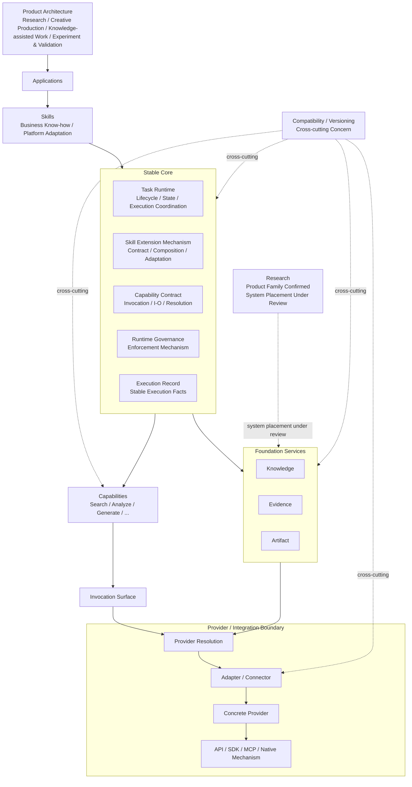

# Ecommerce AI OS — System Architecture V0.2

- **版本**：V0.2
- **状态**：Candidate / Human-reviewed working architecture
- **文档类型**：System Architecture
- **目标路径**：`docs/02_system/00_SYSTEM_ARCHITECTURE.md`
- **项目**：Ecommerce AI OS
- **最后更新**：2026-08-15

---

## 0. 文档目的

这份文档只回答：

> **为了支撑 Product Architecture，Ecommerce AI OS 从系统层应该由哪些责任区域组成，它们如何协作。**

本文件只做到框架级，不设计详细字段。

当前重点：

- Applications；
- Skills；
- Stable Core；
- Capabilities；
- Foundation Services；
- Providers；
- Stable Core Candidate Areas 与 Cross-cutting Concerns；
- 依赖方向；
- Agent / MCP / RAG 等技术概念的位置；
- System Architecture 与 Software Architecture 的边界。

## System Architecture V0.2 Current Candidate Overview

> This is a responsibility map, not a strict runtime call graph.



这张总图用于表达当前 V0.2 的责任区域与主要关系，不新增 Tool Layer、Agent Layer、Orchestration Layer、Adapter Layer 或 MCP Layer。

---

# 1. System Architecture 不是严格的六层流水线

之前可以用以下模型快速理解：

```text
Applications
↓
Skills
↓
Stable Core
↓
Capabilities
↓
Foundation Services
↓
Providers
```

但这不能被理解成严格的运行时调用顺序。

例如一个 Research Skill 可能同时依赖：

```text
Search Capability
Analyze Capability
Evidence Service
Knowledge Service
```

因此，更准确的理解是：

```text
                     ┌──────────────────────┐
                     │     Applications     │
                     │ Chat / Workspace /   │
                     │ Future Applications  │
                     └──────────┬───────────┘
                                │
                                ▼
                     ┌──────────────────────┐
                     │        Skills        │
                     │ Business Know-how /  │
                     │ Platform Adaptation  │
                     └──────────┬───────────┘
                                │
                                ▼
              ┌─────────────────────────────────┐
              │           Stable Core           │
              │                                 │
              │ Task Runtime                    │
              │ Skill Extension Mechanism      │
              │ Capability Contract             │
              │ Runtime Governance              │
              │ Execution Record                │
              └─────────┬──────────────┬────────┘
                        │              │
             ┌──────────▼───────┐  ┌──▼────────────────┐
             │   Capabilities   │  │ Foundation Services│
             │                  │  │                    │
             │ Search           │  │ Knowledge          │
             │ Analyze          │  │ Evidence           │
             │ Generate         │  │ Artifact           │
             │ Image            │  │                    │
             │ Video            │  │                    │
             │ Future           │  │                    │
             └─────────┬────────┘  └─────────┬──────────┘
                       │                     │
                       └──────────┬──────────┘
                                  ▼
                       ┌─────────────────────┐
                       │      Providers      │
                       │ Concrete Providers │
                       │ via Adapters / ... │
                       └─────────────────────┘

Research (Product Use Case Family)
┌─────────────────────────────────────────────┐
│ System Placement Under Review                │
│ Not part of the confirmed Foundation        │
│ Services Candidate Set                      │
└─────────────────────────────────────────────┘

Research may later be placed as a Domain Service, Workflow, Skill Composition,
Capability Composition, or another structure. No final placement is decided.
```

这是一张**责任关系图**，不是最终调用图、进程图或部署图。

---

# 2. Applications / 应用入口

Applications 表示：

> **用户真正进入 Ecommerce AI OS 的产品入口。**

未来可能包括：

- Chat；
- Research Workspace；
- Creative Workspace；
- Operator Console；
- Automation Application；
- Future Applications。

Applications 不等于 Product Use Case Family。

区别：

```text
Product Architecture
→ 用户想完成什么工作

Applications
→ 用户从什么产品入口使用这些能力
```

当前 Applications：

**Candidate / Not Yet Designed**

---

# 3. Skills / 业务方法层

System Architecture 中：

> **Skill = 业务上怎么做。**

Skill 承载：

- Business Know-how；
- Professional Method；
- Platform Adaptation；
- Domain Rules；
- Composite Workflow Method。

未来可能包括：

```text
Generic Skills
├── Research Method
├── Script Writer
├── Director
└── Critic

Commerce Skills
├── Product Grounding
├── Claim Safety
└── Selling Point Integration

Platform Skills
├── TikTok Hook
├── TikTok Pacing
├── Amazon Listing Method
└── Future

Composite Skills
└── Multiple Skill Composition
```

Skill 不负责：

- Provider API 调用细节；
- Scrape Creators 字段；
- 模型 SDK；
- 存储实现；
- 通用 Runtime 规则。

---

# 4. Capabilities / 系统能力

Capability 回答：

> **系统会做什么。**

例如：

```text
Search
Retrieve
Analyze
Generate Text
Generate Image
Generate Video
Transcribe
Translate
Future
```

Capability 不负责：

> “业务上应该怎么做。”

因此边界是：

```text
Skill
= 怎么做

Capability
= 能做什么

Provider
= 谁来做
```

这三个概念当前作为 System Architecture 的核心语义边界。

---

# 5. Providers / 具体实现与外部接入

Provider 表示：

> **实际提供外部数据、模型、能力或基础设施的一方。**

例如未来可能包括：

- Scrape Creators；
- OpenAI；
- Kling；
- 即梦；
- Storage Provider；
- Future Providers。

Provider 与以下概念必须区分：

```text
Provider
≠ Adapter / Connector
≠ API / SDK / MCP
```

其中：

- `Provider` 是实际提供外部数据、模型、能力或基础设施的一方；
- `Adapter / Connector` 是 Ecommerce AI OS 内部把具体 Provider 映射到稳定 Capability / Service Contract 的适配边界；
- `Integration / Access Mechanism` 是 API、SDK、MCP 或 Native Integration 等连接方式。

当前 Candidate 依赖方向：

```text
Capability / Service Contract
        ↓
Provider Resolution
        ↓
Adapter / Connector
        ↓
Concrete Provider
        ↓
API / SDK / MCP / Native Mechanism
```

不新增顶层 Adapter Layer。

核心原则：

> **Provider-specific quirks 应优先由 Adapter / Contract Boundary 吸收，不应直接泄漏到业务 Skill。**

这些 quirks 包括：

- parameter naming；
- provider IDs；
- pagination token；
- missing fields；
- error shape；
- provider-specific filters；
- region quirks。

Provider Lab 提供 Provider 事实，但 Provider Lab 不定义 Ecommerce AI OS 顶层架构。

---

# 6. Stable Core / 稳定核心

Stable Core 只负责：

> **让 Task、Skill、Capability、Service、Provider 在稳定的系统规则下协作。**

Stable Core 不承载：

- TikTok 业务知识；
- Amazon 业务知识；
- Short Drama 方法；
- Research 专业方法；
- LLM Prompt；
- Scrape Creators 字段；
- 具体 Provider 业务逻辑。

当前 Stable Core Candidate Areas：

```text
Stable Core
│
├── Task Runtime
├── Skill Extension Mechanism
├── Capability Contract
├── Runtime Governance
└── Execution Record

Cross-cutting:
└── Compatibility / Versioning
```

状态：

**Candidate Architecture**

内部对象、字段、接口、运行时行为尚未批准。

---

## 6.1 Task Runtime

候选职责：

- Task Identity；
- Task Lifecycle；
- Execution Context；
- Runtime State；
- Pause / Continue；
- Failure Status；
- Execution Coordination。

职责边界：

```text
Skill / Workflow
= 定义业务应该怎么做

Task Runtime / Execution Coordination
= 当前这一次执行如何推进

Agent
= 需要动态判断时使用的 Execution / Decision Strategy

Capability
= 提供具体可调用能力
```

以下属于 Advanced Runtime Concerns，当前尚未被业务需求证明，也尚未设计：

```text
Checkpoint Strategy
Crash Recovery
Durable Execution
Retry Engine
```

详细设计：

**Not Yet Designed**

---

## 6.2 Skill Extension Mechanism

候选职责：

- Skill Contract；
- Extension Registration；
- Composition；
- Dependency Declaration；
- Context Binding；
- Platform / Domain Adaptation。

原则：

> **Skill 的可插拔、注册和组合机制可以属于 Core，但具体业务适配规则属于 Skill。**

本机制不负责：

- Task Lifecycle；
- Runtime State；
- Checkpoint；
- Pause / Resume；
- Recovery。

详细设计：

**Not Yet Designed**

---

## 6.3 Capability Contract

候选职责：

- Capability Identity；
- Capability Declaration；
- Invocation Surface；
- Input Boundary；
- Output Boundary；
- Error Boundary；
- Context Boundary；
- Runtime Governance Hook；
- Provider Resolution Boundary。

语义边界：

```text
Capability
= 系统会做什么

Invocation Surface
= Runtime 如何调用该 Capability
```

`Tool` 可以作为未来 Runtime / Software implementation representation，当前不新增 Tool Layer，也不在本层冻结 Tool Schema。

详细设计：

**Not Yet Designed**

---

## 6.4 Runtime Governance

原候选名称 `Governance` 在本基线中改名为：

> **Runtime Governance**

目的是和项目层的：

> **Architecture Governance**

严格区分。

Runtime Governance 负责系统运行时，例如：

- Permission Enforcement；
- Policy Evaluation Hook；
- Human Gate；
- Cost Gate Mechanism；
- Risk Gate Mechanism；
- Execution Approval / Block / Pause。

Runtime Governance 的核心边界是：

```text
Runtime Governance
= Enforcement Mechanism

Concrete Policy Source
= Skill / Platform / Domain / Capability / Configuration
```

Stable Core 不拥有：

- TikTok-specific rule；
- Amazon-specific rule；
- Claim policy content；
- Business threshold；
- Platform-specific operating rule。

例如：

```text
高成本视频生成
↓
Human Approval
↓
Execute
```

而 Architecture Governance 负责：

- Draft；
- Candidate；
- Approved；
- ADR；
- Superseded；
- Architecture Change。

因此：

```text
Runtime Governance
≠
Architecture Governance
```

详细 Runtime Governance：

**Not Yet Designed**

---

## 6.5 Execution Record

候选职责：

- Run Identity；
- Task Reference；
- Input References；
- Skill Reference；
- Capability Reference；
- Provider Reference；
- Version References；
- Output / Artifact References；
- Trace Reference；
- Important Runtime Facts；
- Reproducibility References。

长期边界：

```text
Trace
≠ Execution Record
≠ Evidence
≠ Artifact
≠ Observability
≠ Evaluation
```

Execution Record 不设计成：

- 万能日志系统；
- Evidence Store；
- Artifact Store；
- Metrics Backend；
- Evaluation Framework。

详细设计：

**Not Yet Designed**

---

## 6.6 Cross-cutting Compatibility / Versioning

Compatibility 不再作为独立一级 Stable Core Area。

它保留为：

> **Cross-cutting Compatibility / Versioning Concern**

其候选归属为：

```text
Capability / Contract Version
→ Capability Contract

Skill Version / Compatibility
→ Skill Extension Mechanism

Provider Compatibility
→ Provider Adapter / Integration

Schema / Data Migration
→ Software Architecture

Architecture Deprecation / Supersession
→ Architecture Governance
```

Compatibility concern is real.

但：

```text
Standalone Compatibility Core Component
= Not Currently Required
```

详细设计：

**Not Yet Designed**

---

# 7. Foundation Services / 基础服务

有些系统能力不是一次调用结束，而是长期维护状态、知识、证据、资产或研究上下文。

这类能力当前称为：

> **Foundation Services**

候选：

```text
Foundation Services
│
├── Knowledge
├── Evidence
└── Artifact
```

未来扩展占位：

> Additional Foundation Services may be proposed when supported by real business or system evidence.

Future Service Placeholder ≠ Current Candidate Service。

状态：

**Candidate / Detailed Architecture Not Yet Designed**

---

## 7.1 Knowledge

可能负责长期知识管理、版本、读取、更新候选和审核后的正式更新。

但当前详细系统架构未设计。

---

## 7.2 Evidence

可能负责 Evidence 的保存、引用、追溯、解释边界和来源关系。

但当前详细系统架构未设计。

---

## 7.3 Research

Research 仍然是 Product Architecture 中的跨平台 Use Case Family。

但在 System Architecture 中：

> **Research = System Placement Under Review**

当前不预设 Research 必然属于 Foundation Service，也不在本文件决定它最终是：

- Research Domain Service；
- Research Workflow；
- Skill Composition；
- Capability Composition。

Research 业务需求保持有效，后续再根据稳定的系统 Contract 判断其归属。

此前可能的职责包括：

- Research Question；
- Evidence Need；
- Data Discovery；
- Research Result；
- Finding。

但当前不继承旧 SIG 对象作为正式新 OS Contract。

---

## 7.4 Artifact

可能负责：

- Script；
- Image；
- Video；
- Report；
- File；
- Other Produced Assets。

这里只确认 Artifact 是重要系统关注点，不定义存储实现。

---

# 8. Capabilities 与 Foundation Services 的区别

当前原则：

```text
Capabilities
≠
Foundation Services
```

一个 Capability 更接近：

```text
Input
↓
Perform Capability
↓
Output
```

例如：

```text
Generate Video
```

而 Foundation Service 更可能涉及：

- 长期状态；
- 生命周期；
- 版本；
- 查询；
- 更新；
- 审核；
- 追溯。

例如：

```text
Knowledge Service
```

最终哪些东西属于 Capability、哪些属于 Service，后续专项审计。

---

# 9. Agent 的位置

当前不建立：

```text
Agent Layer
```

作为顶层 System Architecture。

Agent 当前理解为：

> **Execution / Decision Strategy**

未来可能参与：

- Application；
- Skill Orchestration；
- Task Runtime；
- Future Runtime Strategy。

但具体位置：

**Not Yet Designed**

因此：

```text
Agent
≠ Stable Core 本身
≠ 顶层 Architecture Layer
```

---

# 10. MCP / RAG / Embedding / Vector DB / LLM 的位置

这些都不是当前顶层 System Architecture Layer。

当前理解：

- MCP = Integration / Capability Access Mechanism；
- RAG = Knowledge Retrieval Pattern；
- Embedding = Semantic Representation Technique；
- Vector DB = Storage / Retrieval Implementation；
- LLM = Provider / Capability Implementation；
- Multimodal Model = Capability Implementation；
- Chat = Application / Interaction Surface。

具体采用与否由后续业务和软件需求决定。

---

# 11. 依赖原则

当前建议冻结一个 System Architecture 原则：

> **Business logic should depend on stable contracts, not concrete Providers.**

不推荐：

```text
TikTok Script Skill
↓
Scrape Creators API
↓
Kling API
```

推荐：

```text
TikTok Script Skill
↓
Capability / Service Contract
↓
Provider Resolution
↓
Adapter / Connector
↓
Concrete Provider
↓
API / SDK / MCP / Native Mechanism
```

这样：

```text
Scrape Creators → Future Provider
Kling → 即梦 → Future Video Model
```

不会迫使业务 Skill 整体重写。

---

# 12. Product Architecture 到 System Architecture 的映射

Product Architecture：

```text
Research
Creative Production
Knowledge-assisted Work
Experiment & Validation
Platform Adaptation
```

并不直接等于 System Component。

例如：

```text
Creative Production
```

可能由：

- Skills；
- Capabilities；
- Stable Core；
- Foundation Services；
- Providers；

共同支撑。

因此：

> **Product Family 不直接映射成同名 System Module。**

---

# 13. System Architecture 总图

```text
Product Architecture
│
│ 用户能做什么
│
▼
Applications
│
▼
Skills
│
▼
Stable Core
│
├───────────────┐
▼               ▼
Capabilities    Foundation Services
│               │
└───────┬───────┘
        ▼
     Providers
```

注意：

> 这是一张 Responsibility Map，不是严格 Runtime Call Graph。

---

# 14. 当前架构状态

### Candidate Architecture

- Applications；
- Skills；
- Stable Core；
- Capabilities；
- Foundation Services；
- Providers。

### Stable Core Candidate Areas

- Task Runtime；
- Skill Extension Mechanism；
- Capability Contract；
- Runtime Governance；
- Execution Record；
- Cross-cutting Compatibility / Versioning Concern。

### Candidate Foundation Services

- Knowledge；
- Evidence；
- Artifact。

Research：

> **System Placement Under Review**

### Not Yet Designed

- Task Object；
- Advanced Runtime Concerns：Checkpoint Strategy、Crash Recovery、Durable Execution、Retry Engine；
- Skill Extension Contract Details；
- Capability Invocation Schema；
- Provider Resolution；
- Runtime Governance Rules；
- Execution Record Schema；
- Cross-cutting Compatibility Rules；
- Foundation Service Contracts；
- Agent Architecture；
- Event / Message Architecture；
- Persistence；
- Database；
- UI。

---

# 15. System Architecture 与 Software Architecture 的边界

System Architecture 回答：

> **系统由什么职责区域组成，边界是什么。**

Software Architecture 回答：

> **这些职责最终如何落成代码、模块、接口、运行时和部署结构。**

因此：

```text
System Architecture
        ↓
Software Architecture
```

不能反过来通过当前空 Python 目录推导 System Architecture。

---

# 16. Human Review Gate

当前文档状态：

# **Candidate / Human-reviewed working architecture**

批准本文件只代表：

> **C01-C09 Change Set 已经过 Human Review 并落实为 Current Candidate Architecture 的边界收敛；C10 Operational Observability 继续 DEFER。**

不代表：

- 整个 System Architecture 已升级为 Approved；
- Stable Core 内部字段已批准；
- Foundation Service Contract 已批准；
- Agent 已批准；
- Database 已批准；
- Software Architecture 已批准；
- 可以全面实现。
