# Ecommerce AI OS — First Vertical Slice Planning Record V0.1

- **文档类型**：Planning Record / First Vertical Slice Working Plan
- **项目**：Ecommerce AI OS
- **项目路径**：`/Volumes/projects/andy/0813/ecommerce-ai-os`
- **当前阶段**：System Architecture V0.2 Candidate Stabilized / Pre-Vertical-Slice
- **目标阶段**：First Vertical Slice — Research Execution Architecture
- **状态**：Working Planning Record / 非 Architecture Authority
- **日期**：2026-08-16

---

# 0. 文档目的

本文件用于冻结当前关于 First Vertical Slice 的推进思路，避免后续讨论再次出现：

- 忘记已经形成的推进方法；
- 把 Vertical Slice 误解成一套新的 System Architecture；
- 因为当前业务是 TikTok Research，就重新设计整个 Research Architecture；
- 因为追求“完整系统”，重新滑回 Kernel First；
- 把 `Why Stop / Trust / Click / Buy` 当成整个 Research 的顶层结构；
- 让 Scrape Creators 的 97 API 反向定义 Ecommerce AI OS；
- 在 System Detailed Contract 尚未收敛前进入 Software Architecture；
- 提前设计 Agent / RAG / DB / UI / Provider Router / Durable Runtime 等未被当前业务证明的结构。

本文件只是：

> **First Vertical Slice 的 Working Planning Record。**

它不是：

- Product Architecture Authority；
- System Architecture Authority；
- Software Architecture Authority；
- ADR；
- Candidate → Approved 的批准记录。

如果本文件和 Current Authority 冲突，以对应 Current Authority 为准。

当前 Governance 已明确：一个问题只有一个 Current Authority，AI / Codex 不能自行把 Candidate 升级为 Approved。

---

# 1. 当前全局 System Architecture 不因 Vertical Slice 重画

当前继续使用：

# **System Architecture V0.2**

状态：

> **Candidate / Human-reviewed working architecture**

不是 Approved Architecture。

当前全局 Responsibility Map：

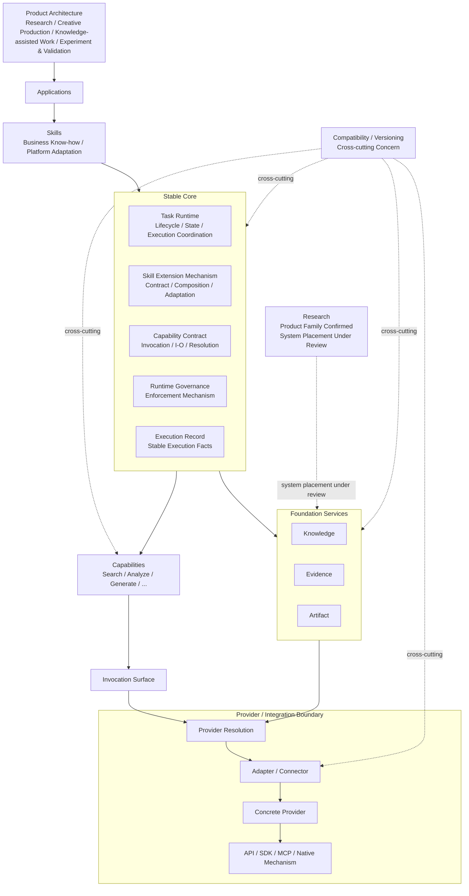

这张图当前表达的是：

> **System Responsibility Map**

而不是严格 Runtime Call Graph。

---

# 2. “全局架构”和“Vertical Slice”到底是什么关系

这是目前最需要长期保持清楚的概念。

## 2.1 Global System Architecture

回答：

> **Ecommerce AI OS 长期需要哪些责任区域？**

例如：

```text
Applications
Skills
Stable Core
Capabilities
Foundation Services
Providers
```

它解决的是：

```text
系统长期应该怎么分责任？
```

---

## 2.2 Vertical Slice

Vertical Slice 不是另一套架构。

Vertical Slice 回答：

> **为了完成一个真实业务，这次到底穿过现有 System Architecture 的哪些 Responsibility？**

例如 First Slice：

```text
Research
+
TikTok
+
US / Car Vacuum
```

会穿过 System Architecture 中的部分区域。

---

## 2.3 System Detailed Contracts

当 Slice 已经确认要穿过某些 Responsibility 后，再回答：

> **这些 Responsibility 之间最小需要什么 Contract？**

例如：

```text
Research Skill
↓
Task Runtime
↓
Search Capability
↓
Provider Boundary
↓
Evidence
↓
Finding
```

这里开始从“框”进入“边界”。

---

## 2.4 Minimal Software Architecture

只有 Contract 被真实业务证明需要后，才讨论：

```text
Python module
Interface
Runtime representation
Dependency
Persistence
Error representation
Configuration
Testing boundary
```

当前 Software Architecture 仍然明确是：

> **Not Yet Designed**

而现有 `src/` 只是 Project Scaffold，不能反向定义 Software Architecture。

---

# 3. 当前统一开发模型

整个方法应该理解成：

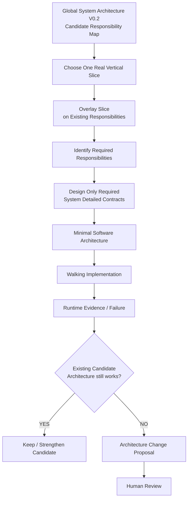

核心仍然是：

> **Architecture Big, Implementation Small**

并保持：

```text
Vertical Slice First
Stable Core Thin First

Kernel First       = No
UI First           = No
Framework First    = No
```

当前 Handoff 已明确把这作为下一阶段开发哲学。

---

# 4. First Vertical Slice 当前身份

当前第一条 Vertical Slice：

```text
Use Case Family:
Research

Platform Adaptation:
TikTok

Business Context:
US / Car Vacuum / Commerce Content

Working Name:
US / Car Vacuum / TikTok Content Research
```

这符合当前 Product Architecture：

```text
Use Case Family
+
Platform Adaptation
+
Business Context
=
Concrete Workflow
```


---

# 5. First Slice 当前真正目的

当前不是为了：

> 把 TikTok Research 做完整。

而是为了：

> **利用一条真实 TikTok Research Workflow，第一次验证 System Architecture V0.2 的关键责任边界。**

也就是说 First Slice 的系统价值在于测试：

```text
Skill 是否真能承载业务方法？

Task Runtime 最小到底需要什么？

Capability 是否真的能和 Provider 解耦？

Provider Adapter 是否能吸收 Scrape Creators quirks？

Raw Result / Evidence / Finding 是否能清楚分离？

Execution Record 是否能留下稳定执行事实？
```

Vertical Slice 是：

> **Architecture Probe**

不是整个系统本身。

---

# 6. 关于 “Why Stop / Why Trust / Why Click / Why Buy” 的当前定位

最近从 TikTok 实际运营需求提出：

```text
为什么停留？
为什么继续看？
为什么相信？
为什么点击？
为什么购买？
```

这些问题有业务价值。

但是当前明确：

> **不能把它们直接升级成 Ecommerce AI OS 的 Research Architecture。**

更合理的位置是：

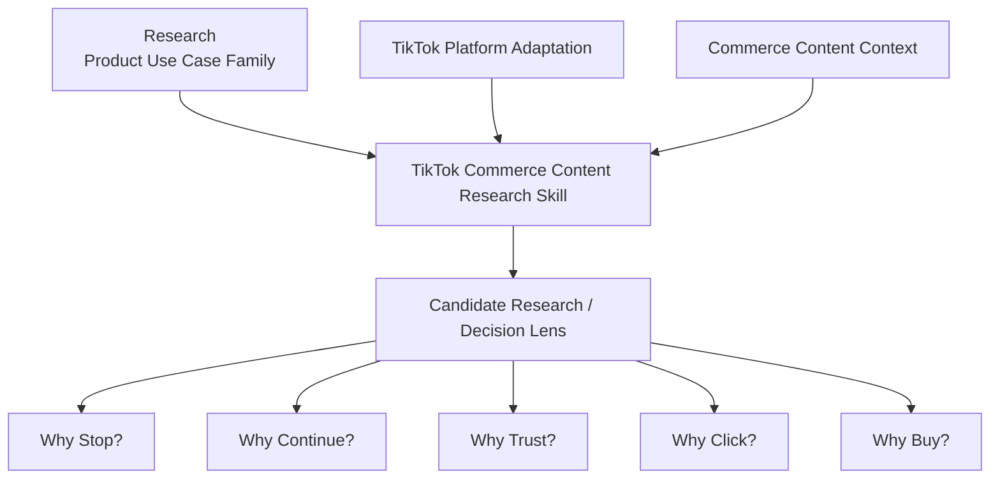

它们更可能只是：

> **TikTok Commerce Content Research Skill 内部的一组 Candidate Lens。**

---

# 7. 为什么这组 Lens 还不能直接冻结

当前已经发现：

```text
Stop
Click
Purchase
```

更接近：

> Observable Behavior / Outcome

而：

```text
Trust
```

更接近：

> Psychological / Decision Mechanism

所以它们不是同一语义层。

另外还明显缺：

```text
Relevance
Desire
Value
Risk
Friction
Objection
```

因此当前：

```text
Why Stop / Trust / Click / Buy
```

只能保持：

> **Candidate Business Thinking Model**

不能成为正式 Research Taxonomy。

---

# 8. 第一条 Slice 暂时不能被 “Why Stop” 锁死

当前 First Vertical Slice 只先确认：

```text
Research
+
TikTok
+
US / Car Vacuum
+
Commerce Content
```

至于第一刀究竟选择：

```text
Attention / Continuation
```

还是：

```text
Content Pattern Research
```

还是：

```text
更宽的 TikTok Commerce Content Research
```

当前仍需要在 Round 1 的 Slice Boundary 中冻结。

因此：

> `Why Stop / Trust / Click / Buy` 现在是业务理解输入，不是 First Slice 已批准的 Scope。

---

# 9. 当前这一阶段要产出的 4 个核心产物

---

# Product A — Slice Business Boundary

目的：

> **把 First Vertical Slice 到底是什么说清楚。**

需要冻结：

```text
Slice Identity

Start Boundary

End Boundary

In Scope

Out of Scope

Business Decision Served
```

核心问题包括：

```text
这条 Slice 从什么业务输入开始？

最终要帮助运营做什么判断？

做到什么程度算结束？

哪些 Research 活动属于当前 Slice？

哪些明确不属于？
```

---

# Product B — Slice Overlay Map

目的：

> **不改变 System Architecture，而是在 V0.2 上标出 First Slice 实际经过哪些 Responsibility。**

Working Candidate：

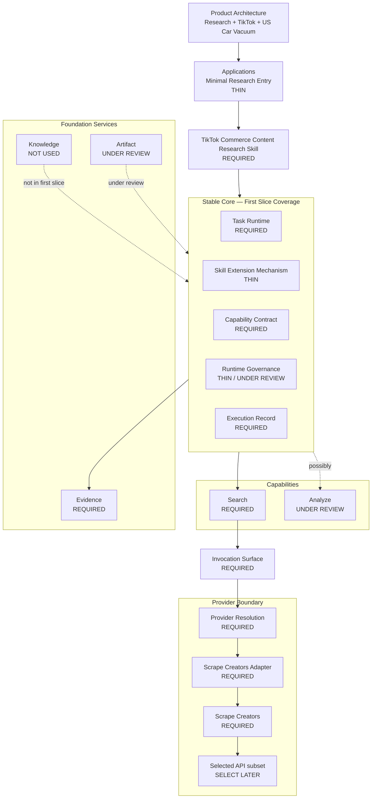

这张图只是：

> **First Slice Overlay**

不是新的 System Architecture。

---

# Product C — Responsibility Coverage Matrix

统一使用四种状态：

```text
REQUIRED

THIN

UNDER REVIEW

NOT USED
```

当前 Working Matrix：

| Responsibility | First Slice 状态 | 为什么需要 | 当前不设计什么 |
|---|---|---|---|
| Application | THIN | 给 Research Task 一个最小入口 | Chat / UI / Research Workspace |
| Research Skill | REQUIRED | 承载 TikTok Commerce Content Research 专业方法 | 完整 TikTok Skill Pack |
| Task Runtime | REQUIRED | 管理一次 Research 执行 | Durable Execution / Crash Recovery |
| Skill Extension Mechanism | THIN | 证明 Skill Contract / Dependency Boundary | 插件市场 / 复杂 Registry |
| Capability Contract | REQUIRED | Skill 不直接依赖 Scrape Creators | 全 Capability 平台 |
| Runtime Governance | THIN / UNDER REVIEW | 保留必要 Runtime Enforcement Hook | 完整 Permission / Risk / Cost Engine |
| Execution Record | REQUIRED | 记录稳定执行事实 | Observability / Universal Log |
| Search Capability | REQUIRED | 获取 Research 所需数据 | 所有未来 Search 类型 |
| Analyze Capability | UNDER REVIEW | 可能需要，但尚未证明必须独立 | Analyze Framework |
| Evidence | REQUIRED | Raw Result → Evidence → Finding | 完整 Evidence Platform |
| Knowledge | NOT USED | First Slice 暂不要求知识更新 | RAG / KB |
| Artifact | UNDER REVIEW | Finding / Report 是否进入 Artifact 尚未确定 | Artifact Store |
| Provider Resolution | REQUIRED | 防止 Capability 直接绑定 Provider | Production Router |
| Adapter | REQUIRED | 吸收 Scrape Creators quirks | 通用 Integration Platform |
| Scrape Creators | REQUIRED | 当前真实 Provider | 第二 Provider |
| 97 APIs 整体 | NOT USED | First Slice 只取最小 endpoint subset | 全量接入 |

这张 Matrix 后续必须通过 Round 2 正式逐项审。

---

# Product D — System Contract Backlog

目标：

> **列出 First Slice 真正需要进一步进入 System Detailed Design 的 Contract。**

当前 Backlog：

```text
C1. Research Skill Boundary

C2. Task Runtime Minimum

C3. Search Capability Contract

C4. Capability Invocation Surface

C5. Provider Resolution Boundary

C6. Scrape Creators Adapter Boundary

C7. Evidence Boundary

C8. Finding Boundary

C9. Execution Record Minimum
```

当前明确：

```text
Analyze Capability
Artifact participation
Runtime Governance depth
Research system placement
```

继续：

> **UNDER REVIEW**

尤其 Research 当前必须保持：

```text
Product Family
= Confirmed

System Placement
= Under Review
```

不能因为第一条 Slice 是 Research，就直接建立 Research Foundation Service。

---

# 10. 当前 Six-Round 推进计划

---

# Round 1 — Freeze Slice Boundary

这一轮只回答：

```text
这条 Slice 是什么？

最终服务什么 Business Decision？

从哪里开始？

到哪里结束？

明确包含什么？

明确不包含什么？
```

输出：

```text
Start Boundary

End Boundary

In Scope

Out of Scope

Business Decision Served
```

这一轮不设计 Contract。

不谈 Python。

不选 API。

---

# Round 2 — Responsibility Traversal

拿 System Architecture V0.2 一个个问：

```text
Application 用不用？

Skill 用不用？

Task Runtime 用不用？

Skill Extension Mechanism 用不用？

Capability Contract 用不用？

Runtime Governance 用不用？

Execution Record 用不用？

Search 用不用？

Analyze 用不用？

Evidence 用不用？

Knowledge 用不用？

Artifact 用不用？

Provider Resolution 用不用？

Adapter 用不用？
```

目标：

> **完成 Responsibility Coverage Matrix。**

---

# Round 3 — Minimal Runtime Path

在 Responsibility Coverage 确认之后，再画真实路径。

Working Candidate：

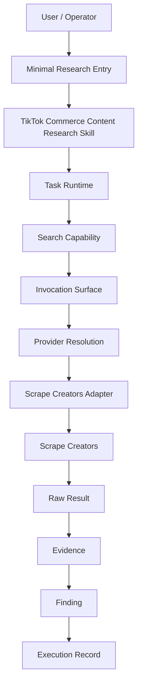

这一轮必须逐个质疑：

> **这个节点真的需要吗？**

尤其重点挑战：

```text
Analyze Capability

Artifact

Runtime Governance
```

不能因为总图里存在，就强制 First Slice 全部实现。

---

# Round 4 — Contract Inventory

这一轮只确定：

> **哪些责任边界之间必须有 Contract？**

候选：

```text
Research Skill
↔
Task Runtime

Task Runtime
↔
Capability

Capability
↔
Invocation Surface

Capability
↔
Provider Resolution

Provider Resolution
↔
Adapter

Adapter
↔
Concrete Provider

Raw Result
↔
Evidence

Evidence
↔
Finding

Run
↔
Execution Record
```

这一轮明确：

```text
不写 JSON

不设计 Python class

不决定 dataclass

不决定 Pydantic

不设计 Database

不设计 HTTP API

不决定 sync / async
```

因为这些属于后面的 Minimal Software Architecture。

---

# Round 5 — Deferred / Not Yet Designed Register

目的：

> **主动把当前不该进入 First Slice 的东西锁住。**

至少包括：

```text
Full TikTok Skill Pack

Complete Research Taxonomy

Complete Why Stop / Trust / Click / Buy Model

Knowledge Service Implementation

RAG

Vector DB

Production Database

Full Artifact Service

Production Provider Router

Second Provider

97 API Full Integration

Checkpoint Strategy

Crash Recovery

Durable Execution

Retry Engine

Agent Architecture

Multi-Agent

UI / Research Workspace

Operational Observability Backend

Full Creative Pipeline

Publishing

Ads

Attribution Engine

GMV Analytics
```

目的不是永久拒绝。

而是：

> **First Slice 当前没有资格设计。**

当前 ADR 本身也明确把 Checkpoint、Crash Recovery、Durable Execution、Retry Engine 保持为 Advanced Runtime Concerns / Not Yet Proven。

---

# Round 6 — Architecture Review Gate

在进入详细 Contract 前，最后检查：

```text
1.
有没有新增 V0.2 中不存在的 top-level Responsibility？

2.
有没有把 TikTok-specific Business Know-how 塞进 Stable Core？

3.
有没有让 Scrape Creators API Shape 定义 OS Capability / Domain？

4.
有没有为了 First Slice 顺手设计完整 Research Platform / Kernel / Provider Platform？

5.
有没有某个 V0.2 Candidate Responsibility 在真实 Slice 下明显无法承载需求？
```

然后分两种结果。

## Case A

```text
Existing Candidate Architecture
supports the Slice
```

则：

```text
进入
System Detailed Contract Design
```

---

## Case B

```text
Real Slice Need
≠
Current Candidate Boundary
```

则：

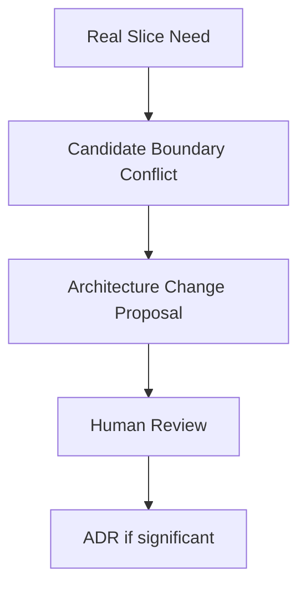

不能偷偷修改 V0.2。

这符合 Architecture Governance 的 Change Process。

---

# 11. Six Rounds 之后才进入 System Detailed Contract Design

完整阶段关系：

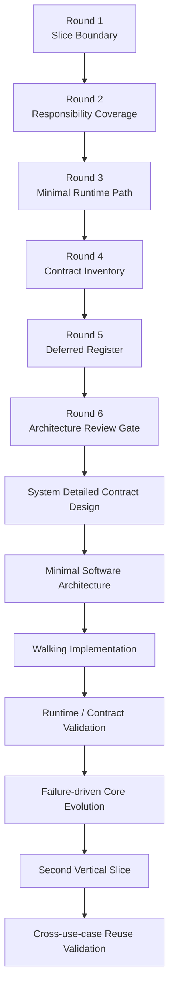

---

# 12. System Detailed Contract 阶段预计顺序

Six Rounds 完成之后，预计按以下顺序：

```text
1. Research Skill Boundary

2. Task Runtime Minimum

3. Search Capability Contract

4. Capability Invocation Surface

5. Provider Resolution Boundary

6. Scrape Creators Adapter Boundary

7. Evidence Boundary

8. Finding Boundary

9. Execution Record Minimum
```

但这不是当前就开始。

---

# 13. Provider Lab / 97 API 在 First Slice 中怎么使用

Provider Lab 当前职责：

> **发现和认证 Provider Facts。**

不是定义 Ecommerce AI OS。

当前已有：

```text
97 inventoried endpoints

92 SUCCESS

5 non-success

L0:
92 CONFIRMED
5 UNKNOWN

L2:
PAUSED intentionally
```

 

First Slice 使用 Provider Lab 的正确顺序：

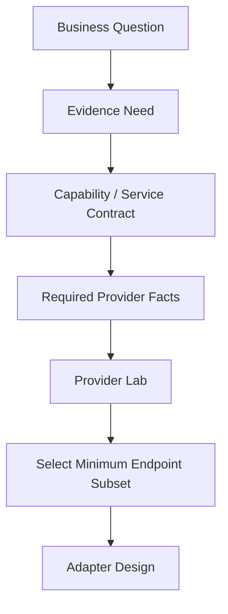

错误顺序：

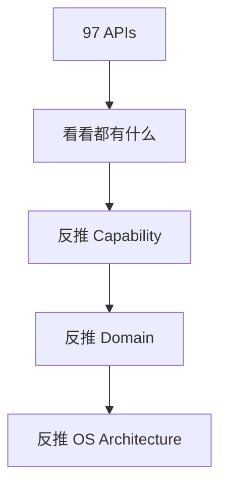

后者明确禁止。

Provider Lab 当前 Handoff 本身也明确：

```text
OS
↓
Capability / Service Contract
↓
Provider Adapter
↓
Provider Facts
↓
Provider Runtime Evidence
```

而不是 `97 APIs → 97 OS modules`。

---

# 14. Stable Core Thin First 在 First Slice 中到底是什么意思

First Slice 不等于把 Stable Core 五块全部开发完整。

---

## 14.1 Task Runtime

First Slice 当前只考虑基础职责：

```text
Task Identity

Task Lifecycle

Execution Context

Runtime State

Execution Coordination

Failure Status
```

暂不进入：

```text
Checkpoint Strategy

Crash Recovery

Durable Execution

Retry Engine
```

---

## 14.2 Skill Extension Mechanism

First Slice 可能只需要证明：

```text
Skill has Contract

Skill declares Dependencies

Skill binds Context
```

暂时不需要：

```text
Dynamic Plugin Marketplace

Complex Registry

Automatic Discovery

Independent Extension Runtime
```

---

## 14.3 Capability Contract

First Slice 优先只做穿：

```text
Search
```

不因为全局里未来还有：

```text
Analyze
Generate Text
Generate Image
Generate Video
Transcribe
Translate
```

就全部设计。

---

## 14.4 Runtime Governance

当前只保留真正需要的：

```text
Runtime Governance Hook
```

如果 Research Slice 没有高风险、高成本动作：

> 不做完整 Governance Engine。

---

## 14.5 Execution Record

只记录：

> **Stable Execution Facts + References**

不允许演化成：

```text
Universal Log

Evidence Store

Artifact Store

Observability Backend

Evaluation Framework
```

当前 System Architecture 本身已经明确这些边界。

---

# 15. 当前明确禁止事项

First Slice 当前禁止：

```text
重新设计 Documentation Architecture

重新设计 Product Architecture

重新做 top-level System Architecture Audit

把 System Architecture V0.2 自动升级为 Approved

从 src scaffold 反推 Software Architecture

恢复旧 SIG / N01-N18 / Track A/B/C

让 Scrape Creators API Shape 定义 OS

一次接入全部 97 APIs

先实现完整 Kernel

先做 UI

先选 Framework

先设计 Production Database

先设计 Production Agent

先设计 Multi-Agent

先上 RAG / Vector DB

先做完整 Creative Pipeline

先完整设计 TikTok Skill Pack

先完整设计 Why Stop / Trust / Click / Buy Taxonomy

先把 Research 固定成 Foundation Service

先造完整 Analyze Framework

先造 Production Provider Router
```

这些都符合当前 Handoff 中的开发边界。

---

# 16. 后续任何新业务概念都先过四个问题

未来无论讨论：

```text
Why Stop

Hook

Comment Analysis

Competitor

Trust

GMV

Video Pattern

Audience

Product Review
```

都先回答：

```text
1.
它属于哪个 Product Use Case？

2.
它属于通用业务能力，
还是 Platform / Domain Skill？

3.
它需要哪个现有 System Responsibility 承载？

4.
当前 First Slice 真的需要把它设计到什么深度？
```

---

# 17. 示例：Why Stop 应该放在哪里

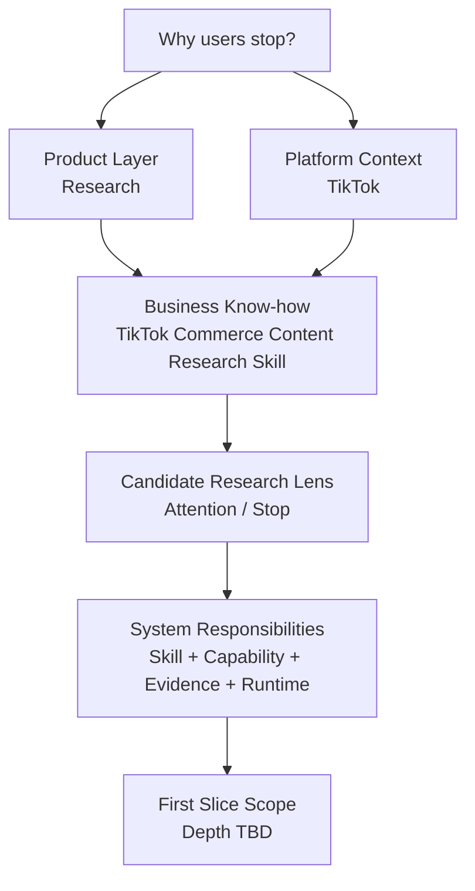

所以：

```text
Why Stop
```

不是：

```text
Stable Core Component
```

不是：

```text
Research Foundation Service
```

也不是：

```text
Ecommerce AI OS Top-level Architecture
```

而更可能只是：

> **TikTok Commerce Research Skill 中的一个 Candidate Lens。**

---

# 18. 当前完整近期路线

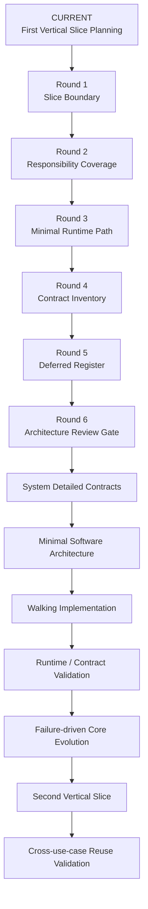

---

# 19. 当前下一步

Round 1 — Slice Business Boundary 已完成第一轮设计与审查。

Round 2 — Responsibility Coverage 已完成第一轮设计与审查。

当前下一步：

# **Round 3 — Minimal Runtime Path**

Round 3 将基于：

`01_SLICE_BUSINESS_BOUNDARY.md`

和：

`02_RESPONSIBILITY_COVERAGE.md`

不再重新决定“哪些 Responsibility 应该存在”，而是审查已经确认参与 First Slice 的 Responsibility 在一次真实 Research Execution 中如何协作。

Round 3 重点回答：

- Operator 如何进入 First Slice；
- Application Boundary 如何触发 Research Execution；
- Research Skill 与 Task Runtime 的真实调用 / 协作方向；
- Skill 如何触发 Search Capability；
- Invocation Surface 在运行路径中的位置；
- Provider Resolution 何时发生；
- Adapter 如何进入调用链；
- Search Result 在什么时候进入 Evidence Boundary；
- Research Skill 如何从 Evidence 形成 Finding / Hypothesis；
- Execution Record 在执行过程中还是执行结束时形成；
- Research Result 如何返回 Operator；
- 哪些箭头是真正 Runtime Interaction；
- 哪些只是 Responsibility Relation。

Round 3 当前仍然不进入：

- System Detailed Contract 字段；
- JSON Schema；
- Python；
- Pydantic / dataclass；
- Database；
- Persistence；
- API；
- Tool Schema；
- Agent Framework；
- Scrape Creators endpoint selection；
- Software Architecture。

---

## Current Progress

### Round 1 — Slice Business Boundary

Status:

**Candidate / Round 1 Reviewed**

Review Result:

**PASS_WITH_CHANGES**

Detailed Record:

`01_SLICE_BUSINESS_BOUNDARY.md`

Current Boundary Summary:

- Start：必要的 Product / SKU、US、TikTok、Commerce Content Context 与 Research Intent / Decision Need 已存在；
- End：形成 Human-reviewable Research Result；
- Result 包括 Evidence、Research Findings、Testable Hypotheses、Answerability / Limitations、Traceability / Provenance；
- Research 只提供 Decision Support，不承担最终测试优先级决策；
- Creative Production、Experiment Execution、Knowledge Update 均不属于 First Slice V0.1。

Next:

**Round 2 — Responsibility Traversal**

---

### Round 2 — Responsibility Coverage

Status:

**Candidate / Round 2 Reviewed**

Review Result:

**PASS_WITH_REFINEMENTS**

Detailed Record:

`02_RESPONSIBILITY_COVERAGE.md`

Current Coverage Summary:

- Application = REQUIRED / THIN；
- Research Skill = REQUIRED / SLICE-SUFFICIENT；
- Task Runtime = REQUIRED / THIN；
- Skill Extension Mechanism = REQUIRED / VERY THIN；
- Capability Contract = REQUIRED / THIN；
- Runtime Governance = NOT ACTIVELY REQUIRED / HOOK PRESERVED；
- Execution Record = REQUIRED / MINIMAL / REFERENCE-ORIENTED；
- Search Capability = REQUIRED / SLICE-SUFFICIENT；
- Analyze Capability = NOT YET PROVEN / DO NOT DESIGN YET；
- Evidence Boundary = REQUIRED / SLICE-SUFFICIENT；
- Full Evidence Foundation Service = NOT YET PROVEN；
- Knowledge = NOT REQUIRED / NOT USED；
- Artifact = NOT REQUIRED / NOT USED；
- Provider Resolution = REQUIRED / STATIC / SINGLE-PROVIDER；
- Adapter / Connector = REQUIRED / MINIMAL / CONTRACT-DRIVEN；
- Scrape Creators = CURRENT CONCRETE PROVIDER / MINIMUM ENDPOINT SUBSET ONLY；

Key Round 2 Findings:

1. Necessity 与 First-slice Depth 必须分开表达；
2. Global Responsibility ≠ Every Slice Uses It；
3. Analysis Activity ≠ Independent Analyze Capability；
4. Evidence Boundary ≠ Full Evidence Foundation Service；
5. Concrete Provider ≠ System Contract Dependency；

Next:

**Round 3 — Minimal Runtime Path**

---

# 20. 当前 Authority Reminder

当前继续服从：

```text
docs/00_project/02_CURRENT_HANDOFF.md
→ Handoff / Navigation only

docs/00_project/00_PROJECT_BASELINE_V0.1.md
→ Project State Map

docs/00_project/01_PRODUCT_ORIGIN_AND_REQUIREMENTS.md
→ Requirements

docs/01_product/00_PRODUCT_ARCHITECTURE.md
→ Product Architecture Authority

docs/02_system/00_SYSTEM_ARCHITECTURE.md
→ System Architecture Authority

docs/03_software/00_SOFTWARE_ARCHITECTURE.md
→ Software Architecture Boundary
→ Not Yet Designed

docs/04_governance/00_ARCHITECTURE_GOVERNANCE.md
→ Governance Authority

docs/04_governance/decisions/
ADR-001-SYSTEM-ARCHITECTURE-V0.2-BOUNDARY-REFINEMENT.md
→ C01-C09 Decision Record

docs/05_references/provider_lab/
03_PROVIDER_LAB_ASSET_HANDOFF.md
→ Provider Fact Handoff

docs/05_references/legacy/
02_LEGACY_ARCHITECTURE_REFERENCE_AUDIT.md
→ Reference only

docs/05_references/ai_architecture/
04_SYSTEM_ARCHITECTURE_STRESS_TEST.md
→ Architecture Review Evidence
```

---

# 21. 当前一句话状态摘要

> **全局 System Architecture V0.2 当前保持不变；First Vertical Slice 不是创建另一套架构，而是在现有 Candidate Responsibility Map 上选择一条真实业务路径，通过 4 个规划产物和 6 轮审计确定这条路径到底需要哪些 Responsibility 和 System Contracts，然后才进入 Minimal Software Architecture 与 Walking Implementation。**
