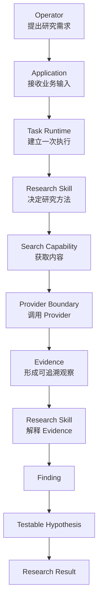

# Ecommerce AI OS — First Vertical Slice Research Execution

# Read Me First V0.1

- 项目：Ecommerce AI OS
- Vertical Slice：First Research Execution
- Business Scenario：US / Car Vacuum / TikTok Content Research

---

# Document Purpose

状态：

> Human Reading Guide / Navigation Only

本文件用于帮助开发者、未来的自己、协作者快速理解 First Vertical Slice。

本文件不是：

- Product Architecture Authority
- System Architecture Authority
- Software Architecture Authority
- ADR
- Contract Authority

如果本文件与正式 Architecture 文档存在冲突，以 Current Authority 文档为准。

---

# 1. What Are We Building?

First Vertical Slice 不是：

- 一个 TikTok 数据分析工具；
- 一个完整 AI Agent 系统；
- 一个完整 Ecommerce Automation Platform。

它是在验证：

> Ecommerce AI OS 的 Candidate Architecture 是否能够支撑一次真实业务执行。

当前真实业务：

```text
US
+
Car Vacuum
+
TikTok Content Research
+
Commerce Content Decision Support
```

目标：通过一条真实 Research Workflow，验证：

- Business Boundary
- Responsibility Boundary
- Runtime Interaction
- System Contract
- Provider Integration Boundary

---

# 2. One Sentence Understanding

运营提出：

> 为什么某些美国 TikTok 车载吸尘器视频表现更好？

系统不是直接回答：

> 下一条视频应该怎么拍。

系统负责：

```text
Research Question
↓
Public Content Evidence
↓
Research Finding
↓
Testable Hypothesis
↓
Human-reviewable Research Result
```

最终帮助运营：决定下一轮应该优先验证哪些内容假设。

---

# 3. Why Vertical Slice First?

Ecommerce AI OS 长期目标：

```text
Research

Creative Production

Knowledge-assisted Work

Experiment & Validation
```

但是当前采用：

> Vertical Slice First

原因：如果直接设计：

- 完整 Kernel
- Agent System
- Knowledge System
- Provider Platform
- UI
- Database

容易变成：

```text
先设计未来需求
↓
再寻找业务
```

当前方法：

```text
Global Architecture
↓
One Real Business Slice
↓
Required Responsibility
↓
Required Contract
↓
Minimal Implementation
↓
Runtime Evidence
```

核心原则：

> Architecture Big, Implementation Small

---

# 4. Relationship Between Global Architecture and Vertical Slice

Global System Architecture 回答：长期系统有哪些责任区域？例如：

```text
Applications

Skills

Stable Core

Capabilities

Foundation Services

Providers
```

它是一张地图。

Vertical Slice 回答：一次真实业务执行穿过地图中的哪些区域？

当前 Slice：

```text
Research

TikTok

US

Car Vacuum
```

它不是新的架构。它只是在已有系统地图中选择一条真实路径进行验证。

---

# 5. Six Core Documents

## 01_SLICE_BUSINESS_BOUNDARY.md

回答：我们到底做什么？

关注：

```text
Start Boundary

End Boundary

Business Decision

In Scope

Out of Scope
```

核心：

```text
Research
=
Decision Support
```

不是：

```text
Final Business Decision
```

## 02_RESPONSIBILITY_COVERAGE.md

回答：谁负责什么？

核心责任：

```text
Research Skill
=
Business Method
```

```text
Task Runtime
=
Execution Coordination
```

```text
Capability
=
System Ability
```

目标：防止一个模块承担所有事情。

## 03_MINIMAL_RUNTIME_PATH.md

回答：一次任务到底怎么运行？

简化流程：

```text
Operator
↓
Application
↓
Task Runtime
↓
Research Skill
↓
Search Capability
↓
Provider
↓
Evidence
↓
Research Result
↓
Operator
```

以后阅读代码时，优先参考这里。

## 04_CONTRACT_INVENTORY.md

回答：模块之间通过什么稳定边界协作？

当前确认：9 个 Required Contract / Boundary：

```text
C1   Task Execution Boundary

C2a  Skill Contract

C2b  Task Runtime Execution Contract

C3   Search Capability Contract

C4a  Provider Resolution Boundary

C4b  Scrape Creators Adapter Contract

C5a  Evidence Contract

C5b  Research Result Contract

C6   Execution Record Contract
```

注意：

```text
Contract
≠
Component
```

```text
Contract
≠
Service
```

```text
Contract
≠
Class
```

```text
Contract
≠
API
```

## 05_DEFERRED_REGISTER.md

回答：为什么现在不做某些东西？

它的作用：防止 Architecture Drift。

当前明确没有进入 First Slice：

```text
Agent Layer

Tool Layer

RAG

Vector DB

Event Bus

Retry Engine

97 API Full Integration
```

不是永远不要，而是当前没有足够证据证明需要。

## 06_ARCHITECTURE_REVIEW.md

回答：六轮审查之后，是否可以进入下一阶段？

最终结论：

```text
First Vertical Slice Planning
=
COMPLETE
```

下一阶段：

```text
System Detailed Contract Design
```

不是：

```text
Direct Coding
```

---

# 6. Understanding One Research Execution

真实例子：运营分析最近美国 TikTok 车载吸尘器内容趋势。



---

# 7. Why Are Agent, RAG, Database Not Added?

不是因为这些技术没有价值，而是当前阶段遵循：

```text
Need
↓
Evidence
↓
Design
```

而不是：

```text
Technology
↓
Architecture
↓
寻找场景
```

当前没有证据证明需要：

- Agent Layer
- Tool Layer
- RAG
- Vector Database
- Event Architecture
- Retry Engine

所以保持：

```text
Not Yet Proven
```

或者：

```text
Explicitly Rejected For Current Slice
```

---

# 8. How Code Should Map Back To Architecture

未来每一个代码模块都应该回答三个问题：

1. 它属于哪个 Responsibility？
2. 它实现哪个 Contract？
3. 它解决哪个 Runtime 问题？

例如，未来：

```text
src/ecommerce_ai_os/capabilities/search/
```

应该对应：

```text
C3 Search Capability Contract
```

而不是：感觉需要一个 search 文件。

---

# 9. Current Project Stage

已经完成：

```text
Round 1
Business Boundary

Round 2
Responsibility Coverage

Round 3
Minimal Runtime Path

Round 4
Contract Inventory

Round 5
Deferred Register

Round 6
Architecture Review
```

当前：

```text
First Vertical Slice Planning
=
COMPLETE
```

下一阶段：

```text
System Detailed Contract Design
```

---

# 10. Recommended Reading Order

第一次理解系统：

```text
00_READ_ME_FIRST
↓
01_SLICE_BUSINESS_BOUNDARY
↓
03_MINIMAL_RUNTIME_PATH
↓
02_RESPONSIBILITY_COVERAGE
↓
04_CONTRACT_INVENTORY
↓
05_DEFERRED_REGISTER
↓
06_ARCHITECTURE_REVIEW
```

开发阶段：

```text
03_MINIMAL_RUNTIME_PATH
↓
04_CONTRACT_INVENTORY
↓
System Detailed Contract
↓
Code
```

---

# 11. Final Learning Goal

最终不是背架构术语，而是形成这样的设计思维：

看到一个需求：

```text
业务问题
↓
判断：这是 Business Problem 还是 System Responsibility？
↓
判断：哪个 Responsibility 负责？
↓
判断：需要什么 Contract？
↓
最后：代码如何实现？
```

这就是 Ecommerce AI OS 的设计方法。

---

# 12. Current Documentation Structure

当前 First Vertical Slice Planning Package：

```text
01_research_execution/
├── 00_READ_ME_FIRST.md
├── 00_FIRST_VERTICAL_SLICE_PLANNING.md
├── 01_SLICE_BUSINESS_BOUNDARY.md
├── 02_RESPONSIBILITY_COVERAGE.md
├── 03_MINIMAL_RUNTIME_PATH.md
├── 04_CONTRACT_INVENTORY.md
├── 05_DEFERRED_REGISTER.md
└── 06_ARCHITECTURE_REVIEW.md
```

职责：

```text
00_READ_ME_FIRST
→ 人类阅读入口

00_FIRST_VERTICAL_SLICE_PLANNING
→ Planning Navigation / Progress

01
→ Business Boundary

02
→ Responsibility Coverage

03
→ Runtime Path

04
→ Contract Inventory

05
→ Deferred / Maturity Register

06
→ Final Architecture Review Gate
```

---

# 13. Next Phase

不继续创建：

```text
07_*
08_*
09_*
```

作为 Planning Round。First Vertical Slice Planning 已完成。

下一阶段进入：

```text
System Detailed Contract Design
```

推荐从以下顺序开始：

```text
D1 — Execution Spine

C1 Task Execution Boundary

C2b Task Runtime Execution Contract

C2a Skill Contract
```

---

# Summary

First Vertical Slice 的目标不是先实现一个完整系统，而是用一条真实 Research Execution 验证 Candidate Architecture。

当前 Planning 已完成并进入 System Detailed Contract Design。下一阶段仍然保持 Architecture before implementation，并继续由业务证据推动设计范围。
