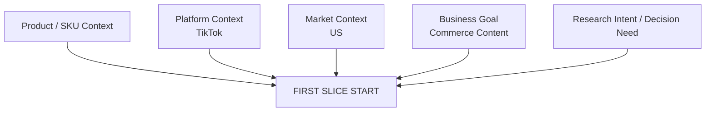
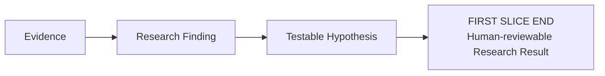
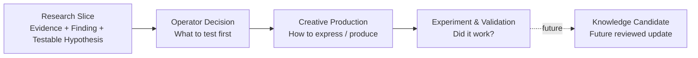
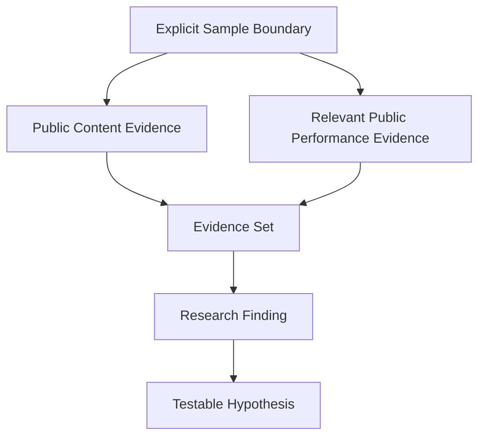
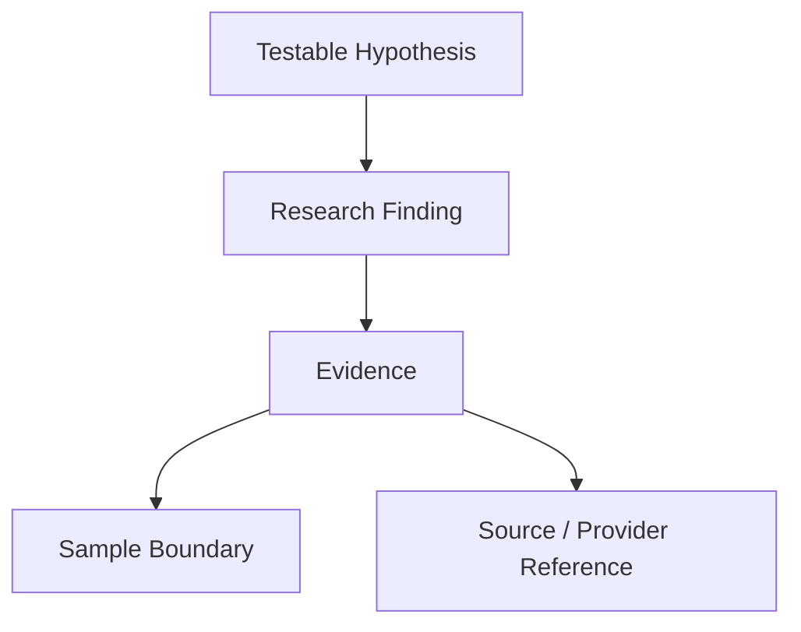
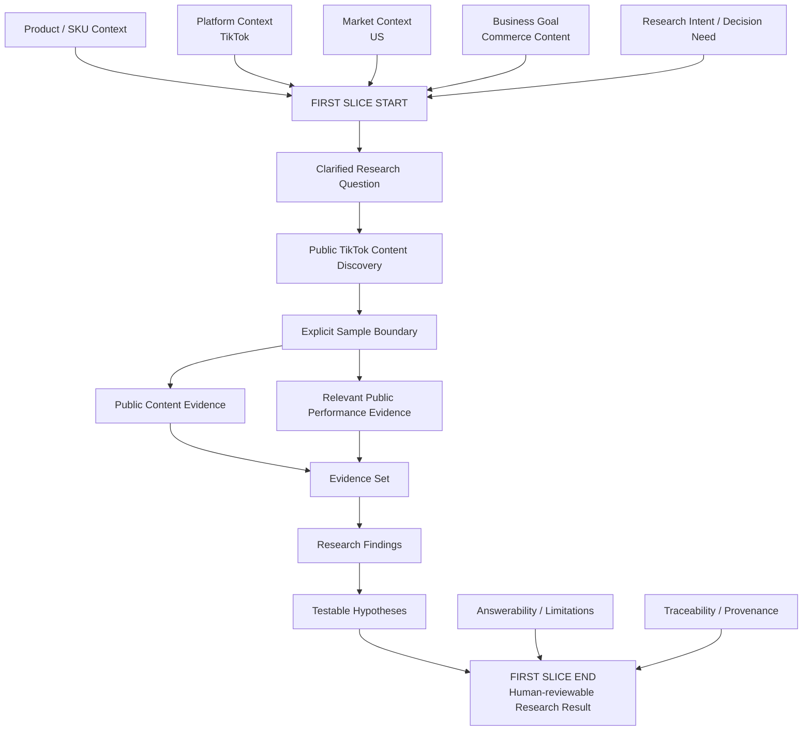

# Ecommerce AI OS — First Vertical Slice — Slice Business Boundary V0.1

- **文档类型**：Vertical Slice / Business Boundary
- **项目**：Ecommerce AI OS
- **Vertical Slice**：First Vertical Slice — Research Execution
- **Business Scenario**：US / Car Vacuum / TikTok Content Research
- **目标路径**：`docs/02_system/vertical_slices/01_research_execution/01_SLICE_BUSINESS_BOUNDARY.md`
- **状态**：Candidate / Round 1 Reviewed
- **阶段**：First Vertical Slice Planning — Round 1
- **Architecture Authority**：No
- **上级规划文档**：`00_FIRST_VERTICAL_SLICE_PLANNING.md`
- **日期**：2026-08-16

---

# 0. 文档目的

本文件记录 First Vertical Slice 的 **Round 1 — Slice Business Boundary** 设计结果。

本轮只回答：

> **US / Car Vacuum / TikTok Content Research 这条 First Vertical Slice，从哪里开始、到哪里结束、服务什么业务决策、包含什么、不包含什么。**

本文件不负责：

- System Detailed Contract；
- Research Skill 内部完整 Professional Method；
- Task Runtime Contract；
- Search Capability Contract；
- Evidence Schema；
- Provider Adapter Contract；
- Software Architecture；
- Python Package；
- Database；
- UI；
- Agent；
- RAG；
- Scrape Creators endpoint selection。

本文件属于：

> **Vertical Slice Working Design Record**

不是：

- Product Architecture Authority；
- System Architecture Authority；
- Software Architecture Authority；
- ADR；
- Candidate → Approved 的批准记录。

如果本文件与 Current Authority 冲突，以对应 Current Authority 为准。

---

# 1. First Vertical Slice Identity

当前 First Vertical Slice 的业务身份：

```text
Use Case Family:
Research

Platform Adaptation:
TikTok

Market:
US

Product / Category:
Car Vacuum

Business Context:
Commerce Content

Working Name:
US / Car Vacuum / TikTok Content Research
```

当前 Product Architecture 的基本组合关系保持：

```text
Use Case Family
+
Platform Adaptation
+
Business Context
=
Concrete Workflow
```

本 Slice 不重新设计 Product Architecture。

---

# 2. Business Decision Served

First Slice 的主要业务目的不是：

> 找出播放量最大的 TikTok 视频。

也不是：

> 自动判断下一条视频应该怎么拍。

也不是：

> 证明什么内容一定能够带来购买。

当前 Business Decision Served 定义为：

> **为运营决定“下一轮 US TikTok Car Vacuum 内容实验优先验证哪些假设”提供可追溯、受 Evidence 支撑的研究依据。**

必须保持：

```text
Research
→ Decision Support

Operator / downstream workflow
→ Final Test Priority Decision
```

因此：

> **First Slice 本身不承担最终测试优先级决策。**

它负责提供：

- Evidence；
- Research Finding；
- Testable Hypothesis；
- Answerability；
- Limitations；
- Traceability。

最终：

> “先测哪个假设”

仍属于下游 Operator / Business Decision。

---

# 3. Start Boundary

First Slice 不从：

```text
keyword = car vacuum
```

开始。

也不从：

```text
Scrape Creators API request
```

开始。

First Slice 的 Start Boundary 是：

> **运营已经具备必要的 Product / Business Context，并产生了一个明确的 Research Intent / Decision Need。**

Slice 开始时至少已有：

```text
Product / SKU Context
+
Platform Context = TikTok
+
Market Context = US
+
Business Goal = Commerce Content
+
Research Intent / Decision Need
```

关系如下：



---

# 4. Product / SKU Context Boundary

First Slice 需要能够使用必要的 Product / SKU Context。

原因：

> Research Finding 必须和当前真实商品能力及业务约束保持 Grounded。

例如不能因为公开 TikTok 样本中某个卖点表现较高，就直接推荐当前 SKU 并不存在的：

- 性能；
- 参数；
-功能；
- Claim；
- 使用场景。

但是：

> **First Slice 不负责从零建立完整 Product Facts System。**

也不在本轮设计：

- ProductBrief Schema；
- Product Database；
- Claim Engine；
- Product Knowledge Service；
- Product ingestion workflow。

当前只确认：

> **必要 Product / SKU Context 是 First Slice 的上游输入。**

---

# 5. Research Question Boundary

First Slice 必须从真实 Research Intent 出发。

但 Round 1 不冻结完整：

```text
Why Stop
Why Continue
Why Trust
Why Click
Why Buy
```

Taxonomy。

这些问题当前只属于：

> **Candidate Research / Decision Lens**

更可能存在于未来：

```text
TikTok Commerce Content Research Skill
→ Professional Method / Research Lens
```

而不是 First Slice 顶层 Architecture。

因此 First Slice 当前只要求：

> **能够把 Research Intent 收敛成当前 Evidence 可以合理研究的问题。**

---

# 6. Why Stop / Trust / Click / Buy 当前定位

当前运营思考中已经提出：

```text
Why Stop?
Why Continue Watching?
Why Trust?
Why Click?
Why Buy?
```

这些问题具有真实业务价值。

但当前审计发现，它们并不是同一语义层。

例如：

```text
Stop
Click
Purchase
```

更接近：

> Observable Behavior / Outcome

而：

```text
Trust
```

更接近：

> Psychological / Decision Mechanism

同时当前模型还可能缺少：

```text
Relevance
Desire
Value
Risk
Friction
Objection
```

因此当前状态统一保持：

```text
Why Stop / Continue / Trust / Click / Buy

Status:
Candidate Research / Decision Lens

Not:
First Slice Architecture

Not:
Frozen Research Taxonomy

Not:
Stable Core Component

Not:
Foundation Service
```

后续由 Research Skill Detailed Design 和真实业务证据继续收敛。

---

# 7. End Boundary

First Slice 不结束于：

> Candidate Content Direction。

原因：

`Content Direction` 已经容易跨入：

> Creative Production 应该怎么做。

First Slice 的 End Boundary 收敛为：

> **形成一份 Human-reviewable Research Result。**

该 Research Result 至少概念上包含：

```text
Explicit Sample Boundary
+
Evidence Set
+
Research Findings
+
Testable Hypotheses
+
Answerability / Limitations
+
Traceability / Provenance
```

关系：



因此：

```text
Finding
≠
Creative Direction

Hypothesis
≠
Script

Research Result
≠
Final Business Decision
```

---

# 8. First Slice 与下游 Product Families 的边界

First Slice 到 Research Result 结束。

之后才可能进入：



因此 First Slice 当前不进入：

- Creative Direction finalization；
- Script；
- Shot Planning；
- Video Production；
- Publishing；
- Ads；
- Experiment Execution；
- GMV Attribution；
- Knowledge Update。

---

# 9. In Scope

First Vertical Slice V0.1 当前 In Scope：

## 9.1 Research Question Clarification

从明确的 Business Context 和 Research Intent 出发，将问题收敛到当前 Evidence 能合理研究的范围。

---

## 9.2 Public TikTok Content Discovery

发现与当前：

```text
US
+
TikTok
+
Car Vacuum
+
Commerce Content
```

相关的公开 TikTok Content。

Round 1 不定义：

- Search Query Schema；
- Search Capability Input；
- Provider 参数；
- endpoint；
- pagination。

这些进入后续 System Detailed Design。

---

## 9.3 Explicit Sample Boundary

任何 Finding 必须知道：

> **它来自什么样本。**

Sample Boundary 属于 First Slice 的必要业务边界。

后续可能涉及：

```text
time window
query coverage
sample size
selection logic
filters
```

但 Round 1 不定义具体字段和数值规则。

---

## 9.4 Public Content Evidence

First Slice 需要能够使用：

> **公开视频本身及其可观察内容事实。**

例如未来可能观察：

- 画面；
- 文案；
-展示；
-结构；
-表达；
-产品使用方式。

但是 Round 1 不冻结：

```text
Hook
Proof
CTA
Problem Framing
Trust
Attention
```

等完整分析 Taxonomy。

这些属于未来 Research Skill Professional Method。

---

## 9.5 Relevant Public Performance Evidence

Public Performance Evidence 可以参与 Research。

但是必须保持：

```text
Public Content Evidence
≠
Public Performance Evidence
```

例如：

```text
Content Evidence
→ 某种模式在样本中反复出现

Performance Evidence
→ 某些样本具有较高的公开表现
```

Public Performance Evidence 可以帮助判断：

> 哪些现象值得进一步关注和验证。

但它不能自动证明：

- 用户为什么购买；
- 某内容导致更高 GMV；
- 某创意一定有效；
- 某模式具有真实商业因果。

---

# 10. Public Evidence Interpretation Boundary

First Slice 必须保持：

```text
Public Signal
≠
Real Business Truth
```

以及：

```text
Correlation
≠
Causation
```

公开内容和公开表现数据适合支持：

- Observation；
- Pattern；
- Signal；
- Finding；
- Candidate Hypothesis。

它们不能自动支持：

- purchase causality；
- conversion attribution；
- buyer identity；
- guaranteed creative success；
- real account performance prediction。

因此 Finding 必须受：

```text
Answerability
+
Limitations
```

约束。

---

# 11. Evidence → Finding → Hypothesis Boundary

First Slice 的核心研究链路：



必须保持：

```text
Raw Provider Result
≠
Evidence

Evidence
≠
Finding

Finding
≠
Hypothesis

Hypothesis
≠
Validated Business Truth
```

具体 System Contract 后续单独设计。

---

# 12. Answerability / Limitations

First Slice 输出必须能够明确回答：

```text
What does current evidence support?

What does current evidence partially support?

What does current evidence not support?

What requires own-business data?

What cannot be concluded from public data?
```

Research Result 不能只输出 Finding。

还必须保存：

> **Finding 的解释边界。**

---

# 13. Traceability / Provenance

First Slice 必须保留：

> **从 Research Result 返回其 Evidence 来源的可追溯能力。**

概念关系：



Round 1 只确认 Traceability 是必须的。

当前不设计：

- Execution Record Schema；
- Evidence ID；
- Database；
- Trace backend；
- logging；
- observability。

---

# 14. Comments 当前状态

Comments 当前不是 First Slice V0.1 的 mandatory evidence source。

状态：

```text
Comments

Status:
Deferred / Optional Evidence Source
```

原因：

当前尚未证明 Comments 是完成最小：

```text
Research
→ Evidence
→ Finding
→ Testable Hypothesis
```

闭环的必要条件。

Comments 一旦进入 mandatory scope，会增加：

- comment retrieval；
- comment sampling；
- pagination；
- language analysis；
- intent / objection interpretation；
- missingness；
- additional evidence semantics。

当前没有足够业务证据要求第一条 Slice 承担这些复杂度。

Revisit Condition：

> **当某个已经确认的 Research Question 无法依靠 Public Content Evidence 和相关 Public Performance Evidence 合理回答时，重新评估 Comments 是否进入 Slice。**

---

# 15. Research Skill Method 当前不冻结

Round 1 不冻结：

```text
Hook taxonomy
Opening Visual taxonomy
Problem Framing taxonomy
Proof taxonomy
CTA taxonomy
Attention model
Trust model
Click model
Purchase model
```

原因：

这些更接近：

> TikTok Commerce Content Research Skill 的 Professional Method / Research Lens。

当前 First Slice Business Boundary 只确认：

> 需要能够分析与当前 Research Question 相关的公开内容和 Evidence。

具体：

> **怎么分析**

进入后续 Research Skill Boundary。

---

# 16. Out of Scope

First Vertical Slice V0.1 当前明确 Out of Scope：

```text
Full TikTok Research Platform

Full Ecommerce Research Platform

Full TikTok Skill Pack

Complete Research Taxonomy

Complete Why Stop / Continue / Trust / Click / Buy Model

Comments as Mandatory Evidence Source

Final Creative Direction

Script Generation

Director / Shot Planning

Video Generation

Editing

Publishing

Ads

GMVMax Execution

Own CTR Attribution

Own CVR Attribution

Own GMV Attribution

Experiment Execution

Automatic Knowledge Update

Amazon Workflow

Temu Workflow

Production Research Workspace

Production UI

Production Provider Router

97 API Full Integration
```

必须保持：

> **Out of Scope ≠ Permanently Rejected**

这里只代表：

> **Not Required by First Vertical Slice V0.1**

---

# 17. Round 1 Boundary Overview



---

# 18. Current Boundary Summary

当前 First Vertical Slice 可以压缩为：

> **First Slice 从“运营已经具备必要的 Product / SKU、US、TikTok、Commerce Content Context，并产生明确 Research Intent / Decision Need”开始；经过公开 TikTok Content Discovery、明确 Sample Boundary、Public Content Evidence 与相关 Public Performance Evidence 的研究，形成 Research Findings 与 Testable Hypotheses，同时保留 Answerability、Limitations 和 Traceability；最终在形成 Human-reviewable Research Result 后结束。**

它不负责：

> 最终决定测什么。

它不负责：

> 怎么拍。

它不负责：

> 实际发布和验证。

它只负责：

> **产生足以支持后续业务决策的、有 Evidence 边界的 Research Result。**

---

# 19. Round 1 Review Result

本轮 Review 结论：

```text
PASS_WITH_CHANGES
```

主要完成以下 Boundary Refinement：

```text
1.
Candidate Content Direction
→ Testable Hypothesis

2.
Research
→ Decision Support
而不是 Final Business Decision

3.
Start Boundary
增加 Product / SKU Context

4.
Hook / Proof / CTA / Trust / Attention 等
从 Slice Business Boundary 移出
保留为未来 Skill Method / Research Lens

5.
Public Content Evidence
≠
Public Performance Evidence

6.
Comments
→ Deferred / Optional Evidence Source

7.
Why Stop / Trust / Click / Buy
→ Candidate Research / Decision Lens
而不是 First Slice Architecture
```

---

# 20. 当前状态

本文件当前状态：

# **Candidate / Round 1 Reviewed**

本状态只代表：

> First Vertical Slice 的 Business Decision Served、Start Boundary、End Boundary、In Scope、Out of Scope、Evidence Interpretation Boundary 和主要 Deferred Items 已完成第一轮设计与审查。

它不代表：

- System Architecture Approved；
- Research Skill Contract Approved；
- Task Runtime Contract Approved；
- Evidence Contract Approved；
- Search Capability Approved；
- Provider Contract Approved；
- Software Architecture 已设计；
- First Slice 已实现。

---

# 21. 下一步

Round 1 之后进入：

# **Round 2 — Responsibility Traversal**

下一轮将基于当前已经收敛的 Slice Business Boundary，逐项检查 System Architecture V0.2：

```text
Application
Skill
Task Runtime
Skill Extension Mechanism
Capability Contract
Runtime Governance
Execution Record
Search
Analyze
Evidence
Knowledge
Artifact
Provider Resolution
Adapter
Concrete Provider
```

目标：

> **形成 First Vertical Slice 的 Responsibility Coverage Matrix。**

Round 2 之前不进入：

- JSON；
- Python；
- Schema；
- Database；
- API；
- Scrape Creators endpoint selection；
- Software Architecture。