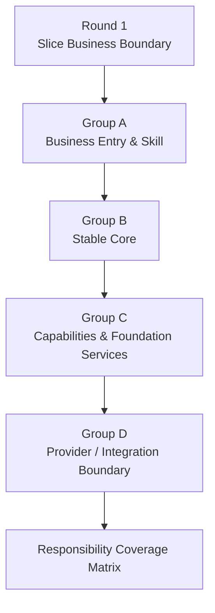
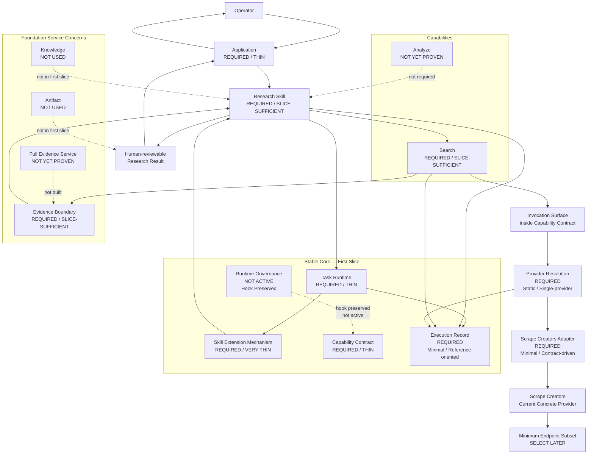

# Ecommerce AI OS — First Vertical Slice — Responsibility Coverage V0.1

- **文档类型**：Vertical Slice / Responsibility Coverage
- **项目**：Ecommerce AI OS
- **Vertical Slice**：First Vertical Slice — Research Execution
- **Business Scenario**：US / Car Vacuum / TikTok Content Research
- **目标路径**：`docs/02_system/vertical_slices/01_research_execution/02_RESPONSIBILITY_COVERAGE.md`
- **状态**：Candidate / Round 2 Reviewed
- **Review Result**：PASS_WITH_REFINEMENTS
- **阶段**：First Vertical Slice Planning — Round 2
- **Architecture Authority**：No
- **上级规划文档**：`00_FIRST_VERTICAL_SLICE_PLANNING.md`
- **上游业务边界**：`01_SLICE_BUSINESS_BOUNDARY.md`
- **日期**：2026-08-16

---

# 0. 文档目的

本文件记录 First Vertical Slice 的：

# **Round 2 — Responsibility Traversal / Responsibility Coverage**

完整审查结果。

本轮不重新设计 System Architecture V0.2。

本轮只回答：

> **为了完成已经在 Round 1 收敛的 US / Car Vacuum / TikTok Content Research Slice，System Architecture V0.2 中哪些 Responsibility 真正需要参与？参与到什么程度？哪些虽然存在于全局架构中，但 First Slice 当前并不需要？**

本轮重点不是：

> 把 System Architecture V0.2 中的所有方框全部实现。

而是：

> **使用真实 Slice 对 Candidate Responsibility Map 做第一次逐项压力测试。**

---

# 1. Round 1 输入边界

Round 2 不重新讨论 First Slice Business Boundary。

当前直接继承：

`01_SLICE_BUSINESS_BOUNDARY.md`

中的 Round 1 结果。

First Slice 从以下输入已经存在时开始：

```text
Product / SKU Context
+
Platform Context = TikTok
+
Market Context = US
+
Business Goal = Commerce Content
+
Research Intent / Decision Need
```

经过：

```text
Research Question Clarification
↓
Public TikTok Content Discovery
↓
Explicit Sample Boundary
↓
Public Content Evidence
+
Relevant Public Performance Evidence
↓
Research Findings
↓
Testable Hypotheses
↓
Answerability / Limitations
+
Traceability / Provenance
```

最终形成：

# **Human-reviewable Research Result**

First Slice 不承担：

- 最终测试优先级决策；
- Creative Direction finalization；
- Script；
- Shot Planning；
- Video Production；
- Publishing；
- Ads；
- Experiment Execution；
- GMV Attribution；
- Automatic Knowledge Update。

---

# 2. Round 2 审查方法

每一个 Responsibility 统一使用以下五个问题进行审查：

```text
R1.
First Slice 中有什么真实业务需求要求它存在？

R2.
如果删除它，Slice 会在哪一步断掉？

R3.
它的职责能否由另一个已有 Responsibility 合理承担？

R4.
First Slice 当前需要它做到什么深度？

R5.
它最容易错误吸收哪些不属于自己的职责？
```

---

# 3. Round 2 的一个重要方法修正

最初 Working Matrix 使用：

```text
REQUIRED
THIN
UNDER REVIEW
NOT USED
```

作为单一状态。

Round 2 审查后发现：

> **Necessity 和 Implementation / Design Depth 不是同一个维度。**

例如：

```text
Task Runtime
Necessity = REQUIRED
Depth = THIN
```

而：

```text
Research Skill
Necessity = REQUIRED
Depth = SLICE-SUFFICIENT
```

因此 Round 2 之后统一拆成：

```text
Necessity / Role
+
First-slice Depth
```

这只是 Vertical Slice Coverage 的表达修正。

它不修改 System Architecture V0.2。

---

# 4. Round 2 Grouping

本轮按四组责任区域审查：



---

# 5. Group A — Business Entry & Skill

---

# 5.1 Application

## Verdict

```text
Necessity:
REQUIRED

First-slice Depth:
THIN
```

## First Slice 为什么需要 Application Responsibility

First Slice 至少存在：

```text
Operator
→ Research Intent / Business Context
→ Ecommerce AI OS

Ecommerce AI OS
→ Human-reviewable Research Result
→ Operator
```

如果完全没有 Application Boundary，内部 Research Execution 仍然可以运行，但整个 Slice 会退化成：

```text
internal function
→ internal skill
→ internal capability
```

而不是完整的：

> 用户业务 Vertical Slice。

因此 First Slice 需要一个最小：

# **Operator ↔ System Interaction Boundary**

---

## First Slice 当前 Application 只负责

```text
Input side:
接受已经存在的 Business Context / Research Intent

Output side:
向 Operator 暴露 Human-reviewable Research Result
```

---

## 当前明确不设计

```text
Chat
Research Workspace
Dashboard
Session UI
Authentication UI
Operator Console
CLI / HTTP / Web implementation choice
```

具体 Interaction Surface 属于未来 Software / Application Design。

---

## 边界

Application 不负责：

```text
Research Method
Task Lifecycle
Execution State
Provider Details
Search Strategy
Evidence Interpretation
```

---

# 5.2 Research Skill

## Verdict

```text
Necessity:
REQUIRED

First-slice Depth:
SLICE-SUFFICIENT
```

Research Skill 是 First Slice 的：

# **业务方法核心**

没有 Research Skill，系统会退化成：

```text
Search
→ Data
→ Generic Summary
```

而不是：

```text
Business Question
→ Evidence Need
→ Research Method
→ Finding
→ Testable Hypothesis
```

---

## Research Skill 当前负责

### Research Question Clarification

把：

```text
Research Intent
```

收敛为：

```text
当前 Evidence 可以合理研究的问题
```

---

### Evidence Need Definition

Skill 决定：

> 为了回答当前 Research Question，需要什么类型的 Evidence。

保持：

```text
Business Question
→ Evidence Need
→ Candidate Capability / Source
```

而不是：

```text
Provider 有什么
→ Skill 就研究什么
```

---

### Discovery Strategy

Skill 负责：

```text
为什么找？
应该找什么？
应该覆盖哪些研究角度？
Query / Discovery Strategy 应该怎么形成？
```

但不负责真实 Provider 调用。

---

### Sample Selection Method

Skill 负责：

```text
为什么这样抽样？
什么样本值得进入？
什么应排除？
什么时候 coverage 基本够？
```

但：

```text
Actual Sample Boundary
```

属于本次 Research Execution 的稳定事实，而不是 Skill 自己私有的数据。

---

### Evidence Interpretation

Skill 负责：

> 当前 Evidence 在具体 Research Question 下意味着什么。

例如：

```text
某模式反复出现意味着什么？
高公开表现能支持什么？
不能支持什么？
```

---

### Finding Formation

Skill 负责：

```text
Evidence
→ apply professional research method
→ Research Finding
```

---

### Hypothesis Formation

Skill 可以形成：

```text
Testable Hypothesis
```

但不能形成：

```text
Validated Business Truth
```

也不承担：

```text
Final Test Priority Decision
```

---

### Answerability / Limitation Rules

例如：

```text
Public Signal
≠
Real Business Truth

Correlation
≠
Causation
```

这类具体研究解释纪律属于 Skill / Research Method。

---

## Research Skill 当前不负责

```text
Application interaction
Task lifecycle
Task runtime state
Search execution
Provider-specific API
Evidence persistence
Traceability mechanism
Execution Record
Final business decision
Creative Production
```

---

# 6. Group B — Stable Core

---

# 6.1 Task Runtime

## Verdict

```text
Necessity:
REQUIRED

First-slice Depth:
THIN
```

First Slice 已经证明：

> Research 不是一次单独 Capability Invocation，而是一整次 Research Execution。

因此需要一个稳定的：

# **Execution Boundary**

---

## First Slice 当前需要

### Task Identity

用于区分：

```text
Research Execution A
Research Execution B
```

并让 Evidence、Finding、Execution Record 等能够关联到同一次 Task。

---

### Task Lifecycle

当前只确认：

> Task 有开始、运行、完成 / 失败的生命周期。

不冻结复杂 State Machine。

---

### Execution Context

需要保持本次 Research 的：

```text
Product / SKU
TikTok
US
Commerce Content Goal
Research Intent
```

等上下文一致。

---

### Runtime State

当前只需要：

> 最小运行状态意识。

具体 State Enum 尚未设计。

---

### Execution Coordination

Skill 定义：

```text
业务上应该怎么研究
```

Task Runtime 负责：

```text
当前这一次执行如何向前推进
```

当前不新增：

```text
Orchestration Layer
Workflow Engine
Graph Runtime
```

---

### Failure Status

First Slice 已经可以出现：

```text
Search failure
Provider failure
Evidence insufficient
Partial execution
```

因此 Task 必须能表达最终失败 / 完成状态。

---

## First Slice 当前不要求

```text
Pause / Continue
Checkpoint Strategy
Crash Recovery
Durable Execution
Retry Engine
```

其中：

```text
Pause / Continue
```

属于当前 System Candidate，但 First Slice 没有真实需求证明中途 Human Gate / Resume 必须存在。

---

# 6.2 Skill Extension Mechanism

## Verdict

```text
Necessity:
REQUIRED

First-slice Depth:
VERY THIN
```

它的价值不是：

> 建设 Skill Plugin Platform。

而是：

> **证明 Research Skill 不是硬编码在 Stable Core / Application 中的特殊业务逻辑。**

---

## First Slice 当前需要

### Skill Contract

Skill 必须能够概念上表达：

```text
Who am I?
What business work do I perform?
What context do I need?
What dependencies do I require?
What business output do I produce?
```

具体 Python / Schema representation 尚未设计。

---

### Skill Identity / Declaration

系统必须知道：

> 当前使用的是哪个 Skill。

---

### Registration

当前只需要：

# **THIN / STATIC REGISTRATION**

不需要动态插件发现。

---

### Dependency Declaration

Research Skill 应声明：

```text
I need Search Capability
```

而不是：

```text
I need Scrape Creators
```

---

### Context Binding

把当前 Task Execution Context 中真正需要的部分绑定给 Skill。

---

### Platform / Domain Adaptation

First Slice 本身已经是：

```text
Research
+
TikTok
+
Commerce Content
```

因此 Platform / Domain Adaptation 作为机制是现实需求。

具体 TikTok 业务知识仍属于 Skill。

---

## 当前不需要

```text
Dynamic Plugin Discovery
Hot Reload
Skill Marketplace
Remote Registry
Independent Skill Runtime
Skill Checkpoint
Skill Recovery
```

---

## Composition

```text
Status:
UNDER REVIEW
```

当前只有一个明确 Research Skill。

尚未证明必须拆成：

```text
Generic Research
+
TikTok Skill
+
Commerce Skill
+
Car Vacuum Skill
```

再动态组合。

---

# 6.3 Capability Contract

## Verdict

```text
Necessity:
REQUIRED

First-slice Depth:
THIN at Core level
```

Capability Contract 是：

> Skill 与具体 Provider 之间的稳定能力边界。

---

## First Slice 已证明需要以下 concern

```text
Capability Identity
Capability Declaration
Invocation Surface
Input Boundary
Output Boundary
Error Boundary
Context Boundary
Runtime Governance Hook
Provider Resolution Boundary
```

---

## Capability Identity

Research Skill 必须能够声明：

```text
I depend on Search
```

---

## Invocation Surface

回答：

> Runtime 如何调用 Capability。

但当前不决定：

```text
Python Protocol
Tool Schema
HTTP API
MCP
Function Calling
```

---

## Input Boundary

Search 输入必须是：

> Provider-neutral system semantics。

不能直接等价于 Scrape Creators request fields。

---

## Output Boundary

Capability 不能直接返回：

```text
Scrape Creators raw JSON
```

作为稳定 OS output。

同时必须保持：

```text
Capability Result
≠
Evidence
```

---

## Error Boundary

Provider-specific error 应通过 Adapter 映射为稳定 Capability error semantics。

---

## Context Boundary

Capability 只获得执行该能力真正需要的 Context。

不能自动获得完整业务上下文。

---

## Runtime Governance Hook

保留 compatibility boundary。

但 First Slice 当前没有 active Governance enforcement。

---

## Provider Resolution Boundary

Capability 不直接绑定 Concrete Provider。

---

## 当前明确不设计

```text
Tool Layer
Tool Registry
Tool Schema
Full Capability Catalog
Universal Capability Framework
Multi-provider Routing
```

---

# 6.4 Runtime Governance

## Verdict

```text
First-slice Necessity:
NOT ACTIVELY REQUIRED

First-slice Depth:
HOOK PRESERVED ONLY
```

这是 Round 2 中第一个明确证明：

> **Global Responsibility 存在，不代表 First Slice 必须实际经过。**

---

## First Slice 当前没有证明需要

```text
Permission Enforcement
Human Gate
Cost Gate
Risk Gate
Execution Approval
Execution Block
Governance-driven Pause
```

---

## Human-reviewable Result ≠ Human Gate

Round 1 的：

```text
Human-reviewable Research Result
```

只意味着：

> 人可以审查系统输出。

它不等于：

```text
execution pause
→ human approval
→ resume
```

---

## Cost Fact ≠ Cost Gate

Scrape Creators 有 credit / cost facts。

但 First Slice 当前没有：

```text
cost > threshold
→ approval / block
```

这样的业务规则。

---

## Answerability

例如：

```text
Public Signal ≠ Business Truth
```

当前属于 Research Skill Method。

如果以后真实运行证明：

> Skill guidance 无法可靠阻止 overclaim，

再重新评估 Runtime Enforcement。

---

## Revisit Conditions

出现以下真实需求时重新审：

```text
Human Approval
Cost Gate
Permission Gate
Risk Gate
Mandatory Finding Validation
Publishing
Ads
High-cost Generation
Formal Knowledge Update
```

---

# 6.5 Execution Record

## Verdict

```text
Necessity:
REQUIRED

First-slice Depth:
MINIMAL / REFERENCE-ORIENTED
```

Execution Record 只负责：

# **Stable Execution Facts + References**

必须保持：

```text
Trace
≠
Execution Record
≠
Evidence
≠
Artifact
≠
Observability
≠
Evaluation
```

---

## First Slice 当前需要

```text
Run / Execution Identity
Task Reference
Input References
Skill Reference
Capability Reference
Provider Reference
Version References
Output References
Important Runtime Facts
Reproducibility References
```

---

## Provider Reference

业务不能依赖 Concrete Provider。

但执行事实必须知道：

> 这次实际用了哪个 Provider。

因此：

```text
Business dependency
= provider-neutral

Execution fact
= provider-specific allowed
```

---

## Version Reference

至少概念上需要知道：

> 当前使用的是哪个 Skill / Contract / Adapter version。

具体 version format 尚未设计。

---

## Trace Reference

```text
UNDER REVIEW
```

First Slice 需要 Traceability，但尚未证明必须有独立 Runtime Trace system。

---

## 当前明确不放入 Execution Record

```text
Full Evidence Payload
Full Artifact Payload
All Logs
Metrics
Tracing Backend
Evaluation Scores
All Runtime Intermediate States
```

---

# 7. Group C — Capabilities & Foundation Services

---

# 7.1 Search Capability

## Verdict

```text
Necessity:
REQUIRED

First-slice Depth:
SLICE-SUFFICIENT

Abstraction Scope:
Provider-neutral Content Discovery Boundary
```

但：

```text
Universal Search Architecture
= NOT YET PROVEN
```

---

## First Slice 为什么真正需要 Search

Round 1 已明确：

```text
Public TikTok Content Discovery
```

属于 In Scope。

这个需求独立于 Scrape Creators。

即使未来换 Provider，业务仍然需要：

> 发现相关公开内容。

因此 Search 是真正 Provider-independent 的 Capability concern。

---

## Research Skill vs Search

```text
Research Skill
= 决定为什么找、找什么、怎么用结果

Search Capability
= 执行稳定的内容发现行为

Provider
= 实际完成搜索
```

---

## Query

### Query Strategy

属于 Skill。

### Executable Search Request

属于 Capability Input Boundary。

---

## Source / Platform Intent

First Slice 需要 Search 能表达：

```text
TikTok
US
Research Query / Intent
必要约束
```

但当前不冻结：

```text
Universal Search Contract
```

也不决定最终名称究竟是：

```text
Search
Public Content Search
Platform Content Search
```

---

## Search Result ≠ Research Sample

Search 返回候选结果。

最终：

```text
Actual Sample Boundary
```

还要由 Research Method 和研究执行共同形成。

---

## Search Result ≠ Evidence

必须保持：

```text
Provider Raw Result
↓
Adapter
↓
Search Capability Result
↓
Evidence
```

而不是：

```text
Provider JSON = Evidence
```

---

## Pagination

当前只确认：

> Search 可能需要表达结果非一次完整返回的事实。

但 provider-specific cursor / token 属于 Adapter。

---

## Filter

必须保持：

```text
Business Filter Intent
≠
Provider Filter Syntax
```

---

## 当前不设计

```text
FindViralTikTokVideosCapability
Universal Search Platform
Retrieve Detail Capability
Comments Capability
Analyze Capability
Search + Analyze Combined Capability
```

其中 Retrieve 是否需要，必须等 Evidence Need 与 endpoint facts 明确后再判断。

---

# 7.2 Analyze Capability

## Verdict

```text
Analysis Activity:
REQUIRED

Independent Analyze Capability:
NOT YET PROVEN

First-slice Depth:
DO NOT DESIGN AS INDEPENDENT CAPABILITY YET
```

---

## 为什么需要 Analysis Activity

First Slice 一定存在：

```text
Evidence Interpretation
Pattern Comparison
Finding Formation
Hypothesis Formation
```

但这些目前高度依赖：

```text
Research Question
TikTok Context
Commerce Context
Answerability Rules
Research Method
```

所以它们目前更自然属于：

# **Research Skill**

---

## 为什么不现在抽 Analyze Capability

否则很容易形成：

```text
AnalyzeCapability
├── detect hook
├── classify content
├── compare performance
├── summarize
├── infer trust
├── create finding
└── generate hypothesis
```

这会变成新的万能垃圾桶。

---

## Revisit Conditions

当出现以下真实事实时重新审：

```text
多个 Skill 重复使用同一个分析动作

分析需要独立 Provider Replacement

分析操作形成稳定 I/O Contract

Research Skill 被 model / provider implementation detail 污染
```

例如未来：

```text
Content Feature Extraction
Media Understanding
Similarity Analysis
Classification
Trend Detection
```

可能更有资格成为独立 Capability。

---

# 7.3 Evidence Responsibility

## Verdict

```text
Necessity:
REQUIRED

First-slice Depth:
SLICE-SUFFICIENT BOUNDARY

Full Evidence Foundation Service:
NOT YET PROVEN
```

---

## First Slice 为什么必须有 Evidence Boundary

没有 Evidence：

```text
Provider Result
↓
Research Skill
↓
Finding
```

会导致：

- Provider result 被直接当 Evidence；
- Finding 无法追溯；
- Sample Boundary 无处绑定；
- Answerability 无法表达；
- Missingness 无法正确解释。

因此 Evidence 是 First Slice 从：

> Data Retrieval Tool

升级到：

> Research System

的核心边界。

---

## Raw Provider Result ≠ Evidence

```text
Raw Provider Result
= Provider 实际返回什么

Evidence
= 当前 Research 中被视为支持 / 限制某个判断的可追溯观察
```

---

## Search Result ≠ Evidence automatically

Search Result 必须经过：

```text
Research relevance
Sample inclusion
Evidence boundary
```

才进入 Evidence Set。

---

## Evidence / Finding / Hypothesis

```text
Evidence
= 我们观察到了什么

Finding
= 这些 Evidence 在 Research Question 下意味着什么

Hypothesis
= 接下来值得验证什么
```

---

## Evidence 当前需要

```text
Evidence Identity / Reference
Original Source Reference
Provider Reference
Raw Result / Observation Reference
Sample Boundary Reference
Observation Content
Observation Time / Collection Context
Missingness Semantics
Finding Referenceability
Answerability / Limitation linkage
Raw preservation concern
```

---

## Missingness

必须保持：

```text
missing
≠
0
```

---

## Source / Provider

例如：

```text
TikTok
= Original Source

Scrape Creators
= Access Provider
```

Evidence provenance 必须能够区分二者。

---

## Full Evidence Service 当前未被证明

First Slice 尚未证明需要：

```text
Independent Evidence Lifecycle
Global Evidence Catalog
Evidence Approval Workflow
Cross-task Evidence Reuse
Evidence Version Service
Dedicated Evidence DB
Evidence API
```

所以当前只建立：

# **Evidence Boundary**

不建设：

# **Evidence Platform**

---

# 7.4 Knowledge

## Verdict

```text
Global Architecture:
KEEP AS CANDIDATE FOUNDATION SERVICE

First-slice Necessity:
NOT REQUIRED

First-slice Depth:
NOT USED
```

---

## First Slice 当前不依赖 Knowledge Read

当前最小闭环可以直接完成：

```text
Product / SKU Context
↓
Research Skill
↓
Search
↓
Evidence
↓
Finding
↓
Hypothesis
```

不需要先读取正式 Knowledge。

---

## Research Skill ≠ Knowledge Service

Skill 中的：

```text
Professional Method
Business Know-how
Research Rules
```

并不代表 First Slice 已使用 Knowledge Foundation Service。

---

## Product / SKU Context ≠ Automatically Knowledge Service

当前只把 Product / SKU Context 视为：

```text
Upstream Business Input
```

不提前决定它最终由：

```text
Knowledge
Domain Service
Product Context Store
```

中的哪一个实现。

---

## Knowledge Update

明确：

```text
OUT OF FIRST SLICE
```

First Slice 结束在：

```text
Evidence
→ Finding
→ Testable Hypothesis
```

不继续：

```text
Knowledge Candidate
→ Human Review
→ Approved Knowledge
```

---

# 7.5 Artifact

## Verdict

```text
Global Architecture:
KEEP AS CANDIDATE FOUNDATION SERVICE

First-slice Necessity:
NOT REQUIRED

First-slice Depth:
NOT USED
```

---

## Human-reviewable Research Result ≠ Artifact

Round 1 要求：

```text
Human-reviewable Research Result
```

这是：

> 业务输出语义。

不是：

> 文件格式。

因此当前不要求：

```text
Markdown
PDF
JSON Export
Spreadsheet
Report File
```

---

## Research Result vs Artifact

```text
Research Result
= 本次 Research 业务上产出了什么

Artifact
= 这些结果是否被包装为一个可交付资产
```

未来可能：

```text
Research Result
↓
Optional packaging
↓
Artifact
```

但 First Slice 当前不要求。

---

## Artifact Revisit Conditions

出现以下需求时重新审：

```text
必须交付正式 Research Report

结果必须作为文件供下游 Workflow 消费

需要长期文件 /资产生命周期

多 Product Workflow 开始共享统一 Artifact management
```

---

# 8. Group D — Provider / Integration Boundary

---

# 8.1 Provider Resolution

## Verdict

```text
Necessity:
REQUIRED

First-slice Depth:
STATIC / SINGLE-PROVIDER
```

---

## 为什么只有一个 Provider 仍需要 Resolution

当前虽然只有：

```text
Scrape Creators
```

但仍然需要显式表达：

```text
Search Capability
↓
Current Provider Binding
↓
Scrape Creators
```

否则：

```text
SearchCapability
= ScrapeCreatorsSearch
```

会把 Capability 和 Concrete Provider 重新粘死。

---

## 当前 Provider Resolution 只负责

```text
Given Capability
→ determine current configured Provider binding
```

例如：

```text
Search
→ Scrape Creators
```

---

## 当前不需要

```text
Multi-provider Routing
Fallback
Load Balancing
Cost-aware Routing
Health-aware Routing
Region-aware Routing
Dynamic Provider Discovery
Provider Scoring
```

---

## Provider Resolution ≠ Dependency Injection

Provider Resolution 是：

> System Responsibility。

DI / Factory / Config Mapping 等是未来 Software Implementation Choice。

---

## Provider Resolution ≠ Retry

Retry Engine 当前仍不是 First Slice requirement。

---

# 8.2 Adapter / Connector

## Verdict

```text
Necessity:
REQUIRED

First-slice Depth:
MINIMAL / CONTRACT-DRIVEN
```

Adapter 是：

> **Stable Capability Contract 与 Concrete Provider Reality 之间的 Translation / Quirk Absorption Boundary。**

---

## First Slice 当前 Adapter 负责

### Request Translation

```text
Capability-level Search Request
↓
Scrape Creators-specific Parameters
```

---

### Response Translation

```text
Scrape Creators Response
↓
Stable Search Capability Result
```

---

### Error Translation

```text
Provider-specific Error
↓
Capability-level Error Semantics
```

---

### Pagination / Missingness / Region / Provider ID

根据当前 Slice 实际 endpoint facts，吸收：

```text
parameter naming
provider IDs
pagination token
missing fields
provider filters
region quirks
credits
cache behavior
provider error shape
```

但只处理当前 Contract 真正需要的部分。

---

## Adapter 不负责

```text
Provider Selection
Research Method
Evidence Interpretation
Task Runtime
Retry Engine
Runtime Governance
Full 97 Endpoint Integration
```

---

## Missingness

两层处理：

```text
Adapter
→ normalize provider missingness fact

Evidence / Skill
→ interpret missingness in Research
```

---

## Universal Normalized Object

当前明确不做：

```text
UniversalSocialMediaObject
UniversalVideoSignal
UniversalCommerceObject
```

只做：

# **Contract-required normalization**

---

## Adapter Coverage

First Slice 只覆盖：

> 当前 Slice 最终证明需要的最小 endpoint subset。

不做 97 endpoint 全量 Adapter。

---

# 8.3 Concrete Provider — Scrape Creators

## Verdict

```text
System-contract Necessity:
NO

First-slice Implementation Role:
CURRENT CONCRETE PROVIDER

First-slice Depth:
MINIMUM ENDPOINT SUBSET ONLY
```

---

## 为什么 First Slice 当前选择 Scrape Creators

因为已有独立 Provider Lab 已完成大量 Runtime Verification：

```text
97 inventoried endpoints
92 SUCCESS
5 non-success

L0:
92 CONFIRMED
5 UNKNOWN
```

因此它是当前最成熟、最适合作为 First Slice Concrete Provider 的现有外部资产。

---

## 但 Scrape Creators 不是 System Contract 依赖

必须保持：

```text
Search Capability
= Provider-neutral

Scrape Creators
= current implementation provider
```

如果未来换 Provider：

```text
Scrape Creators
→ Provider B
```

上层 Research Skill 和 Search Contract 不应该整体重写。

---

## Scrape Creators 可以定义

只定义自己的 Runtime Facts：

```text
Request Shape
Response Shape
Pagination
Provider IDs
Missingness
Errors
Credits
Region Behavior
Filter Behavior
Runtime Limitations
```

---

## Scrape Creators 不可以定义

```text
Research Skill
Search Business Semantics
Evidence Model
Finding Model
Task Runtime
Product Architecture
System Architecture
```

---

## 97 API 不全部接入

First Slice 正确顺序必须继续保持：

```text
Business Question
↓
Evidence Need
↓
Search / Service Contract
↓
Required Provider Facts
↓
Select Minimum Endpoint Subset
↓
Adapter Coverage
```

不是：

```text
97 APIs
↓
反推 Capability
↓
反推 OS
```

---

## Execution Record

当前实际执行可以记录：

```text
provider_ref = Scrape Creators
```

因为：

```text
Business Dependency
= Provider-neutral

Execution Fact
= Provider-specific allowed
```

---

# 9. Final Responsibility Coverage Matrix — Round 2 Candidate

| Responsibility | Necessity / Role | First-slice Depth |
|---|---|---|
| Application | REQUIRED | THIN |
| Research Skill | REQUIRED | SLICE-SUFFICIENT |
| Task Runtime | REQUIRED | THIN |
| Skill Extension Mechanism | REQUIRED | VERY THIN |
| Capability Contract | REQUIRED | THIN |
| Runtime Governance | NOT ACTIVELY REQUIRED | HOOK PRESERVED |
| Execution Record | REQUIRED | MINIMAL / REFERENCE-ORIENTED |
| Search Capability | REQUIRED | SLICE-SUFFICIENT |
| Analyze Capability | NOT YET PROVEN | DO NOT DESIGN YET |
| Evidence Responsibility | REQUIRED | SLICE-SUFFICIENT BOUNDARY |
| Full Evidence Foundation Service | NOT YET PROVEN | DO NOT BUILD YET |
| Knowledge | NOT REQUIRED | NOT USED |
| Artifact | NOT REQUIRED | NOT USED |
| Provider Resolution | REQUIRED | STATIC / SINGLE-PROVIDER |
| Adapter / Connector | REQUIRED | MINIMAL / CONTRACT-DRIVEN |
| Scrape Creators | CURRENT CONCRETE PROVIDER | MINIMUM ENDPOINT SUBSET ONLY |

---

# 10. First Slice Responsibility Overlay — Round 2 Result



注意：

> 本图仍然只是 First Slice Responsibility Overlay，不是新的 System Architecture，也不是最终 Runtime Call Graph。

---

# 11. Round 2 形成的五个重要架构发现

---

## Finding 1 — Necessity 与 Depth 必须分开

不能再用一个 Status 同时表达：

```text
要不要这个 Responsibility
```

和：

```text
第一条 Slice 做多深
```

因此后续统一使用：

```text
Necessity / Role
+
First-slice Depth
```

---

## Finding 2 — Global Responsibility ≠ Every Slice Uses It

典型案例：

```text
Runtime Governance
Knowledge
Artifact
```

它们仍然存在于全局 System Architecture Candidate 中。

但 First Slice 当前并不实际经过。

这证明：

> System Architecture V0.2 是 Responsibility Map，不是所有 Slice 必须严格顺序经过的 Runtime Pipeline。

---

## Finding 3 — Activity ≠ Independent Capability

典型案例：

```text
Analysis Activity
= REQUIRED

Independent Analyze Capability
= NOT YET PROVEN
```

First Slice 当前由 Research Skill 承担高度业务相关的 Evidence Interpretation / Analysis Method。

只有出现稳定、独立、可复用调用边界时，Analyze 才可能升级为独立 Capability。

---

## Finding 4 — Boundary ≠ Full Service

典型案例：

```text
Evidence Boundary
= REQUIRED

Full Evidence Foundation Service
= NOT YET PROVEN
```

当前 Slice 真正需要：

```text
Evidence semantics
Provenance
Sample Boundary
Missingness
Finding Referenceability
```

但不需要完整：

```text
Evidence Platform
Evidence DB
Evidence API
Global Catalog
Independent Lifecycle
Approval Workflow
```

---

## Finding 5 — Concrete Provider ≠ System Dependency

典型案例：

```text
Scrape Creators
= Current Concrete Provider

Search Contract
= Must remain Provider-neutral
```

因此：

> Provider-specific Runtime Facts 可以进入 Adapter 和 Execution Facts，但不能反向定义 Skill、Capability、Evidence 或顶层架构。

---

# 12. Round 2 对 System Architecture V0.2 的压力测试结果

本轮没有发现 First Slice 需要：

```text
New top-level Responsibility
```

也没有发现：

```text
Current System Architecture V0.2
无法承载 First Slice
```

本轮真正发生的是：

```text
Implementation Scope Reduction
+
Responsibility Clarification
+
Maturity Separation
```

例如：

```text
Runtime Governance
→ 不主动参与

Analyze
→ 不提前抽 Capability

Knowledge
→ 不进入

Artifact
→ 不进入

Evidence
→ 只做 Boundary，不做 Full Service

Provider Resolution
→ 只做 Static Single-provider

Adapter
→ 只做 Contract-required subset
```

---

# 13. Round 2 Review Result

本轮 Review Result：

# **PASS_WITH_REFINEMENTS**

含义：

> First Slice 当前可以由 System Architecture V0.2 的现有 Responsibility Map 合理承载，不需要新增顶层 System Responsibility，也不需要重新开启 top-level System Architecture Audit。

本轮形成的是：

> **First Slice Responsibility Coverage Candidate**

不是：

- System Architecture Approved；
- Software Architecture Approved；
- Capability Contract Approved；
- Evidence Service Approved；
- Provider Router Approved；
- Implementation Approved。

---

# 14. 当前明确继续 Deferred / Not Yet Designed

Round 2 完成后仍然不进入：

```text
Complete TikTok Skill Pack
Complete Research Taxonomy
Why Stop / Trust / Click / Buy complete model
Pause / Continue mechanism
Checkpoint
Crash Recovery
Durable Execution
Retry Engine
Dynamic Skill Registry
Skill Composition
Tool Layer
Tool Schema
Analyze Capability
Retrieve Capability
Comments Capability
Full Evidence Service
Knowledge Retrieval
Knowledge Update
Artifact Service
Multi-provider Routing
Fallback
Provider Health Routing
97 API Full Integration
Production UI
Database
Persistence
RAG
Vector DB
Agent Architecture
Multi-Agent
Observability Backend
```

---

# 15. Round 2 完成后的当前最小 Responsibility Set

First Slice 当前真正需要的核心责任可以压缩成：

```text
Application Boundary

Research Skill

Task Runtime

Thin Skill Extension Boundary

Capability Contract

Search Capability

Evidence Boundary

Execution Record

Static Provider Resolution

Scrape Creators Adapter

Scrape Creators
```

而：

```text
Runtime Governance
→ Hook preserved, not active

Analyze
→ Not yet proven

Knowledge
→ Not used

Artifact
→ Not used

Full Evidence Service
→ Not yet proven
```

---

# 16. Round 2 到 Round 3 的输入

Round 3 不再重新讨论：

> 哪些 Responsibility 应该存在。

Round 3 将使用本文件中的 Coverage Matrix，开始回答：

# **这些已经确认参与 First Slice 的 Responsibility，在一次真实 Research Execution 中到底怎么协作？**

即：

# **Round 3 — Minimal Runtime Path**

Round 3 重点不是 Software Implementation。

而是：

```text
Operator
↓
Application Boundary
↓
Research Skill
↓
Task Runtime
↓
Search Capability
↓
Invocation Surface
↓
Provider Resolution
↓
Adapter
↓
Scrape Creators
↓
Search Result
↓
Evidence
↓
Research Skill Interpretation
↓
Finding / Hypothesis
↓
Execution Record
↓
Research Result
↓
Operator
```

下一轮必须逐个质疑：

```text
谁先调用谁？

Skill 和 Task Runtime 的真实协作方向是什么？

Evidence 在 Runtime Path 的哪个时点形成？

Execution Record 是持续记录还是结束时形成？

Research Skill 是否直接触发 Capability？

Application 是否直接创建 Task？

Provider Resolution 在调用路径中何时发生？

哪些箭头只是 Responsibility Relation，
哪些是真正 Runtime Interaction？
```

这些属于 Round 3。

---

# 17. 当前状态

```text
Round 1
Slice Business Boundary
→ Candidate / Reviewed
→ PASS_WITH_CHANGES

Round 2
Responsibility Coverage
→ Candidate / Reviewed
→ PASS_WITH_REFINEMENTS

Current Next:
Round 3 — Minimal Runtime Path
```

---

# 18. 一句话总结

> **Round 2 已证明 First Research Slice 不需要实现 System Architecture V0.2 的所有 Candidate Responsibility；真正需要的是一个由 Research Skill 驱动、Task Runtime 承载执行边界、Search Capability 提供外部内容发现、Evidence Boundary 保证研究可追溯性、Execution Record 保存稳定执行事实，并通过静态 Provider Resolution + 最小 Scrape Creators Adapter 接入当前 Concrete Provider 的窄 Research Execution Path。Runtime Governance、Analyze、Knowledge、Artifact 和完整 Evidence Service 当前均没有足够业务证据要求进入 First Slice。**