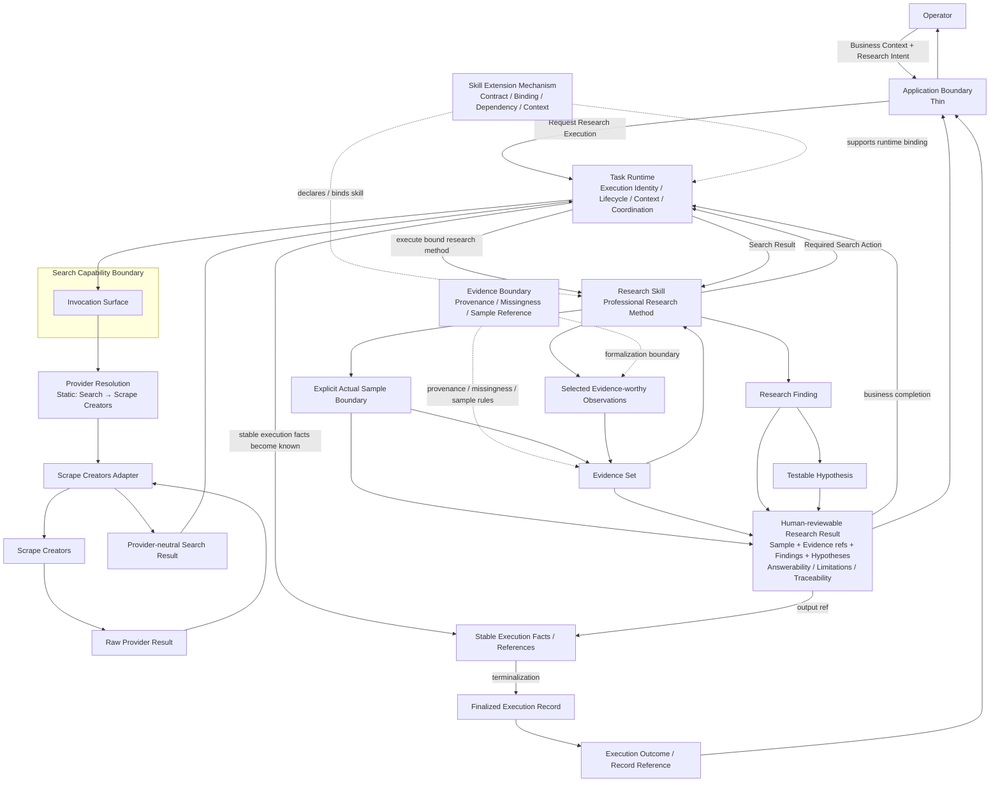

# Ecommerce AI OS — First Vertical Slice — Minimal Runtime Path V0.1

- **文档类型**：Vertical Slice / Minimal Runtime Path
- **项目**：Ecommerce AI OS
- **Vertical Slice**：First Vertical Slice — Research Execution
- **Business Scenario**：US / Car Vacuum / TikTok Content Research
- **目标路径**：`docs/02_system/vertical_slices/01_research_execution/03_MINIMAL_RUNTIME_PATH.md`
- **状态**：Candidate / Round 3 Reviewed
- **Review Result**：PASS_WITH_REFINEMENTS
- **阶段**：First Vertical Slice Planning — Round 3
- **Architecture Authority**：No
- **上级规划文档**：`00_FIRST_VERTICAL_SLICE_PLANNING.md`
- **上游业务边界**：`01_SLICE_BUSINESS_BOUNDARY.md`
- **上游 Responsibility Coverage**：`02_RESPONSIBILITY_COVERAGE.md`
- **日期**：2026-08-16

---

# 0. 文档目的

本文件记录 First Vertical Slice 的：

# **Round 3 — Minimal Runtime Path**

设计与压力测试结果。

Round 1 已回答：

> 这条 Slice 从哪里开始、到哪里结束、服务什么业务决策。

Round 2 已回答：

> 哪些 System Responsibility 真正需要参与 First Slice，以及需要到什么深度。

Round 3 当前只回答：

> **这些已经确认参与 First Slice 的 Responsibility，在一次真实 Research Execution 中如何协作，哪些关系是真正 Runtime Interaction，哪些只是 Responsibility / Contract Boundary。**

本文件不是：

- 新的 System Architecture；
- Python Object Graph；
- Sequence Diagram；
- Process Topology；
- API Design；
- Workflow DSL；
- Agent Graph；
- Database Transaction Model；
- Software Architecture。

---

# 1. Round 3 输入

Round 3 直接继承：

```text
01_SLICE_BUSINESS_BOUNDARY.md
+
02_RESPONSIBILITY_COVERAGE.md
```

不重新讨论：

- First Slice Business Boundary；
- Product Architecture；
- System Architecture V0.2 顶层结构；
- 哪些 Responsibility 应该存在。

---

# 2. First Slice Runtime Entry

First Slice 从 Operator 已具备：

```text
Product / SKU Context
+
Platform Context = TikTok
+
Market Context = US
+
Business Goal = Commerce Content
+
Research Intent / Decision Need
```

开始。

Runtime Entry 当前收敛为：

```text
Operator
↓
Application Boundary
↓
Task Runtime
```

Application 不直接运行 Research Skill。

---

# 3. Application Boundary

## Runtime Responsibility

Application 当前只负责：

```text
Operator
→ Business Context / Research Intent
→ Ecommerce AI OS

Ecommerce AI OS
→ Research Result / Execution Outcome
→ Operator
```

Application 请求：

> 启动一次 Research Execution。

它不负责：

- Task Identity；
- Lifecycle；
- Runtime State；
- Skill Binding；
- Search Execution；
- Evidence Interpretation；
- Provider Resolution。

---

# 4. Task Runtime 建立一次 Research Execution

Task Runtime 为当前请求建立：

```text
Execution Identity
Task Lifecycle
Execution Context
Runtime State
Execution Coordination
Failure Status
```

Round 3 当前不定义：

- Task Schema；
- State Enum；
- State Machine；
- Persistence；
- Checkpoint；
- Durable Execution；
- Retry Engine。

---

# 5. Skill Extension Mechanism 不是第二个 Runtime Hop

Round 3 初始 Working Path 曾表达：

```text
Task Runtime
↓
Skill Extension Mechanism
↓
Research Skill
```

压力测试后收敛为：

```text
Task Runtime
↓
Research Skill
```

同时：

```text
Skill Extension Mechanism
→ 支持 Skill Declaration / Binding / Dependency / Context
```

因此：

> **Skill Extension Mechanism 是 Skill participation boundary，不是第二套执行 Runtime。**

它负责支持：

```text
Skill Contract
Skill Identity / Declaration
Thin Registration
Dependency Declaration
Context Binding
Platform / Domain Adaptation
```

但不承担：

```text
Task execution
Skill lifecycle runtime
Pause / Resume
Retry
Checkpoint
```

---

# 6. Research Skill 与 Task Runtime 的执行关系

两者不是简单上下级调用关系。

当前边界：

```text
Research Skill
= 定义业务上应该怎么研究

Task Runtime
= 当前这一次 Research Execution 如何推进
```

Research Skill 决定：

```text
当前 Research Question 是什么
需要什么 Evidence
业务上下一步需要什么 Capability
Sampling Method
如何解释 Evidence
如何形成 Finding / Hypothesis
```

Task Runtime 负责：

```text
把当前业务动作纳入本次 Task Execution
协调系统级 Capability / Service Interaction
维护执行状态
处理执行成功 / 失败
把执行结果交还 Skill
```

---

# 7. Capability Invocation Direction

Round 3 审查了两种方案。

## Rejected Direction

```text
Research Skill
→ directly calls Search Capability
```

问题：

- Skill 会开始拥有 execution sequencing；
- Capability invocation 不再自然落入 Task execution envelope；
- Task Runtime 容易退化为 status wrapper；
- Execution Record 更难稳定记录 actual capability invocation。

---

## Current Candidate Direction

```text
Research Skill
↓
expresses required capability action
↓
Task Runtime / Execution Coordination
↓
Capability Invocation Surface
↓
Search Capability
```

返回：

```text
Search Capability Result
↓
Task Runtime
↓
Research Skill
```

Skill表达：

> 业务上现在需要 Search。

Runtime负责：

> 当前 Task 中执行一次 Search Capability invocation。

---

# 8. Invocation Surface 的位置

Invocation Surface 不是新的顶层 Runtime Layer。

它属于：

```text
Capability Contract
└── Invocation Surface
```

因此 Runtime Path 中应理解为：

```text
Task Runtime
↓
Search Capability Boundary
   └── Invocation Surface
```

而不是：

```text
Task Runtime
↓
Invocation Layer
↓
Capability Layer
```

---

# 9. Search Capability → Provider Path

当前依赖方向：

```text
Search Capability Invocation
↓
Provider Resolution
↓
Scrape Creators Adapter
↓
Scrape Creators
↓
Concrete API
```

Provider Resolution 当前只负责：

```text
Search
→ current provider binding
→ Scrape Creators
```

属于：

# **Static / Single-provider Resolution**

当前不设计：

- Multi-provider Routing；
- Fallback；
- Load Balancing；
- Cost-aware Routing；
- Health-aware Routing。

---

# 10. Scrape Creators Adapter Runtime Role

Adapter 负责：

```text
Capability Request
↓
Provider Request Translation

Provider Response
↓
Capability Result Translation
```

包括当前 Slice 真正需要的：

```text
parameter translation
response translation
error translation
pagination translation
missingness normalization
region / filter quirks
provider IDs
```

Adapter 不负责：

- Research Method；
- Sampling；
- Evidence Interpretation；
- Provider Selection；
- Runtime Coordination。

---

# 11. Provider Result Return Path

外部执行返回：

```text
Scrape Creators
↓
Raw Provider Result
↓
Scrape Creators Adapter
↓
Provider-neutral Search Capability Result
↓
Task Runtime
↓
Research Skill
```

Task Runtime只理解：

```text
invocation success / failure
result available
result reference
current execution continuation
```

不解释 Search Result 的业务意义。

---

# 12. Search Result ≠ Evidence

Round 3 继续保持：

```text
Raw Provider Result
≠
Search Capability Result
≠
Evidence
```

Search Result 只是：

> Provider-neutral capability result。

它是否成为 Research Evidence，必须经过 Research Method。

---

# 13. Sampling Path

Search Result 返回 Research Skill 后：

```text
Search Capability Result Set
↓
Research Skill applies relevance / sampling method
↓
Explicit Actual Sample Boundary
```

必须区分：

```text
Sample Selection Method
→ Research Skill

Actual Sample Boundary
→ Current Research Execution Fact
```

Search Result 不自动等于 Final Research Sample。

---

# 14. Evidence Formation

Round 3 审查了三种候选：

```text
A.
Search Result
→ Skill
→ Evidence

B.
Search Result
→ Evidence Responsibility
→ Evidence
→ Skill

C.
Search Result
→ Skill selects / interprets relevance
→ Evidence Boundary formalizes
→ Evidence
→ Skill
```

当前选择：

# **C**

但经过 Stress Test 后进一步修正：

> **Evidence Boundary 当前不应被表达成一个已证明存在的独立 Service Runtime Hop。**

因此当前责任关系是：

```text
Research Skill
↓
Selected Evidence-worthy Observations
↓
Evidence Set
```

同时：

```text
Evidence Boundary
→ constrains Evidence formalization
```

Evidence Boundary负责约束：

```text
Source provenance
Provider provenance
Raw / capability result reference
Sample Boundary reference
Missingness
Observation Context
Finding Referenceability
Answerability / limitation linkage
```

---

# 15. Evidence Boundary ≠ Full Evidence Service

Round 3 明确保持 Round 2 结论：

```text
Evidence Boundary
= REQUIRED

Full Evidence Foundation Service
= NOT YET PROVEN
```

因此当前 Runtime Path 不创建：

```text
EvidenceService
EvidenceRepository
Evidence API
Evidence Runtime
Evidence Database
```

这些仍然 Not Yet Designed。

---

# 16. Missingness Runtime Semantics

Missingness 当前链路：

```text
Provider-specific Missingness
↓
Adapter normalization
↓
Evidence preserves missingness fact
↓
Research Skill interprets impact
```

必须保持：

```text
Missing
≠
0
```

---

# 17. Evidence → Research Interpretation

Evidence Set 形成后返回 Research Skill。

后续业务路径：

```text
Evidence Set
↓
Research Skill
↓
Research Finding
↓
Testable Hypothesis
```

当前不引入：

```text
Analyze Capability
Finding Service
Hypothesis Service
Research Service
```

Analysis Activity 存在。

但 Independent Analyze Capability 当前仍：

```text
NOT YET PROVEN
```

---

# 18. Research Result

Research Skill 最终形成：

# **Human-reviewable Research Result**

概念上至少包含：

```text
Explicit Sample Boundary
Evidence References / Evidence Set
Research Findings
Testable Hypotheses
Answerability / Limitations
Traceability / Provenance
```

必须保持：

```text
Research Result
≠
Final Business Decision

Finding
≠
Creative Direction

Hypothesis
≠
Validated Business Truth
```

---

# 19. Business Completion ≠ Execution Completion

Research Skill 可以表达：

> 当前业务方法已经形成完整 Research Result。

但 Skill 不负责：

```text
Task terminal state
Task success
Task failure
Execution lifecycle
```

因此：

```text
Research Skill
→ Business Completion

Task Runtime
→ Execution Completion
```

---

# 20. Insufficient Evidence ≠ Execution Failure

这是 Round 3 的重要语义发现。

例如：

```text
Search成功
Sample形成
Evidence形成
Research Method正常完成
但 Evidence 无法支持强结论
```

合法 Research Result 可以是：

```text
Current evidence is insufficient.
```

这仍然可以是：

# **Successful Research Execution**

因此必须保持：

```text
Execution Failure
≠
Insufficient Evidence
≠
Hypothesis Rejected Later
```

第三种属于未来 Experiment & Validation。

---

# 21. Task Terminalization

Research Result 完成后：

```text
Research Skill
↓
Research Result
↓
Task Runtime
```

Task Runtime负责判断：

> 当前 execution 是否达到 terminal state。

Runtime不判断：

```text
Finding 好不好
Hypothesis 是否正确
Evidence 是否足以证明真实购买因果
```

Runtime只判断：

> 当前业务工作是否按照其 Contract 成功完成并产生允许的结果，或者 execution 本身失败。

---

# 22. Execution Record Lifecycle

Round 3 审查了：

```text
A.
Task结束后才重新生成 Execution Record

B.
每一步都实时写完整 Execution Record

C.
执行过程中稳定 execution facts / refs 逐步变得已知，
Task terminalization 时 finalize Execution Record
```

当前选择：

# **C**

---

# 23. Stable Execution Facts

执行中逐步产生稳定事实，例如：

```text
Execution Identity
Task Reference
Input References
Skill Reference
Actually Invoked Capability References
Resolved Provider Reference
Version References
Search Result Reference
Evidence Set Reference
Research Result / Output Reference
Final Execution Status
Important Stable Runtime Facts
Reproducibility References
```

必须区分：

```text
Declared Dependency
≠
Actual Invocation Fact
```

只有真正调用过 Search：

```text
capability_ref = Search
```

才成为 execution fact。

---

# 24. Execution Record 不是 Runtime Trace

当前继续保持：

```text
Execution Record
≠
Runtime State
≠
Trace
≠
Logs
≠
Observability
≠
Evidence
≠
Artifact
≠
Evaluation
```

Execution Record 不保存：

```text
Full Raw Provider Payload
Full Search Result Payload
Full Evidence Payload
Every Runtime State Change
All Function Calls
All Logs
Metrics
Trace Events
Evaluation Scores
```

---

# 25. Execution Record Finalization

当前生命周期语义：

```text
Task begins
↓
Execution Identity exists
↓
Stable execution facts / refs become known
↓
Task reaches terminal state
↓
Execution Record finalized
```

这不是 Persistence Design。

当前不决定：

```text
memory
JSON
SQLite
Postgres
event store
database transaction
```

---

# 26. Failure Path

Execution Failure 仍然需要形成 Execution Record。

例如：

```text
Task Starts
↓
Search Capability Invocation
↓
Provider = Scrape Creators
↓
Provider Failure
↓
Task Failure
↓
Execution Record Finalized
```

即使没有：

```text
Evidence
Finding
Research Result
```

Execution Record 仍然可以保留：

```text
task ref
skill ref
capability ref
provider ref
failure status
failure reference / stable summary
```

---

# 27. Application Return Boundary

Task 完成后 Application 不需要完整 Execution Record Payload。

当前返回语义：

```text
Research Result
+
Execution Outcome / Record Reference
↓
Application
↓
Operator
```

而不是：

```text
Full Execution Record
↓
Operator
```

Application 是业务交互边界，不是 Runtime Inspection Console。

---

# 28. Runtime Governance 当前不进入 Active Path

Round 3 Stress Test 没有发现需要：

```text
Permission Gate
Cost Gate
Risk Gate
Human Approval Gate
Governance-driven Pause
```

因此保持：

```text
Runtime Governance
= Global Candidate Responsibility

First Slice
= Not Active

Capability Contract
= Governance Hook Preserved
```

---

# 29. Analyze / Knowledge / Artifact 当前不进入 Runtime Path

继续保持 Round 2：

```text
Analyze Capability
= NOT YET PROVEN

Knowledge
= NOT USED

Artifact
= NOT USED

Full Evidence Service
= NOT YET PROVEN
```

Round 3 没有产生新证据要求把它们拉回 First Slice。

---

# 30. Research System Placement 继续 Under Review

当前 Runtime Path 已经可以通过：

```text
Task Runtime
+
Research Skill
+
Search Capability
+
Evidence Boundary
+
Provider Boundary
```

完成闭环。

没有出现必须新增：

```text
Research Service
Research Runtime
Research Foundation Service
```

的证据。

因此继续保持：

```text
Research
= Product Family Confirmed
= System Placement Under Review
```

---

# 31. Minimal Runtime Path Candidate V0.1



---

# 32. 本图解释纪律

本图表达：

> **First Slice Candidate Runtime Interaction。**

它不是：

- exact call graph；
- object graph；
- process graph；
- network topology；
- thread model；
- async model；
- persistence model；
- API schema；
- workflow engine definition。

虚线表示：

> Responsibility / Contract support relation。

实线表示：

> 当前候选 Runtime / Data interaction。

---

# 33. Round 3 Stress Test — Refinement 1

原候选：

```text
Task Runtime
→ Skill Extension Mechanism
→ Research Skill
```

修正：

```text
Task Runtime
→ Research Skill
```

而：

```text
Skill Extension Mechanism
→ supports declaration / binding / dependency / context
```

原因：

> Skill Extension Mechanism 不是第二个 Runtime。

---

# 34. Round 3 Stress Test — Refinement 2

原候选：

```text
Research Skill
→ Evidence Service
→ Evidence Set
```

修正：

```text
Research Skill
→ selected evidence-worthy observations
→ Evidence Set
```

同时：

```text
Evidence Boundary
→ constrains Evidence formalization
```

原因：

> Full Evidence Foundation Service 尚未被证明。

---

# 35. Round 3 Stress Test — Refinement 3

原候选容易表达成：

```text
Every Responsibility
→ directly writes Execution Record
```

修正：

```text
Runtime interactions
↓
stable execution facts become known in execution context
↓
Task terminalization
↓
Execution Record finalized
```

原因：

> 当前没有设计 Event Bus / Recorder / Fact Sink。

---

# 36. Round 3 Stress Test — Refinement 4

原候选：

```text
Execution Record
→ Application
```

修正：

```text
Research Result
+
Execution Outcome / Record Reference
→ Application
```

原因：

> Application 不需要消费完整 Execution Record payload。

---

# 37. Round 3 形成的关键 Runtime 结论

```text
1.
Application initiates Research Execution through Task Runtime.

2.
Skill Extension Mechanism supports Skill participation,
but is not a second Runtime hop.

3.
Research Skill defines Business Method.

4.
Task Runtime coordinates the current execution.

5.
Research Skill expresses required system-level capability actions.

6.
Task Runtime coordinates Capability invocation.

7.
Search invocation crosses:
Capability Boundary
→ Provider Resolution
→ Adapter
→ Scrape Creators.

8.
Provider-specific result is translated before returning upward.

9.
Search Result is not automatically Evidence.

10.
Research Skill owns relevance / sampling / evidence-worthiness judgment.

11.
Actual Sample Boundary is an execution research fact.

12.
Evidence Boundary formalizes stable Evidence semantics
without introducing a full Evidence Service.

13.
Research Skill owns Evidence Interpretation,
Finding Formation and Hypothesis Formation.

14.
Research Result represents Business Completion.

15.
Task Runtime owns Execution Completion.

16.
Insufficient Evidence ≠ Execution Failure.

17.
Stable Execution Facts accumulate conceptually during execution.

18.
Execution Record is finalized at task terminalization.

19.
Application receives Research Result
plus Execution Outcome / Record Reference.

20.
Runtime Governance / Analyze / Knowledge / Artifact
remain outside the active First Slice path.
```

---

# 38. Round 3 Review Result

本轮 Review Result：

# **PASS_WITH_REFINEMENTS**

本轮没有发现：

```text
Top-level System Architecture Gap
```

没有发现：

```text
需要新增：
Agent Layer
Orchestration Layer
Research Service
Evidence Service
Tool Layer
```

也没有发现 Round 2 Coverage Matrix 需要被推翻。

本轮主要完成：

```text
Runtime Interaction Clarification
+
Responsibility Relation vs Runtime Hop Separation
+
Execution Completion Boundary
+
Execution Record Lifecycle Clarification
```

---

# 39. 当前继续 Not Yet Designed

Round 3 完成后仍然不进入：

```text
Task Schema
Task State Enum
Workflow DSL
Action Object
CapabilityRequest Object
Search Request Schema
Search Result Schema
Evidence Schema
Finding Schema
Research Result Schema
Execution Record Schema
Error Taxonomy
Provider Resolution Interface
Adapter Interface
Python Protocol
Pydantic
dataclass
Database
Persistence
HTTP API
Tool Schema
Agent Framework
Sync / Async
Event / Message Architecture
Scrape Creators endpoint selection
```

这些进入后续阶段。

---

# 40. 下一步

Round 3 完成后进入：

# **Round 4 — Contract Inventory**

Round 4 不再重新画 Runtime Path。

它将回答：

> **在当前 Minimal Runtime Path 中，哪些 Responsibility Boundary 之间必须存在明确 System Contract？**

重点包括：

```text
Application ↔ Task Runtime

Task Runtime ↔ Research Skill

Skill Extension Contract

Research Skill ↔ Capability Need

Task Runtime ↔ Capability Invocation Surface

Search Capability Contract

Capability ↔ Provider Resolution

Provider Resolution ↔ Adapter

Adapter ↔ Concrete Provider

Search Result ↔ Evidence Formalization Boundary

Evidence ↔ Finding / Research Result

Task Runtime ↔ Execution Record

Task Completion ↔ Application Return
```

Round 4 仍然只做：

> Contract Inventory / Contract Responsibility

不进入：

- 字段；
- JSON；
- Python；
- Schema；
- Persistence；
- endpoint。

---

# 41. 当前状态

```text
Round 1
Slice Business Boundary
→ Candidate / Reviewed
→ PASS_WITH_CHANGES

Round 2
Responsibility Coverage
→ Candidate / Reviewed
→ PASS_WITH_REFINEMENTS

Round 3
Minimal Runtime Path
→ Candidate / Reviewed
→ PASS_WITH_REFINEMENTS

Current Next:
Round 4 — Contract Inventory
```

---

# 42. 一句话总结

> **Round 3 已将 First Research Slice 从 System Responsibility Map 收敛成一条最小 Runtime Interaction Candidate：Operator 通过薄 Application Boundary 启动 Task；Task Runtime 协调 Research Skill 与系统级 Capability invocation；Search 经 Provider Resolution、Scrape Creators Adapter 和 Concrete Provider 获取 Provider-neutral Result；Research Skill完成 sampling 与 Evidence-worthiness 判断，Evidence Boundary保证证据语义和追溯边界，Research Skill形成 Finding / Testable Hypothesis；Task Runtime在业务结果完成后终止 execution，并以稳定 execution facts finalize Execution Record，最终向 Application 返回 Research Result 与 Execution Outcome / Record Reference。**