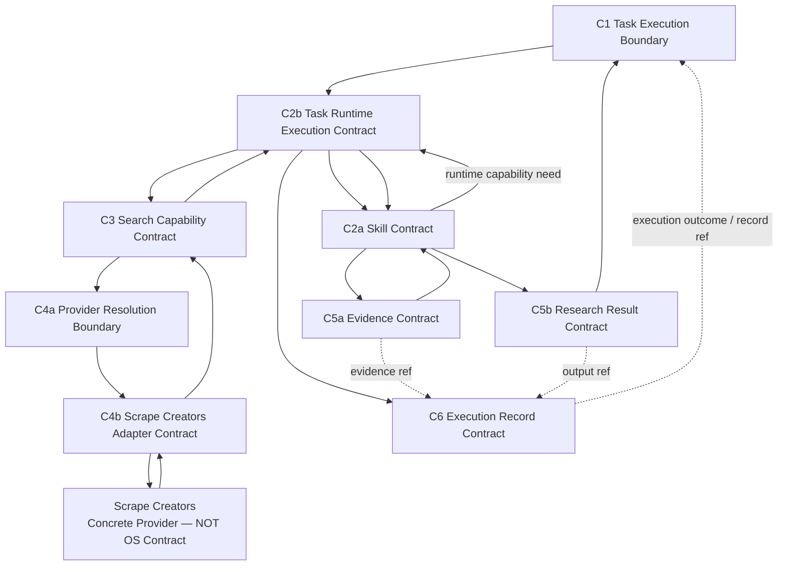

# Ecommerce AI OS — First Vertical Slice — Contract Inventory V0.1

- **文档类型**：Vertical Slice / System Contract Inventory
- **项目**：Ecommerce AI OS
- **Vertical Slice**：First Vertical Slice — Research Execution
- **Business Scenario**：US / Car Vacuum / TikTok Content Research
- **目标路径**：`docs/02_system/vertical_slices/01_research_execution/04_CONTRACT_INVENTORY.md`
- **状态**：Candidate / Round 4 Reviewed
- **Review Result**：PASS_WITH_REFINEMENTS
- **阶段**：First Vertical Slice Planning — Round 4
- **Architecture Authority**：No
- **上级规划文档**：`00_FIRST_VERTICAL_SLICE_PLANNING.md`
- **上游业务边界**：`01_SLICE_BUSINESS_BOUNDARY.md`
- **上游 Responsibility Coverage**：`02_RESPONSIBILITY_COVERAGE.md`
- **上游 Runtime Path**：`03_MINIMAL_RUNTIME_PATH.md`
- **日期**：2026-08-16

---

# 0. 文档目的

本文件记录：

# **Round 4 — Contract Inventory**

Round 1 已回答：

> First Slice 服务什么业务决策、从哪里开始、在哪里结束。

Round 2 已回答：

> 哪些 System Responsibility 真正参与 First Slice，以及需要到什么深度。

Round 3 已回答：

> 这些 Responsibility 在一次真实 Research Execution 中如何协作。

Round 4 当前只回答：

> **Minimal Runtime Path 中哪些边界已经被 First Slice 证明必须具有稳定 System Contract semantics；哪些关系可以由现有 Contract 共同承担；哪些候选 Contract 当前不应新增。**

本文件不是：

- Contract Schema；
- JSON Schema；
- Python interface；
- API specification；
- Database schema；
- Software Architecture；
- Service decomposition；
- Process topology；
- Event architecture；
- Provider endpoint mapping。

---

# 1. Round 4 设计原则

Round 4 不采用：

```text
每一条 Runtime Arrow
=
一个独立 Contract
```

而采用：

# **Minimum Stable Contract Boundary**

判断一个 Contract Candidate 是否应该存在时，至少检查：

1. 该边界是否已经被 First Slice 的真实需求证明；
2. 删除它是否会导致两个 Responsibility 重新耦合；
3. 是否已有 Contract 可以承载该关系；
4. 是否具有跨一次函数调用的稳定语义价值；
5. 是否只是未来 Software implementation mechanism；
6. 是否只是横切 concern，而不是独立业务 Contract；
7. 是否会制造重复建模。

核心原则：

# **Contract ≠ Component ≠ Service ≠ Class ≠ Process ≠ API**

---

# 2. Round 4 最终结果

First Slice 当前收敛出：

# **9 个 Required Contract / Boundary**

```text
C1   Task Execution Boundary

C2a  Skill Contract

C2b  Task Runtime Execution Contract

C3   Search Capability Contract

C4a  Provider Resolution Boundary

C4b  Scrape Creators Adapter Contract

C5a  Evidence Contract

C5b  Research Result Contract

C6   Execution Record Contract
```

这 9 个 Contract / Boundary 是：

> First Slice 已证明需要稳定 System Semantics 的边界。

它们不代表系统需要 9 个 Service。

---

# 3. C1 — Task Execution Boundary

## Verdict

# **REQUIRED**

该 Boundary 位于：

```text
Application
↔
Task Runtime
```

负责定义：

> Application 如何请求一次业务执行，以及 Task Runtime terminalization 后如何向 Application 返回业务结果与 execution outcome/reference。

---

## Required Concerns

概念上至少覆盖：

```text
Business Work Request

Business / Execution Context Entry

Execution Request Boundary

Business Result Return

Execution Outcome

Execution / Record Reference

Failure Return Semantics
```

---

## Explicitly Not Owned

```text
UI representation
Chat protocol
CLI arguments
HTTP API
Python method signature
Skill binding implementation
Provider selection
Capability invocation implementation
Persistence
```

Application 不应知道：

```text
Scrape Creators
Search endpoint
Adapter
Provider Resolution internals
Runtime state internals
```

---

# 4. C2a — Skill Contract

## Verdict

# **REQUIRED**

Skill Contract定义：

> 一个 Skill 以什么稳定业务语义参与 Ecommerce AI OS。

---

## Required Concerns

```text
Skill Identity / Declaration

Business Responsibility

Required Context

Declared Capability Dependencies

Runtime Expression of Required Capability Action

Platform / Domain Adaptation Boundary

Business Input Boundary

Business Output Boundary

Business Completion Semantics

Version Referenceability
```

---

## Important Distinctions

必须保持：

```text
Declared Capability Dependency
≠
Runtime Capability Need
≠
Actual Capability Invocation Fact
```

Research Skill 可以表达：

> 当前业务方法现在需要 Search。

但 Skill 不拥有：

```text
Task lifecycle
Task terminal status
Provider selection
Runtime state
```

---

# 5. C2b — Task Runtime Execution Contract

## Verdict

# **REQUIRED**

Task Runtime Execution Contract定义：

> 当前一次 execution 的稳定运行语义。

---

## Required Concerns

```text
Execution Identity

Task Lifecycle

Execution Context

Runtime State Boundary

Execution Coordination

Capability Invocation Coordination

Capability Result Return

Failure Semantics

Execution Terminalization
```

---

## Runtime Does Not Own

```text
Research Method

TikTok-specific Research Logic

Sampling Method

Evidence Interpretation

Finding Quality

Provider-specific API Logic
```

---

# 6. Standalone Runtime–Skill Contract

## Verdict

# **DO NOT ADD**

当前：

```text
Skill Contract
+
Task Runtime Execution Contract
```

已经足够承载：

```text
Task Runtime ↔ Research Skill
```

不新增：

```text
RuntimeSkillContract
SkillExecutionContract
SkillInvocationContract
```

原因：

> 当前没有无法由现有两类 Contract 承担的稳定语义。

---

# 7. C3 — Search Capability Contract

## Verdict

# **REQUIRED**

Search Capability 已经被 First Slice 真实证明为：

```text
Provider-neutral
Independent System Ability
```

因此需要一个具体 Capability Contract。

---

## Required Concerns

概念上至少包括：

```text
Capability Identity

Invocation Surface

Input Boundary

Output Boundary

Error Boundary

Context Boundary

Governance Hook

Provider Resolution Boundary

Version Referenceability
```

---

## Search Capability Does Not Own

```text
Research Question

Query Strategy Why

Sampling Method

Evidence Interpretation

Scrape Creators endpoint semantics

Provider-specific request syntax
```

---

# 8. Standalone Capability Need / Action / Command Contract

## Verdict

# **DO NOT ADD**

当前不创建：

```text
CapabilityNeedContract
ActionContract
CommandContract
StepContract
ToolCallContract
```

原因：

```text
Skill Contract
→ 声明 dependency / 表达 runtime capability need

Task Runtime Execution Contract
→ 协调 actual invocation

Capability Contract
→ 提供 stable invocation boundary
```

已足够。

---

# 9. C4a — Provider Resolution Boundary

## Verdict

# **REQUIRED**

负责：

> 对一个已经明确的 Capability invocation，确定当前合法 Provider binding。

First Slice 当前只需要：

```text
Search
→
Scrape Creators
```

即：

# **STATIC / SINGLE-PROVIDER RESOLUTION**

---

## Required Concerns

```text
Capability Identity Awareness

Current Provider Binding

Resolved Provider Identity

Minimal Eligibility / Compatibility Boundary
```

---

## Explicitly Deferred

```text
Multi-provider Routing

Fallback

Load Balancing

Health-aware Routing

Cost-aware Routing

Dynamic Discovery

Provider Ranking
```

---

# 10. C4b — Scrape Creators Adapter Contract

## Verdict

# **REQUIRED**

Adapter Contract定义：

> Stable Search Capability Contract 如何映射到 Scrape Creators runtime reality。

---

## Required Concerns

```text
Request Translation

Response Translation

Error Translation

Missingness Normalization

Pagination Translation

Region / Filter Translation

Provider ID Translation

Provider-specific Quirk Absorption

Raw Provider Result Referenceability

Version / Compatibility Awareness
```

---

## Explicitly Not Owned

```text
Research Method

Sampling

Evidence Interpretation

Provider Selection

Task Lifecycle

Retry Engine

Governance Policy

Business Finding
```

---

## Scope

Adapter 当前只覆盖：

# **First Slice 后续证明实际需要的 minimum endpoint subset**

不覆盖全部 97 个 API。

---

# 11. Concrete Provider Contract

## Verdict

# **DO NOT ADD**

Scrape Creators 是：

```text
Current Concrete Provider
+
Provider Runtime Fact Source
```

不是 Ecommerce AI OS 自己拥有的业务 Contract。

OS 通过：

```text
Provider Identity
+
Adapter Contract
+
Provider Runtime Facts
```

消费它。

不新增：

```text
ScrapeCreatorsProviderContract
```

---

# 12. API / SDK / MCP Contract as OS Contract

## Verdict

# **DO NOT ADD**

这些属于：

```text
Concrete Access / Integration Mechanism
```

不是新的 System Contract family。

---

# 13. C5a — Evidence Contract

## Verdict

# **REQUIRED**

First Slice 已经证明：

```text
Raw Provider Result
≠
Search Capability Result
≠
Evidence
≠
Finding
≠
Hypothesis
```

因此 Evidence 必须具有稳定系统语义。

---

## Required Concerns

```text
Evidence Identity / Referenceability

Observation Boundary

Original Source Reference

Provider Reference

Raw / Capability Result Referenceability

Actual Sample Boundary Reference

Observation / Collection Context

Time Semantics

Missingness Semantics

Finding Referenceability

Traceability / Provenance
```

---

## Evidence Contract Does Not Own

```text
为什么这个 observation 值得研究

为什么纳入 Sample

Finding 是什么

Hypothesis 是什么

下一步应该测试什么
```

这些属于 Research Skill。

---

# 14. Evidence Contract ≠ Full Evidence Service

继续保持：

```text
Evidence Contract
= REQUIRED

Full Evidence Foundation Service
= NOT YET PROVEN
```

Round 4 不创建：

```text
EvidenceService
EvidenceRepository
Evidence API
Evidence Runtime
Evidence Database
```

---

# 15. Sample Boundary

当前：

```text
Sample Selection Method
→ Research Skill

Actual Sample Boundary
→ Current Research Execution Fact
```

Actual Sample Boundary 是重要的一等研究事实。

但：

# **Standalone Sample Boundary Contract = DO NOT ADD YET**

当前由：

```text
Evidence Contract
+
Research Result Contract
```

稳定引用。

---

# 16. Finding Contract

## Verdict

# **DO NOT ADD**

Finding 当前属于：

```text
Research Skill business interpretation
+
Research Result output semantics
```

没有证据要求独立：

```text
FindingContract
InsightContract
ConclusionContract
```

---

# 17. Hypothesis Contract

## Verdict

# **DO NOT ADD YET**

当前 Testable Hypothesis 是 Research Result 的业务输出语义。

未来当 Experiment & Validation 真正需要：

```text
Hypothesis Identity
Lifecycle
Experiment Linkage
Validation Status
Validation History
```

时，再审是否升级为独立 Contract。

---

# 18. C5b — Research Result Contract

## Verdict

# **REQUIRED**

Research Result 是 First Slice 已冻结的业务终点：

# **Human-reviewable Research Result**

---

## Required Concerns

概念上至少包括：

```text
Research Scope / Boundary

Actual Sample Boundary

Evidence References

Research Findings

Testable Hypotheses

Answerability

Limitations

Traceability / Provenance

Business Completion Semantics

Result Referenceability
```

---

## Important Distinctions

```text
Research Result
≠ Final Business Decision

Finding
≠ Creative Direction

Hypothesis
≠ Validated Business Truth

Research Result
≠ Artifact
```

---

# 19. Answerability / Limitations

当前不建立：

```text
AnswerabilityContract
LimitationContract
```

它们属于 Research Result Contract 的核心业务语义。

必须继续保持：

```text
Insufficient Evidence
≠
Execution Failure
```

---

# 20. Traceability

当前不建立：

```text
TraceabilityContract
TraceabilityService
```

Traceability 通过现有 Contract references 形成：

```text
Finding / Hypothesis
↓
Evidence
↓
Actual Sample Boundary
↓
Capability Result
↓
Raw Provider Result
↓
Original Source
```

以及：

```text
Research Result
↓
Execution Record
↓
Skill / Capability / Provider / Version Refs
```

---

# 21. C6 — Execution Record Contract

## Verdict

# **REQUIRED**

Execution Record保存：

# **Stable Execution Facts + References**

---

## Required Concerns

```text
Execution Identity

Task Reference

Input References

Actual Skill Reference

Actually Invoked Capability References

Resolved / Actually Used Provider Reference

Relevant Version References

Relevant Capability Result References

Evidence References where relevant

Final Business Output Reference

Terminal Execution Outcome

Important Stable Runtime Facts

Reproducibility References
```

---

# 22. Execution Record Lifecycle

当前语义：

```text
Task Begins
↓
Execution Identity Exists
↓
Stable Execution Facts / Refs Become Known
↓
Task Reaches Terminal State
↓
Execution Record Finalized
```

这不是 Persistence Design。

---

# 23. Execution Record Boundary Discipline

必须保持：

```text
Execution Record
≠ Runtime State
≠ Trace
≠ Logs
≠ Evidence
≠ Artifact
≠ Observability
≠ Evaluation
```

Execution Record 不保存：

```text
Full Raw Provider Payload

Full Search Result Payload

Full Evidence Payload

Every Runtime State Change

All Function Calls

All Logs

All Trace Events

Metrics

Evaluation Scores
```

---

# 24. Stable Execution Fact Contract

## Verdict

# **DO NOT ADD**

Stable Execution Facts 是：

```text
Execution Record Contract concern
```

不是独立 Contract family。

---

# 25. Runtime ↔ Execution Record Interaction Contract

## Verdict

# **DO NOT ADD**

由：

```text
Task Runtime Execution Contract
+
Execution Record Contract
```

共同承载。

---

# 26. Recorder / Event / Audit / Trace Contract

当前均：

# **DO NOT ADD**

不创建：

```text
ExecutionRecorder
FactSink
EventContract
EventBus
AuditContract
TraceContract
```

原因：

> Execution Record requirement 不等于 Event / Audit / Observability Architecture requirement。

---

# 27. Cross-contract Requirement — Identity / Referenceability

## Verdict

# **REQUIRED CROSS-CONTRACT CONCERN**

但：

```text
Standalone Identity Contract
= DO NOT ADD

Identity Service
= DO NOT ADD
```

---

## Primary Placement

```text
Task Runtime
→ Task / Execution Identity

Skill Contract
→ Skill Identity

Search Capability Contract
→ Capability Identity

Provider Resolution
→ Provider Identity

Evidence Contract
→ Evidence Identity

Research Result Contract
→ Result Referenceability

Execution Record
→ Aggregates References
```

原则：

# **Local Identity Ownership, Cross-boundary Reference**

---

# 28. Cross-contract Requirement — Versioning / Compatibility

## Verdict

# **REQUIRED CROSS-CUTTING CONCERN**

Primary placement：

```text
Skill Contract
Search Capability Contract
Scrape Creators Adapter Contract
Execution Record Contract
```

Provider Resolution未来可以消费 compatibility information。

当前不创建：

```text
VersionContract
CompatibilityService
SchemaRegistry
MigrationFramework
```

---

# 29. Cross-contract Requirement — Traceability / Provenance

## Verdict

# **REQUIRED CROSS-CONTRACT REQUIREMENT**

Primary owners：

```text
Evidence Contract
Research Result Contract
Execution Record Contract
```

不新增 Traceability Contract。

---

# 30. Cross-contract Requirement — Missingness

必须保持：

# **Missing ≠ 0**

当前语义链：

```text
Provider Missingness
↓
Adapter Normalization
↓
Search Capability Result Preservation
↓
Evidence Preservation
↓
Research Skill Interpretation
↓
Research Result Answerability / Limitations
```

不新增：

```text
MissingnessContract
MissingnessService
```

---

# 31. Cross-contract Requirement — Error Semantics

错误沿边界逐层 translation：

```text
Provider-specific Error
↓
Adapter Translation
↓
Capability-level Failure Semantics
↓
Task Runtime Failure Semantics
↓
Application Execution Outcome
```

必须保持：

```text
Insufficient Evidence
≠ Runtime Error

Weak Finding
≠ Runtime Error

Hypothesis Rejected Later
≠ Runtime Error
```

当前：

```text
Standalone Universal Error Contract
= DO NOT ADD YET
```

---

# 32. Cross-contract Requirement — Context Propagation

当前采用：

# **Progressive Context Narrowing**

```text
Application Business Context
↓
Task Execution Context
↓
Skill-required Context
↓
Capability-required Context
↓
Provider-required Context
```

Skill Extension Mechanism负责：

```text
Context Binding
```

但不是第二个 Runtime。

当前不创建：

```text
GlobalContext
UniversalContextEnvelope
ContextService
```

---

# 33. Cross-contract Requirement — Governance Hook

Runtime Governance 当前：

```text
Global Candidate Responsibility
```

First Slice：

```text
NOT ACTIVELY REQUIRED
```

当前 Capability Contract只保留：

```text
Governance Hook
```

不创建：

```text
PermissionContract
CostContract
RiskContract
ApprovalContract
Active Governance Service
```

---

# 34. Cross-contract Placement Matrix

| Cross-contract Concern | Primary Placement | Secondary / Consumer |
|---|---|---|
| Identity / Referenceability | 各 Contract 本地拥有自身 identity | Execution Record 聚合 references |
| Versioning / Compatibility | Skill / Capability / Adapter | Provider Resolution / Execution Record |
| Traceability / Provenance | Evidence | Research Result / Execution Record |
| Missingness | Adapter → Search → Evidence | Skill → Research Result |
| Error Semantics | Adapter → Capability → Runtime | Task Execution Boundary |
| Context Propagation | Task Runtime / Skill | Capability / Adapter / Evidence |
| Governance Hook | Capability Contract | Runtime Governance / Task Runtime future |

---

# 35. Contract Architecture Principle

Round 4 形成以下原则：

# **Local Ownership, Cross-boundary Reference**

即：

> 一个语义应尽可能由真正拥有它的 Contract 本地定义；其他 Contract 通过 stable reference / boundary 使用该语义，而不是复制它，也不是因为跨多个边界就建立新的万能 Contract。

例如：

```text
Evidence identity
→ Evidence Contract owns

Execution Record
→ references Evidence
```

而不是：

```text
Execution Record
→ redefine Evidence
```

---

# 36. Final Required Contract Inventory

| ID | Contract / Boundary | First Slice Verdict |
|---|---|---|
| C1 | Task Execution Boundary | **REQUIRED** |
| C2a | Skill Contract | **REQUIRED** |
| C2b | Task Runtime Execution Contract | **REQUIRED** |
| C3 | Search Capability Contract | **REQUIRED** |
| C4a | Provider Resolution Boundary | **REQUIRED** |
| C4b | Scrape Creators Adapter Contract | **REQUIRED** |
| C5a | Evidence Contract | **REQUIRED** |
| C5b | Research Result Contract | **REQUIRED** |
| C6 | Execution Record Contract | **REQUIRED** |

总计：

# **9 Required Contract / Boundary**

---

# 37. Negative Contract Inventory

Round 4 明确当前不新增：

```text
Standalone Runtime–Skill Contract

Capability Need Contract

Action Contract

Command Contract

Step Contract

Tool Contract

Concrete Provider Contract

Provider API Contract as OS Contract

Provider Compatibility Contract

SearchResult→Evidence Transformation Contract

Finding Contract

Hypothesis Contract

Sample Boundary Contract

Evidence Set Contract

Evidence Service Contract

Traceability Contract

Stable Execution Fact Contract

Runtime→ExecutionRecord Contract

Recorder Contract

Event Contract

Audit Contract

Trace Contract

Identity Contract

Version Contract

Missingness Contract

Universal Error Contract

Universal Context Contract

Active Governance Contract
```

其中部分属于：

```text
DO NOT ADD YET
```

而不是永久禁止。

只有未来真实 workflow / implementation evidence 证明现有 Contract 无法承载时，才重新审议。

---

# 38. Contract Dependency / Interaction View



该图表达：

> **Contract Dependency / Interaction View**

它不是：

```text
Software Object Graph
Service Graph
Process Graph
Exact Runtime Call Graph
```

---

# 39. Round 4 Review Result

本轮：

# **PASS_WITH_REFINEMENTS**

Round 4 没有发现：

```text
Top-level System Architecture Gap
```

没有需要新增：

```text
Agent Layer
Tool Layer
Orchestration Layer
Research Service
Evidence Service
Identity Service
Traceability Service
Event Architecture
```

本轮核心成果不是增加大量 Contract，而是：

> 从 Runtime Path 的大量候选交互边界中收敛出 9 个真正需要稳定 System Semantics 的 Contract / Boundary，并明确大量重复、过早或软件化 Contract 当前不应建立。

---

# 40. Round 4 后仍然 Not Yet Designed

当前仍然不设计：

```text
Contract Fields

JSON Schema

Python Interface

Pydantic

dataclass

Task State Enum

CapabilityRequest Object

Search Request Schema

Search Result Schema

Evidence Schema

Research Result Schema

Execution Record Schema

Unified Error Taxonomy

Provider Resolver Interface

Adapter Python Interface

Database

Persistence

API

Tool Schema

Agent Framework

Sync / Async

Event / Message Architecture

Retry

Checkpoint

Durable Execution

Scrape Creators Endpoint Selection
```

---

# 41. 下一步

Round 4 完成后进入：

# **Round 5 — Deferred / Not Yet Designed Register**

Round 5 不继续新增 architecture。

它将系统登记当前尚未进入 First Slice 设计的事项，并严格区分：

```text
DEFERRED

NOT YET PROVEN

NOT REQUIRED FOR FIRST SLICE

NOT YET DESIGNED

EXPLICITLY REJECTED FOR CURRENT SLICE
```

目的：

> 防止未来聊天或 implementation 阶段看到“没有设计”，就误判为 Architecture Gap，并重新把当前 deliberately excluded 的 Agent、Tool、Knowledge、Artifact、RAG、Retry、Event Bus、Database 等重新塞回 First Slice。

---

# 42. 当前状态

```text
Round 1
Slice Business Boundary
→ Candidate / Reviewed
→ PASS_WITH_CHANGES

Round 2
Responsibility Coverage
→ Candidate / Reviewed
→ PASS_WITH_REFINEMENTS

Round 3
Minimal Runtime Path
→ Candidate / Reviewed
→ PASS_WITH_REFINEMENTS

Round 4
Contract Inventory
→ Candidate / Reviewed
→ PASS_WITH_REFINEMENTS

Current Next:
Round 5 — Deferred / Not Yet Designed Register
```

---

# 43. 一句话总结

> **Round 4 将 First Research Slice 的 Minimal Runtime Path 收敛为 9 个必须具有稳定 System Semantics 的 Contract / Boundary，并通过 Local Ownership, Cross-boundary Reference 原则处理 Identity、Versioning、Traceability、Missingness、Error、Context 与 Governance 等横切 concern，同时拒绝把每条 Runtime Arrow、每个业务名词或未来软件机制都升级成独立 Contract。**