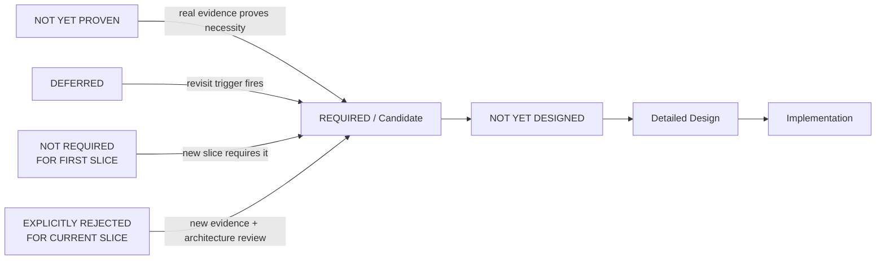
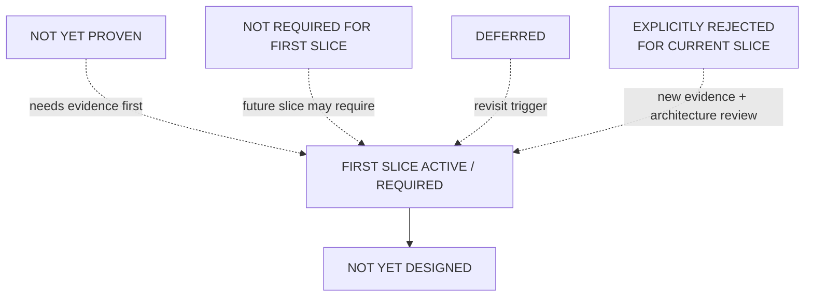

# Ecommerce AI OS — First Vertical Slice — Deferred / Not Yet Designed Register V0.1

- **文档类型**：Vertical Slice / Deferred & Design-Maturity Register
- **项目**：Ecommerce AI OS
- **Vertical Slice**：First Vertical Slice — Research Execution
- **Business Scenario**：US / Car Vacuum / TikTok Content Research
- **目标路径**：`docs/02_system/vertical_slices/01_research_execution/05_DEFERRED_REGISTER.md`
- **状态**：Candidate / Round 5 Reviewed
- **Review Result**：PASS_WITH_RECLASSIFICATIONS
- **阶段**：First Vertical Slice Planning — Round 5
- **Architecture Authority**：No
- **上级规划文档**：`00_FIRST_VERTICAL_SLICE_PLANNING.md`
- **上游业务边界**：`01_SLICE_BUSINESS_BOUNDARY.md`
- **上游 Responsibility Coverage**：`02_RESPONSIBILITY_COVERAGE.md`
- **上游 Runtime Path**：`03_MINIMAL_RUNTIME_PATH.md`
- **上游 Contract Inventory**：`04_CONTRACT_INVENTORY.md`
- **日期**：2026-08-16

---

# 0. 文档目的

本文件记录 First Vertical Slice 的：

# **Round 5 — Deferred / Not Yet Designed Register**

Round 1 已回答：

> First Slice 服务什么业务决策、从哪里开始、在哪里结束。

Round 2 已回答：

> 哪些 System Responsibility 真正参与 First Slice，以及需要到什么深度。

Round 3 已回答：

> 这些 Responsibility 在一次真实 Research Execution 中如何协作。

Round 4 已回答：

> 哪些 Runtime / Responsibility Boundary 已经被证明需要稳定 System Contract semantics。

Round 5 当前只回答：

> **当前没有进入 First Slice Active Design / Implementation Scope 的内容，到底为什么没有进入，以及它们未来在什么条件下才可以重新进入 Scope。**

本文件的核心目的不是建立更多 Architecture，而是：

# **Prevent Architecture Drift**

避免未来聊天、Codex、实现阶段或外部架构审计看到某个东西“还没有”，就错误判断：

```text
Architecture Gap
```

然后未经审查重新加入：

```text
Agent Layer
Tool Layer
Orchestration Layer
Evidence Service
Knowledge Service
Retry Engine
Event Bus
Database
RAG
Multi-provider Router
```

---

# 1. Round 5 核心原则

# **“现在不做”不是状态。**

所有未进入 First Slice 当前 Scope 的事项必须说明：

> **为什么现在不做。**

当前使用五种 Primary Status：

```text
DEFERRED

NOT YET PROVEN

NOT REQUIRED FOR FIRST SLICE

NOT YET DESIGNED

EXPLICITLY REJECTED FOR CURRENT SLICE
```

每一个 Register Item 只能有一个 Primary Status。

---

# 2. Status Definition

## 2.1 DEFERRED

定义：

> 已经知道该能力 / 深度 /数据源具有现实价值，也有较明确的未来使用场景，但当前主动推迟。

它意味着：

```text
Value is known
+
Future need is plausible / likely
+
Current slice deliberately postpones it
```

但：

# **DEFERRED ≠ Next Backlog**

只有明确 Revisit Trigger 出现后，才重新进入 Scope。

---

## 2.2 NOT YET PROVEN

定义：

> 当前还没有足够业务、Runtime 或跨 Use Case Evidence 证明该 Responsibility / Contract / Mechanism 应该独立存在。

这类事项：

# **不得直接进入 Detailed Design 或 Implementation。**

正确路径：

```text
NOT YET PROVEN
↓
Real Evidence
↓
Necessity Proven
↓
Candidate / Required
↓
NOT YET DESIGNED
↓
Detailed Design
```

禁止：

```text
NOT YET PROVEN
↓
Codex implementation
```

---

## 2.3 NOT REQUIRED FOR FIRST SLICE

定义：

> 该 Responsibility / Concern 在全局 Current Candidate 中可能已经成立或具有合法位置，但当前 Research Vertical Slice 不需要主动使用它。

它不意味着：

```text
Global architecture should remove it
```

只意味着：

```text
First Slice active path does not need it
```

---

## 2.4 NOT YET DESIGNED

定义：

> 已经证明该 Contract / Concern / Boundary 是当前或下一阶段必须解决的问题，但其详细设计尚未开始。

这是唯一一种天然能够进入后续：

# **System Detailed Design Backlog**

的状态。

例如：

```text
Evidence Contract
= REQUIRED

Evidence Contract detailed schema
= NOT YET DESIGNED
```

---

## 2.5 EXPLICITLY REJECTED FOR CURRENT SLICE

定义：

> 该 Architecture Shape / Mechanism 已经被审查，并明确决定当前 First Slice 不采用。

它不是：

```text
we forgot it
```

也不是：

```text
we did not have time
```

而是：

> **当前 Slice 已明确不应该这样设计。**

只有：

```text
new evidence
+
architecture review
```

才能重新打开。

---

# 3. Critical Status Distinction

必须长期保持：

```text
NOT YET PROVEN
≠
NOT YET DESIGNED
```

前者表示：

> 连“是否应该存在”都还没证明。

后者表示：

> 已经确定应该存在，只是还没设计细节。

错误地把：

```text
NOT YET PROVEN
```

写成：

```text
NOT YET DESIGNED
```

会产生严重后果：

> 后续开发会把尚未证明的 Architecture Candidate 自动当成 Implementation Backlog。

---

# 4. Governance Rule — Absence Does Not Imply Gap

Round 5 正式建立：

# **Rule A — Absence Does Not Imply Gap**

一个 Responsibility / Mechanism 没有出现在 First Slice Active Path：

```text
≠
System Architecture forgot it
```

任何未来审计在提出：

```text
“为什么没有 Agent？”
“为什么没有 Event Bus？”
“为什么没有 Knowledge？”
“为什么没有 Retry？”
“为什么没有 Database？”
```

之前，必须先检查本 Register。

只有当：

```text
Item is REQUIRED
+
No current Contract / Design
+
No NYD / Deferred explanation
```

时，才可能成为真正的：

# **Architecture Gap**

---

# 5. Governance Rule — Deferred Does Not Imply Backlog

# **Rule B — Deferred Does Not Imply Backlog**

```text
DEFERRED
≠
automatic next-phase implementation
```

只有：

```text
Revisit Trigger fires
```

才重新进入 Scope。

同样：

```text
NOT YET PROVEN
```

更不是 backlog。

---

# 6. Status Transition Discipline



该图表达成熟度和重新进入 Scope 的原则。

它不是自动状态机实现。

---

# 7. Round 5 Final Status Register

| Item | Primary Status |
|---|---|
| Runtime Governance active path | **NOT REQUIRED FOR FIRST SLICE** |
| Pause / Continue | **NOT REQUIRED FOR FIRST SLICE** |
| Independent Analyze Capability | **NOT YET PROVEN** |
| Independent Retrieve Detail Capability | **NOT YET PROVEN** |
| Full Evidence Foundation Service | **NOT YET PROVEN** |
| Knowledge Foundation Service | **NOT REQUIRED FOR FIRST SLICE** |
| Artifact Foundation Service | **NOT REQUIRED FOR FIRST SLICE** |
| Independent Research Service | **NOT YET PROVEN** |
| Agent as Top-level System Layer | **EXPLICITLY REJECTED FOR CURRENT SLICE** |
| Tool as Top-level System Layer | **EXPLICITLY REJECTED FOR CURRENT SLICE** |
| Standalone Orchestration Layer | **EXPLICITLY REJECTED FOR CURRENT SLICE** |
| Skill Composition Mechanism | **NOT YET PROVEN** |
| Dynamic Skill Discovery / Hot Reload / Marketplace | **EXPLICITLY REJECTED FOR CURRENT SLICE** |
| Retry / Checkpoint / Crash Recovery / Durable Execution | **NOT YET PROVEN** |
| Advanced Provider Resolution / Multi-provider / Fallback | **DEFERRED** |
| Event / Message Architecture as required First-Slice mechanism | **EXPLICITLY REJECTED FOR CURRENT SLICE** |
| Record / Reference Retention Semantics | **NOT YET DESIGNED** |
| Dedicated Persistence Subsystem | **NOT YET PROVEN** |
| Specific Database Technology | **NOT YET PROVEN** |
| Production Research Workspace / UI | **NOT REQUIRED FOR FIRST SLICE** |
| Application Interaction / Transport Representation | **NOT YET DESIGNED** |
| Scrape Creators 97 API Full Integration | **EXPLICITLY REJECTED FOR CURRENT SLICE** |
| Minimum Scrape Creators Endpoint Selection | **NOT YET DESIGNED** |
| Comments as Evidence Source | **DEFERRED** |
| Independent Hypothesis Contract | **NOT YET PROVEN** |
| Unified Error Taxonomy | **NOT YET PROVEN** |
| Formal Comprehensive Research Lens Taxonomy | **NOT YET PROVEN** |
| Automatic Research Result → Knowledge Update | **EXPLICITLY REJECTED FOR CURRENT SLICE** |
| Operational Observability / C10 | **DEFERRED** |
| 9 Required Contract Fields / Detailed Schemas | **NOT YET DESIGNED** |
| Software Architecture | **NOT YET DESIGNED** |

---

# 8. Runtime Governance Active Path

## Status

# **NOT REQUIRED FOR FIRST SLICE**

Runtime Governance 在 Current System Architecture V0.2 中继续保持：

```text
Stable Core Candidate Responsibility
```

但 First Research Slice 当前没有证明主动执行以下机制的必要性：

```text
Permission Gate
Cost Gate
Risk Gate
Human Approval Gate
Governance-driven Pause
```

当前只保留：

```text
Capability Contract
→ Governance Hook
```

---

## Important Boundary

```text
Runtime Governance responsibility
≠ deleted

Runtime Governance active execution path
= not required for First Slice
```

---

## Revisit Trigger

当出现真实：

```text
permission requirement
cost threshold
risk-control requirement
human execution approval requirement
```

时重新审议。

---

# 9. Pause / Continue

## Status

# **NOT REQUIRED FOR FIRST SLICE**

Pause / Continue 属于 Task Runtime 全局 Candidate concern。

但 First Research Slice 当前没有：

```text
operator pause requirement
manual continuation requirement
long-running resumable workflow
```

因此当前不进入 active runtime path。

---

## Important Distinction

```text
Pause / Continue
≠
Checkpoint / Crash Recovery / Durable Execution
```

Pause / Continue 在全局 Runtime Candidate 中已有合理位置。

而后者连是否需要都尚未证明。

---

# 10. Independent Analyze Capability

## Status

# **NOT YET PROVEN**

必须区分：

```text
Analysis Activity
= REQUIRED

Independent Analyze Capability
= NOT YET PROVEN
```

当前：

```text
Evidence Interpretation
Pattern Comparison
Finding Formation
Hypothesis Formation
```

仍可合理由 Research Skill 承担。

---

## Revisit Trigger

当出现：

```text
multiple Skills reuse stable analysis behavior
OR
stable provider-neutral Analyze I/O emerges
OR
Research Skill becomes polluted by model/provider implementation
OR
cross-use-case analysis reuse emerges
```

时重新审议。

---

# 11. Independent Retrieve Detail Capability

## Status

# **NOT YET PROVEN**

Provider 可能提供：

```text
content detail API
video detail API
author detail API
```

但：

```text
Provider has endpoint
≠
OS must have independent Capability
```

当前 First Slice 尚未证明独立：

```text
Retrieve Detail Capability
```

的必要性。

---

## Revisit Trigger

当 Search Capability Result 无法满足已确认的 Evidence Need，并且稳定的：

```text
search
→ retrieve detail
```

行为跨 Skill / workflow 反复出现时重新审议。

---

# 12. Full Evidence Foundation Service

## Status

# **NOT YET PROVEN**

当前已经确认：

```text
Evidence Contract
= REQUIRED
```

但这只证明：

> Evidence 需要稳定系统语义。

没有证明：

```text
Evidence Service
Evidence Repository
Evidence API
Evidence Runtime
Evidence Database
```

必须独立存在。

---

## Critical Boundary

```text
Evidence semantics
= confirmed

Full Evidence Foundation Service
= NOT YET PROVEN
```

禁止把：

```text
Evidence Contract
```

自动翻译为：

```text
EvidenceService
```

---

# 13. Knowledge Foundation Service

## Status

# **NOT REQUIRED FOR FIRST SLICE**

Knowledge 继续作为全局 Foundation Service Candidate 保留。

但 First Research Slice 当前：

```text
does not require formal Knowledge read
does not require formal Knowledge write
does not require RAG
does not require approved Knowledge reuse
```

Product / SKU Context 是当前 upstream Business Input。

它不自动等于 Knowledge Foundation Service。

---

## Revisit Trigger

当出现：

```text
formal approved knowledge must be read by multiple tasks
OR
cross-task reusable knowledge becomes necessary
OR
finding / validation → knowledge candidate workflow is introduced
```

时重新进入 Scope。

---

# 14. Artifact Foundation Service

## Status

# **NOT REQUIRED FOR FIRST SLICE**

当前业务终点：

```text
Human-reviewable Research Result
```

并不自动意味着：

```text
PDF
Markdown File
JSON Package
Report Asset
```

因此：

```text
Research Result
≠ Artifact
```

Artifact Foundation Service 当前不进入 First Slice。

---

## Revisit Trigger

当出现：

```text
formal file/report delivery
file-based downstream consumption
asset lifecycle management
shared generated artifact management
```

时重新审议。

---

# 15. Independent Research Service

## Status

# **NOT YET PROVEN**

必须区分：

```text
Research
= Product Family Confirmed
```

与：

```text
Research Service
= independent system responsibility?
```

当前 First Slice 已可通过：

```text
Task Runtime
+
Research Skill
+
Search Capability
+
Evidence Contract
+
Research Result Contract
```

完成闭环。

没有 Runtime Evidence 证明还需要：

```text
Research Service
Research Runtime
Research Foundation Service
```

---

## Current Architecture Status

```text
Research
= Product Family Confirmed
= System Placement Under Review
```

---

# 16. Agent as Top-level System Layer

## Status

# **EXPLICITLY REJECTED FOR CURRENT SLICE**

拒绝对象必须精确：

# **Agent as Top-level System Layer**

当前不采用：

```text
Application
↓
Agent Layer
↓
Tool Layer
↓
Capabilities
```

Agent 在当前 Architecture 中继续被理解为：

```text
Execution / Decision Strategy
```

而不是新的 top-level responsibility。

---

## Important Clarification

当前决策：

```text
Agent Layer
= rejected
```

不等于：

```text
agentic implementation strategy
= permanently forbidden
```

未来 Software Architecture 若有真实证据，可以采用 agentic execution strategy，但不能因此反向重画顶层 System Architecture。

---

# 17. Tool as Top-level System Layer

## Status

# **EXPLICITLY REJECTED FOR CURRENT SLICE**

当前拒绝：

# **Tool as a top-level System Layer**

Tool 未来仍可能是：

```text
Capability Invocation Surface
or
Software Representation
```

但当前不建立：

```text
Tool Layer
Tool Platform
Tool-first System Architecture
```

---

# 18. Standalone Orchestration Layer

## Status

# **EXPLICITLY REJECTED FOR CURRENT SLICE**

当前：

```text
Execution Coordination
→ Task Runtime
```

已经足够承载 First Slice。

因此不新增：

```text
Orchestration Layer
Workflow Orchestrator
Graph Orchestrator
Agent Orchestrator
```

---

## Important Clarification

拒绝的是：

```text
Standalone Orchestration Layer
```

不是：

```text
Execution Coordination
```

后者仍然是 Task Runtime 的核心责任。

---

# 19. Skill Composition Mechanism

## Status

# **NOT YET PROVEN**

First Slice 当前已确认 Skill Extension Mechanism 的最小范围：

```text
Skill Contract
Skill Identity / Declaration
Thin Registration
Dependency Declaration
Context Binding
Platform / Domain Adaptation
```

但尚未证明：

```text
Skill Composition
Skill Graph
Skill Pipeline
Skill-to-Skill Runtime Composition
```

是必要能力。

---

# 20. Dynamic Skill Discovery / Hot Reload / Marketplace

## Status

# **EXPLICITLY REJECTED FOR CURRENT SLICE**

当前不建立：

```text
Dynamic Skill Discovery
Hot Reload
Skill Marketplace
Plugin Runtime
Extension Runtime
```

当前 Skill Extension Mechanism 只需要：

```text
thin / static participation mechanism
```

---

# 21. Retry / Checkpoint / Crash Recovery / Durable Execution

## Status

# **NOT YET PROVEN**

这些都是 Advanced Runtime Concerns。

当前 Task Runtime只证明：

```text
Execution Identity
Lifecycle
Execution Context
Thin Runtime State
Failure Status
Execution Coordination
```

尚未证明：

```text
Retry Engine
Checkpoint
Crash Recovery
Durable Execution
```

必须存在。

---

## Revisit Trigger

例如出现：

```text
long-running execution interruption
repeated transient provider failures
high execution restart cost
cross-process recovery requirement
business requirement for guaranteed resume
```

时再重新审议。

---

# 22. Advanced Provider Resolution

## Item

```text
Multi-provider Routing
Fallback
Health-aware Routing
Cost-aware Routing
Dynamic Provider Selection
```

## Status

# **DEFERRED**

Provider Resolution Boundary 已经：

```text
REQUIRED
```

First Slice 当前只需要：

```text
STATIC / SINGLE-PROVIDER
```

即：

```text
Search
→ Scrape Creators
```

高级 Resolution 是已经成立 Responsibility 的未来深度扩展。

---

## Revisit Trigger

```text
second qualified Search Provider exists
OR
Scrape Creators cost / reliability becomes material
OR
provider replacement becomes operational need
```

---

# 23. Event / Message Architecture

## Status

# **EXPLICITLY REJECTED FOR CURRENT SLICE**

精确拒绝对象：

# **Event / Message Architecture as a required First-Slice execution mechanism**

当前不允许仅因为：

```text
decoupling
AI-native
scalability
best practice
```

就引入：

```text
Event Bus
Message Broker
Domain Event Framework
Event Store
Async Message Architecture
```

---

## Important Clarification

这不是对整个 Ecommerce AI OS 未来 Software Architecture 的永久禁令。

未来只有出现真实：

```text
async
cross-process
cross-service
durable messaging
```

需求后，才能重新审议。

---

# 24. Record / Reference Retention Semantics

## Status

# **NOT YET DESIGNED**

Round 3 / Round 4 已经确认：

```text
Execution Record
Evidence References
Research Result References
Capability Result References
```

需要稳定 referenceability。

因此后续 Detailed Contract 必须回答：

```text
哪些 reference 必须在 execution 完成后继续有效？
哪些 result 必须能够被再次定位？
retention boundary 是什么？
reference lifecycle 是什么？
```

---

## Important Boundary

```text
Retention semantics
= REQUIRED / NOT YET DESIGNED

Dedicated Persistence Subsystem
= NOT automatically implied
```

---

# 25. Dedicated Persistence Subsystem

## Status

# **NOT YET PROVEN**

虽然存在 stable retention requirement，但还没有证明系统必须建立独立：

```text
Persistence Service
Repository Layer
Storage Service
```

当前不从：

```text
stable record required
```

推导出：

```text
dedicated persistence subsystem required
```

---

# 26. Specific Database Technology

## Status

# **NOT YET PROVEN**

当前没有架构承诺：

```text
PostgreSQL
SQLite
Redis
Vector DB
Document DB
Event Store
```

尤其禁止：

```text
Evidence exists
→ therefore Vector DB

Execution Record exists
→ therefore PostgreSQL
```

这类未经证明的技术跳跃。

---

# 27. Production Research Workspace / UI

## Status

# **NOT REQUIRED FOR FIRST SLICE**

当前 Application Boundary 只需要：

```text
Operator Input
↓
Research Execution
↓
Human-reviewable Research Result
```

并不要求：

```text
Research Workspace
Dashboard
Production Web UI
Chat UI
Visual Research Console
```

---

# 28. Application Interaction / Transport Representation

## Status

# **NOT YET DESIGNED**

虽然：

```text
C1 Task Execution Boundary
= REQUIRED
```

但它未来的软件表现形式尚未确定：

```text
Local Function
CLI
HTTP API
Chat
Web UI
Desktop UI
Other Transport
```

这是后续 Software Architecture / Detailed Design 合法问题。

---

# 29. Scrape Creators 97 API Full Integration

## Status

# **EXPLICITLY REJECTED FOR CURRENT SLICE**

必须明确：

# **97 APIs are NOT a First-Slice deferred implementation backlog.**

错误方向：

```text
97 APIs
↓
97 OS modules
↓
OS Architecture
```

正确方向：

```text
Business Question
↓
Evidence Need
↓
Search Contract
↓
Provider Facts
↓
Minimum Endpoint Subset
```

Provider Lab discovers facts.

Ecommerce AI OS productizes facts.

---

# 30. Minimum Scrape Creators Endpoint Selection

## Status

# **NOT YET DESIGNED**

First Slice 已确认：

```text
Search Capability
+
Provider Resolution
+
Scrape Creators Adapter
```

都需要。

因此真正 Walking Implementation 前必须确定：

> 哪些 Scrape Creators endpoints 是满足当前 Search Contract 与 Evidence Need 所需要的最小集合。

该选择当前尚未展开。

---

## Correct Dependency

```text
Business Question
↓
Evidence Need
↓
Detailed Search Contract
↓
Provider Facts
↓
Minimum Endpoint Subset Selection
```

不是先从 97 API Inventory 选择模块。

---

# 31. Comments as Evidence Source

## Status

# **DEFERRED**

Comments 已知可能提供：

```text
trust signals
objections
questions
purchase intent
usage feedback
```

等补充证据。

但当前 First Slice 不要求 Comments 成为 Mandatory Evidence Source。

---

## Revisit Trigger

当：

```text
Public Content
+
Public Performance Evidence
```

无法充分回答某个已确认 Research Question 时，再重新考虑 Comments。

---

# 32. Independent Hypothesis Contract

## Status

# **NOT YET PROVEN**

当前：

```text
Testable Hypothesis
= Research Result business semantics
```

还未证明其需要成为独立跨 workflow entity。

---

## Revisit Trigger

未来 Experiment & Validation 若真实需要：

```text
Hypothesis Identity
Lifecycle
Experiment Linkage
Validation Status
Validation History
```

再重新审议独立 Hypothesis Contract。

---

# 33. Unified Error Taxonomy

## Status

# **NOT YET PROVEN**

当前 error semantics 可以沿边界逐层表达：

```text
Provider-specific Error
↓
Adapter Translation
↓
Capability-level Failure
↓
Task Runtime Failure Semantics
↓
Application Execution Outcome
```

没有证据要求建立：

```text
Universal Ecommerce AI OS Error Taxonomy
Global Error Service
```

---

## Important Boundary

```text
Insufficient Evidence
≠ Runtime Error

Weak Finding
≠ Runtime Error

Hypothesis Rejected Later
≠ Runtime Error
```

---

# 34. Formal Comprehensive Research Lens Taxonomy

## Status

# **NOT YET PROVEN**

当前业务讨论出现过：

```text
Why Stop
Why Continue
Trust
Click
Buy
Relevance
Desire
Value
Risk
Friction
Objection
```

这些目前更适合作为：

```text
Candidate Research / Decision Lenses
inside Research Skill
```

尚未证明需要冻结为：

```text
Complete Research Taxonomy
System Contract
System Module Hierarchy
```

因此 First Slice 只能按具体 Research Question 使用必要 lens。

不能围绕完整 taxonomy 设计系统模块。

---

# 35. Automatic Research Result → Knowledge Update

## Status

# **EXPLICITLY REJECTED FOR CURRENT SLICE**

即使：

```text
Knowledge Foundation Service
```

在全局 Candidate 中存在，也不能推出：

```text
Research Finding
↓
Automatically update Knowledge
```

当前明确禁止：

```text
Automatic Knowledge Promotion
Automatic Knowledge Overwrite
Finding = Approved Knowledge
```

未来若需要：

```text
Research Result
→ Knowledge Candidate
→ Human / Policy Approval
→ Formal Knowledge
```

必须另行设计 Workflow。

---

# 36. Operational Observability / C10

## Status

# **DEFERRED**

继续尊重此前 System Architecture Audit 结论：

```text
C10 Operational Observability
= DEFERRED
```

当前不把：

```text
metrics
logs
tracing
monitoring
dashboards
```

加入 First Slice Architecture。

---

## Important Boundary

```text
Execution Record
≠ Observability
```

不能因为当前没有 Observability，就把这些内容全部塞入 Execution Record。

---

# 37. 9 Required Contract Fields / Detailed Schemas

## Status

# **NOT YET DESIGNED**

Round 4 已确认 9 个 Required Contract / Boundary：

```text
C1   Task Execution Boundary

C2a  Skill Contract

C2b  Task Runtime Execution Contract

C3   Search Capability Contract

C4a  Provider Resolution Boundary

C4b  Scrape Creators Adapter Contract

C5a  Evidence Contract

C5b  Research Result Contract

C6   Execution Record Contract
```

它们已经：

```text
REQUIRED
```

因此详细：

```text
fields
semantics
schemas
input/output structures
error boundary details
context shape
reference shape
```

属于：

# **NOT YET DESIGNED**

而不是：

```text
NOT YET PROVEN
```

---

# 38. Software Architecture

## Status

# **NOT YET DESIGNED**

这是当前项目 Authority-level 状态。

Round 1–5 已产生：

```text
Business Boundary
Responsibility Coverage
Minimal Runtime Path
Contract Inventory
Deferred Register
```

这些都不能被解释为：

```text
Software Architecture Approved
```

---

## Still Not Yet Designed

包括但不限于：

```text
package boundaries
module boundaries
class boundaries
interface implementation
dependency injection
sync / async model
event / message implementation
persistence implementation
database
API
transport
deployment
queue
cache
framework selection
LangGraph
Agent SDK
MCP Runtime
RAG
Vector DB
Redis
PostgreSQL
```

---

# 39. First Slice Active vs Non-active Architecture View



---

# 40. Required Items That Are Legitimate Next Design Work

Round 5 完成后，以下事项可以合法进入后续 System Detailed Design：

```text
C1 Task Execution Boundary detailed contract

C2a Skill Contract detailed contract

C2b Task Runtime Execution Contract detailed contract

C3 Search Capability Contract detailed contract

C4a Provider Resolution Boundary detailed contract

C4b Scrape Creators Adapter Contract detailed contract

C5a Evidence Contract detailed contract

C5b Research Result Contract detailed contract

C6 Execution Record Contract detailed contract

Record / Reference Retention Semantics

Application Interaction / Transport representation

Minimum Scrape Creators Endpoint Selection
```

但：

> 后三项必须服从 Detailed Contract 设计结果，不能抢跑定义上层 Contract。

---

# 41. Items That Must NOT Automatically Enter Next Backlog

以下不是下一阶段默认开发事项：

```text
Independent Analyze Capability

Retrieve Detail Capability

Full Evidence Service

Knowledge Service integration

Artifact integration

Research Service

Agent Layer

Tool Layer

Standalone Orchestrator

Skill Composition

Dynamic Skill Marketplace

Retry Engine

Checkpoint

Crash Recovery

Durable Execution

Dedicated Persistence Service

Database selection

Hypothesis Contract

Unified Error Taxonomy

Comprehensive Research Lens Taxonomy
```

这些必须首先满足各自 Revisit / Evidence Condition。

---

# 42. First Slice Explicit Rejection Guardrail

当前 First Slice implementation 不允许在没有新 Architecture Review 的情况下擅自加入：

```text
Agent as top-level layer

Tool as top-level layer

Standalone Orchestration Layer

Dynamic Skill Discovery / Hot Reload / Marketplace

Event / Message Architecture as required execution mechanism

97 API Full Integration

Automatic Research Result → Knowledge Update
```

这些不是：

```text
optional implementation choices
```

而是当前已经：

# **Explicitly Rejected**

---

# 43. Deferred Items and Revisit Triggers

| Deferred Item | Revisit Trigger |
|---|---|
| Advanced Provider Resolution | Second qualified provider or material cost/reliability pressure |
| Comments as Evidence Source | Current Research Question cannot be answered sufficiently by public content/performance evidence |
| Operational Observability / C10 | Runtime operation produces concrete monitoring/debugging/operational needs |

没有 Trigger 时：

```text
Deferred Item
→ remains outside active scope
```

---

# 44. Not Yet Proven Promotion Rule

所有：

```text
NOT YET PROVEN
```

事项只有当出现真实证据时，才允许晋级。

有效证据包括：

```text
First Slice implementation failure

Repeated cross-skill duplication

Cross-use-case reuse requirement

Stable independent I/O emerging

Current responsibility becoming overloaded

Provider/runtime constraint impossible to absorb in existing boundary

Second Vertical Slice proving repeated need
```

无效证据包括：

```text
framework supports it

industry best practice

AI architecture article recommends it

provider happens to expose an API

future system may become complex

it sounds more scalable
```

---

# 45. Architecture Change Discipline

如果未来证据表明某个：

```text
NOT YET PROVEN
DEFERRED
NOT REQUIRED
EXPLICITLY REJECTED
```

事项需要晋级，

首先检查：

> Current System Architecture 是否已经可以承载它。

如果可以：

```text
add detailed design within current architecture
```

如果不能：

```text
Architecture Change Proposal
↓
Human Review
↓
ADR if significant
```

禁止实现代码反向偷偷修改 Architecture。

---

# 46. Round 5 Stress Test Findings

Round 5 Status Consistency Stress Test 的主要修正包括：

## Reclassification 1 — Persistence

不再笼统写：

```text
Persistence Mechanism
= NOT YET DESIGNED
```

改为：

```text
Record / Reference Retention Semantics
= NOT YET DESIGNED

Dedicated Persistence Subsystem
= NOT YET PROVEN
```

---

## Reclassification 2 — Agent

明确拒绝的是：

```text
Agent as Top-level System Layer
```

不是所有未来 Agentic Strategy。

---

## Reclassification 3 — Tool

明确拒绝的是：

```text
Tool as Top-level System Layer
```

不是未来 Capability 的 Tool representation。

---

## Reclassification 4 — Event Architecture

明确拒绝的是：

```text
Event / Message Architecture
as required First-Slice execution mechanism
```

不是整个项目永久禁止 Event / Message Architecture。

---

# 47. Stress Test Added Register Items

Round 5 Stress Test 补充了此前容易被遗漏的事项：

```text
Pause / Continue

Independent Retrieve Detail Capability

Skill Composition Mechanism

Dynamic Skill Discovery / Hot Reload / Marketplace

Application Interaction / Transport Representation

Unified Error Taxonomy

Formal Comprehensive Research Lens Taxonomy

Automatic Research Result → Knowledge Update

Operational Observability / C10
```

这些事项现在都有明确成熟度，不再属于“未来聊天自由发挥区域”。

---

# 48. Round 5 Review Result

本轮 Review Result：

# **PASS_WITH_RECLASSIFICATIONS**

Round 5 没有发现：

```text
Top-level System Architecture Gap
```

也没有产生：

```text
new top-level Responsibility
new Foundation Service
new Runtime Layer
new Capability Layer
new Agent Layer
new Tool Layer
```

本轮主要完成：

```text
Architecture Maturity Classification

Scope Guardrails

Deferred Revisit Conditions

Not-Yet-Proven Promotion Rules

Explicit Rejection Boundaries

Next-stage Design Legitimacy Boundary
```

---

# 49. 当前仍不修改的上层 Architecture

Round 5 不要求重新设计：

```text
Product Architecture

System Architecture V0.2 top-level Responsibility Map

Documentation Architecture
```

也没有新证据要求把：

```text
Research
= System Placement Under Review
```

升级为独立 Service / Foundation。

---

# 50. 下一步

Round 5 完成后进入：

# **Round 6 — Architecture Review Gate**

Round 6 不再新增 Architecture。

Round 6 将最终审查：

```text
Round 1 — Slice Business Boundary

Round 2 — Responsibility Coverage

Round 3 — Minimal Runtime Path

Round 4 — Contract Inventory

Round 5 — Deferred / Not Yet Designed Register
```

并回答：

1. First Slice 是否已经形成完整、无明显职责缺口的 Candidate；
2. 是否存在必须重新打开 Product Architecture 的证据；
3. 是否存在必须重新打开 top-level System Architecture 的证据；
4. 9 个 Required Contract 是否足以进入 System Detailed Contract Design；
5. 是否存在未被 Register 管理的 Architecture Ambiguity；
6. 哪些设计可以进入下一阶段；
7. 哪些内容仍然禁止进入 Implementation。

---

# 51. Current Phase Status

```text
Round 1
Slice Business Boundary
→ Candidate / Reviewed
→ PASS_WITH_CHANGES

Round 2
Responsibility Coverage
→ Candidate / Reviewed
→ PASS_WITH_REFINEMENTS

Round 3
Minimal Runtime Path
→ Candidate / Reviewed
→ PASS_WITH_REFINEMENTS

Round 4
Contract Inventory
→ Candidate / Reviewed
→ PASS_WITH_REFINEMENTS

Round 5
Deferred / Not Yet Designed Register
→ Candidate / Reviewed
→ PASS_WITH_RECLASSIFICATIONS

Current Next:
Round 6 — Architecture Review Gate
```

---

# 52. 一句话总结

> **Round 5 不再用“以后再做”笼统描述未进入 First Slice 的内容，而是通过 DEFERRED、NOT YET PROVEN、NOT REQUIRED FOR FIRST SLICE、NOT YET DESIGNED 和 EXPLICITLY REJECTED FOR CURRENT SLICE 五种成熟度状态，明确每项 Architecture Concern 当前为什么不进入 Scope、未来在什么条件下可以重新进入，并建立 Absence Does Not Imply Gap、Deferred Does Not Imply Backlog 与 Not-Yet-Proven Must Earn Promotion 三道防漂移护栏。**