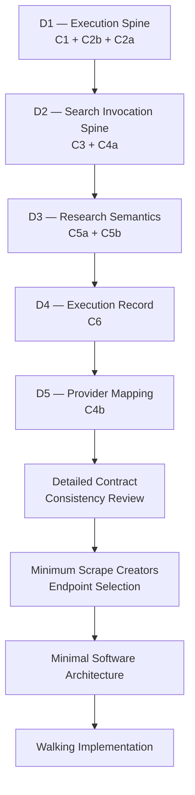

# Ecommerce AI OS — First Vertical Slice — Architecture Review V0.1

- **文档类型**：Vertical Slice / Architecture Review Gate
- **项目**：Ecommerce AI OS
- **Vertical Slice**：First Vertical Slice — Research Execution
- **Business Scenario**：US / Car Vacuum / TikTok Content Research
- **目标路径**：`docs/02_system/vertical_slices/01_research_execution/06_ARCHITECTURE_REVIEW.md`
- **状态**：Candidate / Round 6 Reviewed
- **Review Result**：PASS
- **阶段**：First Vertical Slice Planning — Round 6
- **Architecture Authority**：No
- **上级规划文档**：`00_FIRST_VERTICAL_SLICE_PLANNING.md`
- **上游业务边界**：`01_SLICE_BUSINESS_BOUNDARY.md`
- **上游 Responsibility Coverage**：`02_RESPONSIBILITY_COVERAGE.md`
- **上游 Runtime Path**：`03_MINIMAL_RUNTIME_PATH.md`
- **上游 Contract Inventory**：`04_CONTRACT_INVENTORY.md`
- **上游 Deferred Register**：`05_DEFERRED_REGISTER.md`
- **日期**：2026-08-16

---

# 0. 文档目的

本文件记录 First Vertical Slice Planning 的最终：

# **Round 6 — Architecture Review Gate**

Round 6 不继续新增 Architecture。

它对以下五轮结果进行最终一致性审查：

```text
Round 1 — Slice Business Boundary

Round 2 — Responsibility Coverage

Round 3 — Minimal Runtime Path

Round 4 — Contract Inventory

Round 5 — Deferred / Not Yet Designed Register
```

并最终回答：

> **当前 First Research Vertical Slice 是否已经形成足够完整、职责清晰、Runtime 可闭环、Contract Surface 足够且 Deferred Boundary 受控的 Candidate，从而允许停止当前 Architecture Planning，并进入 System Detailed Contract Design？**

Round 6 不回答：

- Contract Fields；
- JSON Schema；
- Python Interface；
- Software Package Boundary；
- Database；
- Persistence Implementation；
- UI；
- API；
- Sync / Async；
- Event / Message；
- Framework Selection；
- Provider Endpoint Implementation。

---

# 1. Final Review Decision

本轮最终裁决：

# **FIRST VERTICAL SLICE ARCHITECTURE REVIEW: PASS**

具体含义：

```text
Product Architecture Reopen
= NO

Top-level System Architecture Reopen
= NO

Research System Placement Resolution Required Now
= NO

First Vertical Slice Planning
= COMPLETE

System Detailed Contract Design
= AUTHORIZED NEXT PHASE

Software Architecture
= STILL NOT YET DESIGNED

Walking Implementation
= NOT YET AUTHORIZED DIRECTLY
```

Round 6 PASS 授权的是：

# **进入 System Detailed Contract Design**

不是：

```text
直接开始 Coding
```

也不是：

```text
System Architecture 全部 Approved
```

---

# 2. Current Architecture Status After Round 6

必须继续保持：

```text
Product Architecture
= Current Baseline

System Architecture V0.2
= Candidate / Human-reviewed working architecture

Entire System Architecture
≠ Approved

Research
= Product Family Confirmed
= System Placement Under Review

Software Architecture
= Not Yet Designed
```

First Slice Planning 的完成不改变上述 Authority / Maturity 状态。

---

# 3. Gate Summary

Round 6 共完成六个 Gate：

| Gate | Review Result |
|---|---|
| Gate 1 — Business Boundary Integrity | **PASS** |
| Gate 2 — Responsibility Coverage Integrity | **PASS_WITH_REFINEMENTS** |
| Gate 3 — Runtime Closure | **PASS_WITH_REFINEMENTS** |
| Gate 4 — Contract Sufficiency | **PASS_WITH_REFINEMENTS** |
| Gate 5 — Deferred Register Coverage | **PASS_WITH_REFINEMENTS** |
| Gate 6 — Architecture Reopen Decision | **PASS** |

没有任何 Gate 产生：

```text
REOPEN_REQUIRED
```

也没有：

```text
PASS_WITH_BLOCKERS
```

级别的阻塞问题。

---

# 4. Gate 1 — Business Boundary Integrity

## Verdict

# **PASS**

First Slice 当前服务的 Business Decision：

> **Which hypotheses should be prioritized in the next US TikTok Car Vacuum content experiments?**

Research 当前定位：

```text
Research
= Decision Support

Operator / Downstream
= Final Test Priority Decision
```

First Slice 不自动决定：

```text
最终 Creative Direction
Script
Shot List
Video
Publishing
Experiment Execution
GMV Success
```

---

# 5. Start Boundary Review

First Slice 从以下输入已经存在开始：

```text
Product / SKU Context
+
Platform Context = TikTok
+
Market Context = US
+
Business Goal = Commerce Content
+
Research Intent / Decision Need
```

First Slice：

# **不负责从零建立 Product Facts。**

因此不会向前吞并：

```text
Supplier Data Intake
Product Fact Extraction
ProductBrief Construction
Knowledge Construction
```

---

# 6. End Boundary Review

First Slice 结束于：

# **Human-reviewable Research Result**

概念上至少包含：

```text
Explicit Sample Boundary

Evidence Set / Evidence References

Research Findings

Testable Hypotheses

Answerability / Limitations

Traceability / Provenance
```

必须保持：

```text
Search Result
≠ Research Result

Finding
≠ Creative Direction

Hypothesis
≠ Script

Hypothesis
≠ Validated Business Truth

Research Result
≠ Final Business Decision
```

---

# 7. Gate 1 Architecture Reopen Decision

Gate 1 没有发现：

```text
new Product Use Case Family

new Product Layer

new Platform Model

new Business Domain Family
```

因此：

```text
Product Architecture Reopen
= NOT REQUIRED
```

---

# 8. Gate 2 — Responsibility Coverage Integrity

## Verdict

# **PASS_WITH_REFINEMENTS**

First Slice 当前所需 Responsibility 已经有明确 owner。

主要参与者：

```text
Application

Research Skill

Task Runtime

Skill Extension Mechanism

Capability Contract

Search Capability

Evidence Responsibility / Boundary

Provider Resolution

Scrape Creators Adapter

Execution Record
```

当前没有发现：

```text
Ownerless Responsibility

Duplicate Top-level Ownership

Missing Runtime Responsibility

Mandatory New Foundation Service
```

---

# 9. Application Responsibility

Application 保持：

# **THIN**

只负责：

```text
Operator
↔
System
```

以及：

```text
Business Context / Research Intent Entry

Research Result / Execution Outcome Exposure
```

Application 不拥有：

```text
Task Lifecycle
Skill Binding Logic
Search Execution
Provider Selection
Evidence Interpretation
```

---

# 10. Research Skill Responsibility

Research Skill继续拥有：

```text
Research Question Clarification

Evidence Need Definition

Discovery / Query Strategy

Sample Selection Method

Relevance Judgment

Evidence-worthiness Judgment

Evidence Interpretation

Finding Formation

Hypothesis Formation

Answerability / Limitation Logic
```

必须保持：

```text
Skill
= Business Method

Capability
= System Ability

Task Runtime
= Current Execution Coordination
```

---

# 11. Gate 2 Refinement A — Actual Sample Boundary Ownership

必须明确：

```text
Research Skill
↓
applies Sampling Method
↓
determines Actual Sample Boundary
↓
Actual Sample Boundary becomes
a stable Research Execution Fact
```

因此：

```text
Sampling Decision
→ Research Skill

Actual Sample Boundary
→ Research Execution Fact

Reference / Provenance
→ Evidence + Research Result

Task Runtime
→ coordinates / retains reference only
```

Task Runtime：

# **不拥有 Sampling Decision。**

---

# 12. Task Runtime Responsibility

Task Runtime 当前保持：

```text
Execution Identity

Lifecycle

Execution Context

Thin Runtime State

Execution Coordination

Failure Status

Terminalization
```

Task Runtime 不负责：

```text
Research Method

Sampling

Finding Interpretation

Provider API Translation

Research Quality Judgment
```

---

# 13. Gate 2 Refinement B — Evidence Maturity

必须长期保持：

```text
Evidence Contract
= REQUIRED
```

但：

```text
Full Evidence Foundation Service
= NOT YET PROVEN
```

即：

# **Evidence Contract maturity > Evidence Service maturity**

Evidence Contract 不自动批准：

```text
EvidenceService
EvidenceRepository
Evidence API
Evidence Database
```

---

# 14. Gate 2 Refinement C — Skill Extension Maturity

当前：

```text
Skill Extension Mechanism
= REQUIRED / VERY THIN
```

它支持：

```text
Skill Contract

Skill Identity / Declaration

Thin Registration

Dependency Declaration

Context Binding

Platform / Domain Adaptation
```

但它不是：

```text
Second Runtime

Extension Runtime

Plugin Execution Runtime

Skill Orchestrator
```

因此 Runtime Path 不应被重新画成：

```text
Task Runtime
↓
Skill Extension Runtime
↓
Skill
```

---

# 15. Gate 2 System Architecture Decision

当前所有 required business/runtime behavior 都能被 Existing Responsibility Map 承载。

因此：

```text
Top-level System Architecture Reopen
= NOT REQUIRED
```

---

# 16. Gate 3 — Runtime Closure

## Verdict

# **PASS_WITH_REFINEMENTS**

First Slice 当前已形成成功路径：

```text
Operator
↓
Application
↓
Task Runtime
↓
Research Skill
↓
Search Need
↓
Task Runtime
↓
Search Capability
↓
Provider Resolution
↓
Scrape Creators Adapter
↓
Scrape Creators
↓
Adapter
↓
Provider-neutral Search Result
↓
Task Runtime
↓
Research Skill
↓
Sampling / Evidence-worthiness
↓
Evidence
↓
Research Skill
↓
Finding / Hypothesis
↓
Research Result
↓
Task Runtime
↓
Terminalization
↓
Execution Record
↓
Application
↓
Operator
```

---

# 17. Gate 3 Refinement A — Skill / Runtime Round-trip

以下关系：

```text
Research Skill
↓
Task Runtime
↓
Capability
↓
Task Runtime
↓
Research Skill
```

是：

# **Execution Coordination Round-trip**

即：

```text
Business Action
↓
System Execution
↓
Execution Result
↓
Business Continuation
```

它不是：

```text
shared business ownership
```

也不是：

```text
second orchestration engine
```

必须保持：

```text
Skill
→ determines next business action

Runtime
→ coordinates system execution
```

---

# 18. Gate 3 Refinement B — Evidence Is Not A Runtime Service Hop

当前：

```text
Research Skill
↓
Selected Evidence-worthy Observations
↓
Evidence formalized under Evidence Contract
↓
Evidence Set
```

不意味着：

```text
Research Skill
↓
EvidenceService.call()
```

Evidence Contract：

```text
= Required Formalization Semantics
```

但：

```text
Full Evidence Service
= Not Yet Proven
```

---

# 19. Gate 3 Refinement C — Completion Ordering

必须保持：

# **Business Completion precedes Execution Completion**

即：

```text
Research Skill
↓
Valid Research Result
↓
Task Runtime recognizes business completion
↓
Execution terminalization
```

不能：

```text
Task marked SUCCESS
↓
later attempt to build Research Result
```

---

# 20. Insufficient Evidence Semantics

必须长期保持：

```text
Execution Failure
≠
Insufficient Evidence
≠
Hypothesis Rejected Later
```

合法路径可以是：

```text
Search succeeds
↓
Evidence formed
↓
Research Skill concludes:
Current evidence is insufficient
↓
Valid Research Result
↓
Successful Research Execution
```

因此：

```text
No strong positive conclusion
≠ Task Failure
```

---

# 21. Gate 3 Refinement D — Failure Closure

Failure Path 必须独立闭环：

```text
Capability / Provider Failure
↓
Task Runtime
↓
Terminal Failure Outcome
↓
Execution Record Finalization
↓
Application
↓
Operator
```

Failure Path 不要求：

```text
Evidence Set

Finding

Hypothesis

Research Result
```

存在。

---

# 22. Gate 3 Runtime Closure Decision

没有发现必须新增：

```text
Agent Runtime

Standalone Orchestration Layer

Research Service

Evidence Service

Event Bus

Recorder Runtime
```

才能闭环。

因此：

```text
Runtime Architecture Reopen
= NOT REQUIRED
```

---

# 23. Gate 4 — Contract Sufficiency

## Verdict

# **PASS_WITH_REFINEMENTS**

First Slice 当前收敛出的 9 个 Required Contract / Boundary：

```text
C1   Task Execution Boundary

C2a  Skill Contract

C2b  Task Runtime Execution Contract

C3   Search Capability Contract

C4a  Provider Resolution Boundary

C4b  Scrape Creators Adapter Contract

C5a  Evidence Contract

C5b  Research Result Contract

C6   Execution Record Contract
```

Delete Test 没有发现：

```text
Redundant Required Contract
```

也没有发现：

```text
Missing 10th Required Contract
```

---

# 24. Gate 4 Refinement A — Contract Sufficiency ≠ Implementation Sufficiency

必须保持：

```text
9 Required Contracts
= Sufficient System Contract Surface
```

但：

```text
9 Required Contracts
≠ Complete Software Architecture
```

Round 6 PASS 后仍需：

```text
System Detailed Contracts
↓
Contract Consistency Review
↓
Provider Endpoint Mapping
↓
Minimal Software Architecture
↓
Walking Implementation
```

---

# 25. Gate 4 Refinement B — Skill / Runtime Seam Must Be Co-designed

C2a Skill Contract 与 C2b Task Runtime Execution Contract 必须共同回答：

```text
Skill 如何表达 Runtime Capability Need？

Runtime 如何确认这是合法 Dependency？

Runtime 如何执行 Capability？

Result 如何返回当前 Skill Execution？

Skill 如何表达 Business Completion？

Runtime 如何区分 Business Completion 与 Execution Failure？
```

但默认：

# **不新增**

```text
Action Contract
Command Contract
Step Contract
Node Contract
ToolCall Contract
```

---

# 26. Gate 4 Refinement C — Endpoint Count ≠ Capability Count

必须保持：

```text
Provider Endpoint Count
≠
OS Capability Count
```

Scrape Creators Adapter 可以为了满足一个：

```text
Search Capability Contract
```

内部调用多个 Provider Endpoints。

例如：

```text
Search Contract
↓
Scrape Creators Adapter
├── Search Endpoint
├── Detail Endpoint
└── Other Required Endpoint
↓
one provider-neutral Search Result
```

不能因为 Provider 有多个 endpoint，就反向创建多个 OS Capability。

---

# 27. Gate 4 Refinement D — Cross-contract Obligations

9 个 Contract Detailed Design 必须共同处理：

```text
Identity / Referenceability

Versioning / Compatibility

Traceability / Provenance

Missingness

Error Semantics

Context Propagation

Governance Hook

Record / Reference Retention
```

这些是：

# **Cross-contract Obligations**

不是默认的新 Contract / Service。

继续保持：

# **Local Ownership, Cross-boundary Reference**

---

# 28. Gate 4 Refinement E — Execution Record Supports Partial Terminal Facts

C6 Execution Record Contract 必须支持：

## Successful Execution

可能存在：

```text
Evidence Ref

Research Result Ref

Capability Result Ref
```

## Failed Execution

这些 reference 可以合法缺席。

因此：

```text
evidence_ref
research_result_ref
```

不能被假定：

```text
always exists
```

但 Failure execution 仍需形成合法 finalized Execution Record。

---

# 29. Gate 4 Contract Decision

当前：

```text
Missing 10th Contract
= NONE

Contract Inventory Reopen
= NOT REQUIRED
```

---

# 30. Gate 5 — Deferred Register Coverage

## Verdict

# **PASS_WITH_REFINEMENTS**

`05_DEFERRED_REGISTER.md` 已经能够防止主要 First Slice Architecture Drift。

尤其能够阻止未经证据自动加入：

```text
Agent Layer

Tool Layer

Evidence Service

Research Service

Vector DB / RAG

Retry Engine

Durable Workflow

Event Bus

97 API Full Integration

Automatic Knowledge Update

Production Research Workspace

Premature Multi-provider Router

Comprehensive Research Lens Taxonomy
```

---

# 31. Gate 5 Refinement A — Primary Status Controls Default Action

Round 5 五种 Primary Status：

```text
DEFERRED

NOT YET PROVEN

NOT REQUIRED FOR FIRST SLICE

NOT YET DESIGNED

EXPLICITLY REJECTED FOR CURRENT SLICE
```

其默认动作必须不同。

---

## NOT YET DESIGNED

可以进入合法后续 Detailed Design。

---

## NOT YET PROVEN

不能进入设计 / implementation。

必须先获得：

```text
Real Evidence
```

证明必要性。

---

## DEFERRED

不能自动进入 backlog。

只有：

```text
Revisit Trigger
```

发生后才重新审议。

---

## NOT REQUIRED FOR FIRST SLICE

当前 Slice 不进入。

但不代表从全局 Architecture 删除。

---

## EXPLICITLY REJECTED FOR CURRENT SLICE

未经：

```text
New Evidence
+
Architecture Review
```

不能进入当前 Slice。

---

# 32. Gate 5 Refinement B — Deferred Register ≠ Backlog

必须禁止把 `05_DEFERRED_REGISTER.md` 转成：

```text
TODO LIST
```

尤其不能把：

```text
Analyze Capability

Evidence Service

Retry

Agent Support

Event Bus

Knowledge Integration
```

自动加入下一阶段开发。

---

# 33. Gate 5 Refinement C — NYD Still Has Dependency Order

即使状态都是：

```text
NOT YET DESIGNED
```

也不能同时无序设计。

例如：

```text
9 Detailed Contracts
```

必须优先于：

```text
Minimum Provider Endpoint Selection
```

而 System Detailed Contracts 应优先于：

```text
Minimal Software Architecture
```

---

# 34. Gate 5 Refinement D — New Architecture Suggestions Require Status Mapping

未来任何新的：

```text
“应该增加 X”
```

建议必须先经过：

```text
Register Status Mapping
+
Architecture Impact Check
```

而不是：

```text
idea
↓
implementation
```

如果 X 会改变 Current Architecture Boundary：

```text
Architecture Change Proposal
↓
Human Review
↓
ADR if significant
```

---

# 35. Gate 5 Scope Protection Decision

Round 5 当前没有发现阻塞下一阶段的重大未管理 Architecture Ambiguity。

因此：

```text
Deferred Register Coverage
= SUFFICIENT
```

---

# 36. Gate 6 — Architecture Reopen Decision

## Verdict

# **PASS**

Round 6 最终没有发现任何必须重新打开：

```text
Product Architecture
```

或：

```text
Top-level System Architecture V0.2
```

的证据。

---

# 37. Product Architecture Reopen Decision

First Slice 仍然完整属于：

```text
Use Case Family
= Research

Platform Adaptation
= TikTok

Business Context
= US / Car Vacuum / Commerce Content
```

没有产生新的 Product Family。

因此：

```text
Product Architecture Reopen
= NO
```

---

# 38. Top-level System Architecture Reopen Decision

所有 First Slice required behaviors 均能映射到 Current Candidate Responsibility。

没有：

```text
Ownerless Step

Responsibility Collision

Missing Mandatory Foundation Service

New Required Top-level Layer
```

因此：

```text
Top-level System Architecture Reopen
= NO
```

---

# 39. Research System Placement Decision

必须继续保持：

```text
Research
= Product Family Confirmed
= System Placement Under Review
```

但：

```text
Research System Placement Resolution
```

当前不是 blocker。

First Slice 已证明：

```text
Task Runtime
+
Research Skill
+
Search Capability
+
Evidence Contract
+
Research Result Contract
+
Provider Boundary
```

足以完成当前 Research Execution。

因此：

```text
Independent Research Service
= NOT YET PROVEN
```

继续成立。

---

# 40. Evidence Service Decision

同样：

```text
Evidence Contract
= REQUIRED
```

并不要求先解决：

```text
Full Evidence Foundation Service
```

才能进入 Detailed Contract Design。

因此：

```text
Full Evidence Service uncertainty
≠ current blocker
```

---

# 41. Software Architecture Decision

当前继续：

# **Software Architecture = Not Yet Designed**

这不是 Round 6 blocker。

因为当前授权的下一阶段是：

```text
System Detailed Contract Design
```

而不是 Implementation。

---

# 42. First Slice Planning Completion Decision

经过 Round 1–6：

# **First Vertical Slice Planning = COMPLETE**

“Complete” 的含义是：

> 当前 Architecture Planning 精度已经足够，再继续横向扩展架构的价值低于继续向下做 Contract Detailed Design 所能获得的真实证据。

它不意味着：

```text
First Slice Architecture frozen forever
```

未来仍可通过：

```text
Detailed Contract Evidence

Software Implementation Evidence

Runtime Failure Evidence

Second Vertical Slice Evidence
```

重新挑战 Candidate。

---

# 43. Next Phase Authorization

Round 6 正式授权：

# **System Detailed Contract Design**

下一阶段只允许详细化已经确认的：

```text
9 Required Contract / Boundary
```

以及它们已经确认的 Cross-contract obligations。

---

# 44. System Detailed Contract Design — Recommended Sequence

下一阶段建议按以下顺序推进：



---

# 45. D1 — Execution Spine

优先详细设计：

```text
C1   Task Execution Boundary

C2b  Task Runtime Execution Contract

C2a  Skill Contract
```

这一阶段必须回答：

```text
一次 Task / Execution 的系统语义是什么？

Business Work Request 如何进入？

Business / Execution Context 如何进入？

Skill 如何被绑定到当前 execution？

Skill 需要哪些 Context？

Skill 如何声明 Dependency？

Skill 如何表达 Runtime Capability Need？

Runtime 如何执行并返回结果？

Skill 如何表达 Business Completion？

Execution Failure 如何表达？

Task 如何进入 terminal state？
```

当前仍不设计具体 Python / JSON representation。

---

# 46. D2 — Search Invocation Spine

然后详细设计：

```text
C3   Search Capability Contract

C4a  Provider Resolution Boundary
```

重点回答：

```text
Search 的 provider-neutral semantics 是什么？

Search Input Boundary 是什么？

Search Output Boundary 是什么？

Pagination semantics 是什么？

Missingness 怎么表达？

Error Boundary 是什么？

Capability Context 是什么？

Provider Resolution 收到什么？

Static Search → Scrape Creators binding 如何表达？
```

当前仍不选具体 Provider Endpoint。

---

# 47. D3 — Research Semantics

然后详细设计：

```text
C5a  Evidence Contract

C5b  Research Result Contract
```

重点解决：

```text
Search Result
≠ Evidence

Evidence Identity

Original Source

Provider Provenance

Capability / Raw Result Traceability

Actual Sample Boundary

Observation Context

Time Semantics

Missingness

Finding Support

Research Result Scope

Findings

Testable Hypotheses

Answerability

Limitations

Traceability / Provenance
```

---

# 48. D4 — Execution Record

然后详细设计：

```text
C6 Execution Record Contract
```

此时：

```text
Task
Skill
Capability
Provider
Evidence
Research Result
```

的语义已经比较稳定。

C6 才能正确设计：

```text
Execution Identity

Task Ref

Input Refs

Actual Skill Ref

Actually Invoked Capability Refs

Actual Provider Ref

Version Refs

Relevant Result Refs

Evidence Refs

Business Output Ref

Terminal Outcome

Failure Facts

Reproducibility Refs
```

避免 Execution Record 变成万能 Envelope。

---

# 49. D5 — Scrape Creators Adapter

最后再详细设计：

```text
C4b Scrape Creators Adapter Contract
```

原因：

> Adapter 必须由 OS Contract 驱动，而不是由 Provider API Shape 反向定义系统。

详细 Adapter Design 应由：

```text
C3 Search Contract
+
C5a Evidence Need
+
Provider Lab Facts
```

共同驱动。

---

# 50. Minimum Endpoint Selection

只有当：

```text
Search Detailed Contract
+
Evidence Detailed Requirements
+
Adapter Obligations
```

足够明确后，

才进入：

# **Minimum Scrape Creators Endpoint Selection**

正确方向：

```text
Business Question
↓
Evidence Need
↓
Search Contract
↓
Provider Facts
↓
Minimum Endpoint Subset
```

禁止：

```text
97 APIs
↓
OS Modules
```

---

# 51. Minimal Software Architecture

System Detailed Contracts 稳定后，才进入：

# **Minimal Software Architecture**

届时才允许讨论：

```text
package boundaries

module boundaries

interfaces

dependency wiring

dependency injection

sync / async

minimal persistence representation

application transport

configuration

provider integration implementation
```

并且：

# **只为 First Slice Walking Implementation 设计最小 Software Architecture。**

不是一次设计 Ecommerce AI OS 最终软件形态。

---

# 52. Walking Implementation Scope

Walking Implementation 的目标不是：

```text
Build Ecommerce AI OS V1
```

而是：

> **用最小真实实现证明 Candidate Architecture 能走通一条 Research Execution。**

最小目标：

```text
one real Product / SKU Context

one US TikTok Research Intent

one Research Skill path

one Search Capability

one current Provider

minimum endpoint subset

one Evidence path

one Research Result

one Execution Record
```

---

# 53. Walking Implementation Success Does Not Approve Entire Architecture

Walking Implementation 成功后：

```text
≠ Entire System Architecture Approved
```

它只增加：

```text
Runtime Evidence
Contract Evidence
Provider Evidence
Failure Evidence
```

用于继续提升 Architecture maturity。

---

# 54. Post-Walking-Implementation Path

建议：

```text
Walking Implementation
↓
Runtime / Contract Validation
↓
Failure-driven Core Evolution
↓
Second Vertical Slice
↓
Cross-use-case Reuse Validation
```

第二 Vertical Slice 才是重新验证：

```text
Analyze Capability 是否独立？

Hypothesis 是否需要独立 Contract？

Knowledge 是否进入？

Artifact 是否进入？

Research 是否需要独立 System Placement？

Runtime 是否需要高级机制？

Cross-use-case reuse 是否真实成立？
```

的重要阶段。

---

# 55. Next Phase Allowed Scope

下一阶段允许：

```text
Detailed semantics for 9 Required Contracts

Cross-contract reference semantics

Identity / referenceability design

Version / compatibility references

Traceability / provenance semantics

Missingness semantics

Error boundary semantics

Context propagation semantics

Governance hook compatibility

Record / reference retention semantics

Search provider-neutral I/O semantics

Evidence semantics

Research Result semantics

Execution success / failure semantics

Provider mapping after upstream contract stabilization
```

---

# 56. Next Phase Explicitly Disallowed Scope

未经新 evidence / review，下一阶段仍不得直接加入：

```text
Agent as Top-level Layer

Tool as Top-level Layer

Standalone Orchestration Layer

Full Evidence Service

Independent Research Service

Independent Analyze Capability

Knowledge Integration

Artifact Integration

Retry Engine

Checkpoint

Crash Recovery

Durable Execution

Event / Message Architecture

Dedicated Persistence Service

Specific Database Technology

Vector DB / RAG

Production Research Workspace

97 API Full Integration

Automatic Knowledge Update

Comprehensive Research Lens Taxonomy
```

`05_DEFERRED_REGISTER.md` 继续具有 scope guardrail 作用。

---

# 57. Final Architecture Guardrail Set

Round 6 完成后，后续阶段必须继承以下 Guardrails。

## Business

```text
Research = Decision Support

Research Result ≠ Final Business Decision
```

---

## Skill / Runtime

```text
Skill = Business Method

Task Runtime = Execution Coordination

Skill Extension Mechanism ≠ Second Runtime
```

---

## Capability

```text
Capability = Provider-neutral System Ability

Provider Endpoint Count ≠ Capability Count
```

---

## Provider

```text
Provider ≠ Adapter ≠ API / SDK / MCP

Provider Runtime Facts
do not define OS Architecture
```

---

## Evidence

```text
Raw Provider Result
≠ Search Capability Result
≠ Evidence
≠ Finding
≠ Hypothesis
```

---

## Result

```text
Finding ≠ Creative Direction

Hypothesis ≠ Validated Business Truth
```

---

## Runtime Outcome

```text
Execution Failure
≠ Insufficient Evidence
≠ Hypothesis Rejected Later
```

---

## Execution Record

```text
Execution Record
≠ Trace
≠ Logs
≠ Evidence
≠ Artifact
≠ Observability
≠ Evaluation
```

---

## Scope Governance

```text
Absence Does Not Imply Gap

Deferred Does Not Imply Backlog

Not Yet Proven Must Earn Promotion

Primary Status Controls Default Action
```

---

# 58. Architecture Change Rule

未来任何新 evidence 首先回答：

> **Current Architecture 能否承载？**

如果：

```text
YES
```

则：

```text
Detailed Design within Current Architecture
```

如果：

```text
NO
```

则进入：

```text
Architecture Change Proposal
↓
Human Review
↓
ADR if significant
```

Implementation 不得反向偷偷修改 Architecture。

---

# 59. Round 6 Final Gate Table

| Gate | Verdict |
|---|---|
| Business Boundary Integrity | **PASS** |
| Responsibility Coverage Integrity | **PASS_WITH_REFINEMENTS** |
| Runtime Closure | **PASS_WITH_REFINEMENTS** |
| Contract Sufficiency | **PASS_WITH_REFINEMENTS** |
| Deferred Register Coverage | **PASS_WITH_REFINEMENTS** |
| Architecture Reopen Decision | **PASS** |

---

# 60. Final Decision Summary

```text
FIRST VERTICAL SLICE ARCHITECTURE REVIEW
= PASS

Product Architecture Reopen
= NO

System Architecture V0.2 Reopen
= NO

Research System Placement
= KEEP UNDER REVIEW

First Slice Planning
= COMPLETE

Next
= System Detailed Contract Design

Software Architecture
= NOT YET DESIGNED

Direct Walking Implementation
= NOT YET AUTHORIZED
```

---

# 61. Current Documentation State

First Research Vertical Slice Planning 当前形成：

```text
docs/02_system/vertical_slices/01_research_execution/

00_FIRST_VERTICAL_SLICE_PLANNING.md

01_SLICE_BUSINESS_BOUNDARY.md

02_RESPONSIBILITY_COVERAGE.md

03_MINIMAL_RUNTIME_PATH.md

04_CONTRACT_INVENTORY.md

05_DEFERRED_REGISTER.md

06_ARCHITECTURE_REVIEW.md
```

其中：

```text
00
→ Planning / Navigation / Progress

01
→ Business Boundary

02
→ Responsibility Coverage

03
→ Runtime Path

04
→ Contract Inventory

05
→ Deferred / Maturity Register

06
→ Final Architecture Review Gate
```

---

# 62. Next Documentation Direction

Round 6 完成后：

# **不再继续创建 `07_...` 作为 Planning Round。**

下一阶段应该建立新的 Detailed Contract documentation area，而不是继续无限扩展：

```text
vertical_slices/01_research_execution/
```

中的 Planning 序号。

建议下一阶段文档组织单独设计为：

```text
System Detailed Contract Design
```

对应的 Contract 文档结构。

该结构应在开始 D1 前最小确定，不应重新设计整个 Documentation Architecture。

---

# 63. Final One-line Conclusion

> **First Research Vertical Slice 已在 Business Boundary、Responsibility Coverage、Runtime Closure、Contract Sufficiency 与 Deferred Governance 五个维度形成相互一致、可继续向下细化的 Candidate Architecture；当前没有证据要求重新打开 Product Architecture 或 top-level System Architecture，因此 First Slice Planning 正式完成，下一阶段进入 System Detailed Contract Design，并继续以 Runtime Evidence 而不是架构想象推动后续演进。**