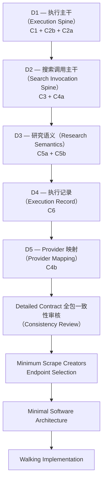
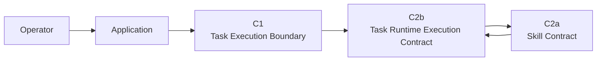

# Ecommerce AI OS — First Research Slice — Contract Design Index V0.1（Contract 设计索引）

- **项目（Project）**：Ecommerce AI OS
- **垂直切片（Vertical Slice）**：First Research Execution
- **业务场景（Business Scenario）**：US / Car Vacuum / TikTok Content Research
- **阶段（Phase）**：System Detailed Contract Design
- **状态（Status）**：Working Navigation / Design Index
- **架构权威（Architecture Authority）**：No

---

# 0. 文档目的（Document Purpose）

本文件是 First Research Vertical Slice 进入：

# **System Detailed Contract Design**

之后的阶段导航入口。

它只负责：

1. 记录当前需要详细设计的 Contract / Boundary；
2. 记录 D1–D5 的设计顺序；
3. 记录每个 Contract 属于哪个设计阶段；
4. 记录当前 Contract Design Progress（Contract 设计进度）；
5. 保持 Detailed Contract Design 不偏离已经完成的 Round 1–6 Architecture Planning（架构规划）。

本文件不是：

- Product Architecture Authority；
- System Architecture Authority；
- Software Architecture Authority；
- ADR；
- 具体 Contract 的 Detail Authority；
- Software Implementation Plan。

具体 Contract 的详细语义，以后续对应的 Detailed Contract 文档为准。

---

# 1. 上游架构规划包（Upstream Architecture Package）

本阶段直接继承以下 First Vertical Slice Planning Package：

```text
../00_READ_ME_FIRST.md

../00_FIRST_VERTICAL_SLICE_PLANNING.md

../01_SLICE_BUSINESS_BOUNDARY.md

../02_RESPONSIBILITY_COVERAGE.md

../03_MINIMAL_RUNTIME_PATH.md

../04_CONTRACT_INVENTORY.md

../05_DEFERRED_REGISTER.md

../06_ARCHITECTURE_REVIEW.md
```

Round 1–6 已经依次完成：

```text
Business Boundary

↓

Responsibility Coverage

↓

Minimal Runtime Path

↓

Contract Inventory

↓

Deferred / Maturity Register

↓

Architecture Review Gate
```

当前：

```text
First Vertical Slice Planning
=
COMPLETE
```

因此本阶段不重新讨论：

- First Slice 是什么；
- Product Architecture 是否需要重画；
- System Architecture V0.2 是否需要重画；
- 是否应该新增 Agent Layer；
- 是否应该新增 Tool Layer；
- 是否应该重新增加新的 Top-level Responsibility。

这些问题只有在后续出现新的真实 Evidence 时，才允许重新打开。

---

# 2. 当前阶段（Current Phase）

当前阶段：

# **System Detailed Contract Design**

Round 6 已经确认：

```text
First Vertical Slice Planning
= COMPLETE

System Detailed Contract Design
= AUTHORIZED NEXT PHASE

Software Architecture
= NOT YET DESIGNED

Direct Walking Implementation
= NOT YET AUTHORIZED
```

因此当前阶段回答的是：

> 已经确认的 System Boundary，到底承诺什么稳定语义？

当前阶段还不是回答：

> Python 怎么写？

也不是回答：

> 数据库表怎么建？

更不是回答：

> 最终框架选 LangGraph、Agent SDK、MCP 还是其它什么？

---

# 3. Contract Design 在整个开发流程中的位置

当前整体推进关系：

```text
Product Architecture

↓

System Architecture

↓

First Vertical Slice Planning

↓

System Detailed Contract Design
← CURRENT

↓

Minimal Software Architecture

↓

Walking Implementation

↓

Runtime / Contract Validation

↓

Failure-driven Architecture Evolution
```

可以简单理解：

```text
前面：

系统应该有哪些责任？


现在：

这些责任之间到底交换什么稳定语义？


后面：

这些语义在代码里怎么实现？
```

---

# 4. Contract 设计 ≠ 数据模型设计（Data Model Design）≠ 软件模型设计（Software Model Design）

System Detailed Contract Design 会开始接近：

- Input semantics；
- Output semantics；
- Identity；
- Reference；
- Context；
- Lifecycle；
- Completion；
- Error；
- Missingness；
- Traceability；
- Version；
- Retention。

但是当前还不直接冻结：

```text
Python class

dataclass

Pydantic model

JSON Schema

ORM model

Database table

HTTP API

Event Schema

Package Structure
```

必须保持顺序：

```text
Contract Semantics

↓

Necessary Data Structure

↓

Minimal Software Architecture

↓

Software Model

↓

Implementation
```

因此：

> Contract Design 会逐渐接近“数据模型”，但现在设计的是数据背后的稳定业务 / 系统语义，而不是数据库模型。

---

# 5. Required Contract Inventory

First Research Slice 当前已经确认：

# **9 个 Required Contract / Boundary**

| ID | Contract / Boundary | Status |
|---|---|---|
| C1 | Task Execution Boundary | REQUIRED |
| C2a | Skill Contract | REQUIRED |
| C2b | Task Runtime Execution Contract | REQUIRED |
| C3 | Search Capability Contract | REQUIRED |
| C4a | Provider Resolution Boundary | REQUIRED |
| C4b | Scrape Creators Adapter Contract | REQUIRED |
| C5a | Evidence Contract | REQUIRED |
| C5b | Research Result Contract | REQUIRED |
| C6 | Execution Record Contract | REQUIRED |

必须长期保持：

```text
Contract
≠
Component

Contract
≠
Service

Contract
≠
Class

Contract
≠
Process

Contract
≠
API
```

这 9 个 Contract 只是：

> First Slice 已经证明必须具有稳定 System Semantics 的边界。

它们不意味着未来一定有 9 个 Service。

---

# 6. 为什么只有这 9 个 Contract？（Why Only These 9 Contracts?）

Round 4 已经完成 Contract Sufficiency Audit。

当前没有证据要求新增所谓：

```text
RuntimeSkillContract

CapabilityNeedContract

ActionContract

CommandContract

StepContract

ToolContract

FindingContract

HypothesisContract

SampleBoundaryContract

TraceabilityContract

IdentityContract

VersionContract

UniversalContextContract

StableExecutionFactContract
```

这些语义目前都可以被现有 9 个 Contract 或 Cross-contract Obligations 合理承载。

因此本阶段默认规则：

> 不因为开始 Detailed Design，就重新制造第 10、第 11、第 12 个 Contract。

如果 Detailed Contract Design 真正证明现有 Contract 无法承载某个稳定语义，再重新走 Architecture Review。

---

# 7. Detailed Contract 设计顺序（Detailed Contract Design Sequence）

当前 Detailed Contract Design 按 D1–D5 推进。



---

# 8. D1 — 执行主干（Execution Spine）

D1 包含：

```text
C1
Task Execution Boundary

C2b
Task Runtime Execution Contract

C2a
Skill Contract
```

D1 是整个 Contract Design 的执行主干。

它首先回答：

```text
一次 Task / Execution 到底是什么？

Business Work Request 如何进入系统？

Execution Context 如何形成？

Research Skill 如何参与当前 Execution？

Skill 如何声明自己需要哪些 Capability？

Skill 如何表达当前 Runtime Capability Need？

Task Runtime 如何协调 Capability Invocation？

Capability Result 如何回到当前 Skill？

Skill 如何表达 Business Completion？

Task Runtime 如何表达 Execution Completion？

Execution Failure 如何表达？

Task 如何进入 Terminal State？
```

必须保持：

```text
Research Skill
=
Business Method

Task Runtime
=
Execution Coordination
```

以及：

```text
Business Completion
precedes
Execution Completion
```

D1 当前不设计：

```text
Python interface

JSON Schema

Pydantic model

Database

HTTP API

Event Bus

Retry Engine

Checkpoint

Durable Execution
```

---

# 9. D1 Contract 关系（Contract Relationship）

D1 可以先这样理解：



这里：

```text
C1
```

解决：

> 外部业务请求如何进入 / 离开一次 Execution。

```text
C2b
```

解决：

> 这一次 Execution 本身如何存在和推进。

```text
C2a
```

解决：

> Business Method 如何以 Skill 的身份参与这次 Execution。

---

# 10. D2 — 搜索调用主干（Search Invocation Spine）

D2 包含：

```text
C3
Search Capability Contract

C4a
Provider Resolution Boundary
```

核心问题：

```text
Search 到底是什么系统能力？

Search Input Boundary 是什么？

Search Output Boundary 是什么？

什么属于 Search Context？

什么不应该进入 Search？

Pagination 如何表达？

Missingness 如何表达？

Search Failure 如何表达？

Task Runtime 如何调用 Search？

Search 如何保持 Provider-neutral？

Provider Resolution 收到什么？

当前 Search → Scrape Creators 的 Static Binding 如何表达？
```

必须保持：

```text
Research Skill
=
为什么搜 / 搜什么 / 怎么使用结果

Search Capability
=
稳定执行内容发现能力

Provider
=
实际提供数据 / 能力的一方
```

当前仍然：

```text
Provider Resolution
=
STATIC / SINGLE-PROVIDER
```

即：

```text
Search
↓
Scrape Creators
```

当前不设计：

- Multi-provider Routing；
- Fallback；
- Cost-aware Routing；
- Health-aware Routing。

---

# 11. D3 — 研究语义（Research Semantics）

D3 包含：

```text
C5a
Evidence Contract

C5b
Research Result Contract
```

这是 First Slice 最核心的 Research 业务语义区域。

必须继续保持：

```text
Raw Provider Result
≠
Search Capability Result
≠
Evidence
≠
Finding
≠
Hypothesis
```

D3 需要回答：

```text
Search Result 在什么条件下可以成为 Evidence？

Evidence Identity 是什么？

Original Source 是什么？

Provider Provenance 是什么？

Raw / Capability Result 如何追溯？

Actual Sample Boundary 如何引用？

Observation Context 是什么？

Time Semantics 是什么？

Missingness 如何表达？

Finding 如何引用 Evidence？

Research Result 如何引用 Sample Boundary？

Research Result 如何表达 Finding？

Research Result 如何表达 Testable Hypothesis？

Answerability 如何表达？

Limitations 如何表达？

Traceability 如何形成？
```

必须保持：

```text
Evidence Contract
=
REQUIRED
```

但：

```text
Full Evidence Foundation Service
=
NOT YET PROVEN
```

因此 D3 不是 EvidenceService Design。

---

# 12. D4 — 执行记录（Execution Record）

D4 包含：

```text
C6
Execution Record Contract
```

D4 要回答：

> 一次 Execution 结束后，到底有哪些稳定执行事实需要留下？

可能涉及：

```text
Execution Identity

Task Reference

Input References

Actual Skill Reference

Actually Invoked Capability References

Actual Provider Reference

Version References

Relevant Capability Result References

Evidence References

Research Result Reference

Terminal Outcome

Failure Facts

Reproducibility References
```

必须保持：

```text
Execution Record
≠
Runtime State

Execution Record
≠
Trace

Execution Record
≠
Logs

Execution Record
≠
Evidence

Execution Record
≠
Artifact

Execution Record
≠
Observability

Execution Record
≠
Evaluation
```

同时必须支持：

## 成功执行（Successful Execution）

可能存在：

```text
Evidence Ref
Research Result Ref
Capability Result Ref
```

## 执行失败（Failed Execution）

这些 Ref 可以合法缺席。

但失败 Execution 仍然必须能够形成稳定的 Execution Record。

---

# 13. D5 — Provider 映射（Provider Mapping）

D5 包含：

```text
C4b
Scrape Creators Adapter Contract
```

D5 必须由上游 Contract 驱动：

```text
Search Contract

+

Evidence Requirements

+

Provider Lab Facts

↓

Scrape Creators Adapter Mapping
```

不能反过来：

```text
Scrape Creators API Shape

↓

定义 Search Contract

↓

定义 Evidence

↓

定义 OS Architecture
```

Adapter 主要负责：

```text
Request Translation

Response Translation

Error Translation

Pagination Translation

Missingness Normalization

Region / Filter Translation

Provider ID Translation

Provider-specific Quirk Absorption
```

必须保持：

```text
Provider Endpoint Count
≠
OS Capability Count
```

一个：

```text
Search Capability
```

完全可以由 Adapter 内部调用多个 Provider Endpoint 来满足。

---

# 14. 最小 Endpoint 选择（Minimum Endpoint Selection）

当前：

```text
Minimum Scrape Creators Endpoint Selection
=
NOT YET DESIGNED
```

但它不是现在立即开始的工作。

必须等：

```text
Detailed Search Contract

+

Detailed Evidence Requirements

+

Adapter Obligations
```

足够明确以后，再根据 Provider Lab Facts 选择最小 endpoint subset。

正确顺序：

```text
Business Question

↓

Evidence Need

↓

Search Contract

↓

Provider Facts

↓

Minimum Endpoint Subset
```

禁止：

```text
97 APIs

↓

97 OS Modules
```

---

# 15. 跨 Contract 义务（Cross-contract Obligations）

9 个 Detailed Contract 不是彼此孤立的。

它们必须共同处理以下 Cross-contract Obligations：

```text
Identity / Referenceability

Versioning / Compatibility

Traceability / Provenance

Missingness

Error Semantics

Context Propagation

Governance Hook

Record / Reference Retention
```

但这些默认不是新的 Contract。

核心原则：

# **Local Ownership, Cross-boundary Reference**

意思是：

> 一个语义由真正拥有它的 Contract 本地定义，其它 Contract 通过稳定 Reference 使用。

例如：

```text
Evidence Identity
→ Evidence Contract owns

Execution Record
→ references Evidence
```

而不是：

```text
Execution Record
→ redefine Evidence
```

---

# 16. Context 设计原则（Context Design Principle）

Context 当前采用：

# **Progressive Context Narrowing**

即：

```text
Application Business Context

↓

Task Execution Context

↓

Skill-required Context

↓

Capability-required Context

↓

Provider-required Context
```

当前不建立：

```text
GlobalContext

UniversalContextEnvelope

ContextService
```

Detailed Contract Design 应明确：

> 每个边界真正需要看到什么 Context，而不是把整个业务世界传给所有模块。

---

# 17. Error 设计原则（Error Design Principle）

错误语义当前保持逐层翻译：

```text
Provider-specific Error

↓

Adapter Translation

↓

Capability-level Failure

↓

Task Runtime Failure Semantics

↓

Application Execution Outcome
```

必须继续保持：

```text
Insufficient Evidence
≠
Runtime Error

Weak Finding
≠
Runtime Error

Hypothesis Rejected Later
≠
Runtime Error
```

当前没有证明需要：

```text
Universal Error Taxonomy
```

因此 Detailed Contract 只设计当前边界真正需要的 Failure Semantics。

---

# 18. Reference / Retention 原则（Reference / Retention Principle）

当前已经证明：

```text
Execution Record References

Evidence References

Research Result References

Capability Result References
```

需要稳定 Referenceability。

因此 Detailed Contract Design 后续必须逐渐回答：

```text
哪些 Ref 在 Execution 完成后仍然必须有效？

哪些 Result 必须能够再次定位？

Reference 生命周期是什么？

Retention Boundary 是什么？
```

但：

```text
Stable Reference Requirement
≠
Dedicated Persistence Service Required
```

当前：

```text
Post-terminal Resolvability
=
REQUIRED SEMANTIC OBLIGATION

Record / Reference Retention Semantics
=
REQUIRED / PARTIALLY REFINED

Exact Retention Lifecycle / Duration
=
NOT YET DESIGNED
```

而：

```text
Dedicated Persistence Subsystem
=
NOT YET PROVEN

Specific Database Technology
=
NOT YET PROVEN
```

---

# 19. 范围护栏（Scope Guardrails）

`../05_DEFERRED_REGISTER.md` 在 Detailed Contract Design 阶段继续有效。

当前不得因为开始设计 Contract 就自动加入：

```text
Agent as Top-level Layer

Tool as Top-level Layer

Standalone Orchestration Layer

Independent Analyze Capability

Full Evidence Foundation Service

Independent Research Service

Knowledge Integration

Artifact Integration

Retry Engine

Checkpoint

Crash Recovery

Durable Execution

Event / Message Architecture

Dedicated Persistence Service

Specific Database Technology

Vector DB / RAG

Production Research Workspace

97 API Full Integration

Automatic Knowledge Update
```

必须继续遵守：

```text
Absence Does Not Imply Gap

Deferred Does Not Imply Backlog

Not Yet Proven Must Earn Promotion

Primary Status Controls Default Action
```

---

# 20. 计划中的文档结构（Planned Documentation Structure）

Detailed Contract 文档计划按 D1–D5 逐步形成：

```text
contracts/

├── 00_CONTRACT_DESIGN_INDEX.md

├── 01_EXECUTION_SPINE.md
│   ├── C1  Task Execution Boundary
│   ├── C2b Task Runtime Execution Contract
│   └── C2a Skill Contract

├── 02_SEARCH_INVOCATION.md
│   ├── C3  Search Capability Contract
│   └── C4a Provider Resolution Boundary

├── 03_RESEARCH_SEMANTICS.md
│   ├── C5a Evidence Contract
│   └── C5b Research Result Contract

├── 04_EXECUTION_RECORD.md
│   └── C6 Execution Record Contract

└── 05_PROVIDER_MAPPING.md
    └── C4b Scrape Creators Adapter Contract

└── 06_DETAILED_CONTRACT_CONSISTENCY_REVIEW.md
    └── Review Record, not Contract Specification
```

上面缩进的 Contract 名称表示每个 Specification Document 覆盖的 Contract，不表示实际子文件。

注意：

> 这是 Planned Layout，不代表这些文档当前已经设计完成。

原则：

# **讨论到哪，文件建到哪。**

Current Specification Set：

```text
00_CONTRACT_DESIGN_INDEX.md
01_EXECUTION_SPINE.md
02_SEARCH_INVOCATION.md
03_RESEARCH_SEMANTICS.md
04_EXECUTION_RECORD.md
05_PROVIDER_MAPPING.md
```

D1–D5 files were created incrementally following the
“讨论到哪，文件建到哪” principle.

---

# 文档组织原则（Documentation Organization Principle）

Detailed Contract 阶段采用：

```text
One D-stage
=
One Specification Document
```

而不是：

```text
One Contract
=
One Markdown File
```

原因：

1. Contract Identity 继续独立保留；
2. 文档按真实执行流 / 学习流组织；
3. 强相关 Contract 放在同一 Specification 中联合设计；
4. 减少文件碎片；
5. 更容易与后续 Software Module / Code 对照；
6. 避免每个 Contract 重复解释相同 Context / Runtime / Error / Reference 背景。

必须明确：

```text
Documentation grouping
≠
Contract merging
```

例如，`01_EXECUTION_SPINE.md` 同时详细设计：

```text
C1
C2b
C2a
```

但三者仍然是三个不同 Contract / Boundary。

---

# 人类阅读映射（Human Reading Mapping）

```text
01_EXECUTION_SPINE.md
→ 一次任务怎么进入、怎么运行、Skill 怎么参与？

02_SEARCH_INVOCATION.md
→ 系统怎么获得外部内容？

03_RESEARCH_SEMANTICS.md
→ Search Result 怎么成为 Evidence 和 Research Result？

04_EXECUTION_RECORD.md
→ 一次执行最终留下什么稳定事实？

05_PROVIDER_MAPPING.md
→ Scrape Creators 怎么映射到稳定 OS Contract？
```

---

# Contract 文档写作风格（Contract Documentation Writing Style）

Detailed Contract 文档从现在开始采用：

> Engineering Specification Style

而不是：

> Architecture Review Transcript Style

每份 D-stage Specification 建议固定包含：

1. Purpose
2. Covered Contracts
3. Responsibility / Ownership
4. Input Semantics
5. Output Semantics
6. Lifecycle / Completion Semantics
7. Failure Semantics
8. Cross-contract Seams
9. Cross-contract Obligations
10. Explicit Exclusions
11. Open Questions
12. Review Result

不要记录完整聊天推理过程，也不要把每一个 rejected option 全部写成长篇历史。

Architecture rationale 已主要保留在 01–06 Planning Package。

---

# 文档长度护栏（Documentation Length Guardrail）

Detailed Contract Specification 应优先：

```text
Concise
+
Traceable
+
Implementation-useful
```

而不是追求最大篇幅。

避免再次生成 1500–2500 行的单轮 Architecture Review 风格文档，除非真实 Contract complexity 后续证明有必要。

---

# 21. 文档阅读层次（Documentation Reading Layers）

当前 First Research Slice 文档分成三个阅读层。

## 第 1 层 — 人类理解（Human Understanding）

```text
../00_READ_ME_FIRST.md
```

回答：

> 我怎么快速看懂这条 Slice？

---

## 第 2 层 — 架构证据（Architecture Evidence）

```text
../01_SLICE_BUSINESS_BOUNDARY.md

../02_RESPONSIBILITY_COVERAGE.md

../03_MINIMAL_RUNTIME_PATH.md

../04_CONTRACT_INVENTORY.md

../05_DEFERRED_REGISTER.md

../06_ARCHITECTURE_REVIEW.md
```

回答：

> 为什么 Architecture 这么设计？

---

## 第 3 层 — Detailed Contract 设计（Detailed Contract Design）

```text
contracts/
```

回答：

> 已经确认的边界具体承诺什么？

以后进入代码阶段：

```text
Architecture

↓

Detailed Contract

↓

Software Architecture

↓

Code

↓

Tests
```

---

# 22. 当前进度（Current Progress）

当前：

```text
First Vertical Slice Planning
=
COMPLETE
```

当前阶段：

```text
Detailed Contract Design Package
=
COMPLETE / CONSISTENCY REVIEWED
```

当前 Review Stage：

```text
Detailed Contract Consistency Review
=
PASS_WITH_REFINEMENTS

Consistency Re-check
=
PASS
```

Review Record：

```text
06_DETAILED_CONTRACT_CONSISTENCY_REVIEW.md
```

Detailed Contract Specifications：

```text
D1 = Created
D2 = Created
D3 = Created
D4 = Created
D5 = Created
```

All 9 Required Contracts：

```text
Detailed Semantics Covered
```

---

# 23. 当前下一步（Current Next）

当前下一步：

# **Minimum Scrape Creators Endpoint Selection**

状态：

```text
AUTHORIZED NEXT
```

不要创建 Endpoint Selection 文件。

---

# 24. 下一阶段学习目标（Learning Goal For The Next Phase）

从这一阶段开始，希望逐渐形成：

```text
Architecture Concept

↓

Contract Semantic

↓

Necessary Data

↓

Software Representation

↓

Code
```

例如以后看到：

```text
SearchRequest
```

不能只问：

> 这个 class 有哪些字段？

应该先问：

```text
它属于哪个 Contract？

为什么这些字段属于 Search？

哪些字段不应该让 Search 看见？

这些数据是谁产生的？

谁消费？

它是否泄漏 Provider Detail？
```

然后才进入代码设计。

---

# 25. 阶段完成条件（Phase Completion Condition）

System Detailed Contract Design 不以：

```text
写完很多 Markdown
```

作为完成标准。

真正的完成条件是：

> 9 个 Required Contract 的语义边界已经足够清楚，可以在不重新猜 Architecture 的情况下设计 Minimal Software Architecture。

完成后必须做：

# **Detailed Contract Consistency Review**

重点检查：

```text
Contract 之间是否对得上？

Identity / Ref 是否一致？

Context 是否泄漏？

Error 是否能逐层传递？

Success / Failure 是否闭环？

Provider Detail 是否被挡在 Adapter 后面？

Evidence / Result / Execution Record 是否仍然分离？
```

只有 Review 通过后，才进入后续阶段。

---

# 总结（Summary）

First Vertical Slice Planning 已经回答：

```text
What business are we doing?

Who owns each responsibility?

How does one execution run?

Which contracts are required?

What must not be added yet?
```

System Detailed Contract Design 当前结果：

> **D1–D5 Detailed Specifications 已通过横向一致性 Review，形成可继续向下的稳定 Contract Package。**

当前 Review Stage：

```text
D1–D5 Detailed Specifications
=
CONSISTENCY REVIEWED

Consistency Re-check
=
PASS

Current Next
=
Minimum Scrape Creators Endpoint Selection
```

下一阶段仍然不直接进入 Software Architecture 或 Walking Implementation：

```text
Minimal Software Architecture

↓

Walking Implementation
```
