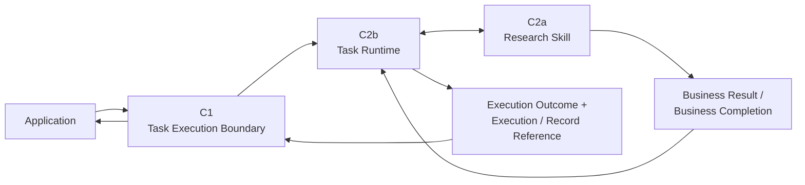
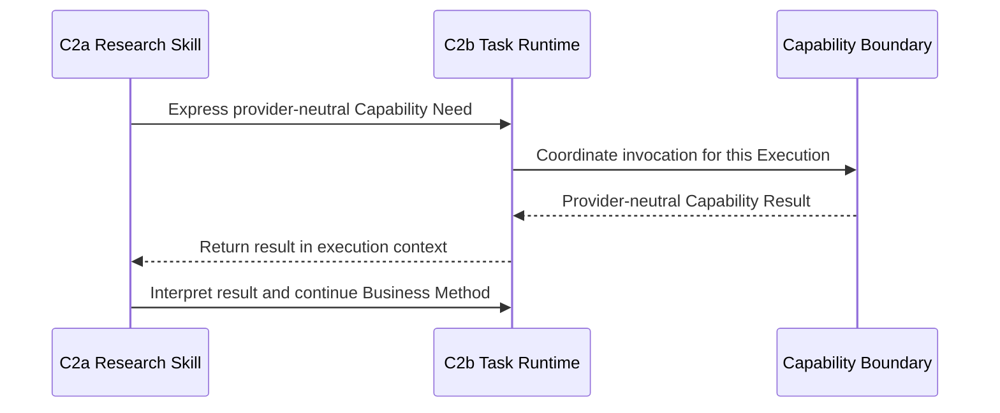

# D1 — 执行主干规范（Execution Spine Specification）

- **文档类型（Document Type）**：Detailed Contract Engineering Specification
- **设计阶段（Design Stage）**：D1 — Execution Spine
- **垂直切片（Vertical Slice）**：First Research Execution
- **业务场景（Business Scenario）**：US / Car Vacuum / TikTok Content Research
- **覆盖 Contract（Covered Contracts）**：C1 + C2b + C2a
- **架构状态（Architecture Status）**：System Architecture V0.2 remains Candidate / Human-reviewed working architecture
- **D1 审核状态（Review Status）**：Detailed Semantics Reviewed
- **D1 联合一致性审核（Joint Consistency Review）**：PASS_WITH_REFINEMENTS
- **架构重开（Architecture Reopen）**：NO
- **需要新增 Contract（New Contract Required）**：NO
- **软件架构（Software Architecture）**：NOT YET DESIGNED

本规范定义 First Research Execution 的稳定语义主干。它是工程规范
（Engineering Specification），不是 Architecture Review transcript，也不是
Software 或 transport design。

## 1. 目的（Purpose）

D1 定义以下最小语义：

- 在 Application boundary 接收 Business Work；
- 建立并协调一次 Execution；
- 为 First Research Slice 绑定一个 Research Skill；
- 表达并协调 provider-neutral Capability Need；
- 区分 Business Completion 与 Execution Completion；
- 向 Application 暴露业务终态和执行终态语义。

以下术语是语义分类，不冻结 JSON fields、Python models、Pydantic schemas、
database keys 或 API payloads。

## 2. 覆盖的 Contract（Covered Contracts）

| Contract | 边界 / 责任（Boundary / responsibility） | D1 作用（D1 role） |
|---|---|---|
| C1 | Task Execution Boundary | Carries business request semantics into and terminal semantics out of the Task Runtime. |
| C2b | Task Runtime Execution Contract | Owns Execution identity, lifecycle, execution-scoped context, coordination, and terminalization. |
| C2a | Skill Contract | Owns the professional Business Method, required business semantics, capability dependency declaration, and Business Completion. |

文档分组不会合并这些 Contract。C1、C2b、C2a 仍然是三个独立的
Contract / Boundary identity。

## 3. 范围与非范围（Scope and Non-Scope）

### 范围内（In scope）

- logical initiation, rejection, active execution, and terminal semantics;
- ownership of business meaning, execution facts, and skill participation;
- progressive narrowing of context;
- the Skill-to-Runtime capability round-trip;
- successful completion, execution failure, and insufficient-evidence semantics;
- cross-contract identity, reference, version, and result obligations;
- the thin supporting role of the Skill Extension Mechanism.

### D1 范围外（Out of scope for D1）

- concrete field names or wire schemas;
- synchronous/asynchronous mechanics or any transport;
- Search Capability details (C3);
- Provider Resolution (C4a) and Scrape Creators mapping (C4b);
- Evidence and Research Result schemas (C5a/C5b);
- Execution Record schema (C6);
- persistence, database, observability, or software module design.

## 4. D1 概念运行流程（Conceptual Runtime Flow）

The logical execution spine is:



The Application submits Business Work Request semantics. It does not create a
Runtime Task in advance. C1 admits or rejects the request; C2b establishes an
Execution only after the request satisfies C1 entry semantics.

When the Skill requires a system capability, the relevant direction is:



The Runtime coordinates the invocation; the Skill owns why the capability is
needed, when it is needed, and what its result means for the research method.

## 5. 责任 / 归属矩阵（Responsibility / Ownership Matrix）

| 语义关注点（Semantic concern） | 主要责任方（Primary owner） | 边界 / 消费方义务（Boundary / consumer obligation） |
|---|---|---|
| Business Work meaning | C2a | C1 承载 / 暴露该语义。 |
| Business Input / Work Intent | C2a | C1 承载进入语义。 |
| Required business context semantics | C2a | C1 承载入口 Context；C2b 容纳 execution-scoped Context。 |
| Execution Identity / referenceability | C2b | C1 可以暴露引用；C2a 不创建它。 |
| Execution lifecycle | C2b | C1 只暴露逻辑进入与终态语义。 |
| Runtime state boundary | C2b | 精确 state taxonomy 仍未设计。 |
| Skill Identity / declaration | C2a | C2b 为 Execution 绑定可识别的 Skill。 |
| Skill version referenceability | C2a | 参与的版本必须可被引用。 |
| Capability dependency declaration | C2a | 声明不等于调用证明。 |
| Runtime Capability Need | C2a expresses | C2b 接收并协调。 |
| Capability invocation coordination | C2b | Capability boundary 提供自身 invocation semantics。 |
| Capability result business interpretation | C2a | C2b 返回结果，但不解释研究含义。 |
| Business Completion | C2a defines / produces | C2b 在 terminalization 前识别它。 |
| Business Result semantics | C2a defines expected output boundary | C5b 拥有详细 Research Result semantics；C2b 关联；C1 暴露。 |
| Execution terminalization | C2b | 只有适用的完成或失败条件满足后才终态收口。 |
| Execution Outcome | C2b | C1 暴露终态结果语义。 |
| Execution Reference | C2b | Execution 存在时由 C1 暴露。 |
| Provider selection | Later C4a boundary | 不由 C1、C2b 或 C2a 拥有。 |
| Execution Record semantics | C6 | C2b 提供稳定 execution facts 并触发 finalization semantics。 |

## 6. C1 — 任务执行边界（Task Execution Boundary）

### 6.1 边界目的（Boundary purpose）

C1 位于 Application 与 Task Runtime 之间，回答：

> Business Work 如何进入系统？Execution 结束后 Application 可以获得什么？

C1 承载业务语义，但不拥有这些语义的详细业务含义。例如，C1 可以承载
Research Business Work Request，但不定义 Research Question、Sampling、
Evidence Interpretation、Finding 或 Hypothesis 语义；这些由 C2a 及后续
业务 Contract 负责。

### 6.2 请求侧语义（Request-side semantics）

Application 提交的是 **Business Work Request（业务工作请求）**，而不是预先
创建的 Runtime Task。请求至少包含以下语义类别：

```text
Business Work Identity / Meaning
+
Business Input / Intent
+
Required Business Context
```

For the First Research Slice, the business refinement is:

```text
Business Input / Work Intent:
    Research Intent / Decision Need

Required Business Context:
    Product / SKU Context
    Platform = TikTok
    Market = US
    Business Goal = Commerce Content
```

这些类别不意味着必须创建 `TaskRequest` object、universal context object，
也不冻结任何特定 transport representation。

### 6.3 进入与终态语义（Entry and terminal semantics）

#### 请求拒绝（Request rejection）

如果请求不满足 C1 的进入语义，则在建立 Execution 之前被拒绝。

拒绝必须提供边界安全的 rejection semantics。它不需要 Execution Identity
或 Execution Reference，也不属于 Execution Failure。

#### 成功执行（Successful execution）

从逻辑上，Application 必须能够获得：

```text
Business Result
+
Execution Outcome
+
Execution / Record Reference semantics
```

详细的 Business Result 语义由 C2a 与 C5b 在下游负责。

#### 执行失败（Failed execution）

从逻辑上，Application 必须能够获得：

```text
Execution Outcome
+
Execution / Record Reference semantics
```

Execution 失败时不要求存在 Business Result。

The following distinctions are mandatory:

```text
Business Result    != Execution Outcome
Request Rejection  != Execution Failure
```

### 6.4 Transport 中立性（Transport neutrality）

C1 只定义逻辑上的启动、拒绝和终态语义，不决定以下哪种 transport：

```text
sync / async
HTTP
CLI
local function call
polling
callback
event transport
```

## 7. C2b — 任务运行时执行 Contract（Task Runtime Execution Contract）

### 7.1 Execution 定义与标识（Execution definition and identity）

**Execution（执行实例）** 是 Task Runtime 为已接受的 Business Work 建立的、
具有稳定标识和生命周期的一次运行实例。

```text
Business Work != Execution
```

Execution 不等同于：

```text
Workflow DAG
Agent
Process Definition
Database Row
Execution Record
Trace
Logs
```

C2b 拥有 Execution Identity / referenceability。其表示形式仍未冻结：UUID、
database key、URI、`run_id`、`task_id` 或其他 software form 都不在此处选择。
C2a 不创建 Execution Identity。

### 7.2 逻辑生命周期（Logical lifecycle）

最小生命周期为：

```text
Execution not established
        ↓
active / non-terminal execution
        ↓
terminal execution
```

终态收口至少必须区分：

```text
successful business completion
execution failure
```

本规范不冻结最终 Runtime State Enum。类似 `SUCCESS | FAILURE` 的 enum 现在
既过早也过于狭窄。精确生命周期和 state taxonomy 仍为 **NOT YET DESIGNED**。

### 7.3 Execution Context（Execution context）

C2b 负责 execution-scoped context 的容纳边界。C2a 负责其业务方法所需
business context 的语义。

Runtime 应用 **Progressive Context Narrowing（渐进式 Context 收窄）**：

```text
Application business context
        ↓
Execution-scoped context
        ↓
Skill-required business context
        ↓
Capability-required context
```

No contract in D1 may create:

```text
GlobalContext
EverythingContext
Universal Ecommerce Context
```

### 7.4 Runtime 协调（Runtime coordination）

C2b 协调当前 Execution，包括：

```text
Execution identity
Lifecycle
Execution-scoped context containment
Runtime state boundary
Execution coordination
Capability invocation coordination
Capability result return
Failure handling
Terminalization
```

Runtime 不拥有 Research Method、TikTok-specific research logic、sampling
judgment、Evidence Interpretation、Finding quality 或 provider API logic。

### 7.5 Capability 协调（Capability coordination）

The stable direction is:

```text
C2a Research Skill
    ↓ expresses provider-neutral Capability Need
C2b Task Runtime
    ↓ coordinates invocation for this Execution
Capability boundary
    ↓ returns provider-neutral Capability Result
C2b Task Runtime
    ↓ returns result in execution context
C2a Research Skill
```

C2a 决定为什么、何时需要 Search；C2b 决定如何把该调用纳入当前 Execution。
Runtime 不解释 Search Result 的业务含义。

The following are separate facts and must not be collapsed:

```text
Declared Capability Dependency
    != Runtime Capability Need
    != Actual Capability Invocation Fact
```

### 7.6 Business Completion 与终态收口（Business Completion and terminalization）

Business Completion（业务完成）必须先于 Execution Completion（执行完成）：

```text
C2a Skill forms valid Business Result / Business Completion
        ↓
C2b Runtime recognizes completion
        ↓
C2b Runtime terminalizes the Execution
        ↓
Terminal Execution Outcome becomes available
```

Runtime 不得先将 Execution 标记为成功，再事后尝试生成 Research Result。

### 7.7 Execution facts 与 C6 接缝（Execution facts and C6 seam）

C2b 拥有 Execution terminalization，并在运行期间产生或提供稳定的 execution
facts，例如 identity、Skill reference、invoked Capability references、
resolved Provider reference 和 result references。

C6 拥有 Execution Record 语义。因此：

```text
C2b owns terminalization and fact availability
C6 owns the Execution Record semantic boundary
```

The following distinctions remain mandatory:

```text
Execution Record != Runtime State
Execution Record != Trace
Execution Record != Logs
Execution Record != Evidence
Execution Record != Artifact
Execution Record != Observability
Execution Record != Evaluation
```

C2b 不拥有 C6 Execution Record schema。

## 8. C2a — Skill Contract（业务技能 Contract）

### 8.1 Skill 定义（Skill definition）

A Skill is a **Business Method**. It is the professional method that gives a
Business Work its domain meaning; it is not the Task Runtime and not a generic
execution process.

C2a defines the following semantic concerns:

```text
Skill Identity / Declaration
Business Responsibility
Required Context
Declared Capability Dependencies
Runtime Expression of Required Capability Action
Platform / Domain Adaptation Boundary
Business Input Boundary
Business Output Boundary
Business Completion Semantics
Version Referenceability
```

### 8.2 Identity 与版本（Identity and version）

Any Skill participating in an Execution must be identifiable and
version-referenceable. D1 does not choose semantic version syntax, Git hash,
package version, registry scheme, or another representation.

### 8.3 Research Skill 责任（Research Skill responsibility）

For the First Research Slice, the Research Skill owns the Business Method,
including as appropriate:

```text
Business Question / Research Method
Evidence Need
Discovery Strategy
Sampling Method
Evidence Interpretation
Finding Formation
Hypothesis Formation
Answerability / Limitation discipline
```

These are responsibilities, not a requirement for one top-level field per
method concern.

The Skill does not own:

```text
Task lifecycle
Task terminal status
Execution outcome
Runtime state
Execution Identity
Provider selection
```

### 8.4 输入、Context 与输出（Input, context, and output）

The First Slice business input is a Research Intent / Decision Need. Required
business context is the Product / SKU Context plus TikTok, US, and Commerce
Content context described at C1.

TikTok / Commerce Content knowledge may be a Research Skill domain adaptation.
It is not Scrape Creators provider/API logic. Provider/API behavior belongs on
the Provider / Adapter side.

The current Research Skill output boundary is a human-reviewable Research
Result. C2a does not duplicate the complete Research Result schema; C5b owns
that detailed business Contract. C2a defines the expected output boundary and
Business Completion semantics.

### 8.5 Capability 依赖与 Runtime Need（Capability dependency and runtime need）

The Research Skill declares a dependency on **Search Capability**, not on
Scrape Creators. It may express a provider-neutral capability action during an
Execution. C2b coordinates the actual invocation, and any actual invocation is
an execution fact rather than a declared dependency.

### 8.6 Business Completion（业务完成）

For this slice, Research Business Work can be complete when the Skill has formed
a valid, human-reviewable Research Result satisfying the Research Result
Contract, including limitations where applicable.

The Skill defines and produces Business Completion. It does not own Runtime
state, Task terminal status, or Execution Outcome.

## 9. 完成与失败语义（Completion and Failure Semantics）

### 9.1 证据不足（Insufficient Evidence）

Insufficient Evidence（证据不足）是有效的研究结论，不是 execution error：

```text
Search succeeds
        ↓
Sample boundary formed
        ↓
Evidence formed
        ↓
Research Skill concludes: current evidence is insufficient
        ↓
Valid Research Result with limitation
        ↓
Business Completion
        ↓
Successful Research Execution
```

当前 Runtime 不得创建 `FAILED_INSUFFICIENT_EVIDENCE`。

```text
Execution Failure
    != Insufficient Evidence
    != Hypothesis Rejected Later
```

Hypothesis Rejected Later 属于未来的 Experiment & Validation context。

### 9.2 数据不完整或来源缺失（Partial data or missing sources）

数据不完整或来源缺失仍然可能产生：

```text
successful business completion + limitations
```

只要能够形成有效 Research Result。如果无法形成有效 Business Completion，
Execution 可以进入 failure closure。

D1 不引入 `PARTIAL` Runtime enum。精确的 partial-state taxonomy 仍为
**NOT YET DESIGNED**。

### 9.3 失败收口（Failure closure）

Execution failure 是终态 Execution outcome，而不是 Business Result。它仍必须
通过 C2b 完成收口，并向 C1 提供 Execution / Record Reference 语义：

```text
Capability or provider failure
        ↓
C2b failure handling
        ↓
Terminal failure outcome
        ↓
Execution Record finalization semantics through C6
        ↓
C1 exposes failure outcome and reference
```

这条失败路径不要求 Evidence、Finding、Hypothesis 或 Research Result。

### 9.4 First-Slice 单 Skill 约束（one-Skill constraint）

对于 First Research Slice：

```text
one Execution requires one bound Research Skill
```

这是 First-Slice Contract Constraint，不是整个 OS 的永久不变量。Skill
Composition 为 **NOT YET PROVEN**，不得被静默改写成永久禁止。

## 10. C1 / C2b / C2a 跨 Contract 接缝（Cross-contract Seams）

### 10.1 C1 ↔ C2b：进入与退出（entry and exit）

C1 定义逻辑上的 Business Work Request 进入和终态返回语义。C2b 建立
Execution，拥有其 identity 与 lifecycle，并负责 terminalization。C1 不预先
创建 Runtime Task，也不暴露 Runtime 内部细节。

### 10.2 C2b ↔ C2a：方法与协调（method and coordination）

C2a owns:

```text
Business Method
Capability Need
Business Completion
Business Result boundary
```

C2b owns:

```text
Execution Coordination
Capability Invocation Coordination
Execution Context containment
Execution Terminalization
Execution Outcome
```

不新增独立的 `RuntimeSkillContract`、`SkillExecutionContract` 或
`SkillInvocationContract`。

### 10.3 D1 ↔ 后续 Contract（later Contracts）

| Later boundary | D1 seam |
|---|---|
| C3 Search Capability | C2a expresses a provider-neutral need; C2b coordinates invocation. |
| C4a Provider Resolution | C2b coordinates a Capability invocation but does not select its Provider. |
| C5b Research Result | C2a defines the output boundary; C5b defines detailed Research Result semantics. |
| C6 Execution Record | C2b exposes stable execution facts and terminalization; C6 owns record semantics. |
| C4b Adapter | D1 consumes provider-neutral Capability semantics and does not design provider mapping. |

## 11. Skill Extension Mechanism 支持

Skill Extension Mechanism 在 D1 中只承担很薄的支持角色，用于证明 Research
Skill participation 不会被硬编码成 Application 或 Stable Core 内的特殊分支。

The minimum supported concerns are:

```text
Skill Contract
Skill Identity / Declaration
Thin / Static Registration
Dependency Declaration
Context Binding
Platform / Domain Adaptation
```

Its role is to support declaration, static registration, binding, and context
binding for participation in:

```text
C2b Task Runtime ↔ bound C2a Skill
```

It is not:

```text
second Runtime hop
new Contract
Plugin Runtime
Dynamic Skill Marketplace
```

The conceptual relationship is:

```text
Skill Extension Mechanism
    supports declaration / registration / binding / context binding
    for Runtime ↔ bound Skill participation
```

It must not be drawn as `Runtime → Extension Service → Skill` or assigned a
separate Task lifecycle, retry, pause/resume, or checkpoint responsibility.

## 12. 跨 Contract 不变量（Cross-contract Invariants）

The following are D1 invariants:

1. C1 carries business semantics; C2a owns detailed business meaning.
2. A Business Work Request is not a pre-created Runtime Task.
3. Request Rejection occurs before Execution establishment and is not Execution Failure.
4. Business Work is not the same thing as Execution.
5. C2b owns Execution Identity; C2a does not create it.
6. Runtime state taxonomy remains open; D1 does not freeze a final enum.
7. Context is progressively narrowed; no GlobalContext or EverythingContext is introduced.
8. C2a expresses why and when a Capability is needed; C2b coordinates invocation.
9. Declared dependency, runtime need, and actual invocation fact remain distinct.
10. Provider-neutral Capability Result is returned through the Runtime to the Skill.
11. Business Completion precedes Execution Completion.
12. Business Result is distinct from Execution Outcome.
13. Insufficient Evidence may be a successful Business Completion with limitations.
14. A failed Execution does not require a Business Result, but does require terminal outcome and reference semantics.
15. C2b owns terminalization; C6 owns Execution Record semantics.
16. One Execution → one bound Research Skill is limited to the First Research Slice.
17. No D1 seam creates a new standalone Runtime–Skill Contract.

## 13. 明确排除项与设计成熟度（Explicit Exclusions and Design Maturity）

以下排除项是有意保留的。它们的 status 不可互换，也不都表示永久禁止。

### NOT YET DESIGNED

```text
Concrete Execution Identity representation
Final Runtime State / lifecycle taxonomy
Business Completion signaling representation
Capability Need software representation
Task Reference vs Execution Identity representation
Execution Reference vs Execution Record Reference representation
Skill Version representation
Sync / async interaction mechanics
```

### NOT YET PROVEN

```text
Skill Composition
Retry Engine
Checkpoint
Crash Recovery
Durable Execution
Dynamic multi-skill coordination
Database / Persistence technology
```

### EXPLICITLY REJECTED FOR CURRENT SLICE

```text
Standalone Orchestration Layer
Workflow DAG
Agent as a top-level layer
Tool as a top-level layer
Dynamic Skill Discovery
Hot Reload
Skill Marketplace
```

### 由后续 Contract 负责或位于 D1 范围外（Owned by later Contracts or outside D1）

```text
Concrete Provider selection
Scrape Creators endpoint and provider filter names
Provider cursor / pagination token
Provider-specific mapping
Evidence semantics
Research Result schema
Execution Record schema
```

D1 也不引入或冻结：

```text
Universal TaskRequest God Object
Universal TaskResult God Object
GlobalContext
HTTP / CLI contract
UI / session / chat protocol
Independent Analyze Capability
```

不得利用这些排除项反向设计 Product Architecture、System Architecture 或
Software Architecture。

## 14. 尚未冻结的表示层问题（Open Representation Questions）

以下表示层问题仍未冻结，但不阻塞 D1 语义完成：

1. How Business Work binds to a Skill: `work_type`, `skill_ref`, static registry, or another representation.
2. How a Capability Need is represented: method call, typed request, yielded command, or another representation.
3. How Business Completion is signaled.
4. How Execution Identity is represented in software.
5. Whether Task Reference and Execution Identity are the same software identifier.
6. Whether Execution Reference and Execution Record Reference use the same identifier.
7. How Skill Version is represented.
8. How sync / async interaction mechanics are implemented.

## 15. 审核结论（Review Result）

```text
C1 — Task Execution Boundary
= PASS_WITH_REFINEMENTS

C2b — Task Runtime Execution Contract
= PASS_WITH_REFINEMENTS

C2a — Skill Contract
= PASS_WITH_REFINEMENTS

D1 Joint Consistency Review
= PASS_WITH_REFINEMENTS

Architecture Reopen
= NO

New Contract Required
= NO

D1 Detailed Semantics
= REVIEWED

D1 Specification
= CREATED
```

这些细化项已通过明确 ownership、completion ordering、failure closure、Context
narrowing 和 open representation questions 记录在本文中，不会重新打开上游
Architecture decisions。

## 16. 下一设计阶段（Next Design Stage）

```text
D2 — Search Invocation Spine

C3 — Search Capability Contract
+
C4a — Provider Resolution Boundary
```

本规范不创建 `02_SEARCH_INVOCATION.md`。
