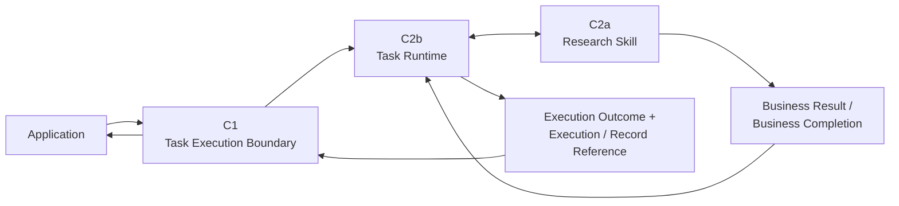
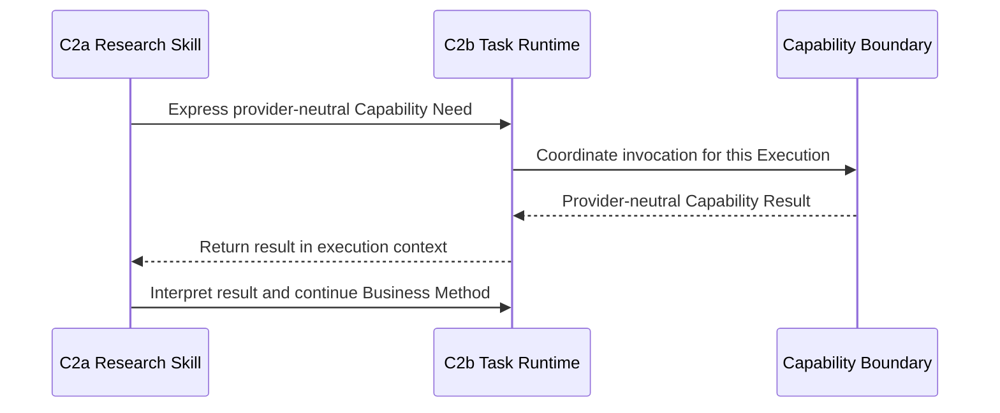

# D1 — Execution Spine Specification

- **Document Type**: Detailed Contract Engineering Specification
- **Design Stage**: D1 — Execution Spine
- **Vertical Slice**: First Research Execution
- **Business Scenario**: US / Car Vacuum / TikTok Content Research
- **Covered Contracts**: C1 + C2b + C2a
- **Architecture Status**: System Architecture V0.2 remains Candidate / Human-reviewed working architecture
- **D1 Review Status**: Detailed Semantics Reviewed
- **D1 Joint Consistency Review**: PASS_WITH_REFINEMENTS
- **Architecture Reopen**: NO
- **New Contract Required**: NO
- **Software Architecture**: NOT YET DESIGNED

This specification defines the stable semantic spine for the first Research
Execution. It is an engineering specification, not an Architecture Review
transcript and not a software or transport design.

## 1. Purpose

D1 defines the minimum semantics for:

- accepting Business Work at the Application boundary;
- establishing and coordinating one Execution;
- binding one Research Skill for the First Research Slice;
- expressing and coordinating provider-neutral Capability needs;
- distinguishing Business Completion from Execution Completion;
- exposing terminal business and execution semantics to the Application.

The terms below are semantic categories. They do not freeze JSON fields,
Python models, Pydantic schemas, database keys, or API payloads.

## 2. Covered Contracts

| Contract | Boundary / responsibility | D1 role |
|---|---|---|
| C1 | Task Execution Boundary | Carries business request semantics into and terminal semantics out of the Task Runtime. |
| C2b | Task Runtime Execution Contract | Owns Execution identity, lifecycle, execution-scoped context, coordination, and terminalization. |
| C2a | Skill Contract | Owns the professional Business Method, required business semantics, capability dependency declaration, and Business Completion. |

Documentation grouping does not merge these Contracts. C1, C2b, and C2a remain
three independent Contract / Boundary identities.

## 3. Scope and Non-Scope

### In scope

- logical initiation, rejection, active execution, and terminal semantics;
- ownership of business meaning, execution facts, and skill participation;
- progressive narrowing of context;
- the Skill-to-Runtime capability round-trip;
- successful completion, execution failure, and insufficient-evidence semantics;
- cross-contract identity, reference, version, and result obligations;
- the thin supporting role of the Skill Extension Mechanism.

### Out of scope for D1

- concrete field names or wire schemas;
- synchronous/asynchronous mechanics or any transport;
- Search Capability details (C3);
- Provider Resolution (C4a) and Scrape Creators mapping (C4b);
- Evidence and Research Result schemas (C5a/C5b);
- Execution Record schema (C6);
- persistence, database, observability, or software module design.

## 4. D1 Conceptual Runtime Flow

The logical execution spine is:



The Application submits Business Work Request semantics. It does not create a
Runtime Task in advance. C1 admits or rejects the request; C2b establishes an
Execution only after the request satisfies C1 entry semantics.

When the Skill requires a system capability, the relevant direction is:



The Runtime coordinates the invocation; the Skill owns why the capability is
needed, when it is needed, and what its result means for the research method.

## 5. Responsibility / Ownership Matrix

| Semantic concern | Primary owner | Boundary / consumer obligation |
|---|---|---|
| Business Work meaning | C2a | C1 carries / exposes it. |
| Business Input / Work Intent | C2a | C1 carries entry semantics. |
| Required business context semantics | C2a | C1 carries entry context; C2b contains execution-scoped context. |
| Execution Identity / referenceability | C2b | C1 may expose a reference; C2a does not create it. |
| Execution lifecycle | C2b | C1 exposes only logical entry and terminal semantics. |
| Runtime state boundary | C2b | Exact state taxonomy remains not yet designed. |
| Skill Identity / declaration | C2a | C2b binds an identifiable Skill for the Execution. |
| Skill version referenceability | C2a | The participating version must be referenceable. |
| Capability dependency declaration | C2a | Declaration is not proof of invocation. |
| Runtime Capability Need | C2a expresses | C2b receives and coordinates it. |
| Capability invocation coordination | C2b | The Capability boundary supplies its own invocation semantics. |
| Capability result business interpretation | C2a | C2b returns the result; it does not interpret research meaning. |
| Business Completion | C2a defines / produces | C2b recognizes it before terminalization. |
| Business Result semantics | C2a defines expected output boundary | C5b owns detailed Research Result semantics; C2b associates; C1 exposes. |
| Execution terminalization | C2b | Terminal closure occurs only after the applicable completion or failure condition. |
| Execution Outcome | C2b | C1 exposes terminal outcome semantics. |
| Execution Reference | C2b | C1 exposes it when an Execution exists. |
| Provider selection | Later C4a boundary | Not owned by C1, C2b, or C2a. |
| Execution Record semantics | C6 | C2b makes stable execution facts available and triggers finalization semantics. |

## 6. C1 — Task Execution Boundary

### 6.1 Boundary purpose

C1 sits between the Application and the Task Runtime. It answers:

> How does Business Work enter the system, and what can the Application obtain
> after execution ends?

C1 carries business semantics; it does not own their detailed business meaning.
For example, C1 may carry a Research Business Work Request, but it does not
define Research Question, Sampling, Evidence Interpretation, Finding, or
Hypothesis semantics. Those belong to C2a and later business-specific Contracts.

### 6.2 Request-side semantics

The Application submits a **Business Work Request**, not a pre-created Runtime
Task. The request has these semantic categories:

```text
Business Work Identity / Meaning
+
Business Input / Intent
+
Required Business Context
```

For the First Research Slice, the business refinement is:

```text
Business Input / Work Intent:
    Research Intent / Decision Need

Required Business Context:
    Product / SKU Context
    Platform = TikTok
    Market = US
    Business Goal = Commerce Content
```

These categories are not a commitment to a `TaskRequest` object, a universal
context object, or a particular transport representation.

### 6.3 Entry and terminal semantics

#### Request rejection

If the request does not satisfy C1 entry semantics, it is rejected before an
Execution is established.

The rejection must provide boundary-safe rejection semantics. It does not
require an Execution Identity or Execution Reference, and it is not an
Execution Failure.

#### Successful execution

Logically, the Application must be able to obtain:

```text
Business Result
+
Execution Outcome
+
Execution / Record Reference semantics
```

The detailed Business Result semantics are downstream of C2a and C5b.

#### Failed execution

Logically, the Application must be able to obtain:

```text
Execution Outcome
+
Execution / Record Reference semantics
```

Business Result is not required when the Execution fails.

The following distinctions are mandatory:

```text
Business Result    != Execution Outcome
Request Rejection  != Execution Failure
```

### 6.4 Transport neutrality

C1 defines logical initiation, rejection, and terminal semantics only. It does
not decide among:

```text
sync / async
HTTP
CLI
local function call
polling
callback
event transport
```

## 7. C2b — Task Runtime Execution Contract

### 7.1 Execution definition and identity

An **Execution** is a run instance established by the Task Runtime for an
accepted Business Work, with stable identity and lifecycle.

```text
Business Work != Execution
```

Execution is not synonymous with:

```text
Workflow DAG
Agent
Process Definition
Database Row
Execution Record
Trace
Logs
```

C2b owns Execution Identity / referenceability. The representation remains
open: UUID, database key, URI, `run_id`, `task_id`, or another software form is
not chosen here. C2a does not create Execution Identity.

### 7.2 Logical lifecycle

The minimum lifecycle is:

```text
Execution not established
        ↓
active / non-terminal execution
        ↓
terminal execution
```

Terminal closure must distinguish at least:

```text
successful business completion
execution failure
```

This specification does not freeze a final Runtime State Enum. An enum such as
`SUCCESS | FAILURE` would be too early and too narrow. Exact lifecycle and
state taxonomy are **NOT YET DESIGNED**.

### 7.3 Execution context

C2b owns containment of execution-scoped context. C2a owns the semantics of the
business context required by its method.

The Runtime applies **Progressive Context Narrowing**:

```text
Application business context
        ↓
Execution-scoped context
        ↓
Skill-required business context
        ↓
Capability-required context
```

No contract in D1 may create:

```text
GlobalContext
EverythingContext
Universal Ecommerce Context
```

### 7.4 Runtime coordination

C2b coordinates the current Execution, including:

```text
Execution identity
Lifecycle
Execution-scoped context containment
Runtime state boundary
Execution coordination
Capability invocation coordination
Capability result return
Failure handling
Terminalization
```

The Runtime does not own the Research Method, TikTok-specific research logic,
sampling judgment, Evidence Interpretation, Finding quality, or provider API
logic.

### 7.5 Capability coordination

The stable direction is:

```text
C2a Research Skill
    ↓ expresses provider-neutral Capability Need
C2b Task Runtime
    ↓ coordinates invocation for this Execution
Capability boundary
    ↓ returns provider-neutral Capability Result
C2b Task Runtime
    ↓ returns result in execution context
C2a Research Skill
```

C2a decides why and when Search is needed. C2b decides how the invocation is
included in the current Execution. The Runtime does not interpret the business
meaning of a Search Result.

The following are separate facts and must not be collapsed:

```text
Declared Capability Dependency
    != Runtime Capability Need
    != Actual Capability Invocation Fact
```

### 7.6 Business Completion and terminalization

Business Completion precedes Execution Completion:

```text
C2a Skill forms valid Business Result / Business Completion
        ↓
C2b Runtime recognizes completion
        ↓
C2b Runtime terminalizes the Execution
        ↓
Terminal Execution Outcome becomes available
```

The Runtime must not mark the Execution successful and only afterward attempt
to generate the Research Result.

### 7.7 Execution facts and C6 seam

C2b owns Execution terminalization and, during the run, produces or makes
available stable execution facts such as identity, Skill reference, invoked
Capability references, resolved Provider reference, and result references.

C6 owns Execution Record semantics. Therefore:

```text
C2b owns terminalization and fact availability
C6 owns the Execution Record semantic boundary
```

The following distinctions remain mandatory:

```text
Execution Record != Runtime State
Execution Record != Trace
Execution Record != Logs
Execution Record != Evidence
Execution Record != Artifact
Execution Record != Observability
Execution Record != Evaluation
```

C2b does not own the C6 Execution Record schema.

## 8. C2a — Skill Contract

### 8.1 Skill definition

A Skill is a **Business Method**. It is the professional method that gives a
Business Work its domain meaning; it is not the Task Runtime and not a generic
execution process.

C2a defines the following semantic concerns:

```text
Skill Identity / Declaration
Business Responsibility
Required Context
Declared Capability Dependencies
Runtime Expression of Required Capability Action
Platform / Domain Adaptation Boundary
Business Input Boundary
Business Output Boundary
Business Completion Semantics
Version Referenceability
```

### 8.2 Identity and version

Any Skill participating in an Execution must be identifiable and
version-referenceable. D1 does not choose semantic version syntax, Git hash,
package version, registry scheme, or another representation.

### 8.3 Research Skill responsibility

For the First Research Slice, the Research Skill owns the Business Method,
including as appropriate:

```text
Business Question / Research Method
Evidence Need
Discovery Strategy
Sampling Method
Evidence Interpretation
Finding Formation
Hypothesis Formation
Answerability / Limitation discipline
```

These are responsibilities, not a requirement for one top-level field per
method concern.

The Skill does not own:

```text
Task lifecycle
Task terminal status
Execution outcome
Runtime state
Execution Identity
Provider selection
```

### 8.4 Input, context, and output

The First Slice business input is a Research Intent / Decision Need. Required
business context is the Product / SKU Context plus TikTok, US, and Commerce
Content context described at C1.

TikTok / Commerce Content knowledge may be a Research Skill domain adaptation.
It is not Scrape Creators provider/API logic. Provider/API behavior belongs on
the Provider / Adapter side.

The current Research Skill output boundary is a human-reviewable Research
Result. C2a does not duplicate the complete Research Result schema; C5b owns
that detailed business Contract. C2a defines the expected output boundary and
Business Completion semantics.

### 8.5 Capability dependency and runtime need

The Research Skill declares a dependency on **Search Capability**, not on
Scrape Creators. It may express a provider-neutral capability action during an
Execution. C2b coordinates the actual invocation, and any actual invocation is
an execution fact rather than a declared dependency.

### 8.6 Business Completion

For this slice, Research Business Work can be complete when the Skill has formed
a valid, human-reviewable Research Result satisfying the Research Result
Contract, including limitations where applicable.

The Skill defines and produces Business Completion. It does not own Runtime
state, Task terminal status, or Execution Outcome.

## 9. Completion and Failure Semantics

### 9.1 Insufficient evidence

Insufficient Evidence is a valid research conclusion, not an execution error:

```text
Search succeeds
        ↓
Sample boundary formed
        ↓
Evidence formed
        ↓
Research Skill concludes: current evidence is insufficient
        ↓
Valid Research Result with limitation
        ↓
Business Completion
        ↓
Successful Research Execution
```

The current Runtime must not create `FAILED_INSUFFICIENT_EVIDENCE`.

```text
Execution Failure
    != Insufficient Evidence
    != Hypothesis Rejected Later
```

Hypothesis Rejected Later belongs to a future Experiment & Validation context.

### 9.2 Partial data or missing sources

Partial data or missing sources may still produce:

```text
successful business completion + limitations
```

when a valid Research Result can be formed. If a valid Business Completion
cannot be formed, the Execution may enter failure closure.

Do not introduce a `PARTIAL` Runtime enum in D1. Exact partial-state taxonomy
is **NOT YET DESIGNED**.

### 9.3 Failure closure

An execution failure is a terminal Execution outcome, not a Business Result.
It must still close through C2b and make Execution / Record Reference semantics
available to C1:

```text
Capability or provider failure
        ↓
C2b failure handling
        ↓
Terminal failure outcome
        ↓
Execution Record finalization semantics through C6
        ↓
C1 exposes failure outcome and reference
```

Evidence, Finding, Hypothesis, and Research Result are not required on this
failure path.

### 9.4 First-Slice one-Skill constraint

For the First Research Slice:

```text
one Execution requires one bound Research Skill
```

This is a First-Slice Contract Constraint, not a permanent OS-wide invariant.
Skill Composition is **NOT YET PROVEN** and must not be silently converted
into a permanent prohibition.

## 10. C1 / C2b / C2a Cross-contract Seams

### 10.1 C1 ↔ C2b: entry and exit

C1 defines the logical Business Work Request entry and terminal return
semantics. C2b establishes the Execution, owns its identity and lifecycle, and
terminalizes it. C1 does not pre-create Runtime Tasks or expose Runtime
internals.

### 10.2 C2b ↔ C2a: method and coordination

C2a owns:

```text
Business Method
Capability Need
Business Completion
Business Result boundary
```

C2b owns:

```text
Execution Coordination
Capability Invocation Coordination
Execution Context containment
Execution Terminalization
Execution Outcome
```

No standalone `RuntimeSkillContract`, `SkillExecutionContract`, or
`SkillInvocationContract` is added.

### 10.3 D1 ↔ later Contracts

| Later boundary | D1 seam |
|---|---|
| C3 Search Capability | C2a expresses a provider-neutral need; C2b coordinates invocation. |
| C4a Provider Resolution | C2b coordinates a Capability invocation but does not select its Provider. |
| C5b Research Result | C2a defines the output boundary; C5b defines detailed Research Result semantics. |
| C6 Execution Record | C2b exposes stable execution facts and terminalization; C6 owns record semantics. |
| C4b Adapter | D1 consumes provider-neutral Capability semantics and does not design provider mapping. |

## 11. Skill Extension Mechanism Support

The Skill Extension Mechanism has a supporting, very thin role in D1. It proves
that Research Skill participation is not hard-coded as a special case inside
the Application or Stable Core.

The minimum supported concerns are:

```text
Skill Contract
Skill Identity / Declaration
Thin / Static Registration
Dependency Declaration
Context Binding
Platform / Domain Adaptation
```

Its role is to support declaration, static registration, binding, and context
binding for participation in:

```text
C2b Task Runtime ↔ bound C2a Skill
```

It is not:

```text
second Runtime hop
new Contract
Plugin Runtime
Dynamic Skill Marketplace
```

The conceptual relationship is:

```text
Skill Extension Mechanism
    supports declaration / registration / binding / context binding
    for Runtime ↔ bound Skill participation
```

It must not be drawn as `Runtime → Extension Service → Skill` or assigned a
separate Task lifecycle, retry, pause/resume, or checkpoint responsibility.

## 12. Cross-contract Invariants

The following are D1 invariants:

1. C1 carries business semantics; C2a owns detailed business meaning.
2. A Business Work Request is not a pre-created Runtime Task.
3. Request Rejection occurs before Execution establishment and is not Execution Failure.
4. Business Work is not the same thing as Execution.
5. C2b owns Execution Identity; C2a does not create it.
6. Runtime state taxonomy remains open; D1 does not freeze a final enum.
7. Context is progressively narrowed; no GlobalContext or EverythingContext is introduced.
8. C2a expresses why and when a Capability is needed; C2b coordinates invocation.
9. Declared dependency, runtime need, and actual invocation fact remain distinct.
10. Provider-neutral Capability Result is returned through the Runtime to the Skill.
11. Business Completion precedes Execution Completion.
12. Business Result is distinct from Execution Outcome.
13. Insufficient Evidence may be a successful Business Completion with limitations.
14. A failed Execution does not require a Business Result, but does require terminal outcome and reference semantics.
15. C2b owns terminalization; C6 owns Execution Record semantics.
16. One Execution → one bound Research Skill is limited to the First Research Slice.
17. No D1 seam creates a new standalone Runtime–Skill Contract.

## 13. Explicit Exclusions and Design Maturity

The following exclusions are intentional. Their statuses are not interchangeable
and do not all mean permanent prohibition.

### Not yet designed

```text
Concrete Execution Identity representation
Final Runtime State / lifecycle taxonomy
Business Completion signaling representation
Capability Need software representation
Task Reference vs Execution Identity representation
Execution Reference vs Execution Record Reference representation
Skill Version representation
Sync / async interaction mechanics
```

### Not yet proven

```text
Skill Composition
Retry Engine
Checkpoint
Crash Recovery
Durable Execution
Dynamic multi-skill coordination
Database / Persistence technology
```

### Explicitly rejected for the current slice

```text
Standalone Orchestration Layer
Workflow DAG
Agent as a top-level layer
Tool as a top-level layer
Dynamic Skill Discovery
Hot Reload
Skill Marketplace
```

### Owned by later Contracts or outside D1

```text
Concrete Provider selection
Scrape Creators endpoint and provider filter names
Provider cursor / pagination token
Provider-specific mapping
Evidence semantics
Research Result schema
Execution Record schema
```

D1 also does not introduce or freeze:

```text
Universal TaskRequest God Object
Universal TaskResult God Object
GlobalContext
HTTP / CLI contract
UI / session / chat protocol
Independent Analyze Capability
```

None of these exclusions may be used to reverse-design Product Architecture,
System Architecture, or Software Architecture.

## 14. Open Representation Questions

The following remain open representation questions. They do not block D1
semantic completion:

1. How Business Work binds to a Skill: `work_type`, `skill_ref`, static registry, or another representation.
2. How a Capability Need is represented: method call, typed request, yielded command, or another representation.
3. How Business Completion is signaled.
4. How Execution Identity is represented in software.
5. Whether Task Reference and Execution Identity are the same software identifier.
6. Whether Execution Reference and Execution Record Reference use the same identifier.
7. How Skill Version is represented.
8. How sync / async interaction mechanics are implemented.

## 15. Review Result

```text
C1 — Task Execution Boundary
= PASS_WITH_REFINEMENTS

C2b — Task Runtime Execution Contract
= PASS_WITH_REFINEMENTS

C2a — Skill Contract
= PASS_WITH_REFINEMENTS

D1 Joint Consistency Review
= PASS_WITH_REFINEMENTS

Architecture Reopen
= NO

New Contract Required
= NO

D1 Detailed Semantics
= REVIEWED

D1 Specification
= CREATED
```

The refinements are represented as explicit ownership, completion ordering,
failure closure, context narrowing, and open representation questions in this
document. They do not reopen the upstream Architecture decisions.

## 16. Next Design Stage

```text
D2 — Search Invocation Spine

C3 — Search Capability Contract
+
C4a — Provider Resolution Boundary
```

This specification does not create `02_SEARCH_INVOCATION.md`.
