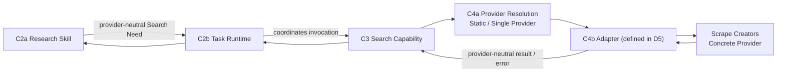
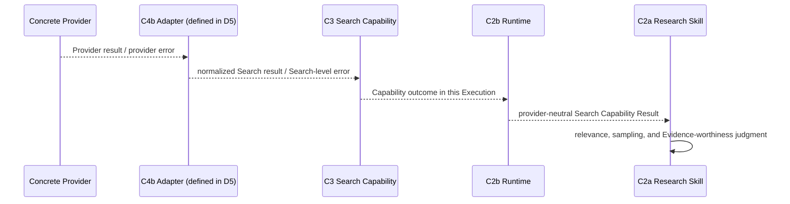

# D2 — Search Invocation Spine Specification

- **Document Type**: Detailed Contract Engineering Specification
- **Design Stage**: D2 — Search Invocation Spine
- **Vertical Slice**: First Research Execution
- **Business Scenario**: US / Car Vacuum / TikTok Content Research
- **Covered Contracts**: C3 + C4a
- **Architecture Status**: System Architecture V0.2 remains Candidate / Human-reviewed working architecture
- **D2 Review Status**: Detailed Semantics Reviewed
- **D2 Joint Consistency Review**: PASS_WITH_REFINEMENTS
- **Architecture Reopen**: NO
- **New Contract Required**: NO
- **Software Architecture**: NOT YET DESIGNED

This specification defines the provider-neutral Search invocation boundary and
the current static Provider Resolution seam. It is an Engineering
Specification, not an Architecture Review transcript, adapter design, endpoint
selection, or software design.

## 1. Purpose

D2 answers:

> After the Research Skill expresses that Search is needed, how does the system
> invoke a stable provider-neutral Search capability and resolve it to the
> currently valid Provider for this First Slice?

The governing distinction is:

```text
C3  = What stable system ability is being invoked?
C4a = Who is currently bound to provide that ability?
C4b = How stable Search semantics map to concrete Provider reality
      (defined in D5; D2 only owns the seam)
```

## 2. Covered Contracts

| Contract | Boundary / responsibility | D2 role |
|---|---|---|
| C3 | Search Capability Contract | Owns provider-neutral Search identity, invocation, input, output, error, context, governance, and version semantics. |
| C4a | Provider Resolution Boundary | Owns the current Provider binding, resolved Provider identity, and minimal eligibility seam for a legal Search invocation. |

Documentation grouping does not merge these Contracts. C3 and C4a remain two
independent Contract / Boundary identities.

## 3. Scope and Non-Scope

### In scope

- provider-neutral Search capability semantics;
- Search input, output, context, missingness, and error boundaries;
- retrieval-set, continuation, and known-completeness semantics;
- capability and Provider referenceability obligations;
- current static, single-Provider resolution;
- the C3 ↔ C4a ↔ C4b Adapter (defined in D5) seams;
- explicit distinctions between resolution, invocation, empty, and missing outcomes.

### Out of scope for D2

- Research Method, relevance, sampling, Evidence Interpretation, Finding, or Hypothesis;
- C4b request/response/error translation or provider-specific quirks;
- Scrape Creators endpoint selection or endpoint parameter mapping;
- provider cursor or pagination-token representation;
- multi-provider routing, fallback, ranking, health, cost, or dynamic discovery;
- Evidence / Research Result semantics (C5a/C5b);
- Execution Record retention or schema (C6);
- transport, persistence, database, or Software Architecture.

## 4. D2 Conceptual Runtime Flow

The D2 invocation spine is:



The C4b Adapter is defined in D5; D2 only owns the seam and does not design
C4b here.

The return distinction is:



The flow does not mean that the Skill calls Scrape Creators. Provider-specific
errors and payloads must not bypass the C3/C4b boundary into C2a.

## 5. Responsibility / Ownership Matrix

| Semantic concern | Primary owner | Boundary / consumer obligation |
|---|---|---|
| Business Search Why | C2a Research Skill | C3 does not interpret the research reason. |
| Search Capability Need | C2a expresses | C2b receives and coordinates the invocation. |
| Capability Invocation Coordination | C2b Task Runtime | Includes the invocation in the current Execution. |
| Capability Identity | C3 | Must be identifiable and version-referenceable. |
| Search Input Boundary | C3 | Defines semantic categories, not concrete fields. |
| Search Output Boundary | C3 | Returns provider-neutral result-set semantics. |
| Search Error Boundary | C3 | Distinguishes rejection, resolution, invocation, empty, and missing outcomes. |
| Search Context Boundary | C3 | Receives only capability-required context after narrowing. |
| Governance Hook | C3 | Hook is preserved; active Runtime Governance is not required in this slice. |
| Search Version Referenceability | C3 | Participating capability version must be referenceable. |
| Current Provider Binding | C4a | Current First Slice binding is Search → Scrape Creators. |
| Resolved Provider Identity | C4a | Actual provider used can be exposed as an execution fact. |
| Provider Eligibility | C4a | Minimal legal-binding check only. |
| Endpoint Mapping | C4b Adapter (defined in D5) | Not owned by C3 or C4a. |
| Provider Parameter Translation | C4b Adapter (defined in D5) | Not owned by C3 or C4a. |
| Pagination Translation | C4b Adapter (defined in D5) | Not owned by C3 or C4a. |
| Missingness Normalization | C4b Adapter (defined in D5) → C3 | C3 receives stable missingness semantics; it does not invent provider quirks. |
| Research Sampling | C2a Research Skill | Search retrieval bound is not the Research Sample Boundary. |
| Evidence Interpretation | C2a / C5a (defined in D3) boundary | D2 does not define Evidence semantics. |

## 6. C3 — Search Capability Contract

### 6.1 Capability definition

C3 defines Search as a provider-neutral, independent System Ability:

```text
Search Capability
    != Research Method
    != Scrape Creators
    != Provider API
```

C3 answers what stable ability is invoked. It does not decide why a particular
Search is valuable, which observations belong in a research sample, or what a
result means for Commerce Content.

### 6.2 Required concerns

C3 covers these semantic concerns:

```text
Capability Identity
Invocation Surface
Input Boundary
Output Boundary
Error Boundary
Context Boundary
Governance Hook
Provider Resolution Boundary seam
Version Referenceability
```

No concrete field list is frozen by D2.

### 6.3 Invocation surface

The invocation surface represents one logical Search invocation in the current
Execution. It must be possible to distinguish:

```text
the capability being invoked
the Search request semantics
the returned Search Capability Result
the invocation outcome
```

The representation may later be a method call, typed request, yielded command,
or another software form. D2 does not create a standalone Capability Need,
Action, Command, Step, or Tool Contract.

The following remain distinct:

```text
Search Need
    != Actual Capability Invocation Fact
```

The Skill may declare a Search dependency without every Execution necessarily
having the same invocation fact.

### 6.4 Input boundary

The minimum Search input semantics are categories, not fields.

#### Search Target / Criteria — required

Defines what is being sought by the Search invocation.

#### Search Scope / capability-required context — required

Contains context needed to execute Search. For this slice it may include:

```text
Platform = TikTok
Market / Region = US, when search-relevant
```

#### Search Constraints — required when applicable

May express:

```text
Temporal Boundary
Content-type Boundary
Retrieval Bound
Ordering / Filtering Requirement
```

D2 does not freeze `days`, `limit`, `sort`, `query`, `region_code`, or Provider
filter names.

#### Continuation Semantics — required when applicable

May express only that the same logical Search is being continued, or that
continuation is available / requested. It must not expose a Scrape Creators
cursor or pagination token.

### 6.5 Progressive Context Narrowing

Context flows through progressively narrower boundaries:

```text
Full Research Context
        ↓ Skill interprets
Search-required Context
        ↓
C3 Search Capability
```

ProductBrief, Research Intent, and Commerce Content Goal do not automatically
pass in full to C3. C3 may need TikTok and US / region when execution-relevant,
but C3 does not understand why a TikTok Hook is worth researching or why US
users may trust a particular content form.

```text
Context propagation != GlobalContext
```

### 6.6 Retrieval and sampling boundary

Search retrieval and Research sampling are different semantics:

```text
Research Sample Size
    != Search Retrieval Bound

Search Retrieval Semantics
    != Research Sample Boundary
```

The correct relationship is:

```text
Search Request
    ↓
Actual returned-set / retrieval semantics
    ↓
Research Skill applies relevance / sampling
    ↓
Actual Research Sample Boundary
```

The actual returned-set boundary is a C3 Output Boundary concern. D2 does not
create `RetrievalBoundaryContract` or `SampleBoundaryContract`.

### 6.7 Output boundary

The minimum C3 output semantics are:

```text
Provider-neutral Search Result Set
Result Item Identity / Source Referenceability
Search Capability Result Referenceability
Actual returned-set semantics
Continuation availability / state
Known completeness semantics
Missingness and necessary collection context
```

C3 output is not:

```text
Finding
Hypothesis
Evidence-worthiness decision
Sampling decision
Research Result
```

The following distinction is mandatory:

```text
Search Capability Result
    != Evidence

Search Result Set
    != Final Research Sample
```

### 6.8 Referenceability boundary

The Search Capability Result and any Result Item needed by later research must
be referenceable. Referenceability allows later boundaries to identify what was
returned and what was used; it does not decide retention or persistence.

```text
Referenceability != Retention Policy
Referenceability != Persistence Design
```

Record / Reference Retention Semantics
    = REQUIRED / PARTIALLY REFINED

If a Search Capability Result Reference or Result Item Reference becomes a
system-controlled internal reference necessary for provenance or finalized
Execution explanation, it inherits the D4 / C6 post-terminal resolvability
obligation:

```text
Post-terminal Resolvability
    = REQUIRED for necessary internal references
```

C3 does not own retention duration or design persistence. Exact retention
lifecycle / duration remains **NOT YET DESIGNED**, and the persistence
mechanism is not owned by C3 and remains **NOT YET PROVEN** at architecture
level.

```text
Referenceability != Retention Policy
Post-terminal Resolvability != Persistence Design
```

D2 therefore does not define retention days, a database, repository, storage
service, or payload persistence.

### 6.9 Missingness and result completeness

Provider-specific missingness follows this direction:

```text
Provider-specific Missingness
        ↓ C4b Adapter (defined in D5) normalization
C3 provider-neutral result semantics
        ↓ later boundary preserves missingness
Evidence / Research semantics
        ↓
Research Skill interprets impact
```

Known missingness is not silently converted to zero:

```text
Missing != 0
```

Known missingness does not automatically mean Search Failure.

### 6.10 Governance and version obligations

C3 preserves a Governance Hook. It must remain possible for a later governance
mechanism to inspect or constrain Search invocation without making Governance a
new D2 Contract.

For the current slice:

```text
Runtime Governance = NOT ACTIVELY REQUIRED
Governance Hook    = PRESERVED ONLY
```

D2 does not introduce Cost Gate, Permission Gate, Approval Gate, Risk Gate,
Credit Budget, `max_cost`, or `approval_id` semantics.

C3 must be identifiable and version-referenceable. D2 does not choose a version
string format, semantic-version policy, package version, or Git hash.

## 7. C4a — Provider Resolution Boundary

### 7.1 Boundary definition

C4a defines how an already identified and valid Capability invocation obtains a
currently legal Provider binding.

For the First Slice:

```text
Search
    ↓
Scrape Creators
```

The current resolution shape is:

```text
STATIC / SINGLE-PROVIDER RESOLUTION
```

C4a answers who is currently bound to provide Search. It does not translate a
Search request to Provider syntax.

### 7.2 Required concerns

C4a covers:

```text
Capability Identity Awareness
Current Provider Binding
Resolved Provider Identity
Minimal Eligibility / Compatibility Boundary
```

Capability and Provider identities cannot be merged:

```text
Search          = Capability Identity
Scrape Creators = Concrete Provider Identity
```

C3 must not become a Scrape Creators-backed Search Contract.

### 7.3 Binding and resolved-provider facts

These semantics remain distinct:

```text
Current Provider Binding
    != Actually Resolved Provider Fact
```

The First Slice commonly has both pointing to Scrape Creators. A configured
current binding is nevertheless different from the Provider actually used for
one invocation. The actual resolved / used Provider may later be referenced by
the Execution Record.

### 7.4 Minimal eligibility

C4a may determine only whether the current binding is considered legally able
to support the Search Capability invocation.

```text
Provider Eligibility
    != Endpoint Eligibility
    != Endpoint Selection
```

C4a does not decide whether Scrape Creators endpoint X satisfies Search. Minimum
Scrape Creators Endpoint Selection is **NOT YET DESIGNED** and depends on:

```text
Detailed Search Contract
        ↓
Provider Facts
        ↓
Minimum Endpoint Subset Selection
```

The Provider API inventory must not define the OS Contract in reverse.

### 7.5 Resolution output

The minimum C4a output is one of:

```text
Resolved Provider Identity / Binding
        or
Provider Resolution Failure Semantics
```

C4a does not output:

```text
endpoint
API key
cursor
Provider params
raw Provider client
request syntax
```

### 7.6 Resolution failure

C4a owns the boundary semantics for a failure in which no legal Provider
binding has been formed:

```text
Provider Resolution Failure
    != Provider Invocation Failure
```

Provider Invocation Failure occurs after a Provider has been resolved and the
call fails. C4b / Provider runtime participates in translating that concrete
failure to C3 Search-level semantics. C4a does not absorb Provider invocation
details.

### 7.7 C4a is not a Router Service

The existence of C4a does not imply a `ProviderRouterService`,
`ProviderRegistryService`, `ProviderSelector`, or scoring engine. Current
implementation depth is static and single-provider.

## 8. C3 / C4a / C4b Cross-contract Seams

### 8.1 C3 ↔ C4a

C3 provides the stable Search Capability identity and invocation semantics. C4a
uses that Capability identity to determine the current legal Provider binding.
C4a returns binding / resolution outcome to the invocation path; it does not
modify the provider-neutral Search request into endpoint syntax.

### 8.2 C4a ↔ C4b Adapter (defined in D5)

| C4a owns | C4b Adapter (defined in D5) owns |
|---|---|
| Who provides Search? | Request Translation |
| Current Provider Binding | Response Translation |
| Resolved Provider Identity | Error Translation |
| Minimal eligibility seam | Missingness Normalization |
|  | Pagination Translation |
|  | Region / Filter Translation |
|  | Provider ID Translation |
|  | Provider-specific Quirk Absorption |
|  | Raw Provider Result Referenceability |
|  | Version / Compatibility Awareness |

C4a does not own endpoint mapping, parameter mapping, pagination translation, or
Provider quirks. This table is a responsibility seam, not a C4b design.

### 8.3 C3 ↔ D3 Evidence seam

The later research semantics remain separate:

```text
Raw Provider Result
    != Search Capability Result
    != Evidence
    != Finding
    != Hypothesis
```

D2 returns provider-neutral Search result semantics. The Research Skill applies
relevance, sampling, and Evidence-worthiness judgment; C5a later defines
Evidence semantics. D2 does not create C5a or C5b structures.

## 9. Search Result / Evidence Boundary

The complete research path is:

```text
Provider / C4b Adapter (defined in D5)
        ↓
Provider-neutral Search Capability Result
        ↓
Research Skill relevance / sampling
        ↓
Actual Sample Boundary
        ↓
Evidence formalization constraints in later C5a
```

Search Result does not automatically become Evidence. A valid Search may return
items that are not relevant, not sampled, or not evidence-worthy. Conversely,
Research Result, Finding, and Hypothesis are outside C3.

## 10. Failure and Missingness Semantics

### 10.1 C3 logical outcome distinctions

C3 must distinguish at least:

```text
Invalid / unsupported Search invocation
Provider Resolution Failure
Normalized Provider Invocation Failure
Valid Empty Search Result
Known Missingness
```

These are not one global error taxonomy:

```text
Capability Rejection
    != Resolution Failure
    != Provider Invocation Failure
    != Valid Empty Result
    != Known Missingness
```

Unified Error Taxonomy is **NOT YET PROVEN**. D2 defines boundary distinctions,
not a global error-code family.

### 10.2 Empty and partial results

```text
Valid Search + empty Result Set
    != Search Failure
```

Partial or incomplete retrieval does not automatically mean Search Failure. If
the Search legally completes but known results are incomplete, the outcome
should express continuation availability, completeness, or limitation
semantics.

D2 does not introduce a `PARTIAL_SEARCH` Runtime enum.

### 10.3 Error translation direction

The required direction is:

```text
Concrete Provider Error
        ↓ C4b Adapter (defined in D5) translation
C3 Search-level error semantics
        ↓
C2b Task Runtime
        ↓
Execution continuation or terminalization
```

The raw Scrape Creators Error must not be sent directly to the Research Skill.

## 11. Governance / Version / Referenceability Obligations

The D2 obligations are:

1. C3 has an identifiable, version-referenceable Capability identity.
2. Search Capability Results and needed Result Items are referenceable.
3. Referenceability does not decide retention, persistence, or storage.
4. C3 preserves a Governance Hook without activating a Governance Policy.
5. C4a exposes current and actually resolved Provider identity as distinct semantics.
6. C4a eligibility does not become endpoint selection.
7. Provider-specific references are normalized at the C4b Adapter (defined in D5) seam before being consumed as C3 semantics.

## 12. Cross-contract Invariants

1. Search Capability is not the Concrete Provider.
2. Search Need is not the Actual Capability Invocation Fact.
3. C3 owns stable Search semantics, not Research business meaning.
4. C4a owns Provider binding, not Provider-specific translation.
5. Raw Provider Result is not Search Capability Result, and Search Capability Result is not Evidence.
6. Search Retrieval Semantics are not the Research Sample Boundary.
7. Empty Result is not Search Failure.
8. Missing is not zero.
9. Provider Resolution Failure is not Provider Invocation Failure.
10. Current Provider Binding is not the Actually Resolved Provider Fact.
11. Referenceability is not Retention or Persistence.
12. Governance Hook is not an Active Governance Policy.
13. Provider eligibility is not Endpoint Selection.
14. No standalone Capability Need / Action / Command Contract is introduced.
15. The current First Slice binding is static and single-provider; it does not establish a permanent multi-provider policy.

## 13. Explicit Exclusions and Design Maturity

These statuses are intentionally distinct. They do not all mean permanent
prohibition.

### NOT YET DESIGNED

```text
Exact Search request fields
Exact Search result fields
Continuation token representation
Capability version representation
Exact retention lifecycle / duration
Reference lifecycle representation
Minimum Scrape Creators Endpoint Selection
```

### DEFERRED

```text
Multi-provider Routing
Fallback
Health-aware Routing
Cost-aware Routing
Provider Ranking
Advanced dynamic Provider Resolution
```

### NOT YET PROVEN

```text
Unified Error Taxonomy
Dedicated Persistence Subsystem
Specific Database Technology
```

### EXPLICITLY REJECTED FOR CURRENT SLICE

```text
97 API Full Integration as an OS backlog / module plan
Event / Message Architecture as a required execution mechanism
```

### OWNED BY LATER CONTRACTS

```text
C4b Provider mapping
C5a Evidence semantics
C5b Research Result semantics
C6 Execution Record semantics
```

D2 also does not introduce a `GlobalErrorContract`, `UniversalError`,
`ProviderRouterService`, `ProviderSelector`, `RetrievalBoundaryContract`, or
`SampleBoundaryContract`.

## 14. Open Representation Questions

The following remain open and do not block D2 semantic completion:

1. Search Invocation software representation.
2. Search Target / Criteria representation.
3. Search Scope representation.
4. Retrieval constraint representation.
5. Continuation representation.
6. Search Result Item identity representation.
7. Search Result reference representation.
8. Capability version representation.
9. Current Provider Binding representation.
10. Resolved Provider Identity representation.
11. Provider eligibility representation.
12. Search-level failure software representation.

## 15. Review Result

```text
C3 — Search Capability Contract
= PASS_WITH_REFINEMENTS

C4a — Provider Resolution Boundary
= PASS_WITH_REFINEMENTS

D2 Joint Consistency Review
= PASS_WITH_REFINEMENTS

Architecture Reopen
= NO

New Contract Required
= NO

D2 Detailed Semantics
= REVIEWED

D2 Specification
= CREATED
```

The six D2 refinements are absorbed as explicit semantics:

```text
retrieval boundary wording
referenceability != retention
governance hook only
error boundary != global taxonomy
static binding != router service
eligibility != endpoint selection
```

## 16. Next Design Stage

```text
D3 — Research Semantics

C5a — Evidence Contract
+
C5b — Research Result Contract
```

This specification does not create `03_RESEARCH_SEMANTICS.md`.
