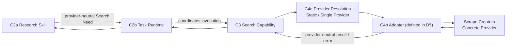
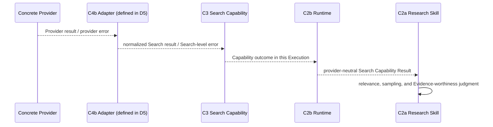

# D2 — 搜索调用主干规范（Search Invocation Spine Specification）

- **文档类型（Document Type）**：Detailed Contract Engineering Specification
- **设计阶段（Design Stage）**：D2 — Search Invocation Spine
- **垂直切片（Vertical Slice）**：First Research Execution
- **业务场景（Business Scenario）**：US / Car Vacuum / TikTok Content Research
- **覆盖 Contract（Covered Contracts）**：C3 + C4a
- **架构状态（Architecture Status）**：System Architecture V0.2 remains Candidate / Human-reviewed working architecture
- **D2 审核状态（Review Status）**：Detailed Semantics Reviewed
- **D2 联合一致性审核（Joint Consistency Review）**：PASS_WITH_REFINEMENTS
- **架构重开（Architecture Reopen）**：NO
- **需要新增 Contract（New Contract Required）**：NO
- **软件架构（Software Architecture）**：NOT YET DESIGNED

本规范定义 provider-neutral Search invocation boundary 以及当前 static
Provider Resolution seam。它是 Engineering Specification，不是 Architecture
Review transcript、adapter design、endpoint selection 或 software design。

## 1. 目的（Purpose）

D2 回答：

> Research Skill 表达需要 Search 后，系统如何调用稳定的 provider-neutral
> Search capability，并将其解析到 First Slice 当前有效的 Provider？

The governing distinction is:

```text
C3  = What stable system ability is being invoked?
C4a = Who is currently bound to provide that ability?
C4b = How stable Search semantics map to concrete Provider reality
      (defined in D5; D2 only owns the seam)
```

## 2. 覆盖的 Contract（Covered Contracts）

| Contract | 边界 / 责任（Boundary / responsibility） | D2 作用（D2 role） |
|---|---|---|
| C3 | Search Capability Contract | Owns provider-neutral Search identity, invocation, input, output, error, context, governance, and version semantics. |
| C4a | Provider Resolution Boundary | Owns the current Provider binding, resolved Provider identity, and minimal eligibility seam for a legal Search invocation. |

文档分组不会合并这些 Contract。C3 与 C4a 仍然是两个独立的
Contract / Boundary identity。

## 3. 范围与非范围（Scope and Non-Scope）

### 范围内（In scope）

- provider-neutral Search capability semantics;
- Search input, output, context, missingness, and error boundaries;
- retrieval-set, continuation, and known-completeness semantics;
- capability and Provider referenceability obligations;
- current static, single-Provider resolution;
- the C3 ↔ C4a ↔ C4b Adapter (defined in D5) seams;
- explicit distinctions between resolution, invocation, empty, and missing outcomes.

### D2 范围外（Out of scope for D2）

- Research Method, relevance, sampling, Evidence Interpretation, Finding, or Hypothesis;
- C4b request/response/error translation or provider-specific quirks;
- Scrape Creators endpoint selection or endpoint parameter mapping;
- provider cursor or pagination-token representation;
- multi-provider routing, fallback, ranking, health, cost, or dynamic discovery;
- Evidence / Research Result semantics (C5a/C5b);
- Execution Record retention or schema (C6);
- transport, persistence, database, or Software Architecture.

## 4. D2 概念运行流程（Conceptual Runtime Flow）

The D2 invocation spine is:



The C4b Adapter is defined in D5; D2 only owns the seam and does not design
C4b here.

The return distinction is:



The flow does not mean that the Skill calls Scrape Creators. Provider-specific
errors and payloads must not bypass the C3/C4b boundary into C2a.

## 5. 责任 / 归属矩阵（Responsibility / Ownership Matrix）

| 语义关注点（Semantic concern） | 主要责任方（Primary owner） | 边界 / 消费方义务（Boundary / consumer obligation） |
|---|---|---|
| Business Search Why | C2a Research Skill | C3 不解释研究原因。 |
| Search Capability Need | C2a expresses | C2b 接收并协调调用。 |
| Capability Invocation Coordination | C2b Task Runtime | 将调用纳入当前 Execution。 |
| Capability Identity | C3 | 必须可识别并可引用版本。 |
| Search Input Boundary | C3 | 定义语义类别，而非具体字段。 |
| Search Output Boundary | C3 | 返回 provider-neutral result-set semantics。 |
| Search Error Boundary | C3 | 区分 rejection、resolution、invocation、empty 与 missing outcome。 |
| Search Context Boundary | C3 | 收窄后只接收能力所需 Context。 |
| Governance Hook | C3 | 保留 Hook；当前 Slice 不要求主动 Runtime Governance。 |
| Search Version Referenceability | C3 | 参与的 capability version 必须可引用。 |
| Current Provider Binding | C4a | 当前 First Slice binding 是 Search → Scrape Creators。 |
| Resolved Provider Identity | C4a | 实际使用的 Provider 可作为 execution fact 暴露。 |
| Provider Eligibility | C4a | 只做最小合法 binding 检查。 |
| Endpoint Mapping | C4b Adapter（D5 定义） | 不由 C3 或 C4a 拥有。 |
| Provider Parameter Translation | C4b Adapter（D5 定义） | 不由 C3 或 C4a 拥有。 |
| Pagination Translation | C4b Adapter（D5 定义） | 不由 C3 或 C4a 拥有。 |
| Missingness Normalization | C4b Adapter（D5 定义）→ C3 | C3 接收稳定缺失语义，不发明 Provider quirks。 |
| Research Sampling | C2a Research Skill | Search retrieval bound 不是 Research Sample Boundary。 |
| Evidence Interpretation | C2a / C5a（D3 定义）边界 | D2 不定义 Evidence semantics。 |

## 6. C3 — 搜索能力 Contract（Search Capability Contract）

### 6.1 能力定义（Capability definition）

C3 将 Search 定义为 provider-neutral、独立的 System Ability：

```text
Search Capability
    != Research Method
    != Scrape Creators
    != Provider API
```

C3 回答“调用的稳定系统能力是什么”，但不决定某次 Search 为什么有价值、
哪些观察应进入 research sample，也不决定结果对 Commerce Content 的含义。

### 6.2 必须覆盖的关注点（Required concerns）

C3 覆盖以下语义关注点：

```text
Capability Identity
Invocation Surface
Input Boundary
Output Boundary
Error Boundary
Context Boundary
Governance Hook
Provider Resolution Boundary seam
Version Referenceability
```

No concrete field list is frozen by D2.

### 6.3 调用表面（Invocation surface）

调用表面表示当前 Execution 中一次逻辑上的 Search invocation，必须能够区分：

```text
the capability being invoked
the Search request semantics
the returned Search Capability Result
the invocation outcome
```

未来可以用 method call、typed request、yielded command 或其他 software form
表示。D2 不创建独立的 Capability Need、Action、Command、Step 或 Tool Contract。

The following remain distinct:

```text
Search Need
    != Actual Capability Invocation Fact
```

The Skill may declare a Search dependency without every Execution necessarily
having the same invocation fact.

### 6.4 输入边界（Input boundary）

最小 Search 输入语义是类别，而不是字段。

#### Search Target / Criteria — 必须项（required）

定义 Search invocation 要寻找的对象。

#### Search Scope / 能力所需 Context — 必须项（required）

包含执行 Search 所需的 Context。对于本 Slice，可能包括：

```text
Platform = TikTok
Market / Region = US, when search-relevant
```

#### Search Constraints — 适用时必须（required when applicable）

May express:

```text
Temporal Boundary
Content-type Boundary
Retrieval Bound
Ordering / Filtering Requirement
```

D2 不冻结 `days`、`limit`、`sort`、`query`、`region_code` 或 Provider filter
names。

#### Continuation Semantics — 适用时必须（required when applicable）

只能表达同一个逻辑 Search 正在继续，或 continuation 是否可用 / 被请求。
不得暴露 Scrape Creators cursor 或 pagination token。

### 6.5 渐进式 Context 收窄（Progressive Context Narrowing）

Context 通过逐步收窄的边界流动：

```text
Full Research Context
        ↓ Skill interprets
Search-required Context
        ↓
C3 Search Capability
```

ProductBrief、Research Intent 和 Commerce Content Goal 不会自动完整传入 C3。
C3 在与执行相关时可能需要 TikTok 和 US / region，但 C3 不理解为什么某个
TikTok Hook 值得研究，也不理解 US 用户为什么会信任某种内容形式。

```text
Context propagation != GlobalContext
```

### 6.6 获取与采样边界（Retrieval and sampling boundary）

Search retrieval 与 Research sampling 是不同语义：

```text
Research Sample Size
    != Search Retrieval Bound

Search Retrieval Semantics
    != Research Sample Boundary
```

The correct relationship is:

```text
Search Request
    ↓
Actual returned-set / retrieval semantics
    ↓
Research Skill applies relevance / sampling
    ↓
Actual Research Sample Boundary
```

The actual returned-set boundary is a C3 Output Boundary concern. D2 does not
create `RetrievalBoundaryContract` or `SampleBoundaryContract`.

### 6.7 输出边界（Output boundary）

The minimum C3 output semantics are:

```text
Provider-neutral Search Result Set
Result Item Identity / Source Referenceability
Search Capability Result Referenceability
Actual returned-set semantics
Continuation availability / state
Known completeness semantics
Missingness and necessary collection context
```

C3 output is not:

```text
Finding
Hypothesis
Evidence-worthiness decision
Sampling decision
Research Result
```

The following distinction is mandatory:

```text
Search Capability Result
    != Evidence

Search Result Set
    != Final Research Sample
```

### 6.8 引用可定位性边界（Referenceability boundary）

Search Capability Result 以及后续研究所需的 Result Item 必须具备
referenceability。Referenceability 允许后续边界识别返回了什么、使用了什么，
但不决定 retention 或 persistence。

```text
Referenceability != Retention Policy
Referenceability != Persistence Design
```

Record / Reference Retention Semantics
    = REQUIRED / PARTIALLY REFINED

If a Search Capability Result Reference or Result Item Reference becomes a
system-controlled internal reference necessary for provenance or finalized
Execution explanation, it inherits the D4 / C6 post-terminal resolvability
obligation:

```text
Post-terminal Resolvability
    = REQUIRED for necessary internal references
```

C3 不拥有 retention duration，也不设计 persistence。Exact retention
lifecycle / duration 仍为 **NOT YET DESIGNED**；persistence mechanism 不由
C3 拥有，在架构层仍为 **NOT YET PROVEN**。

```text
Referenceability != Retention Policy
Post-terminal Resolvability != Persistence Design
```

D2 therefore does not define retention days, a database, repository, storage
service, or payload persistence.

### 6.9 缺失语义与结果完整性（Missingness and result completeness）

Provider-specific missingness follows this direction:

```text
Provider-specific Missingness
        ↓ C4b Adapter (defined in D5) normalization
C3 provider-neutral result semantics
        ↓ later boundary preserves missingness
Evidence / Research semantics
        ↓
Research Skill interprets impact
```

已知缺失不得被静默转换为零：

```text
Missing != 0
```

已知缺失也不自动意味着 Search Failure。

### 6.10 治理与版本义务（Governance and version obligations）

C3 preserves a Governance Hook. It must remain possible for a later governance
mechanism to inspect or constrain Search invocation without making Governance a
new D2 Contract.

For the current slice:

```text
Runtime Governance = NOT ACTIVELY REQUIRED
Governance Hook    = PRESERVED ONLY
```

D2 does not introduce Cost Gate, Permission Gate, Approval Gate, Risk Gate,
Credit Budget, `max_cost`, or `approval_id` semantics.

C3 must be identifiable and version-referenceable. D2 does not choose a version
string format, semantic-version policy, package version, or Git hash.

## 7. C4a — 提供者解析边界（Provider Resolution Boundary）

### 7.1 边界定义（Boundary definition）

C4a defines how an already identified and valid Capability invocation obtains a
currently legal Provider binding.

For the First Slice:

```text
Search
    ↓
Scrape Creators
```

The current resolution shape is:

```text
STATIC / SINGLE-PROVIDER RESOLUTION
```

C4a answers who is currently bound to provide Search. It does not translate a
Search request to Provider syntax.

### 7.2 必须覆盖的关注点（Required concerns）

C4a covers:

```text
Capability Identity Awareness
Current Provider Binding
Resolved Provider Identity
Minimal Eligibility / Compatibility Boundary
```

Capability and Provider identities cannot be merged:

```text
Search          = Capability Identity
Scrape Creators = Concrete Provider Identity
```

C3 must not become a Scrape Creators-backed Search Contract.

### 7.3 Binding 与已解析 Provider 事实（Binding and resolved-provider facts）

These semantics remain distinct:

```text
Current Provider Binding
    != Actually Resolved Provider Fact
```

The First Slice commonly has both pointing to Scrape Creators. A configured
current binding is nevertheless different from the Provider actually used for
one invocation. The actual resolved / used Provider may later be referenced by
the Execution Record.

### 7.4 最小资格检查（Minimal eligibility）

C4a may determine only whether the current binding is considered legally able
to support the Search Capability invocation.

```text
Provider Eligibility
    != Endpoint Eligibility
    != Endpoint Selection
```

C4a does not decide whether Scrape Creators endpoint X satisfies Search. Minimum
Scrape Creators Endpoint Selection is **NOT YET DESIGNED** and depends on:

```text
Detailed Search Contract
        ↓
Provider Facts
        ↓
Minimum Endpoint Subset Selection
```

The Provider API inventory must not define the OS Contract in reverse.

### 7.5 解析输出（Resolution output）

The minimum C4a output is one of:

```text
Resolved Provider Identity / Binding
        or
Provider Resolution Failure Semantics
```

C4a does not output:

```text
endpoint
API key
cursor
Provider params
raw Provider client
request syntax
```

### 7.6 解析失败（Resolution failure）

C4a owns the boundary semantics for a failure in which no legal Provider
binding has been formed:

```text
Provider Resolution Failure
    != Provider Invocation Failure
```

Provider Invocation Failure occurs after a Provider has been resolved and the
call fails. C4b / Provider runtime participates in translating that concrete
failure to C3 Search-level semantics. C4a does not absorb Provider invocation
details.

### 7.7 C4a 不是 Router Service

The existence of C4a does not imply a `ProviderRouterService`,
`ProviderRegistryService`, `ProviderSelector`, or scoring engine. Current
implementation depth is static and single-provider.

## 8. C3 / C4a / C4b 跨 Contract 接缝（Cross-contract Seams）

### 8.1 C3 ↔ C4a

C3 provides the stable Search Capability identity and invocation semantics. C4a
uses that Capability identity to determine the current legal Provider binding.
C4a returns binding / resolution outcome to the invocation path; it does not
modify the provider-neutral Search request into endpoint syntax.

### 8.2 C4a ↔ C4b Adapter（在 D5 定义）

| C4a owns | C4b Adapter (defined in D5) owns |
|---|---|
| Who provides Search? | Request Translation |
| Current Provider Binding | Response Translation |
| Resolved Provider Identity | Error Translation |
| Minimal eligibility seam | Missingness Normalization |
|  | Pagination Translation |
|  | Region / Filter Translation |
|  | Provider ID Translation |
|  | Provider-specific Quirk Absorption |
|  | Raw Provider Result Referenceability |
|  | Version / Compatibility Awareness |

C4a does not own endpoint mapping, parameter mapping, pagination translation, or
Provider quirks. This table is a responsibility seam, not a C4b design.

### 8.3 C3 ↔ D3 Evidence 接缝

The later research semantics remain separate:

```text
Raw Provider Result
    != Search Capability Result
    != Evidence
    != Finding
    != Hypothesis
```

D2 returns provider-neutral Search result semantics. The Research Skill applies
relevance, sampling, and Evidence-worthiness judgment; C5a later defines
Evidence semantics. D2 does not create C5a or C5b structures.

## 9. Search Result / Evidence 边界

The complete research path is:

```text
Provider / C4b Adapter (defined in D5)
        ↓
Provider-neutral Search Capability Result
        ↓
Research Skill relevance / sampling
        ↓
Actual Sample Boundary
        ↓
Evidence formalization constraints in later C5a
```

Search Result does not automatically become Evidence. A valid Search may return
items that are not relevant, not sampled, or not evidence-worthy. Conversely,
Research Result, Finding, and Hypothesis are outside C3.

## 10. 失败与缺失语义（Failure and Missingness Semantics）

### 10.1 C3 逻辑结果区分（logical outcome distinctions）

C3 must distinguish at least:

```text
Invalid / unsupported Search invocation
Provider Resolution Failure
Normalized Provider Invocation Failure
Valid Empty Search Result
Known Missingness
```

These are not one global error taxonomy:

```text
Capability Rejection
    != Resolution Failure
    != Provider Invocation Failure
    != Valid Empty Result
    != Known Missingness
```

Unified Error Taxonomy is **NOT YET PROVEN**. D2 defines boundary distinctions,
not a global error-code family.

### 10.2 空结果与部分结果（Empty and partial results）

```text
Valid Search + empty Result Set
    != Search Failure
```

Partial or incomplete retrieval does not automatically mean Search Failure. If
the Search legally completes but known results are incomplete, the outcome
should express continuation availability, completeness, or limitation
semantics.

D2 does not introduce a `PARTIAL_SEARCH` Runtime enum.

### 10.3 Error 翻译方向（Error translation direction）

The required direction is:

```text
Concrete Provider Error
        ↓ C4b Adapter (defined in D5) translation
C3 Search-level error semantics
        ↓
C2b Task Runtime
        ↓
Execution continuation or terminalization
```

The raw Scrape Creators Error must not be sent directly to the Research Skill.

## 11. 治理 / 版本 / 引用可定位性义务（Governance / Version / Referenceability Obligations）

The D2 obligations are:

1. C3 has an identifiable, version-referenceable Capability identity.
2. Search Capability Results and needed Result Items are referenceable.
3. Referenceability does not decide retention, persistence, or storage.
4. C3 preserves a Governance Hook without activating a Governance Policy.
5. C4a exposes current and actually resolved Provider identity as distinct semantics.
6. C4a eligibility does not become endpoint selection.
7. Provider-specific references are normalized at the C4b Adapter (defined in D5) seam before being consumed as C3 semantics.

## 12. 跨 Contract 不变量（Cross-contract Invariants）

1. Search Capability is not the Concrete Provider.
2. Search Need is not the Actual Capability Invocation Fact.
3. C3 owns stable Search semantics, not Research business meaning.
4. C4a owns Provider binding, not Provider-specific translation.
5. Raw Provider Result is not Search Capability Result, and Search Capability Result is not Evidence.
6. Search Retrieval Semantics are not the Research Sample Boundary.
7. Empty Result is not Search Failure.
8. Missing is not zero.
9. Provider Resolution Failure is not Provider Invocation Failure.
10. Current Provider Binding is not the Actually Resolved Provider Fact.
11. Referenceability is not Retention or Persistence.
12. Governance Hook is not an Active Governance Policy.
13. Provider eligibility is not Endpoint Selection.
14. No standalone Capability Need / Action / Command Contract is introduced.
15. The current First Slice binding is static and single-provider; it does not establish a permanent multi-provider policy.

## 13. 明确排除项与设计成熟度（Explicit Exclusions and Design Maturity）

These statuses are intentionally distinct. They do not all mean permanent
prohibition.

### NOT YET DESIGNED

```text
Exact Search request fields
Exact Search result fields
Continuation token representation
Capability version representation
Exact retention lifecycle / duration
Reference lifecycle representation
Minimum Scrape Creators Endpoint Selection
```

### DEFERRED

```text
Multi-provider Routing
Fallback
Health-aware Routing
Cost-aware Routing
Provider Ranking
Advanced dynamic Provider Resolution
```

### NOT YET PROVEN

```text
Unified Error Taxonomy
Dedicated Persistence Subsystem
Specific Database Technology
```

### EXPLICITLY REJECTED FOR CURRENT SLICE

```text
97 API Full Integration as an OS backlog / module plan
Event / Message Architecture as a required execution mechanism
```

### 由后续 Contract 负责（OWNED BY LATER CONTRACTS）

```text
C4b Provider mapping
C5a Evidence semantics
C5b Research Result semantics
C6 Execution Record semantics
```

D2 also does not introduce a `GlobalErrorContract`, `UniversalError`,
`ProviderRouterService`, `ProviderSelector`, `RetrievalBoundaryContract`, or
`SampleBoundaryContract`.

## 14. 尚未冻结的表示层问题（Open Representation Questions）

The following remain open and do not block D2 semantic completion:

1. Search Invocation software representation.
2. Search Target / Criteria representation.
3. Search Scope representation.
4. Retrieval constraint representation.
5. Continuation representation.
6. Search Result Item identity representation.
7. Search Result reference representation.
8. Capability version representation.
9. Current Provider Binding representation.
10. Resolved Provider Identity representation.
11. Provider eligibility representation.
12. Search-level failure software representation.

## 15. 审核结论（Review Result）

```text
C3 — Search Capability Contract
= PASS_WITH_REFINEMENTS

C4a — Provider Resolution Boundary
= PASS_WITH_REFINEMENTS

D2 Joint Consistency Review
= PASS_WITH_REFINEMENTS

Architecture Reopen
= NO

New Contract Required
= NO

D2 Detailed Semantics
= REVIEWED

D2 Specification
= CREATED
```

The six D2 refinements are absorbed as explicit semantics:

```text
retrieval boundary wording
referenceability != retention
governance hook only
error boundary != global taxonomy
static binding != router service
eligibility != endpoint selection
```

## 16. 下一设计阶段（Next Design Stage）

```text
D3 — Research Semantics

C5a — Evidence Contract
+
C5b — Research Result Contract
```

This specification does not create `03_RESEARCH_SEMANTICS.md`.
