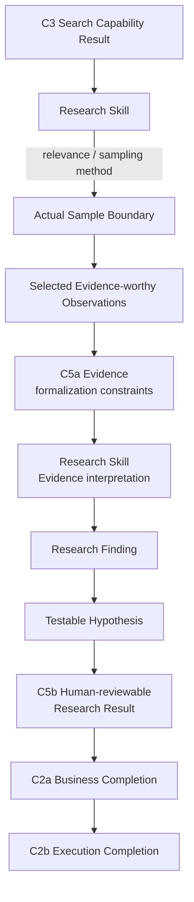
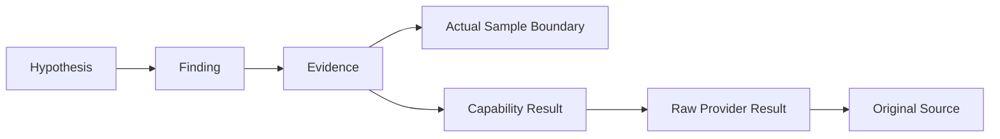

# D3 — Research Semantics Specification

- **Document Type**: Detailed Contract Engineering Specification
- **Design Stage**: D3 — Research Semantics
- **Vertical Slice**: First Research Execution
- **Business Scenario**: US / Car Vacuum / TikTok Content Research
- **Covered Contracts**: C5a + C5b
- **Architecture Status**: System Architecture V0.2 remains Candidate / Human-reviewed working architecture
- **D3 Review Status**: Detailed Semantics Reviewed
- **D3 Joint Consistency Review**: PASS_WITH_REFINEMENTS
- **Architecture Reopen**: NO
- **New Contract Required**: NO
- **Software Architecture**: NOT YET DESIGNED

This specification defines the evidence and research-result semantics for the
First Research Slice. It is an Engineering Specification, not an Architecture
Review transcript, Research Method handbook, data-science textbook, database
schema, or Evidence / Research Service design.

## 1. Purpose

D3 answers:

```text
When does a Search Capability Result qualify as Evidence?
What research boundary and provenance must Evidence preserve?
How does the Research Skill form Findings and Testable Hypotheses?
What Human-reviewable Research Result is sufficient for Business Completion?
```

The semantic layers are deliberately distinct:

```text
Raw Provider Result
    != Search Capability Result
    != Evidence
    != Finding
    != Testable Hypothesis
```

## 2. Covered Contracts

| Contract | Boundary / responsibility | D3 role |
|---|---|---|
| C5a | Evidence Contract | Owns the stable semantics that a selected observation must preserve to become referenceable Evidence. |
| C5b | Research Result Contract | Owns the Human-reviewable Research Result boundary, including findings, hypotheses, answerability, limitations, traceability, and result referenceability. |

Documentation grouping does not merge these Contracts. C5a and C5b remain two
independent Contract identities.

## 3. D3 Core Semantic Layers

| Layer | Meaning | Primary responsibility |
|---|---|---|
| Raw Provider Result | Provider runtime reality | Future C4b / concrete Provider boundary |
| Search Capability Result | Provider-neutral output of C3 | C3, consumed by the Research Skill |
| Evidence | Selected, source- and context-grounded research fact | C5a formalization semantics |
| Finding | Research interpretation of Evidence within a bounded sample | Research Skill |
| Testable Hypothesis | Finding-based proposition awaiting future validation | Research Skill, exposed by C5b |

These are not one data object with different names. Each layer changes the
semantic responsibility and traceability requirements.

## 4. Scope and Non-Scope

### In scope

- Evidence identity, referenceability, observation, source, time, and missingness;
- Actual Sample Boundary reference semantics;
- distinction between observed fact and research interpretation;
- distinction between Public Content Evidence and Public Performance Evidence;
- Finding and Testable Hypothesis outcome semantics;
- Answerability, Limitations, and insufficient-evidence semantics;
- claim-level and execution-level traceability;
- Business Completion seam between C5b, C2a, and C2b.

### Out of scope for D3

- Search invocation or Provider Resolution (C3/C4a);
- Scrape Creators request/response translation or endpoint selection (C4b);
- Task lifecycle, Runtime state, or Execution terminalization (C2b);
- Execution Record semantics (C6);
- Evidence Service, Research Service, repository, database, or persistence;
- complete Evidence taxonomy, ontology, confidence model, or sampling algorithm;
- final business decision, Creative Direction, Script, Artifact, or Experiment execution;
- Python models, JSON schemas, API schemas, or Software Architecture.

## 5. D3 Conceptual Research Flow

The normal research path is:



The valid insufficient-evidence branch is also part of the contract:

```text
Evidence
    ↓
Research Skill
    ↓
Current evidence is insufficient
    ↓
C5b Research Result
    + Answerability
    + Limitations
    + Traceability
    ↓
C2a Business Completion
    ↓
Successful Execution
```

## 6. Responsibility / Ownership Matrix

| Semantic concern | Primary owner | Boundary / consumer obligation |
|---|---|---|
| Search Capability Result | Upstream C3 | Supplies provider-neutral result semantics. |
| Sampling Method | Research Skill | Decides how relevance and sampling are applied. |
| Actual Sample Boundary determination | Research Skill | Determines the boundary for the current research work. |
| Actual Sample Boundary after determination | Stable Research Execution Fact | C5a and C5b reference it; neither owns it as a separate Contract. |
| Evidence formalization semantics | C5a | Defines what a selected observation must preserve as Evidence. |
| Observed Fact | C5a preserves | Must remain distinguishable from interpretation. |
| Evidence-worthiness decision | Research Skill | Decides why an observation is worth selecting. |
| Source / Provider / Capability references | C5a | Preserves distinct traceability references. |
| Missingness preservation | C5a | Preserves known missingness; does not infer zero or meaning. |
| Evidence interpretation | Research Skill | Interprets Evidence within Research Boundary and Sample Boundary. |
| Finding formation | Research Skill | Forms an evidence-backed, sample-bounded interpretation. |
| Hypothesis formation | Research Skill | Forms a proposition for future Experiment & Validation. |
| Research Result boundary | C5b | Defines the Human-reviewable business output. |
| Answerability | C5b | States what the current Evidence can answer. |
| Limitations | C5b | States why the answer is bounded. |
| Evidence / claim traceability | C5a + C5b seam | Finding / Hypothesis can point to supporting Evidence. |
| Business Completion | C2a using C5b-valid result | Skill declares completion after a valid Research Result exists. |
| Execution Completion | C2b | Runtime recognizes completion and terminalizes the Execution. |
| Execution Record | Future C6 | D3 supplies references but does not design C6. |

## 7. C5a — Evidence Contract

### 7.1 Evidence definition

Evidence is a research fact that, under an explicit Research Question and
Actual Sample Boundary, was selected by the Research Method and preserved with
the semantics needed for traceable review:

```text
Observed Fact
Source
Observation / Collection Context
Time Semantics
Missingness
Provenance
```

Evidence is not defined as:

```text
high-play video
LLM opinion
Research Finding
```

### 7.2 Required C5a concerns

C5a covers:

```text
Evidence Identity / Referenceability
Observation Boundary
Original Source Reference
Provider Reference
Raw / Capability Result Referenceability
Actual Sample Boundary Reference
Observation / Collection Context
Time Semantics
Missingness Semantics
Finding Referenceability seam
Traceability / Provenance
```

These are stable semantic concerns, not a requirement for one software field
or one independently persisted object per line.

### 7.3 Evidence-worthiness ownership

The Research Skill decides:

```text
why an observation is worth studying
why it enters the current Sample
how relevance / sampling method is applied
```

C5a defines what must be preserved after an observation has been selected:

```text
Skill = decides WHY
C5a   = defines WHAT must be preserved
```

C5a does not decide research relevance, sampling quality, or business meaning.

### 7.4 Observation versus interpretation

The following distinction is mandatory:

```text
Observed Fact
    != Research Interpretation
```

Examples of Observed Fact include:

```text
public views = an observed value
the first two seconds show an observable content structure
the public post contains a particular visible claim or presentation
```

A statement such as “this pattern may matter for the current research question”
is Research Interpretation. Evidence formalization must preserve the Observed
Fact without silently converting interpretation into observation.

Observation Boundary is a C5a concern. D3 does not create:

```text
Observation Contract
Observation Service
Observation Repository
```

### 7.5 Actual Sample Boundary semantics

Ownership is precise:

```text
Sample Selection Method
    → Research Skill owns

Actual Sample Boundary, once determined
    → stable Research Execution Fact

C5a Evidence
    → references Actual Sample Boundary

C5b Research Result
    → references / exposes Actual Sample Boundary
```

C5a and C5b do not own the Sample Boundary, and D3 does not create a
`SampleBoundaryContract`.

At semantic level, the boundary must make it possible to explain:

```text
what research scope was considered
what retrieval / selection scope was actually used
how many samples were actually included
what selection logic or limitation applies
```

D3 does not freeze field names, sample-size rules, or a sampling algorithm.

### 7.6 Public Content versus Public Performance

Evidence nature must remain distinguishable:

```text
Public Content Evidence
    != Public Performance Evidence
```

Public Content Observation may concern:

```text
visuals
copy
content structure
presentation method
how the product appears
```

Public Performance Observation may concern:

```text
public views
likes
comments count
other public performance signals
```

Public Performance Signal is not causal business truth:

```text
Public Performance Signal
    != Causal Business Truth
```

If high-performing sample videos often contain a Hook, that can be an observed
association or Finding. It does not by itself prove the Hook caused views,
CTR, CVR, or GMV. D3 does not create a complete evidence taxonomy, dozens of
`evidence_type` enum values, or an Evidence Ontology.

### 7.7 Source, Provider, and Capability references

The following references answer different questions:

| Reference | Meaning |
|---|---|
| Original Source Reference | What object in the original public world was observed? |
| Provider Reference | Through which Provider did the system observe or retrieve it? |
| Capability Result Reference | In which provider-neutral Search Capability Result did it enter this Execution? |

```text
Original Source Reference
    != Provider Reference
    != Capability Result Reference
```

These are traceability semantics, not database foreign-key design.

### 7.8 Evidence identity and referenceability

Evidence must be referenceable so that Findings, Hypotheses, Research Results,
and later Execution facts can identify the supporting research fact.

```text
Referenceability != Retention Policy
Referenceability != Repository
Referenceability != Database
```

Record / Reference Retention Semantics remain **NOT YET DESIGNED**. D3 does not
create `EvidenceRepository`, `EvidenceService`, an Evidence table, or a vector
database.

### 7.9 Time semantics

C5a must preserve Observation Time Semantics because these can differ:

```text
published time
observed state time
collection time
provider update time
```

D3 does not freeze `published_at`, `observed_at`, `collected_at`,
`updated_at`, or `provider_updated_at`. The semantic obligation is:

```text
Observation Time Semantics = REQUIRED
Exact field model = NOT YET DESIGNED
```

### 7.10 Missingness semantics

Missingness follows the established direction:

```text
Provider-specific Missingness
        ↓ future C4b normalization
C3 provider-neutral Search Result
        ↓
C5a preserves known missingness
        ↓
Research Skill interprets impact
        ↓
C5b Answerability / Limitations
```

The invariant is:

```text
Missing != 0
```

C5a must not automatically complete an unknown fact, interpret missing as zero,
or interpret missing as negative evidence. Known missingness is itself a
research fact that may bound Answerability and Limitations.

### 7.11 Finding Referenceability seam

Finding Referenceability does not mean that Evidence owns Finding. It means
downstream Finding and Hypothesis semantics must be able to identify the
Evidence on which they depend:

```text
Finding / Hypothesis
    → Evidence References
```

Whether the relationship is bidirectional, or whether Evidence stores a
reverse Finding reference, remains **NOT YET DESIGNED**. D3 does not create a
Finding Contract.

### 7.12 C5a is not an Evidence Service

```text
Evidence Contract
    = REQUIRED

Full Evidence Foundation Service
    = NOT YET PROVEN
```

The Contract defines stable Evidence semantics only. It does not imply an
Evidence Service, repository, API, runtime, or database.

## 8. Actual Sample Boundary Semantics

The Search Retrieval Semantics from D2 and the Research Sample Boundary are
distinct:

```text
Search Retrieval Semantics
    != Research Sample Boundary
```

The Research Skill applies relevance and sampling to a provider-neutral Search
Result. Once determined, the Actual Sample Boundary is a stable fact of the
current Research Execution. C5a and C5b reference it so that a reviewer can
understand what the Evidence and Result actually cover.

The boundary is not an independently designed entity or Contract. It can be
referenced by existing Evidence and Research Result semantics without adding a
`SampleBoundaryContract`.

## 9. Evidence Provenance, Missingness, and Time

C5a provenance is the chain that makes a research fact reviewable:

```text
Evidence Identity
    ↓
Observed Fact + Observation Boundary
    ↓
Original Source Reference
    ↓
Provider / Capability Result References
    ↓
Actual Sample Boundary
    ↓
Observation / Collection Context
    ↓
Time Semantics + Missingness
```

The chain does not prescribe storage. It defines the stable semantics needed to
explain what was observed, where it came from, under what sample and time
conditions, and what was not known.

## 10. C5b — Research Result Contract

### 10.1 Result definition and boundary

C5b defines the First Slice Business End Boundary:

```text
Human-reviewable Research Result
```

C5b must cover:

```text
Research Scope / Boundary
Actual Sample Boundary reference
Evidence References
Research Findings outcome
Testable Hypotheses outcome
Answerability
Limitations
Traceability / Provenance
Business Completion Semantics
Result Referenceability
```

C5b references C5a Evidence semantics; it does not redefine or fully copy the
Evidence Contract payload.

### 10.2 Research Scope / Boundary

The Result must make clear the Research Boundary under which it applies. For
the First Slice this may include:

```text
US
TikTok
Car Vacuum
Commerce Content
Research Intent / Decision Need
```

C5b does not simply duplicate the complete C1 Business Work Request. It retains
the Research Boundary semantics necessary to understand Result applicability.

### 10.3 Evidence references

C5b must be able to cite the Evidence supporting the current Result:

```text
C5a owns Evidence semantics
C5b references Evidence
```

The Result must not copy the complete Evidence payload merely for convenience.
Inline versus reference representation remains **NOT YET DESIGNED**.

## 11. Finding and Hypothesis Semantics

### 11.1 Finding

A Finding is a Research Skill interpretation formed from Evidence within the
Research Boundary and Actual Sample Boundary.

A valid Finding is:

```text
Evidence-backed
Sample-bounded
Traceable
Epistemically limited
```

```text
Finding
    != Evidence
    != Creative Direction
    != Validated Business Truth
```

Finding formation belongs to the Research Skill. D3 does not create a Finding
Contract.

### 11.2 Causal discipline

Observed association does not equal causal conclusion:

```text
Observed association
    != Causal conclusion
```

For example, a content structure appearing frequently in a high-public-
performance sample may be a Finding. It does not automatically establish that
the structure caused high views, CTR, CVR, or GMV. Future Experiment &
Validation evidence is required for such claims.

### 11.3 Testable Hypothesis

A Testable Hypothesis is a proposition formed from a Finding that can be
validated or falsified by a later Experiment & Validation process.

```text
Hypothesis
    != Validated Business Truth
    != Final Test Priority Decision
    != Script
    != Creative Direction
```

Hypothesis formation belongs to the Research Skill. An Independent Hypothesis
Contract is **DO NOT ADD YET**.

### 11.4 Outcome semantics and non-empty guardrail

C5b must contain semantic Finding and Hypothesis outcomes. This does not mean:

```text
findings.length >= 1
hypotheses.length >= 1
```

Insufficient Evidence may yield a valid Research Result without a positive
Finding or actionable Hypothesis. The system must not fabricate claims merely
to satisfy a non-empty schema.

```text
Semantic outcome required
    != Forced non-empty claim required

Result completeness
    != Forced positive conclusion
```

## 12. Answerability and Limitations

### 12.1 Answerability

Answerability states what the current Evidence permits the Research Question
to answer and to what degree. For example, it may support that a pattern
repeatedly appears in the current sample while not supporting that the pattern
causes purchase growth.

D3 does not freeze `High / Medium / Low`, a confidence score, a 0–1 score, or
another taxonomy. An Answerability Contract is **DO NOT ADD**.

### 12.2 Limitations

Limitations state why the Result is bounded. Examples include:

```text
public signals only
no CTR / CVR
no GMV attribution
limited time window
Provider retrieval boundary
known missing fields
Comments not mandatory in the current slice
```

The distinction is:

```text
Answerability = what can currently be answered
Limitations   = why the answer is bounded
```

An independent Limitation Contract is **DO NOT ADD**.

## 13. Insufficient Evidence and Result Validity

Insufficient Evidence is a valid research outcome when the Research Method has
completed the available evidence work and the Result accurately states the
limit of what can be concluded.

```text
Search succeeds
        ↓
Actual Sample Boundary formed
        ↓
Evidence formed
        ↓
Research Skill completes method
        ↓
Evidence cannot support a strong conclusion
        ↓
C5b Research Result:
    Current evidence is insufficient
    + Answerability
    + Limitations
    + Traceability
        ↓
C2a Business Completion
        ↓
Successful Execution
```

The mandatory distinction is:

```text
Execution Failure
    != Insufficient Evidence
    != Hypothesis Rejected Later
```

The current Runtime must not create `FAILED_INSUFFICIENT_EVIDENCE`.

## 14. Traceability and Result Referenceability

### 14.1 Claim-level traceability

C5b must support a traceability path such as:



The exact direction and software representation of every link remain open.
What is stable is the obligation that a Finding / Hypothesis can identify the
Evidence on which it depends, and that Evidence can be traced to its sample,
Capability result, Provider reality, and original source.

### 14.2 Execution-level traceability

At the execution level:

```text
Research Result
    ↓
Execution Record (future C6)
    ↓
Skill / Capability / Provider / Version References
```

D3 does not design C6 or an Execution Record schema. It only preserves the
cross-contract reference obligations.

### 14.3 Result referenceability

Research Result must be referenceable because C1 exposes the Business Result
and future C6 may reference the final Business Output.

```text
Result Referenceability
    != Result Persistence
    != Retention Policy
```

`result_id`, URI, database key, storage location, and retention behavior are
**NOT YET DESIGNED**.

Traceability is carried by existing Contract references. D3 does not create a
`TraceabilityContract` or `TraceabilityService`.

## 15. Business Completion Seam

C5b defines what constitutes a valid Research Result. C2a Research Skill uses
that valid Result to declare Business Completion. C2b recognizes Business
Completion and owns Execution Completion:

```text
C5b-valid Research Result
        ↓
C2a Research Skill declares Business Completion
        ↓
C2b Runtime recognizes completion
        ↓
Execution terminalization
```

```text
Business Completion
    precedes
Execution Completion
```

C5b does not own Runtime State, Execution terminalization, or Execution Outcome.

## 16. Research Result Product Boundary

The First Slice ends at a Human-reviewable Research Result. It does not make
the final downstream business decision:

```text
Research Result
    != Final Business Decision

Finding
    != Creative Direction

Hypothesis
    != Script
    != Validated Business Truth

Research Result
    != Artifact
```

The possible downstream path is outside D3:

```text
Operator Decision
    ↓
Creative Production
    ↓
Experiment & Validation
```

## 17. Cross-contract Invariants

1. Raw Provider Result ≠ Search Capability Result ≠ Evidence ≠ Finding ≠ Hypothesis.
2. Search Result is not Evidence.
3. Observed Fact is not Research Interpretation.
4. Sample Selection Method is not the Actual Sample Boundary.
5. The Actual Sample Boundary is a stable Research Execution Fact, not a C5a/C5b-owned entity.
6. Public Content Evidence is not Public Performance Evidence.
7. Public Performance Signal is not Causal Business Truth.
8. Missing is not zero.
9. Finding is not Creative Direction.
10. Hypothesis is not Validated Business Truth.
11. Hypothesis is not Script.
12. Research Result is not Final Business Decision.
13. Research Result is not Artifact.
14. Insufficient Evidence is not Execution Failure.
15. Required Finding / Hypothesis semantics do not require forced non-empty claims.
16. Referenceability is not Retention or Persistence.
17. Traceability is not a Traceability Service.
18. Evidence Contract is not an Evidence Service.
19. Business Completion precedes Execution Completion.
20. D3 does not add a standalone Sample Boundary, Finding, Hypothesis, Answerability, Limitation, or Traceability Contract.

## 18. Explicit Exclusions and Design Maturity

These statuses are intentionally distinct. They do not all mean permanent
prohibition.

### DO NOT ADD / DO NOT ADD YET

```text
Observation Contract
Standalone Sample Boundary Contract
Finding Contract
Hypothesis Contract
Answerability Contract
Limitation Contract
Traceability Contract
```

### NOT YET PROVEN

```text
Full Evidence Foundation Service
Independent Analyze Capability
Independent Research Service
Dedicated Persistence Subsystem
Specific Database Technology
```

### NOT YET DESIGNED

```text
Evidence software model
Research Result software model
Evidence / Result reference representation
Record / Reference retention semantics
Exact time field model
Exact Answerability representation
Finding / Hypothesis relationship representation
Inline vs referenced Evidence representation in Research Result
```

### NOT REQUIRED FOR FIRST SLICE

```text
Knowledge integration
Artifact Foundation Service
```

### EXPLICITLY REJECTED FOR CURRENT SLICE

```text
Automatic Research Result → Knowledge Update
```

D3 also does not create:

```text
EvidenceService
EvidenceRepository
ResearchService
Evidence Database
Vector Database
Evidence Ontology
```

## 19. Open Representation Questions

The following remain open and do not block D3 semantic completion:

1. Evidence Identity representation.
2. Original Source Reference representation.
3. Provider / Capability Result reference representation.
4. Actual Sample Boundary representation.
5. Observation representation.
6. Time semantics field model.
7. Missingness representation.
8. Evidence collection / grouping representation.
9. Finding representation.
10. Hypothesis representation.
11. Finding → Evidence reference representation.
12. Hypothesis → Finding / Evidence reference representation.
13. Research Result identity / reference representation.
14. Answerability representation.
15. Limitations representation.
16. Inline versus referenced Evidence in Research Result.

## 20. Review Result

```text
C5a — Evidence Contract
= PASS_WITH_REFINEMENTS

C5b — Research Result Contract
= PASS_WITH_REFINEMENTS

D3 Joint Consistency Review
= PASS_WITH_REFINEMENTS

Architecture Reopen
= NO

New Contract Required
= NO

D3 Detailed Semantics
= REVIEWED

D3 Specification
= CREATED
```

The seven D3 refinements are absorbed as explicit semantics:

```text
R1 — Sample Boundary ownership
R2 — Observation wording
R3 — Evidence nature
R4 — Finding / Hypothesis outcome
R5 — Answerability vs Limitations
R6 — Claim traceability
R7 — Referenceability vs Persistence
```

## 21. Next Design Stage

```text
D4 — Execution Record

C6 — Execution Record Contract
```

This specification does not create `04_EXECUTION_RECORD.md`.
