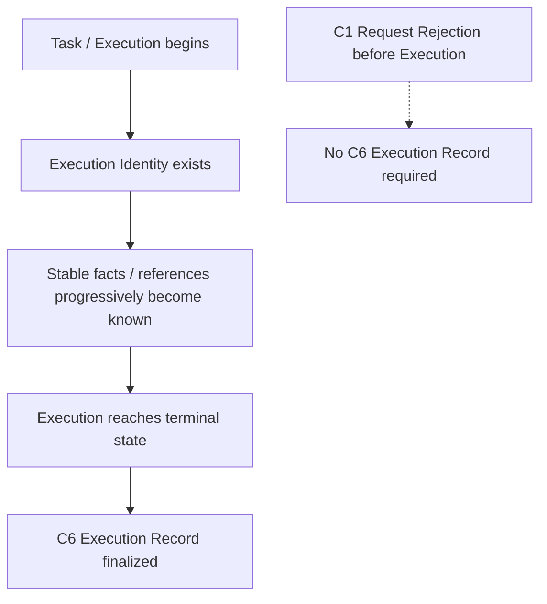

# D4 — Execution Record Specification

- **Document Type**: Detailed Contract Engineering Specification
- **Design Stage**: D4 — Execution Record
- **Vertical Slice**: First Research Execution
- **Business Scenario**: US / Car Vacuum / TikTok Content Research
- **Covered Contract**: C6 — Execution Record Contract
- **Architecture Status**: System Architecture V0.2 remains Candidate / Human-reviewed working architecture
- **D4 Review Status**: Detailed Semantics Reviewed
- **D4 Final Consistency Review**: PASS_WITH_REFINEMENTS
- **Architecture Reopen**: NO
- **New Contract Required**: NO
- **Software Architecture**: NOT YET DESIGNED

This specification defines the stable, reference-oriented execution facts that
become available when an Execution reaches terminalization. It is not a Runtime
Trace specification, Logging specification, Audit specification, Persistence
design, Database schema, or Software Architecture.

## 1. Purpose

D4 answers:

```text
What stable facts describe one completed Execution?
Which actual participants and outputs can be referenced?
How are successful and failed Executions finalized?
What remains resolvable after terminalization?
```

## 2. Scope and Non-Scope

### In scope

- the semantic definition and lifecycle of C6 Execution Record;
- actual execution facts and cross-contract references;
- successful and failed finalized Records;
- pre-execution request rejection boundary;
- reference-oriented record semantics;
- stable failure-stage explanation;
- post-terminal resolvability of necessary internal references;
- internal versus external reference obligations;
- relevant version and reproducibility references.

### Out of scope

```text
Runtime State taxonomy
Runtime Trace
Logs
Observability
Audit architecture
Event / Message architecture
Recorder runtime
Persistence Service
Repository
Database technology
Retention duration
Software model or implementation
```

## 3. Execution Record Definition

An Execution Record is the stable execution summary of an already established
Execution, finalized after terminalization, consisting of:

```text
Stable Execution Facts
+
Cross-contract References
+
Terminal Execution Outcome
```

It answers:

```text
Which Execution was this?
What actually participated?
Which relevant outputs were produced or referenced?
How did the Execution end?
How can the Execution be explained and traced later?
```

```text
Execution Record != Full Runtime History
```

C2b owns live Execution identity, terminalization, and stable fact availability.
C6 owns the Execution Record semantic boundary and aggregates actual references
from the local owners of those identities and results.

## 4. Conceptual Record Lifecycle

The semantic lifecycle is:



Stable facts become known during the Execution; terminalization finalizes the
Record semantics. This is not a Persistence Design and must not be represented
as “rebuild a Record from logs after the Task ends” or “rewrite the complete
Record on every step.”

## 5. Required Stable Facts and References

These are semantic groups, not frozen fields or permanent non-null columns.

### A. Execution identity and input

```text
Execution Identity
Task Reference
Input References
```

### B. Actual execution participants

```text
Actual Skill Reference
Relevant Skill Version Reference
Actually Invoked Capability References
Relevant Capability Version References
Resolved / Actually Used Provider Reference
```

### C. Relevant intermediate results

```text
Relevant Capability Result References
Evidence References where relevant
```

### D. Final business output

```text
Final Business Output Reference where present
```

For a successful First Research Slice Execution, the Final Business Output is
the Research Result Reference. It is not required on every execution path.

### E. Terminal semantics

```text
Terminal Execution Outcome
```

### F. Explanation and reproducibility

```text
Important Stable Runtime Facts
Relevant Reproducibility References
```

## 6. Responsibility / Ownership Matrix

| Semantic concern | Local owner | C6 responsibility |
|---|---|---|
| Execution Identity | C2b | Aggregates the actual identity reference. |
| Task Reference | C1 / C2b seam | Preserves the applicable reference without deciding its representation. |
| Input References | C1 / execution boundary | Records references relevant to the established Execution. |
| Skill Identity / Version | C2a | C6 references the actual participating Skill and relevant version. |
| Capability Identity / Version | C3 | C6 references capabilities actually invoked and relevant versions. |
| Provider Identity | C4a | C6 references the Provider actually resolved / used where applicable. |
| Capability Result | C3 | C6 references relevant results; it does not copy full payloads. |
| Evidence Identity | C5a | C6 references Evidence where the execution path produced or used it. |
| Research Result | C5b | C6 references the final Business Output where present. |
| Terminalization | C2b | C2b finalizes the Execution; C6 finalizes Record semantics. |
| Terminal Outcome | C2b | C6 preserves the terminal outcome as an execution fact. |
| Stable failure explanation | C2b / relevant boundary | C6 preserves stable failure-stage facts and references, not dumps. |
| Reproducibility references | Cross-contract | C6 aggregates relevant actual version and source references. |
| Retention / persistence | Not owned by D4 | C6 has resolvability obligations but does not design storage. |

C6 does not redefine Skill, Capability, Provider, Evidence, or Research Result.
It references the identity and result semantics owned by those Contracts.

## 7. Actual Facts Only

The Record contains facts that actually occurred and became stable execution
semantics. The following distinctions are mandatory:

```text
Declared Dependency
    != Actual Invocation Fact

Configured Provider Binding
    != Actually Used Provider Fact

Planned Action
    != Actual Execution Fact
```

Declaring that a Skill depends on Search does not prove that Search was
invoked. A Capability Reference enters the Record as an actual invocation fact
only when that invocation occurred. A configured Provider binding does not
prove that the Provider was actually resolved and used.

## 8. Successful Execution Record

A successful First Research Slice Record may contain:

```text
Execution Identity
Task / Input References
Actual Skill Reference + relevant version
Actually Invoked Capability References + relevant versions
Actually Used Provider Reference
Relevant Capability Result References
Evidence References where relevant
Final Research Result Reference
Terminal Successful Outcome
Relevant Reproducibility References
```

These are path-sensitive semantic obligations. D4 does not turn every item into
an OS-wide mandatory non-null field. The governing rule is:

```text
Record what actually occurred.
```

## 9. Failed Execution Record

A failed Execution must still produce a valid finalized Execution Record. A
failure Record may contain:

```text
Execution Identity
Task / Input References
Actual Skill Reference where established
Actually Invoked Capability Reference if invocation occurred
Resolved / Actually Used Provider Reference if resolution or invocation occurred
Relevant stable failure-stage facts / references
Terminal Failure Outcome
```

It may legitimately lack:

```text
Evidence Reference
Research Result Reference
Final Business Output Reference
```

```text
Execution Record completeness
    != All possible references are non-null
```

Completeness means that the actual stable facts appropriate to the execution
path are preserved, including the facts needed to explain failure closure.

## 10. Failure Explanation Boundary

A failed Record must preserve enough stable failure-stage semantics and
references to explain terminal failure. It must not become a raw error dump.

```text
Stable Failure Explanation
    != Trace / Log Dump
```

C6 does not require:

```text
Full stack trace
Full HTTP response
Raw Provider exception
All debug logs
All retry events
```

The exact failure object, taxonomy, or enum is **NOT YET DESIGNED**. C6 records
stable failure facts appropriate to the boundary; it does not create a global
error or observability architecture.

## 11. Pre-execution Request Rejection Boundary

If C1 rejects a Business Work Request before an Execution is established:

```text
No Execution established
    → no C6 Execution Record required
```

This is distinct from a failed Execution, which must produce a finalized
Record. D4 does not imply that the wider system can never log or identify a
rejected request; future Application or Transport concerns may have request
logs or request IDs. Such concerns are outside the current C6 Contract.

## 12. Reference-oriented Record Boundary

C6 is reference-oriented, not payload-oriented:

```text
Execution Record
    → points to relevant Capability Result
    → points to Evidence where relevant
    → points to Final Business Output where present
```

C6 must not default to copying:

```text
Full Raw Provider Payload
Full Search Result Payload
Full Evidence Payload
Full Research Result Payload
Every Runtime State Change
All Function Calls
All Logs
All Trace Events
Metrics
Evaluation Scores
```

The following distinctions remain explicit:

```text
Execution Record != Runtime State
Execution Record != Trace
Execution Record != Logs
Execution Record != Evidence
Execution Record != Artifact
Execution Record != Observability
Execution Record != Evaluation
```

Do not add `ExecutionRecorder`, `FactSink`, `AuditContract`, `TraceContract`,
`EventContract`, `EventBus`, `Recorder Runtime`,
`StableExecutionFactContract`, or `RuntimeExecutionRecordContract`.

## 13. Post-terminal Resolvability

A finalized Execution Record has explanatory value only when the
system-controlled internal references needed to explain the Execution remain
resolvable after terminalization.

```text
Post-terminal resolvability
    = REQUIRED SEMANTIC OBLIGATION
```

At minimum, this applies where present to:

```text
Execution Record and stable identity
Actual Skill / Version references
Actually Invoked Capability / Version references
Actually Used Provider reference
Relevant Capability Result references
Evidence references
Final Business Output reference
```

This does not freeze a retention duration. `30 days`, `90 days`, `1 year`, and
`forever` are not D4 semantics.

## 14. Retention, Persistence, and Storage Maturity

The current maturity is:

```text
Record / Reference Retention Semantics
    = REQUIRED / Detailed Semantics Partially Refined

Exact retention lifecycle / duration
    = NOT YET DESIGNED

Dedicated Persistence Subsystem
    = NOT YET PROVEN

Specific Database Technology
    = NOT YET PROVEN
```

Post-terminal resolvability does not imply a Persistence Service, Repository,
Storage Service, or Database:

```text
Execution Record exists
    ≠ PostgreSQL is required

Stable references exist
    ≠ Repository Layer is required

Evidence references exist
    ≠ Vector DB is required
```

## 15. Internal and External References

The Record must distinguish system-controlled internal references from external
source references.

### System-controlled internal references

Examples:

```text
Execution Record Reference
Capability Result Reference
Evidence Reference
Research Result Reference
```

Necessary internal references carry the post-terminal resolvability obligation.

### External source references

Examples:

```text
TikTok source URL
External source identity
```

The system may preserve an external source identity but cannot guarantee that
the external source remains permanently accessible:

```text
Source Reference Retained
    != External Source Guaranteed Available
```

## 16. Versioning and Reproducibility

C6 must support relevant version and reproducibility references, including as
applicable:

```text
Actual Skill Version Reference
Relevant Capability Version Reference
Provider / Adapter compatibility reference
Relevant source / result references
```

C6 records actual relevant version and reference facts. It does not design:

```text
Semantic version policy
Version registry
Compatibility engine
```

The exact representation of Version References and Reproducibility References
is **NOT YET DESIGNED**.

## 17. Cross-contract Invariants

1. Execution Record = Stable Execution Facts + Cross-contract References + Terminal Outcome.
2. Execution Record is not Runtime State.
3. Execution Record is not Trace or Logs.
4. Execution Record is not Evidence.
5. Execution Record is not Artifact, Observability, or Evaluation.
6. Declared Dependency is not Actual Invocation Fact.
7. Configured Provider Binding is not the Actually Used Provider Fact.
8. Planned Action is not Actual Execution Fact.
9. C2b owns terminalization and fact availability; C6 owns Record semantics.
10. Local identity ownership is preserved; C6 aggregates cross-contract references.
11. Successful and failed Executions both support valid finalized Records.
12. A failed Record does not require Evidence, Research Result, or Final Business Output references.
13. Pre-execution Request Rejection does not require a C6 Record.
14. Reference-oriented does not mean payload aggregation.
15. Necessary internal references must remain resolvable after terminalization.
16. Retained external source reference does not guarantee external availability.
17. Retention / resolvability does not imply Persistence architecture.
18. An Execution Record requirement does not imply Event, Audit, or Recorder architecture.

## 18. Explicit Exclusions and Design Maturity

These statuses are intentionally distinct and do not all mean permanent
prohibition.

### DO NOT ADD

```text
Stable Execution Fact Contract
Runtime ↔ Execution Record Contract
Recorder Contract
Event Contract
Audit Contract
Trace Contract
Identity Contract
```

### NOT YET DESIGNED

```text
Exact Execution Record software model
Exact reference representation
Exact failure representation
Exact retention duration
Reference lifecycle details
Task Reference vs Execution Identity relation
Execution Reference vs Execution Record Reference relation
```

### NOT YET PROVEN

```text
Dedicated Persistence Subsystem
Repository Layer
Storage Service
Specific Database Technology
Event Store
```

### EXPLICITLY REJECTED FOR CURRENT SLICE

```text
Event / Message Architecture as a required First-Slice execution mechanism
```

## 19. Open Representation Questions

The following do not block D4 semantic completion:

1. Execution Record identity representation.
2. Task Reference versus Execution Identity representation.
3. Execution Reference versus Execution Record Reference relationship.
4. Input Reference representation.
5. Skill / Capability / Provider reference representation.
6. Version Reference representation.
7. Capability Result reference representation.
8. Evidence reference collection representation.
9. Final Business Output reference representation.
10. Terminal Outcome representation.
11. Stable failure-stage semantics representation.
12. Reproducibility reference representation.
13. Exact post-terminal retention lifecycle.
14. Storage / persistence mechanism.

## 20. Review Result

```text
C6 — Execution Record Contract
= PASS_WITH_REFINEMENTS

D4 Final Consistency Review
= PASS_WITH_REFINEMENTS

Architecture Reopen
= NO

New Contract Required
= NO

D4 Detailed Semantics
= REVIEWED

D4 Specification
= CREATED
```

The seven D4 refinements are absorbed as explicit semantics:

```text
R1 — Actual Facts Only
R2 — Path-dependent References
R3 — Failure Explanation, Not Dump
R4 — Pre-execution Request Rejection
R5 — Post-terminal Resolvability
R6 — External Source Availability
R7 — Retention != Persistence
```

## 21. Next Design Stage

```text
D5 — Provider Mapping

C4b — Scrape Creators Adapter Contract
```

This specification does not create `05_PROVIDER_MAPPING.md`.
