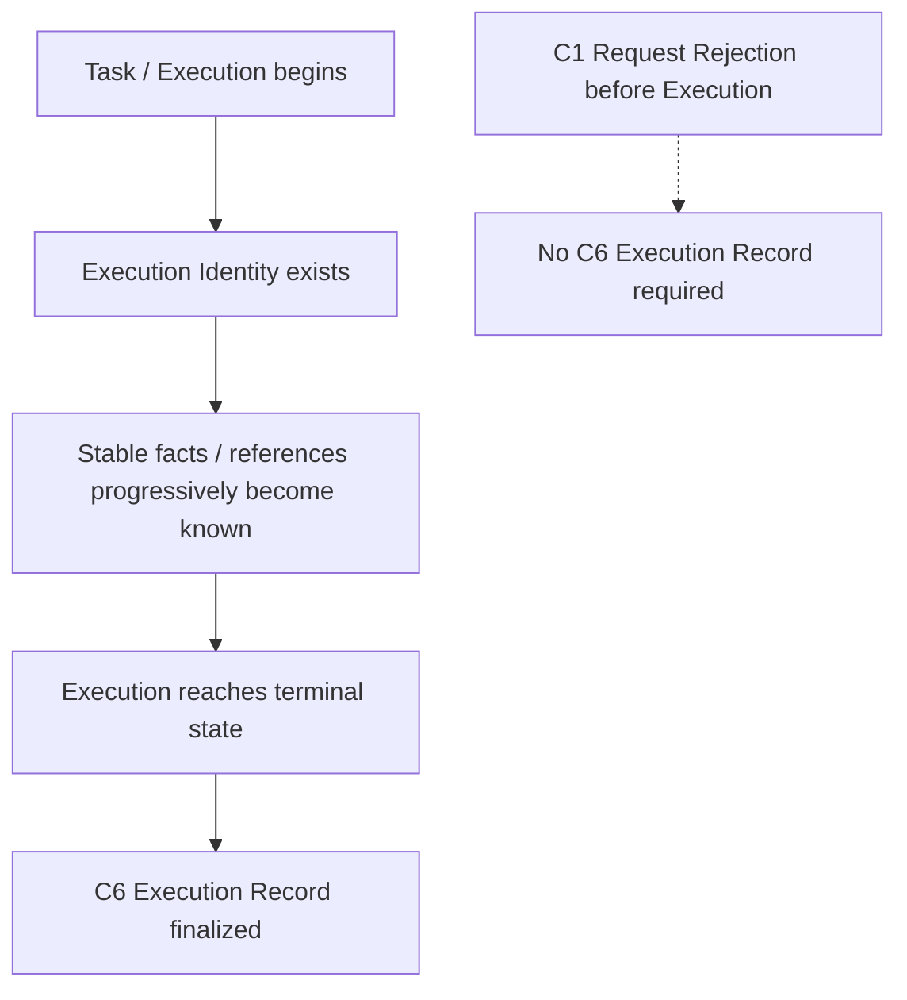

# D4 — 执行记录规范（Execution Record Specification）

- **文档类型（Document Type）**：Detailed Contract Engineering Specification
- **设计阶段（Design Stage）**：D4 — Execution Record
- **垂直切片（Vertical Slice）**：First Research Execution
- **业务场景（Business Scenario）**：US / Car Vacuum / TikTok Content Research
- **覆盖 Contract（Covered Contract）**：C6 — Execution Record Contract
- **架构状态（Architecture Status）**：System Architecture V0.2 remains Candidate / Human-reviewed working architecture
- **D4 审核状态（Review Status）**：Detailed Semantics Reviewed
- **D4 最终一致性审核（Final Consistency Review）**：PASS_WITH_REFINEMENTS
- **架构重开（Architecture Reopen）**：NO
- **需要新增 Contract（New Contract Required）**：NO
- **软件架构（Software Architecture）**：NOT YET DESIGNED

本规范定义 Execution 达到 terminalization 后可获得的稳定、reference-oriented
execution facts。它不是 Runtime Trace specification、Logging specification、
Audit specification、Persistence design、Database schema 或 Software Architecture。

## 1. 目的（Purpose）

D4 回答：

```text
What stable facts describe one completed Execution?
Which actual participants and outputs can be referenced?
How are successful and failed Executions finalized?
What remains resolvable after terminalization?
```

## 2. 范围与非范围（Scope and Non-Scope）

### 范围内（In scope）

- the semantic definition and lifecycle of C6 Execution Record;
- actual execution facts and cross-contract references;
- successful and failed finalized Records;
- pre-execution request rejection boundary;
- reference-oriented record semantics;
- stable failure-stage explanation;
- post-terminal resolvability of necessary internal references;
- internal versus external reference obligations;
- relevant version and reproducibility references.

### 范围外（Out of scope）

```text
Runtime State taxonomy
Runtime Trace
Logs
Observability
Audit architecture
Event / Message architecture
Recorder runtime
Persistence Service
Repository
Database technology
Retention duration
Software model or implementation
```

## 3. Execution Record 定义（Execution Record Definition）

An Execution Record is the stable execution summary of an already established
Execution, finalized after terminalization, consisting of:

```text
Stable Execution Facts
+
Cross-contract References
+
Terminal Execution Outcome
```

It answers:

```text
Which Execution was this?
What actually participated?
Which relevant outputs were produced or referenced?
How did the Execution end?
How can the Execution be explained and traced later?
```

```text
Execution Record != Full Runtime History
```

C2b owns live Execution identity, terminalization, and stable fact availability.
C6 owns the Execution Record semantic boundary and aggregates actual references
from the local owners of those identities and results.

## 4. 概念记录生命周期（Conceptual Record Lifecycle）

The semantic lifecycle is:



Stable facts become known during the Execution; terminalization finalizes the
Record semantics. This is not a Persistence Design and must not be represented
as “rebuild a Record from logs after the Task ends” or “rewrite the complete
Record on every step.”

## 5. 必须保留的稳定事实与引用（Required Stable Facts and References）

These are semantic groups, not frozen fields or permanent non-null columns.

### A. Execution identity 与输入

```text
Execution Identity
Task Reference
Input References
```

### B. 实际执行参与者（Actual execution participants）

```text
Actual Skill Reference
Relevant Skill Version Reference
Actually Invoked Capability References
Relevant Capability Version References
Resolved Provider Reference where resolution occurred
Actually Used Provider Reference where Provider invocation occurred
```

### C. 相关中间结果（Relevant intermediate results）

```text
Relevant Capability Result References
Evidence References where relevant
```

### D. 最终业务输出（Final business output）

```text
Final Business Output Reference where present
```

For a successful First Research Slice Execution, the Final Business Output is
the Research Result Reference. It is not required on every execution path.

### E. 终态语义（Terminal semantics）

```text
Terminal Execution Outcome
```

### F. 解释与可复现性（Explanation and reproducibility）

```text
Important Stable Runtime Facts
Relevant Reproducibility References
```

## 6. 责任 / 归属矩阵（Responsibility / Ownership Matrix）

| 语义关注点（Semantic concern） | 本地责任方（Local owner） | C6 责任（C6 responsibility） |
|---|---|---|
| Execution Identity | C2b | 汇总实际 identity reference。 |
| Task Reference | C2b / execution-side task-reference semantics | 保留适用的 Task Reference，不决定它是否与 Execution Identity 共用 software identifier。C1 可承载 / 暴露上游或终态引用语义，但不拥有 Runtime Task identity。 |
| Input References | C1 / execution boundary | 记录与已建立 Execution 相关的引用。 |
| Skill Identity / Version | C2a | C6 引用实际参与的 Skill 及相关版本。 |
| Capability Identity / Version | C3 | C6 引用实际调用的 capabilities 及相关版本。 |
| Provider Identity | C4a / execution Provider path | C4a 拥有 resolution fact；C6 在发生 resolution 时汇总 Resolved Provider Reference，只有发生 invocation 时才汇总 Actually Used Provider Reference。 |
| Capability Result | C3 | C6 引用相关结果，不复制完整 payload。 |
| Evidence Identity | C5a | 执行路径产生或使用 Evidence 时由 C6 引用。 |
| Research Result | C5b | 存在时引用最终 Business Output。 |
| Terminalization | C2b | C2b 完成 Execution；C6 完成 Record semantics。 |
| Terminal Outcome | C2b | C6 将 terminal outcome 保留为 execution fact。 |
| Stable failure explanation | C2b / relevant boundary | C6 保留稳定 failure-stage facts 与 references，而非 dump。 |
| Reproducibility references | Cross-contract | C6 汇总相关的实际版本与来源引用。 |
| Retention / persistence | Not owned by D4 | C6 具有 resolvability obligations，但不设计 storage。 |

C6 不重新定义 Skill、Capability、Provider、Evidence 或 Research Result；它
引用这些 Contract 所拥有的 identity 与 result semantics。

## 7. 只记录实际事实（Actual Facts Only）

Record 只包含实际发生并成为稳定 execution semantics 的事实。以下区分是强制性的：

```text
Declared Dependency
    != Actual Invocation Fact

Planned Action
    != Actual Execution Fact
```

声明 Skill 依赖 Search，不证明 Search 已被调用。Capability Reference 只有在
实际发生调用时，才作为 actual invocation fact 进入 Record。

Provider facts are also path-sensitive:

```text
Current / Configured Provider Binding
    != Resolved Provider Fact
    != Actually Used Provider Fact
```

合法路径可能先解析 Provider、再在调用前失败：

```text
Provider resolution succeeds
        ↓
Resolved Provider Reference exists
        ↓
Failure before Provider invocation
        ↓
Actually Used Provider Reference is absent
```

The exact software relationship between Task Reference and Execution Identity
remains **NOT YET DESIGNED**; C6 does not force them to share one identifier.

## 8. 成功 Execution Record（Successful Execution Record）

成功的 First Research Slice Record 可能包含：

```text
Execution Identity
Task / Input References
Actual Skill Reference + relevant version
Actually Invoked Capability References + relevant versions
Resolved Provider Reference where resolution occurred
Actually Used Provider Reference where Provider invocation occurred
Relevant Capability Result References
Evidence References where relevant
Final Research Result Reference
Terminal Successful Outcome
Relevant Reproducibility References
```

这些是 path-sensitive semantic obligations。D4 不把每一项都变成 OS-wide
mandatory non-null field。治理原则是：

```text
Record what actually occurred.
```

## 9. 失败 Execution Record（Failed Execution Record）

失败的 Execution 仍必须产生有效的 finalized Execution Record。Failure Record
可能包含：

```text
Execution Identity
Task / Input References
Actual Skill Reference where established
Actually Invoked Capability Reference if invocation occurred
Resolved Provider Reference if resolution occurred
Actually Used Provider Reference only if Provider invocation occurred
Relevant stable failure-stage facts / references
Terminal Failure Outcome
```

它可以合理地缺少：

```text
Evidence Reference
Research Result Reference
Final Business Output Reference
```

```text
Execution Record completeness
    != All possible references are non-null
```

完整性意味着保留与执行路径相匹配的实际稳定事实，包括解释 failure closure
所需的事实。

## 10. 失败解释边界（Failure Explanation Boundary）

Failure Record 必须保留足够的稳定 failure-stage semantics 与 references 来
解释 terminal failure，但不能变成 raw error dump。

```text
Stable Failure Explanation
    != Trace / Log Dump
```

C6 does not require:

```text
Full stack trace
Full HTTP response
Raw Provider exception
All debug logs
All retry events
```

精确的 failure object、taxonomy 或 enum 为 **NOT YET DESIGNED**。C6 记录与
边界相匹配的稳定 failure facts，不创建 global error 或 observability architecture。

## 11. 执行前请求拒绝边界（Pre-execution Request Rejection Boundary）

如果 C1 在建立 Execution 之前拒绝 Business Work Request：

```text
No Execution established
    → no C6 Execution Record required
```

这不同于必须产生 finalized Record 的 failed Execution。D4 不意味着更大的
系统永远不能记录或识别 rejected request；未来 Application 或 Transport
concerns 可以拥有 request logs 或 request IDs，但这些不属于当前 C6 Contract。

## 12. 面向 Reference 的 Record 边界（Reference-oriented Record Boundary）

C6 面向 reference，而不是面向 payload：

```text
Execution Record
    → points to relevant Capability Result
    → points to Evidence where relevant
    → points to Final Business Output where present
```

C6 不得默认复制：

```text
Full Raw Provider Payload
Full Search Result Payload
Full Evidence Payload
Full Research Result Payload
Every Runtime State Change
All Function Calls
All Logs
All Trace Events
Metrics
Evaluation Scores
```

The following distinctions remain explicit:

```text
Execution Record != Runtime State
Execution Record != Trace
Execution Record != Logs
Execution Record != Evidence
Execution Record != Artifact
Execution Record != Observability
Execution Record != Evaluation
```

Do not add `ExecutionRecorder`, `FactSink`, `AuditContract`, `TraceContract`,
`EventContract`, `EventBus`, `Recorder Runtime`,
`StableExecutionFactContract`, or `RuntimeExecutionRecordContract`.

## 13. 终态后可解析性（Post-terminal Resolvability）

finalized Execution Record 只有在解释 Execution 所需的 system-controlled
internal references 于 terminalization 后仍可解析时，才具有解释价值。

```text
Post-terminal resolvability
    = REQUIRED SEMANTIC OBLIGATION
```

At minimum, this applies where present to:

```text
Execution Record and stable identity
Actual Skill / Version references
Actually Invoked Capability / Version references
Actually Used Provider reference
Relevant Capability Result references
Evidence references
Final Business Output reference
```

这不冻结 retention duration。`30 days`、`90 days`、`1 year` 与 `forever` 都不是
D4 语义。

## 14. Retention、Persistence 与存储成熟度（Storage Maturity）

当前成熟度为：

```text
Record / Reference Retention Semantics
    = REQUIRED / Detailed Semantics Partially Refined

Exact retention lifecycle / duration
    = NOT YET DESIGNED

Dedicated Persistence Subsystem
    = NOT YET PROVEN

Specific Database Technology
    = NOT YET PROVEN
```

Post-terminal resolvability 不意味着必须存在 Persistence Service、Repository、
Storage Service 或 Database：

```text
Execution Record exists
    ≠ PostgreSQL is required

Stable references exist
    ≠ Repository Layer is required

Evidence references exist
    ≠ Vector DB is required
```

## 15. 内部与外部引用（Internal and External References）

The Record must distinguish system-controlled internal references from external
source references.

### 系统控制的内部引用（System-controlled internal references）

Examples:

```text
Execution Record Reference
Capability Result Reference
Evidence Reference
Research Result Reference
```

Necessary internal references carry the post-terminal resolvability obligation.

### 外部来源引用（External source references）

Examples:

```text
TikTok source URL
External source identity
```

The system may preserve an external source identity but cannot guarantee that
the external source remains permanently accessible:

```text
Source Reference Retained
    != External Source Guaranteed Available
```

## 16. 版本管理与可复现性（Versioning and Reproducibility）

C6 must support relevant version and reproducibility references, including as
applicable:

```text
Actual Skill Version Reference
Relevant Capability Version Reference
Provider / Adapter compatibility reference
Relevant source / result references
```

C6 records actual relevant version and reference facts. It does not design:

```text
Semantic version policy
Version registry
Compatibility engine
```

The exact representation of Version References and Reproducibility References
is **NOT YET DESIGNED**.

## 17. 跨 Contract 不变量（Cross-contract Invariants）

1. Execution Record = Stable Execution Facts + Cross-contract References + Terminal Outcome.
2. Execution Record is not Runtime State.
3. Execution Record is not Trace or Logs.
4. Execution Record is not Evidence.
5. Execution Record is not Artifact, Observability, or Evaluation.
6. Declared Dependency is not Actual Invocation Fact.
7. Current / Configured Provider Binding is not the Resolved Provider Fact and is not the Actually Used Provider Fact.
8. Planned Action is not Actual Execution Fact.
9. C2b owns terminalization and fact availability; C6 owns Record semantics.
10. Local identity ownership is preserved; C6 aggregates cross-contract references.
11. Successful and failed Executions both support valid finalized Records.
12. A failed Record does not require Evidence, Research Result, or Final Business Output references.
13. Pre-execution Request Rejection does not require a C6 Record.
14. Reference-oriented does not mean payload aggregation.
15. Necessary internal references must remain resolvable after terminalization.
16. Retained external source reference does not guarantee external availability.
17. Retention / resolvability does not imply Persistence architecture.
18. An Execution Record requirement does not imply Event, Audit, or Recorder architecture.

## 18. 明确排除项与设计成熟度（Explicit Exclusions and Design Maturity）

These statuses are intentionally distinct and do not all mean permanent
prohibition.

### DO NOT ADD

```text
Stable Execution Fact Contract
Runtime ↔ Execution Record Contract
Recorder Contract
Event Contract
Audit Contract
Trace Contract
Identity Contract
```

### NOT YET DESIGNED

```text
Exact Execution Record software model
Exact reference representation
Exact failure representation
Exact retention duration
Reference lifecycle details
Task Reference vs Execution Identity relation
Execution Reference vs Execution Record Reference relation
```

### NOT YET PROVEN

```text
Dedicated Persistence Subsystem
Repository Layer
Storage Service
Specific Database Technology
Event Store
```

### EXPLICITLY REJECTED FOR CURRENT SLICE

```text
Event / Message Architecture as a required First-Slice execution mechanism
```

## 19. 尚未冻结的表示层问题（Open Representation Questions）

The following do not block D4 semantic completion:

1. Execution Record identity representation.
2. Task Reference versus Execution Identity representation.
3. Execution Reference versus Execution Record Reference relationship.
4. Input Reference representation.
5. Skill / Capability / Provider reference representation.
6. Version Reference representation.
7. Capability Result reference representation.
8. Evidence reference collection representation.
9. Final Business Output reference representation.
10. Terminal Outcome representation.
11. Stable failure-stage semantics representation.
12. Reproducibility reference representation.
13. Exact post-terminal retention lifecycle.
14. Storage / persistence mechanism.

## 20. 审核结论（Review Result）

```text
C6 — Execution Record Contract
= PASS_WITH_REFINEMENTS

D4 Final Consistency Review
= PASS_WITH_REFINEMENTS

Architecture Reopen
= NO

New Contract Required
= NO

D4 Detailed Semantics
= REVIEWED

D4 Specification
= CREATED
```

The seven D4 refinements are absorbed as explicit semantics:

```text
R1 — Actual Facts Only
R2 — Path-dependent References
R3 — Failure Explanation, Not Dump
R4 — Pre-execution Request Rejection
R5 — Post-terminal Resolvability
R6 — External Source Availability
R7 — Retention != Persistence
```

## 21. 下一设计阶段（Next Design Stage）

```text
D5 — Provider Mapping

C4b — Scrape Creators Adapter Contract
```

This specification does not create `05_PROVIDER_MAPPING.md`.
