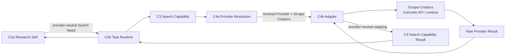

# D5 — Provider 映射规范（Provider Mapping Specification）

- **文档类型（Document Type）**：Detailed Contract Engineering Specification
- **设计阶段（Design Stage）**：D5 — Provider Mapping
- **垂直切片（Vertical Slice）**：First Research Execution
- **业务场景（Business Scenario）**：US / Car Vacuum / TikTok Content Research
- **覆盖 Contract（Covered Contract）**：C4b — Scrape Creators Adapter Contract
- **架构状态（Architecture Status）**：System Architecture V0.2 remains Candidate / Human-reviewed working architecture
- **D5 审核状态（Review Status）**：Detailed Semantics Reviewed
- **D5 最终一致性审核（Final Consistency Review）**：PASS_WITH_REFINEMENTS
- **架构重开（Architecture Reopen）**：NO
- **需要新增 Contract（New Contract Required）**：NO
- **软件架构（Software Architecture）**：NOT YET DESIGNED

本规范定义稳定的 Search Capability semantics 如何映射到当前 Scrape Creators
runtime reality。它不是 API inventory、endpoint selection report、SDK wrapper
design、concrete client implementation、Provider Lab report 或 Software Architecture。

## 1. 目的（Purpose）

D5 回答：

> How does the stable C3 Search Capability Contract map through C4b to the
> current Scrape Creators Provider without allowing Provider-specific syntax,
> identifiers, errors, or quirks to leak into the stable OS Contracts?

The core relationship is:

```text
Stable OS Search Semantics
        ↕
Provider-specific Representation
```

C4b 吸收 Provider-specific volatility，但不发明 Research semantics，也不选择
Provider。

## 2. 覆盖的 Contract（Covered Contract）

| Contract | 边界 / 责任（Boundary / responsibility） | D5 作用（D5 role） |
|---|---|---|
| C4b | Scrape Creators Adapter Contract | Translates stable C3 Search semantics to and from the current Scrape Creators runtime, normalizes provider facts, and exposes bounded references and compatibility awareness. |

C4b 与 C3 Search Capability、C4a Provider Resolution 保持区分。

## 3. 范围与非范围（Scope and Non-Scope）

### 范围内（In scope）

- provider-neutral request translation;
- provider-result response translation;
- missingness, pagination, region/filter, Provider ID, and error translation;
- narrow Provider-specific quirk absorption;
- Raw Provider Result referenceability;
- mapping-level version / compatibility awareness;
- faithful, bounded/lossy, and unsupported mapping semantics;
- C4a, C3, C5a, and C6 cross-contract seams.

### 范围外（Out of scope）

```text
Concrete endpoint selection
Concrete Provider parameter names
Concrete request JSON
All 97 API mappings
Provider selection or ranking
Multi-provider routing or fallback
Research Method or Discovery Strategy
Sampling or Evidence Interpretation
Finding or Hypothesis logic
Task lifecycle or Retry Engine
Governance Policy
Persistence, Repository, Database, or Software Architecture
```

## 4. Provider 映射位置（Provider Mapping Position）

C4a 与 C4b 回答不同问题：

```text
C4a Provider Resolution
    = Who currently provides this Capability?

C4b Adapter
    = How do stable Search semantics map to that Provider reality?
```

For this First Slice:

```text
Search
    → Scrape Creators
```

```text
Provider Resolution != Provider Translation
```

C4b 不拥有 Provider Selection、Provider Ranking、Fallback 或 Multi-provider Routing。

## 5. 概念请求 / 返回流程（Conceptual Request / Return Flow）

稳定方向是：



语义层必须保持区分：

```text
Raw Provider Result
    != Search Capability Result
    != Evidence
```

Response translation 在 provider-neutral C3 boundary 结束，不形成 Evidence、
Finding 或 Hypothesis。

## 6. 责任 / 归属矩阵（Responsibility / Ownership Matrix）

| 语义关注点（Semantic concern） | 主要责任方（Primary owner） | C4b 责任 / 边界（C4b responsibility / boundary） |
|---|---|---|
| Research Search Why | C2a Research Skill | C4b 只消费既有 Search semantics。 |
| Stable Search semantics | C3 | 定义 Search request 与 result 的含义。 |
| Provider Resolution / Binding | C4a | 确定当前 Provider；C4b 消费已解析 binding。 |
| Request Translation | C4b | 将 C3 request categories 映射为 Provider representation。 |
| Response Translation | C4b | 将 Provider result layout 映射为 C3 output semantics。 |
| Error Translation | C4b | 将 Provider failures 映射为 C3 Search-level failure semantics。 |
| Missingness Normalization | C4b | 在不解释的情况下归一化 Provider-specific absence。 |
| Pagination Translation | C4b | 将 Provider continuation mechanics 映射为 C3 continuation semantics。 |
| Region / Filter Translation | C4b | 将已有效的 C3 scope 与 constraints 映射为 Provider representation。 |
| Provider ID Translation | C4b | 保留 Provider IDs 及稳定 source / provenance references。 |
| Provider Quirk Absorption | C4b | 吸收狭窄的表示层或运行时不规则性。 |
| Raw Provider Result Referenceability | C4b | 使相关 raw facts 可引用，但不定义 retention。 |
| Version / Compatibility Awareness | C4b | 记录 mapping-level assumptions 与 compatibility facts。 |
| Research Sampling | C2a Research Skill | 不属于 Provider mapping responsibility。 |
| Evidence Interpretation | Research Skill / C5a seam | 不由 C4b 形成。 |
| Execution Record semantics | C6 | C4b 暴露 Provider-side facts；C6 决定 finalized Record semantics。 |
| Retry Policy | Not C4b | 本文不设计 Retry Engine 或 recovery policy。 |
| Governance Policy | Not C4b | C4b 不激活 governance rules。 |

## 7. C4b — Scrape Creators 适配器 Contract（Adapter Contract）

### 7.1 Adapter 定义（Adapter definition）

C4b 是以下两者之间的 translation boundary：

```text
Stable C3 Search Capability Contract
        ↕
Scrape Creators runtime reality
```

它的职责是在吸收 Provider-specific volatility 的同时保留稳定 OS semantics，
例如 endpoint layout、parameter naming、cursor syntax、Provider IDs、response
layout、error shape 以及其他有界 quirks。

### 7.2 Adapter 不是 Provider 或访问机制（access mechanism）

```text
C4b Adapter
    != Concrete Provider

Scrape Creators
    = Current Concrete Provider

API / SDK / MCP
    = Concrete Access / Integration Mechanism
```

Scrape Creators 是外部 Provider fact source，不是新的 OS Contract。D5 不新增
`ScrapeCreatorsProviderContract`、`Provider API Contract`、`SDK Contract` 或
`MCP Contract`。

## 8. 请求翻译（Request Translation）

C4b 将 provider-neutral C3 request categories 映射为 Scrape Creators-compatible
representation，可能需要翻译：

```text
Search Target / Criteria
Search Scope
Search Constraints
Continuation Semantics
```

The boundary is:

```text
C3 = defines WHAT the Search semantics mean
C4b = defines HOW those semantics map to Provider representation
```

D5 does not specify endpoint names, Provider parameter names, field names,
request JSON, or a concrete request object.

### 8.1 Translation 不发明业务语义（does not invent business semantics）

Valid:

```text
C3 says: market scope = US
C4b maps that semantic to a Provider-supported representation
```

Invalid:

```text
C3 says: Search Target = Car Vacuum
C4b invents: cordless car vacuum cleaner
C4b invents: best car vacuum
C4b invents: high-view-only query
```

The latter belongs to Research Skill Discovery Strategy or an already-defined
C3 Search Constraint, not to the Adapter.

```text
Adapter translates != Adapter invents business semantics
```

## 9. 响应翻译（Response Translation）

C4b maps:

```text
Raw Provider Result
        ↓
Provider-neutral C3 Search Capability Result
```

映射结果必须满足 C3 Output Boundary，包括 relevant result-item identity、source
referenceability、returned-set semantics、continuation state、Provider boundary
可观察的 completeness semantics，以及 normalized missingness。

Response Translation is not:

```text
Evidence Formation
Research Interpretation
Finding Formation
Hypothesis Formation
```

C4b 不形成 Evidence、Finding、Hypothesis 或 Research Result。

## 10. 缺失语义归一化（Missingness Normalization）

Provider 侧的以下形式：

```text
missing
null
absent
unavailable
not returned
```

必须在结果到达 C3 及后续 C5a 之前归一化为 provider-neutral missingness semantics：

```text
Provider-specific Missingness
        ↓ C4b normalization
Provider-neutral missingness
        ↓ C3 Search Result
C5a preserves known missingness
        ↓
Research Skill interprets impact
```

Adapter 不得把 missingness 转换为：

```text
0
false
empty string
inferred value
```

```text
Missing != 0
Missingness Normalization != Missingness Interpretation
```

## 11. 分页翻译（Pagination Translation）

当选定的 Provider representation 具有 continuation mechanics 时，C4b 将
Provider pagination reality 映射为 C3 provider-neutral continuation semantics。

Possible Provider mechanisms include:

```text
cursor
page
offset
has_more
next token
other Provider mechanism
```

D5 不冻结任何 mechanism。Provider cursor 或 token 不得泄漏到 Research Skill，
也不得成为稳定 C3 semantics 的一部分。

### 11.1 Pagination 不是全局完整性（global completeness）

Provider-observable facts such as “no next page” or `has_more = false` may
support Provider retrieval completeness semantics. They cannot be strengthened
into:

```text
All relevant TikTok content in existence has been discovered
```

```text
Provider pagination != Global completeness
```

C4b preserves only bounded continuation and retrieval-completeness semantics.

## 12. Region 与 Filter 翻译（Region and Filter Translation）

C4b 将已经有效的 C3 region、market 与 filter-related Search semantics 映射为
Provider representation，不创建 Research rules。

```text
Provider Request Filter
    != Research Sampling Rule
```

The Adapter must not infer or add a:

```text
views threshold
engagement threshold
creator threshold
business ranking rule
```

from Research sampling intent. Such a constraint must already be part of the
valid C3 Search semantics before C4b translates it.

## 13. Provider ID 与 Source Identity 翻译（Translation）

C4b 必须保留 Provider-specific IDs，并使相关 Search Result 与 source references
具备 provenance 能力。

These identities remain distinct:

```text
Provider-specific ID
    != Global OS Identity

Provider ID
    != Original Source Identity
```

An `aweme_id`, or any analogous Provider identifier, must not be declared to be
a global canonical content ID without Provider Facts proving a valid mapping.

The stable obligation is that Provider-specific identities are preserved or
translated within the C3 / C5a reference semantics.

## 14. Error 翻译（Error Translation）

方向是：

```text
Concrete Provider Error
        ↓ C4b translation
C3 Search-level failure semantics
        ↓
C2b Runtime
        ↓
Execution continuation or failure closure
```

Raw Provider errors 不得直接进入 Research Skill。C4b 可以保留解释所需的稳定
Provider-side failure semantics 或 references，但不能变成 raw error dump。

### 14.1 Translation 不是恢复策略（recovery policy）

```text
Error Translation != Retry Policy
Error Translation != Fallback
Error Translation != Backoff
Error Translation != Provider Selection
```

C4b 不拥有 Retry Engine，也不定义 `retry_count`、`max_attempts`、exponential
backoff 或 fallback Provider behavior。

## 15. Provider-specific Quirk 吸收（Quirk Absorption）

A Provider-specific Quirk is narrowly defined as:

> A Provider-specific representational or runtime irregularity that must be
> absorbed to preserve stable C3 semantics.

Examples that may belong at C4b include:

```text
unusual field name
nested response structure
special cursor syntax
Provider-specific region syntax
endpoint-specific missing field behavior
other representational irregularity
```

Quirk Absorption must not absorb:

```text
Research Method
Sampling
Business Ranking
Finding Logic
Hypothesis Logic
Retry Policy
Provider Selection
```

C4b is not a `misc_provider_logic` container.

## 16. Raw Provider Result 引用可定位性（Referenceability）

C4b must make relevant Raw Provider Results referenceable because a later
provenance path may need to connect:

```text
Evidence
    ↓
Capability Result
    ↓
Raw Provider Result
    ↓
Original Source
```

The following distinctions are mandatory:

```text
Raw Provider Result Referenceability
    != Raw Payload Duplication

Raw Provider Result Referenceability
    != Permanent Raw Payload Retention
```

C4b does not decide how long raw payloads are retained, where they are stored,
or which database / object store is used.

Where a Raw Provider Result Reference becomes necessary for provenance or
execution explanation, it inherits the cross-contract post-terminal
resolvability obligation defined by D4 / C6.

This does not make C4b the owner of retention duration or persistence
mechanism:

```text
Referenceability
    != Raw Payload Duplication

Post-terminal Resolvability
    != C4b-owned Retention Policy

Retention Requirement
    != Persistence Architecture
```

Exact retention duration remains **NOT YET DESIGNED**, and the persistence
mechanism remains outside C4b.

## 17. 版本与兼容性意识（Version and Compatibility Awareness）

C4b must have mapping-level Version / Compatibility Awareness. It must be
possible to express:

```text
which mapping is currently relied upon
which Provider/API runtime assumptions it depends on
whether the mapping is still considered compatible
```

C4b does not create:

```text
Compatibility Service
Provider Schema Registry
API Negotiation Platform
Version Registry
```

C4a may consume compatibility information when resolving a Provider, but C4b
does not take over Provider Resolution ownership.

## 18. 忠实、有界与不支持的映射（Faithful, Bounded, and Unsupported Mapping）

D5 freezes the following semantic distinction without creating an enum:

### 忠实映射（Faithful Mapping）

The Provider can express the C3-required semantic without material loss.

### 明确有界 / 有损映射（Explicitly Bounded / Lossy Mapping）

The Provider can express only part of the semantic, but the limitation is
explicitly preserved and C3 / downstream semantics allow the bounded result.

### 不支持的映射（Unsupported Mapping）

The Provider cannot legally satisfy a required C3 semantic.

Do not create `FAITHFUL`, `LOSSY`, or `UNSUPPORTED` enums or a compatibility
scoring system in D5.

### 18.1 不得静默增强语义（No silent semantic strengthening）

If Provider reality cannot fully support a C3 semantic, C4b must not silently
approximate, strengthen, or fabricate exactness.

For example, a rough Provider region hint must not be translated into exact US
scope. The Adapter must preserve the limitation or surface incompatibility /
unsupported mapping.

```text
Provider limitation
    must not become
Stronger OS-level fact
```

## 19. Provider Observation 不是 Inference

If the Provider does not return an observation, C4b must not infer it and wrap
the inference as a Provider fact. The stable result is instead one of the
appropriate missing, unavailable, or unsupported semantics.

```text
Provider observation absent
    → missing / unavailable / unsupported
    != inferred Provider observation
```

Research inference remains the responsibility of the Research Skill.

## 20. C4a / C4b / C3 跨 Contract 接缝（Cross-contract Seams）

| Seam | Responsibility boundary |
|---|---|
| C3 ↔ C4a | C3 defines stable Search identity and semantics; C4a resolves who provides it. |
| C4a ↔ C4b | C4a supplies the resolved Provider binding; C4b translates to that Provider reality. |
| C4b ↔ C3 | C4b returns provider-neutral Search Result or Search-level failure semantics. |
| C4b ↔ C2b | C2b coordinates the invocation and receives the normalized outcome. |
| C4b ↔ C2a | C2a receives only provider-neutral Search results, never raw Provider syntax or errors. |

The central invariant is:

```text
C4a Provider Resolution != C4b Provider Translation
```

## 21. C4b ↔ C5a Provenance 接缝（Seam）

C4b makes available:

```text
Provider Reference
Raw Provider Result Referenceability
Provider-specific IDs / source mapping facts
Normalized Missingness
```

C5a owns Evidence provenance semantics. The stable chain is:

```text
Raw Provider Result
        ↓ C4b
Search Capability Result
        ↓ Research Skill
C5a Evidence
```

C4b does not own Evidence, Evidence-worthiness, Sampling, or Evidence
Interpretation. It must preserve enough references for C5a to maintain
provenance without copying raw payloads by default.

## 22. C4b ↔ C6 Execution Record 接缝（Seam）

C4b can make these actual Provider-side facts referenceable:

```text
Actually Used Provider-side Reference
Relevant Raw Provider Result Reference
Relevant Provider / API Version or Compatibility Facts
```

C6 owns Execution Record semantics. C4b does not write or own the Record:

```text
C4b → makes Provider-side facts referenceable
C6  → decides finalized Execution Record semantics
```

Configured Provider binding and actual Provider use remain separate facts.

## 23. 实现范围与 Endpoint 边界（Implementation Scope and Endpoint Boundary）

C4b defines the complete stable adapter responsibility, but First Slice
implementation may cover only a later-proven minimum endpoint subset.

```text
97 APIs != 97 OS modules
```

D5 does not create a 97-endpoint mapping table and does not select an endpoint.

Minimum Scrape Creators Endpoint Selection remains:

```text
NOT YET DESIGNED
```

The correct later dependency is:

```text
Detailed Contracts complete
        ↓
Provider Facts
        ↓
Minimum Endpoint Subset Selection
```

The Provider API inventory must not redefine C3 or C4b.

## 24. 跨 Contract 不变量（Cross-contract Invariants）

1. C3 Search Capability is not the Concrete Provider.
2. C4a Provider Resolution is not C4b Provider Translation.
3. Adapter is not Concrete Provider and neither is API / SDK / MCP.
4. Adapter translates existing semantics; it does not invent business semantics.
5. Raw Provider Result is not Search Capability Result and neither is Evidence.
6. Missing is not zero.
7. Missingness Normalization is not Missingness Interpretation.
8. Provider pagination is not Global Completeness.
9. Provider Request Filter is not Research Sampling Rule.
10. Provider ID is not Global OS Identity.
11. Provider ID is not Original Source Identity.
12. Error Translation is not Retry or Recovery Policy.
13. Provider Quirk is not Business Logic.
14. Raw Provider Result Referenceability is not Raw Payload Retention.
15. Version Awareness is not a Compatibility Platform.
16. Provider limitation must not be silently strengthened into stronger OS semantics.
17. C4b makes Provider-side facts referenceable; C6 owns Execution Record semantics.
18. C4b implementation scope is not all 97 APIs.
19. D5 Adapter Contract Design is not Minimum Endpoint Selection.

## 25. 明确排除项与设计成熟度（Explicit Exclusions and Design Maturity）

These statuses are intentionally distinct and do not all mean permanent
prohibition.

### DO NOT ADD

```text
Concrete Provider Contract
Provider API Contract
Translation Contract
Error Translation Contract
Pagination Contract
Missingness Contract
Provider ID Contract
```

### NOT YET DESIGNED

```text
Exact Adapter software model
Exact Provider request mapping
Exact Provider response mapping
Exact endpoint mapping
Exact continuation token mapping
Exact Provider ID mapping
Exact failure object representation
Exact compatibility representation
Minimum Scrape Creators Endpoint Selection
```

### DEFERRED

```text
Multi-provider Routing
Fallback
Load Balancing
Health-aware Routing
Cost-aware Routing
Provider Ranking
Dynamic Discovery
```

### NOT YET PROVEN

```text
Retry Engine
Compatibility Service
Provider Schema Registry
Raw Payload Repository
Dedicated Persistence Subsystem
Specific Database Technology
```

### EXPLICITLY REJECTED FOR CURRENT SLICE

```text
Scrape Creators 97 API Full Integration as module / backlog architecture
```

## 26. 尚未冻结的表示层问题（Open Representation Questions）

The following do not block D5 semantic completion:

1. Adapter identity / version representation.
2. Stable Search request to Provider request representation.
3. Provider response to Search Result representation.
4. Missingness normalization representation.
5. Provider continuation-token representation.
6. Region / filter mapping representation.
7. Provider ID / source identity mapping.
8. Provider failure translation representation.
9. Raw Provider Result reference representation.
10. Faithful / bounded / unsupported mapping representation.
11. Compatibility awareness representation.
12. Concrete access mechanism.
13. Minimum endpoint subset.
14. Raw Provider payload retention mechanism.

## 27. 审核结论（Review Result）

```text
C4b — Scrape Creators Adapter Contract
= PASS_WITH_REFINEMENTS

D5 Final Consistency Review
= PASS_WITH_REFINEMENTS

Architecture Reopen
= NO

New Contract Required
= NO

D5 Detailed Semantics
= REVIEWED

D5 Specification
= CREATED
```

The eight D5 refinements are absorbed as explicit semantics:

```text
R1 — Translation != Business Interpretation
R2 — Missingness Normalization != Interpretation
R3 — Pagination != Global Completeness
R4 — Provider ID != Global Source Identity
R5 — Error Translation != Recovery Policy
R6 — Quirk Absorption Has Narrow Boundary
R7 — Unsupported / Lossy Mapping Must Be Explicit
R8 — Raw Result Referenceability != Raw Payload Retention
```

## 28. Detailed Contract 设计完成情况（Design Completion）

D5 completes the planned D1–D5 specification set:

```text
D1 — Execution Spine
    = SPECIFICATION CREATED
D2 — Search Invocation
    = SPECIFICATION CREATED
D3 — Research Semantics
    = SPECIFICATION CREATED
D4 — Execution Record
    = SPECIFICATION CREATED
D5 — Provider Mapping
    = SPECIFICATION CREATED
```

Therefore:

```text
All 9 Required Contract / Boundary
Detailed Semantics
= COVERED
```

This does not mean:

```text
Contracts Approved
System Architecture Approved
Software Architecture Designed
Walking Implementation Authorized
```

The accurate package status is:

```text
Detailed Contract Design Package
= COMPLETE FOR CONSISTENCY REVIEW
```

## 29. 下一阶段（Next Phase）

The next phase is:

```text
D1–D5 Detailed Specifications
        ↓
Detailed Contract Consistency Review
        ↓
Minimum Scrape Creators Endpoint Selection
        ↓
Minimal Software Architecture
        ↓
Walking Implementation
```

This D5 task does not create a Consistency Review file, Endpoint Selection
file, Software Architecture file, or implementation file.
