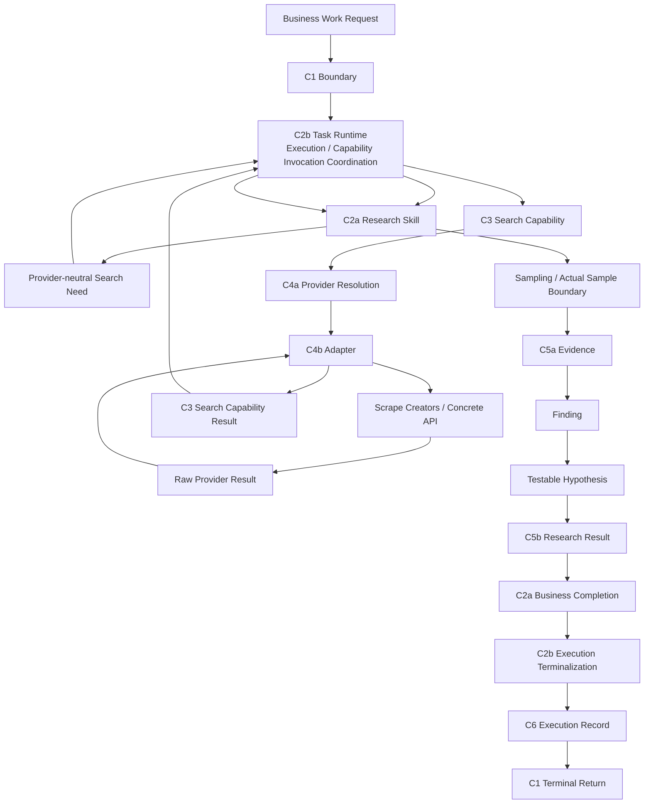

# Detailed Contract Consistency Review

- **Document Type**: Package-level Contract Review Record
- **Vertical Slice**: First Research Execution
- **Business Scenario**: US / Car Vacuum / TikTok Content Research
- **Review Scope**: D1–D5 Detailed Contract Specifications
- **Review Type**: Cross-contract consistency review
- **Review Result**: PASS_WITH_REFINEMENTS
- **Refinement Sync**: COMPLETE
- **Consistency Re-check**: PASS
- **Architecture Reopen**: NO
- **Contract Inventory Reopen**: NO
- **New Contract Required**: NO
- **Detailed Contract Package Status**: CONSISTENCY REVIEWED
- **Next Authorized Stage**: Minimum Scrape Creators Endpoint Selection
- **Architecture Status**: System Architecture V0.2 remains Candidate / Human-reviewed working architecture
- **Software Architecture**: NOT YET DESIGNED
- **Walking Implementation**: NOT YET AUTHORIZED

This is a package-level review record. It is not a Contract Specification, not
a tenth Contract, not an Architecture Authority, and not Software Architecture.

## 1. Review Purpose

This review checks whether the five Detailed Contract Specifications compose
without ownership collisions, semantic leakage, or an unclosed success/failure
path.

It reviews the package as a whole rather than repeating the D1–D5 Contract
definitions.

## 2. Review Scope

The reviewed specifications are:

```text
D1 — Execution Spine
    C1 Task Execution Boundary
    C2a Skill Contract
    C2b Task Runtime Execution Contract

D2 — Search Invocation Spine
    C3 Search Capability Contract
    C4a Provider Resolution Boundary

D3 — Research Semantics
    C5a Evidence Contract
    C5b Research Result Contract

D4 — Execution Record
    C6 Execution Record Contract

D5 — Provider Mapping
    C4b Scrape Creators Adapter Contract
```

The package still contains exactly 9 Required Contract / Boundary identities.

## 3. Package Under Review

The current specification set is:

```text
00_CONTRACT_DESIGN_INDEX.md
01_EXECUTION_SPINE.md
02_SEARCH_INVOCATION.md
03_RESEARCH_SEMANTICS.md
04_EXECUTION_RECORD.md
05_PROVIDER_MAPPING.md
06_DETAILED_CONTRACT_CONSISTENCY_REVIEW.md
```

The sixth file is a Review Record, not a Contract Specification and not a new
Contract identity.

## 4. Review Gates

| Gate | Result |
|---|---|
| Gate 1 — Identity / Referenceability | PASS_WITH_REFINEMENT_RESOLVED |
| Gate 2 — Context Propagation | PASS |
| Gate 3 — Capability / Provider Isolation | PASS |
| Gate 4 — Missingness Semantics | PASS |
| Gate 5 — Error / Failure Semantics | PASS |
| Gate 6 — Business / Execution Completion | PASS |
| Gate 7 — Research Semantic Separation | PASS |
| Gate 8 — Traceability / Provenance | PASS |
| Gate 9 — Execution Record Integrity | PASS |
| Gate 10 — Retention / Post-terminal Resolvability | PASS_WITH_REFINEMENT_RESOLVED |

## 5. End-to-End Semantic Spine



This is a semantic spine, not a Software Component Diagram.

## 6. Gate 1 — Identity / Referenceability

Result: **PASS_WITH_REFINEMENT_RESOLVED**.

Local identity ownership is preserved and cross-contract references are used:

```text
Execution Identity
    → C2b
Skill Identity / Version
    → C2a
Capability Identity / Version
    → C3
Provider Identity / Resolution
    → C4a
Evidence Identity
    → C5a
Research Result Referenceability
    → C5b
Execution Record Semantics
    → C6
```

CR-2 is resolved. C1 carries request-side and terminal boundary semantics;
C2b owns execution-side identity and Task Reference semantics. The software
relationship between Task Reference and Execution Identity remains open.

## 7. Gate 2 — Context Propagation

Result: **PASS**.

The package preserves Progressive Context Narrowing:

```text
Application Business Context
    ↓
Execution-scoped Context
    ↓
Skill-required Context
    ↓
Capability-required Context
    ↓
Provider-required Representation
```

No GlobalContext, UniversalContextEnvelope, or EverythingContext is introduced.
Provider-specific context remains behind C4b and does not redefine C2a
business semantics.

## 8. Gate 3 — Capability / Provider Isolation

Result: **PASS**.

```text
Search Capability
    != Scrape Creators

C3 = stable provider-neutral Search semantics
C4a = Provider Resolution
C4b = Provider Translation
```

The package also preserves:

```text
Current Provider Binding
    != Resolved Provider Fact
    != Actually Used Provider Fact
```

CR-3 is resolved. A legal path may resolve a Provider and fail before Provider
invocation; the Resolved Provider Reference exists while the Actually Used
Provider Reference is absent.

The Adapter remains distinct from the Provider and from API / SDK / MCP access
mechanisms.

## 9. Gate 4 — Missingness Semantics

Result: **PASS**.

The package preserves the complete direction:

```text
Provider-specific Missingness
    ↓ C4b normalization
C3 provider-neutral missingness
    ↓
C5a preserves missingness
    ↓
Research Skill interprets impact
    ↓
C5b Answerability / Limitations
```

```text
Missing != 0
Missing != false
Missingness Normalization != Interpretation
```

## 10. Gate 5 — Error / Failure Semantics

Result: **PASS**.

The failure path closes as:

```text
Concrete Provider Error
    ↓ C4b Error Translation
C3 Search-level failure semantics
    ↓
C2b Runtime failure handling
    ↓
Terminal Execution Outcome
    ↓
C6 Failure Execution Record
    ↓
C1 Terminal Failure Return
```

The package distinguishes:

```text
Provider Resolution Failure != Provider Invocation Failure
Request Rejection != Execution Failure
Valid Empty Result != Search Failure
Known Missingness != Search Failure
Insufficient Evidence != Execution Failure
Error Translation != Retry / Recovery Policy
```

No Universal Error Taxonomy, Retry Engine, or Fallback architecture is implied.

## 11. Gate 6 — Business / Execution Completion

Result: **PASS**.

```text
C5b-valid Research Result
    ↓
C2a Business Completion
    ↓
C2b recognizes completion
    ↓
Execution terminalization
```

Therefore:

```text
Business Completion precedes Execution Completion
Business Result != Execution Outcome
```

A failed Execution may have no Business Result. Insufficient Evidence may still
produce a valid Research Result with Answerability, Limitations, and
Traceability, followed by successful Business Completion.

## 12. Gate 7 — Research Semantic Separation

Result: **PASS**.

The package preserves:

```text
Raw Provider Result
    != Search Capability Result
    != Evidence
    != Finding
    != Testable Hypothesis

Search Retrieval Semantics
    != Actual Research Sample Boundary

Observed Fact
    != Research Interpretation

Finding
    != Validated Business Truth

Hypothesis
    != Validated Business Truth
    != Script

Research Result
    != Final Business Decision
    != Artifact
```

## 13. Gate 8 — Traceability / Provenance

Result: **PASS**.

Claim-level traceability remains:

```text
Hypothesis
    ↓
Finding
    ↓
Evidence
    ↓
Actual Sample Boundary
    ↓
Capability Result
    ↓
Raw Provider Result
    ↓
Original Source
```

Execution-level traceability remains:

```text
Research Result
    ↓
Execution Record
    ↓
Skill / Capability / Provider / Version References
```

Traceability is carried by existing references. No Traceability Service or
Traceability Contract is introduced.

## 14. Gate 9 — Execution Record Integrity

Result: **PASS**.

```text
Execution Record
    = Stable Execution Facts
    + Cross-contract References
    + Terminal Outcome
```

The Record remains distinct from Runtime State, Trace, Logs, Evidence,
Artifact, Observability, and Evaluation. Both successful and failed Executions
support valid finalized Records.

A failure Record may legitimately lack Evidence, Research Result, and Final
Business Output references. A pre-execution C1 rejection establishes no
Execution and therefore requires no C6 Record.

## 15. Gate 10 — Retention / Post-terminal Resolvability

Result: **PASS_WITH_REFINEMENT_RESOLVED**.

The package truth is:

```text
Post-terminal Resolvability
    = REQUIRED SEMANTIC OBLIGATION

Record / Reference Retention Semantics
    = REQUIRED / PARTIALLY REFINED

Exact retention lifecycle / duration
    = NOT YET DESIGNED

Persistence mechanism
    = NOT implied / NOT YET PROVEN
```

Necessary system-controlled internal references inherit the obligation,
including where applicable Capability Result, Evidence, Research Result, Raw
Provider Result, Skill, Capability, Provider, and Version references.

```text
Referenceability != Retention Policy
Post-terminal Resolvability != Persistence Architecture
External Source Reference retained != External Source guaranteed available
```

## 16. Consistency Findings CR-1 — CR-5

| Finding | Issue | Resolution | Status |
|---|---|---|---|
| CR-1 | Retention maturity and post-terminal inheritance were inconsistent across D2, D3, and Index. | Synchronized `REQUIRED / PARTIALLY REFINED`, required resolvability, open duration, and non-implied persistence. | RESOLVED |
| CR-2 | Task Reference wording could make C1 appear to own Runtime Task identity. | Assigned execution-side Task Reference semantics to C2b; kept C1 as boundary carrier / exposer. | RESOLVED |
| CR-3 | Resolved Provider and Actually Used Provider were folded together. | Separated binding, resolution fact, and actual invocation fact, including resolution-only failure path. | RESOLVED |
| CR-4 | Index retained stale “only index exists” and “start from D1” navigation. | Updated current specification set and Review Stage navigation. | RESOLVED |
| CR-5 | D2/D3 forward references used stale maturity wording. | Normalized references to Contracts defined in D3–D5 while preserving historical ownership boundaries. | RESOLVED |

CR-1, CR-2, and CR-3 are semantic consistency refinements. CR-4 and CR-5
are documentation / maturity wording refinements.

## 17. Refinement Resolution

```text
Refinement Sync
    = COMPLETE

Consistency Re-check
    = PASS
```

No unresolved blocking consistency issue remains for the current First Research
Slice Detailed Contract package. This does not permanently resolve future
Contract questions or authorize unrelated architecture expansion.

## 18. Final Cross-contract Invariants

1. Business Work Request is not Execution.
2. C1 carries boundary semantics; C2b owns Execution lifecycle and identity.
3. Skill is the Business Method; Task Runtime is Execution Coordination.
4. Declared Capability Dependency ≠ Runtime Capability Need ≠ Actual Invocation Fact.
5. Search Capability ≠ Concrete Provider.
6. C4a Provider Resolution ≠ C4b Provider Translation.
7. Current Provider Binding ≠ Resolved Provider Fact ≠ Actually Used Provider Fact.
8. Raw Provider Result ≠ Search Result ≠ Evidence ≠ Finding ≠ Hypothesis.
9. Search Retrieval ≠ Research Sample Boundary.
10. Missing ≠ 0.
11. Insufficient Evidence ≠ Execution Failure.
12. Business Completion precedes Execution Completion.
13. Execution Record ≠ Runtime State / Trace / Logs / Evidence / Artifact.
14. Local ownership is preserved; cross-boundary references are used.
15. Necessary internal references remain post-terminal resolvable.
16. Retention semantic obligation ≠ Persistence architecture.
17. Provider-specific detail remains behind C4b.
18. The package still contains 9 Required Contracts / Boundaries.
19. This review requires no new Contract.

## 19. Architecture / Contract Reopen Decision

```text
Product Architecture Reopen
    = NO

System Architecture V0.2 Reopen
    = NO

Contract Inventory Reopen
    = NO

New Contract Required
    = NO

Research placement resolution required now
    = NO
```

System Architecture V0.2 remains Candidate / Human-reviewed working
architecture. It is not upgraded to Approved.

## 20. Final Verdict

```text
Detailed Contract Consistency Review
    = PASS_WITH_REFINEMENTS

Consistency Refinement Sync
    = COMPLETE

Consistency Re-check
    = PASS

D1–D5 Detailed Specifications
    = CONSISTENCY REVIEWED

All 9 Required Contracts / Boundaries
    = DETAILED SEMANTICS COVERED
    + CONSISTENCY REVIEWED

Detailed Contract Design Package
    = COMPLETE FOR CURRENT FIRST-SLICE CONTRACT STAGE
```

This does not mean Approved Forever, Production-ready, or
Implementation-complete.

## 21. Next Authorized Stage

```text
Minimum Scrape Creators Endpoint Selection
    = AUTHORIZED NEXT

Software Architecture
    = NOT YET DESIGNED

Walking Implementation
    = NOT YET AUTHORIZED
```

The authorized sequence is:

```text
Detailed Contract Consistency Review
    ↓
Minimum Scrape Creators Endpoint Selection
    ↓
Minimal Software Architecture
    ↓
Walking Implementation
```

This Review Record does not create an Endpoint Selection file, Software
Architecture file, or implementation file.
