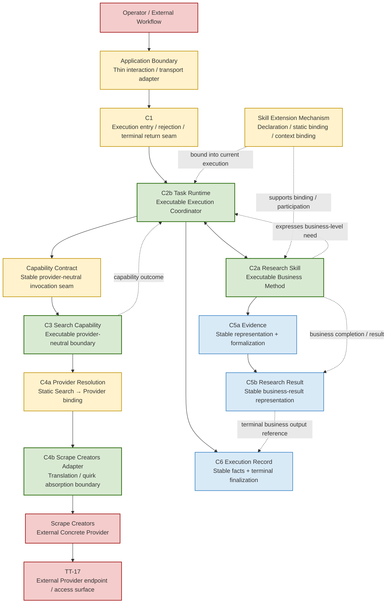

# Ecommerce AI OS — First Research Slice — Software Responsibility Mapping V0.1

- **Phase**: Minimal Software Architecture
- **Step**: 1 — Responsibility → Software Responsibility Mapping
- **Status**: Candidate / Step 1 Complete
- **Architecture Authority**: No
- **Slice**: US / Car Vacuum / TikTok Content Research
- **Walking Implementation**: NOT YET AUTHORIZED

---

## 0. Document Purpose and Boundary

本文件只负责将 First Research Slice 已确认的 System Responsibility / Contract semantics 映射为最小 software responsibility candidate，并判断每项责任需要哪一种软件承载：

```text
System Responsibility / Contract Semantics
        ↓
Minimum Software Responsibility
        ↓
Executable owner / seam / binding / representation / external reality
```

本文件的目标不是设计最终软件架构，而是回答：

- 每一项 First Slice responsibility 在软件里是否有明确承载？
- 哪些责任需要 executable owner？
- 哪些责任只需要 stable seam、binding 或 representation？
- 哪些责任属于外部现实，而不是 Ecommerce AI OS 内部组件？
- 哪些看似可以命名为 Service / Runtime / Router 的东西，当前实际上没有被证明需要？

本文件**不负责**：

- Step 2 Execution Spine software execution model
- package / module / class / interface / protocol / ABC 选择
- sync / async / coroutine / callback 选择
- database / persistence implementation
- HTTP / CLI / UI transport implementation
- framework / dependency injection / deployment 选择
- C3 Search concrete software model
- C4a Provider Resolution implementation
- C4b Adapter implementation
- C5a Evidence exact schema
- C5b Research Result exact schema
- C6 exact accumulator / builder / finalizer representation
- walking implementation

因此必须继续保持：

```text
Responsibility ≠ Contract ≠ Software Component
Runtime Semantic Flow ≠ Software Call Graph
Business Work Request ≠ Execution
Skill = Business Method
Task Runtime = Execution Coordination
```

---

## 1. Inherited Inputs and Stable Boundary

本 Step 不重新设计上游语义，只继承 First Research Slice 已确认的责任与边界。

### 1.1 First Slice Responsibility Set

本文件完整覆盖以下 14 项责任映射：

1. Application Boundary
2. C1 Task Execution Boundary
3. C2b Task Runtime
4. C2a Research Skill
5. Skill Extension Mechanism
6. Capability Contract
7. C3 Search Capability
8. C4a Provider Resolution
9. C4b Scrape Creators Adapter
10. C5a Evidence Boundary
11. C5b Research Result
12. C6 Execution Record
13. Scrape Creators Provider
14. TT-17 Provider Endpoint / Access Surface

### 1.2 Stable Conclusions Carried Forward

```text
C1
= transport-neutral execution entry / return seam

C2b
= actual Execution owner and coordinator

C2a
= executable business method

C2a
≠ second Runtime

C2b
coordinates Capability invocation and result return

C2a
does not directly invoke the concrete provider

C3
= provider-neutral Search Capability boundary

C4a
= current static Capability → Provider binding

C4b
= internal provider translation / quirk absorption boundary

C5a
= Evidence representation and formalization responsibility

C5b
= stable Research Result representation

C6
= stable execution facts and terminal finalization responsibility

Scrape Creators
= external concrete Provider

TT-17
= admitted Provider endpoint / access surface used by the First Slice
```

---

## 2. Mapping Rules

### 2.1 Software Presence Is Not Automatically Componentization

每项上游责任都必须在软件中有合适的承载，但软件承载不自动意味着独立 Service、Runtime、Router、Repository 或其他独立组件。

### 2.2 Contract Is Not a Call-Graph Node

Contract 可以规定稳定 obligations、输入输出边界、错误语义、context 约束和 invocation seam，但不因此产生一个额外的 runtime hop。

### 2.3 Executable Does Not Mean Runtime Engine

Research Skill 与 Search Capability 都需要可执行的承载，但它们分别是 business method 与 capability boundary；只有 C2b Task Runtime 拥有当前 Execution 的 coordination authority。

### 2.4 Boundary Must Survive Provider Replacement

Provider-specific behavior 必须被 C4b Adapter 吸收，不能反向污染 C3 Search Capability 或 C2a Research Skill。

### 2.5 Representation Must Preserve Stable Meaning

C5a、C5b、C6 的软件存在感不能因为暂不创建独立 Service 而被删除。必须保留相应的 stable representation、formalization、traceability 与 finalization responsibility。

---

## 3. Master Software Responsibility Mapping Matrix

| # | Upstream responsibility / contract | Minimum software form | Executable? | Independent component? | Stable seam? | Category | Must-not-become |
|---:|---|---|---|---|---|---|---|
| 1 | Application Boundary | Thin interaction / transport-facing entry and return responsibility | No lifecycle authority | No dedicated service required | Yes | Thin boundary | Web App, Chat UI, or transport framework as architecture |
| 2 | C1 Task Execution Boundary | Transport-neutral execution admission, rejection, and terminal return seam | No execution owner | No dedicated service required | Yes | Thin seam | `TaskExecutionService`, runtime replacement, or pre-execution failure conflation |
| 3 | C2b Task Runtime | Execution coordinator owning establishment, identity, context, invocation coordination, failure, and terminalization | Yes | Yes | Yes | Executable owner | Workflow Engine, Agent Runtime, generic Orchestrator platform |
| 4 | C2a Research Skill | Executable research business method with local working state | Yes, as business method | No second runtime engine | Yes | Executable business method | Provider client, Search executor, or `AnalyzeService` |
| 5 | Skill Extension Mechanism | Skill identity, declaration, dependency declaration, static registration/binding, and context binding support | Bounded binding behavior | No independent extension runtime required | Yes | Binding / thin seam | Plugin Platform, marketplace, hot-reload Extension Runtime |
| 6 | Capability Contract | Provider-neutral invocation obligations and stable capability seam | Not a standalone execution owner | No; contract is not a component | Yes | Contract / seam | Tool Layer, generic Capability Runtime, or Dispatcher platform |
| 7 | C3 Search Capability | Typed provider-neutral callable Search boundary | Yes, through callable owner | No extra generic service proven; callable owner required | Yes | Executable capability boundary | `ScrapeCreatorsSearch` or provider-shaped search API |
| 8 | C4a Provider Resolution | Current static Search → Scrape Creators binding | No independent routing behavior required | No Router / Registry / scoring component | Yes | Static binding | Provider Router, dynamic registry, or selection platform |
| 9 | C4b Scrape Creators Adapter | Internal request/response/error/pagination/missingness/ID/region translation boundary | Yes, as adapter behavior | Yes, as a distinct provider-isolation boundary | Yes | Translation boundary | Raw HTTP client, Provider itself, or C3 implementation |
| 10 | C5a Evidence Boundary | Stable Evidence representation plus formalization / validation responsibility | Bounded formalization behavior | No independent Evidence Service required | Yes | Representation / formalization | `EvidenceService`, `EvidenceRepository`, or Evidence DB |
| 11 | C5b Research Result | Stable business-result representation containing evidence refs, findings, hypotheses, answerability, limitations, and traceability | No independent runtime required | No separate Research Service proven | Yes | Representation | `ResearchService` or unbounded result workflow |
| 12 | C6 Execution Record | Stable execution facts, references, terminal finalization responsibility, and finalized record representation | Finalization behavior, not a second runtime | No independent Recorder Runtime required | Yes | Representation / finalization | Logs, Trace-only output, or `ExecutionRecordService` |
| 13 | Scrape Creators Provider | External concrete provider reality | External execution | N/A — outside OS ownership | Accessed through adapter seam | External reality | Internal OS component, adapter, or capability boundary |
| 14 | TT-17 Provider Endpoint / Access Surface | Provider access surface used by the Adapter for the admitted Search operation | External operation | N/A — not an OS component | Reached through C4b | External access surface | Search Capability itself, provider abstraction, or general endpoint platform |

### 3.1 Matrix Reading Rules

#### `Executable?`

“Yes” means the responsibility requires an executable software behavior. It does not prescribe a class, function, process, framework, or execution mechanism.

“Bounded behavior” means software must perform a semantic action, but the action does not justify an independent runtime component.

#### `Independent component?`

“Yes” is reserved for a responsibility with a separately justified ownership boundary. “No” does not mean the responsibility disappears; it means its software presence can be carried by an existing owner, seam, binding, or representation.

#### `Stable seam?`

“Yes” means later implementation choices must preserve the boundary even if the eventual software shape is a callable, data structure, binding, adapter, or other form.

---

## 4. Overall Software Responsibility Map

The diagram distinguishes:

- executable owners / executable boundaries
- thin seams / bindings
- stable representation and formalization responsibilities
- external reality



### 4.1 Diagram Interpretation

```text
Task Runtime
= actual Execution coordinator

Research Skill
= executable business method

Search Capability
= provider-neutral executable capability boundary

C4b
= distinct internal provider-isolation boundary

Application / C1 / Skill Extension / Capability Contract / C4a
= required seams or bindings, not automatically services

C5a / C5b / C6
= required stable representation / formalization / finalization responsibilities

Scrape Creators / TT-17
= external reality
```

The diagram is a responsibility map, not a package layout, object graph, or implementation call graph.

---

## 5. Responsibility Mappings

### 5.1 Application Boundary

**Upstream responsibility**

The Application Boundary is where an operator or external workflow interacts with the system.

**Minimum software responsibility**

```text
Thin interaction / transport-facing entry and return responsibility
```

It may eventually translate an external interaction into a C1-compatible request and expose a terminal result. It does not own the Execution lifecycle.

**Independent component conclusion**

No independent Application Service is required by Step 1. The software must preserve the boundary, but the transport and its implementation are deferred.

**Must not become**

```text
Web App
Chat UI
HTTP framework
ApplicationService with Execution authority
```

### 5.2 C1 Task Execution Boundary

**Upstream responsibility**

C1 governs how a valid Business Work Request enters and leaves an Execution, including admission, rejection, and terminal return semantics.

**Minimum software responsibility**

```text
Transport-neutral execution entry / rejection / terminal return seam
```

An invalid request rejected before Execution establishment is not an Execution Failure and must not be represented as an established Execution Record.

**Independent component conclusion**

The seam is required. A dedicated `TaskExecutionService` is not required.

**Must not become**

```text
TaskExecutionService
second Execution owner
transport-specific runtime API
```

### 5.3 C2b Task Runtime

**Upstream responsibility**

C2b owns the current Execution as an executable coordination responsibility. Its minimum authority includes Execution identity, canonical Execution Context, runtime state, Skill participation, Capability invocation coordination, outcome return, failure semantics, and terminalization.

**Minimum software responsibility**

```text
Executable Execution Coordinator
```

C2b is the canonical owner of the current Execution. It coordinates system action while leaving business-method judgment to the Skill.

**Independent component conclusion**

Yes. A real executable owner is required. This conclusion does not imply a workflow engine, graph runtime, agent runtime, or platform orchestrator.

**Must not become**

```text
Workflow Engine
Agent Runtime
Graph Runtime
Generic Orchestrator Platform
```

### 5.4 C2a Research Skill

**Upstream responsibility**

C2a owns the research business method: research-question clarification, evidence need, discovery and sampling judgment, evidence-worthiness, interpretation, Finding formation, Hypothesis formation, answerability reasoning, limitations, and Research Result formation.

**Minimum software responsibility**

```text
Executable Business Method
```

The Skill determines what the research should do next and what a result means. It does not directly call the concrete provider.

**Independent component conclusion**

An executable representation is required, but a second Runtime Engine is not. The Skill remains a business-method owner participating in the C2b Execution.

**Must not become**

```text
Provider client
Search executor
Capability dispatcher
AnalyzeService
second Task Runtime
```

### 5.5 Skill Extension Mechanism

**Upstream responsibility**

The Skill Extension Mechanism provides Skill identity and declaration, thin static registration, dependency declaration, context binding, and platform/domain adaptation support.

**Minimum software responsibility**

```text
Skill declaration + static participation / binding support
```

The mechanism must allow the current Research Skill to be identified, bound to its declared context and dependencies, and used by the Task Runtime. It does not require dynamic discovery, hot reload, marketplace behavior, or a general plugin platform.

**Independent component conclusion**

No independent Skill Extension Runtime is required for the First Slice. The declaration and binding seam cannot be deleted.

**Must not become**

```text
Plugin Platform
Extension Runtime
Marketplace
Hot-reload subsystem
```

### 5.6 Capability Contract

**Upstream responsibility**

The Capability Contract defines stable, provider-neutral obligations for Capability identity, declaration, input/output boundary, context boundary, invocation semantics, provider-resolution seam, and error behavior.

**Minimum software responsibility**

```text
Capability Invocation Abstraction / stable seam
```

This is a set of obligations and a boundary, not an additional runtime hop. The First Slice needs the Search Capability; it does not need a generic Capability platform.

**Independent component conclusion**

The contract is not itself an independent component. Its semantics must be carried by the actual callable Capability boundary and the coordination path owned by C2b.

**Must not become**

```text
Tool Layer
Generic Capability Runtime
Capability Dispatcher
Capability Registry
```

### 5.7 C3 Search Capability

**Upstream responsibility**

C3 is the provider-neutral content-discovery Capability used by the First Slice. It defines the Search request/result boundary without exposing Scrape Creators-specific shape to the Research Skill.

**Minimum software responsibility**

```text
Typed provider-neutral executable Search Capability boundary
```

The boundary must be callable by the execution coordination path and must remain distinct from the concrete provider.

**Independent component conclusion**

A callable software owner/boundary is required. No additional generic Search Service or Capability Runtime is proven.

**Must not become**

```text
ScrapeCreatorsSearch
provider-shaped Search API
generic Tool Runtime
```

### 5.8 C4a Provider Resolution

**Upstream responsibility**

C4a resolves the current provider-neutral Capability to the selected provider. For this First Slice, the relevant binding is the current Search → Scrape Creators relationship.

**Minimum software responsibility**

```text
Static Capability → Provider binding
```

The binding can remain narrow and explicit for the current Slice. Dynamic discovery, scoring, fallback, multi-provider routing, and provider registries are not required by Step 1.

**Independent component conclusion**

No independent Provider Router or Registry is required.

**Must not become**

```text
Provider Router
Provider Registry
Provider Scoring Engine
Dynamic Fallback Platform
```

### 5.9 C4b Scrape Creators Adapter

**Upstream responsibility**

C4b translates between the OS-level provider-neutral Search boundary and Scrape Creators-specific request, response, error, pagination, missingness, identifier, and region behavior.

**Minimum software responsibility**

```text
Provider translation / quirk absorption boundary
```

The Adapter is internal to Ecommerce AI OS and is driven by the OS Contract. It prevents Provider API shape from redefining C3, C5a, or C2a semantics.

**Independent component conclusion**

A distinct adapter boundary is required. This is the strongest internal provider-isolation boundary in the First Slice, but it does not prescribe a particular client library or transport.

**Must not become**

```text
raw HTTP client as the system boundary
Scrape Creators Provider itself
Search Capability implementation
provider API model leaked into the Skill
```

### 5.10 C5a Evidence Boundary

**Upstream responsibility**

C5a preserves Evidence semantics including provenance, source reference, actual sample boundary, observation context, time semantics, missingness, limitations, and traceability to the underlying capability outcome.

**Minimum software responsibility**

```text
Stable Evidence representation
+
Evidence formalization / validation responsibility
```

The Research Skill decides whether an observation is evidence-worthy. The Evidence boundary ensures that an accepted observation is represented without losing provenance, missingness, sample boundary, or limitation semantics.

**Independent component conclusion**

No independent Evidence Service is required. The representation and formalization responsibility are required.

**Must not become**

```text
EvidenceService
EvidenceRepository
EvidenceDatabase
Evidence Runtime
```

### 5.11 C5b Research Result

**Upstream responsibility**

C5b represents the business result: sample references, Evidence references, Findings, Hypotheses, answerability, limitations, and traceability.

**Minimum software responsibility**

```text
Stable business-result representation
```

C5b is the result semantic boundary. It does not own the Research Skill's business reasoning and does not require an independent result-processing runtime.

**Independent component conclusion**

No separate Research Service is currently proven.

**Must not become**

```text
ResearchService
result workflow engine
unbounded analysis subsystem
```

### 5.12 C6 Execution Record

**Upstream responsibility**

C6 records stable execution facts and references that become known during execution, then finalizes them at terminalization. It must support successful, failed, partial, and otherwise terminal executions without inventing facts that did not occur.

**Minimum software responsibility**

```text
Stable execution-facts representation
+
Fact accumulation responsibility during execution
+
Terminal finalization responsibility
+
Finalized Execution Record representation
```

Execution Context and transient runtime state must not be conflated with the finalized C6 record. Actual Skill, Capability, Provider, Evidence, Research Result, failure, and terminal facts are recorded only when they are actually known.

**Independent component conclusion**

An independent `ExecutionRecordService` or Recorder Runtime is not proven. The Task Runtime owns the Execution lifecycle and coordinates fact finalization; C6's stable facts and finalization semantics cannot be deleted.

**Must not become**

```text
Logs
Tracing only
Recorder Runtime
ExecutionRecordService
every responsibility writing directly to the final record
```

### 5.13 Scrape Creators Provider

**Upstream responsibility**

Scrape Creators is the current concrete external Provider used by the First Slice.

**Minimum software responsibility**

```text
External dependency / external reality
```

The OS does not own the Provider's internal behavior. The Adapter owns the internal translation boundary through which the Provider is accessed.

**Independent component conclusion**

Not applicable as an internal OS component.

**Must not become**

```text
internal OS service
Search Capability
Adapter boundary
```

### 5.14 TT-17 Provider Endpoint / Access Surface

**Upstream responsibility**

TT-17 is the admitted Provider endpoint / access surface for the current Search-by-Keyword operation.

**Minimum software responsibility**

```text
External access surface reached through C4b
```

The endpoint is not the Search Capability. It is an external reality selected for the current Slice and must remain behind the Adapter boundary.

**Independent component conclusion**

Not applicable as an internal OS component.

**Must not become**

```text
Search Capability itself
provider abstraction
general endpoint platform
```

---

## 6. Required Software Presence ≠ Independent Software Component

This is a governing Step 1 principle:

> **A responsibility can require definite software presence without requiring an independent software component.**

The correct question is not:

```text
Does this responsibility exist?
→ Create a Service?
```

The correct questions are:

```text
What semantic responsibility must software carry?
Who already owns the surrounding lifecycle?
What stable seam must survive implementation changes?
Is an independent component justified by a distinct executable authority?
```

### 6.1 C1 Example

```text
C1 software presence
= execution entry / rejection / terminal return seam

Independent TaskExecutionService
= not required
```

If C1 disappeared semantically, Application transport would connect directly to runtime internals. Pre-execution rejection could be confused with execution failure, and terminal return semantics would become runtime-private. Therefore the seam is required even though a dedicated service is not.

### 6.2 Skill Extension Example

```text
Skill Extension software presence
= identity / declaration / dependency / static binding / context binding

Independent ExtensionRuntime
= not required
```

Removing a plugin platform does not stop the current Slice if the Skill can still be statically declared and bound. Removing the declaration and binding seam would, however, make Skill participation implicit, hard-coded, and non-replaceable.

### 6.3 C5a Evidence Example

```text
C5a software presence
= stable Evidence representation + formalization / validation

Independent EvidenceService
= not required
```

Removing an Evidence Service does not prevent the current Skill from formalizing selected observations. Removing Evidence representation and formalization would collapse Search Result directly into business interpretation and could lose provenance, missingness, sample boundary, and limitation semantics.

### 6.4 C6 Execution Record Example

```text
C6 software presence
= stable facts + references + terminal finalization + record representation

Independent Recorder Runtime
= not required
```

Removing a Recorder Runtime does not prevent the Task Runtime from retaining stable facts and finalizing a terminal record. Removing the C6 responsibility would make failure, partial execution, actual provider use, and terminal outcome unavailable for later closure.

### 6.5 Summary Rule

```text
Required semantic presence
    ≠
Independent software component

Independent component
    requires
Distinct executable authority or isolation evidence
```

This rule prevents mechanical conversion of every Contract or Responsibility into a Service.

---

## 7. Delete Tests

The following tests distinguish a removable independent component from a non-removable seam, representation, or finalization responsibility.

### 7.1 Delete Test — Skill Extension

#### Candidate being deleted

```text
Independent SkillExtensionService
SkillRegistry
ExtensionRuntime
Plugin Platform
```

#### Result if deleted

The First Slice can still run if the current Research Skill has:

```text
Skill identity
Skill declaration
declared dependency = Search
static binding
execution-context binding
```

The Task Runtime can bind the known Skill and its declared dependency without dynamic discovery, hot reload, marketplace behavior, or a separate extension process.

#### What cannot be deleted

```text
Skill identity
Skill declaration
dependency declaration
static binding
context binding
Skill participation seam
```

#### Conclusion

```text
Independent Skill Extension Runtime
= removable / not required

Skill Extension Mechanism
= required software responsibility
```

The absence of an extension platform must not be implemented as hard-coding `if skill_name == ...` inside the Application or Task Runtime. That would remove the binding seam while merely hiding the responsibility in the wrong owner.

### 7.2 Delete Test — Evidence Boundary

#### Candidate being deleted

```text
EvidenceService
EvidenceRepository
EvidenceManager
EvidenceRuntime
```

#### Result if deleted

The First Slice can still run if software retains a stable Evidence representation and a bounded formalization / validation action. The action may be carried by an existing business execution path; no independent Evidence Service is necessary.

The Research Skill still decides:

```text
whether an observation is relevant
whether it is evidence-worthy
how it should be interpreted
```

The Evidence boundary still ensures:

```text
provenance is preserved
source reference is preserved
sample boundary is preserved
observation context is preserved
missingness is preserved
limitations remain expressible
```

#### What cannot be deleted

```text
Evidence identity / reference
source and provider provenance
actual sample boundary reference
observation semantics
time and missingness semantics
formalization / validation responsibility
traceability to the underlying result
```

#### Conclusion

```text
Independent Evidence Service
= removable / not required

C5a Evidence representation + formalization
= required software responsibility
```

If the representation and formalization rules were deleted, Search Result would flow directly into unconstrained interpretation. That would be a semantic loss, not a valid simplification.

### 7.3 Delete Test — Execution Record

#### Candidate being deleted

```text
ExecutionRecordService
RecorderRuntime
ExecutionHistoryManager
```

#### Result if deleted

The First Slice can still complete if the Task Runtime owns the current Execution Context and retains stable facts as they become known, then finalizes a C6 record at terminalization.

Conceptually:

```text
Execution starts
    → execution identity becomes known
Skill is bound
    → actual Skill reference becomes known
Search is invoked
    → actual Capability reference becomes known
Provider is resolved
    → actual Provider reference becomes known
Outcome is returned
    → result / failure fact becomes known
Execution terminalizes
    → stable facts are finalized as C6
```

This does not mean every transient variable belongs in C6. Runtime state, Skill working state, temporary provider objects, and provisional reasoning must remain distinct from stable execution facts and the finalized record.

#### What cannot be deleted

```text
execution identity
actual Skill / Capability / Provider references
actual result or failure facts
partial terminal facts
terminal status
finalization responsibility
stable Execution Record representation
```

Failure and partial execution must remain representable even when no Evidence or Research Result was formed.

#### Conclusion

```text
Independent Execution Record Service
= removable / not required

C6 stable facts + terminal finalization
= required software responsibility
```

Removing the independent Recorder Runtime is a component reduction. Removing stable facts or finalization would break Execution closure and later referenceability.

---

## 8. Ownership and Boundary Summary

| Responsibility type | First Slice software owner / carrier | Boundary that must remain explicit |
|---|---|---|
| Execution lifecycle | C2b Task Runtime | C1 admission/return seam |
| Business research method | C2a Research Skill | Skill participation / context binding |
| Capability invocation | C2b coordinates; C3 carries Search behavior | Capability Contract seam |
| Provider selection | C4a static binding | Provider-neutral C3 to provider-specific C4b boundary |
| Provider translation | C4b Adapter | External Provider isolation |
| Evidence meaning | C5a representation/formalization | Provenance, missingness, sample, limitation semantics |
| Business result meaning | C5b representation | Traceability to Evidence and business conclusions |
| Execution closure | C2b coordinates; C6 finalizes | Stable facts and terminal record semantics |
| External reality | Scrape Creators / TT-17 | Access only through the internal Adapter boundary |

The minimum executable ownership set is therefore:

```text
Task Runtime
Research Skill
Search Capability boundary
Scrape Creators Adapter
```

The minimum required non-component software presence also includes:

```text
Application / C1 seams
Skill declaration and binding
Capability Contract semantics
C4a static binding
C5a Evidence representation and formalization
C5b Research Result representation
C6 stable facts and finalization
```

---

## 9. Explicitly Not Introduced by Step 1

The following are not introduced merely because the responsibility map contains a related semantic term:

```text
TaskExecutionService
ApplicationService
Workflow Engine
Agent Runtime
Graph Runtime
Generic Capability Runtime
Capability Dispatcher
Capability Registry
Skill Extension Runtime
Provider Router
Provider Registry
EvidenceService
EvidenceRepository
ResearchService
ExecutionRecordService
Recorder Runtime
Database subsystem
Persistence subsystem
Event / Message Architecture
General-purpose API platform
```

This is not a claim that no future design can ever contain such software. It is the Step 1 conclusion that the First Slice has not yet proved the need for them.

---

## 10. Deferred Questions and Scope Guard

The following remain deferred to later software-design steps and are not silently decided here:

- exact representation of C1 request and terminal return
- exact C2b execution model
- exact C2a / C2b cooperation mechanism
- exact C3 Search invocation model
- exact C4a binding representation
- exact C4b adapter implementation
- exact C5a Evidence schema and validator/formalizer shape
- exact C5b Research Result schema
- exact C6 facts accumulator and finalizer shape
- package / module / class layout
- protocol / ABC / callable choice
- generator / coroutine / callback / async choice
- persistence and database choice
- application transport choice
- framework and deployment choice

These are deferred design questions, not missing responsibility mappings.

---

## 11. Step 1 Review / Sufficiency Gate

### 11.1 Gate Criteria

| Review question | Result | Basis |
|---|---|---|
| Does every First Slice responsibility have software carriage? | PASS | All 14 responsibilities appear in the Master Matrix and have a minimum software form or explicit external-reality classification. |
| Has any Contract been mechanically turned into a Service? | PASS | Capability Contract, C1, C4a, C5a, C5b, and C6 are carried as seams, bindings, representations, formalization, or finalization responsibilities. |
| Is any executable owner missing? | PASS | C2b owns Execution coordination; C2a owns the business method; C3 has a callable provider-neutral boundary; C4b owns provider translation. |
| Has any unproven component been introduced? | PASS | No Workflow Engine, Generic Capability Runtime, Extension Runtime, Provider Router, Evidence Service, Recorder Runtime, database, transport platform, or framework is introduced. |
| Are the stable seams explicit? | PASS | Application/C1, Skill Extension, Capability Contract, C3/C4a/C4b, C5a/C5b, and C6 seams are separately identified. |
| Is external reality distinguished from internal software? | PASS | Scrape Creators and TT-17 are explicitly classified as external Provider / access surface. |
| Are representation and finalization responsibilities preserved? | PASS | C5a, C5b, and C6 remain present without being inflated into independent runtime services. |
| Does Step 1 require reopening Product semantics? | NO | No Product conclusion is changed. |
| Does Step 1 require reopening System semantics? | NO | No System responsibility or authority boundary is changed. |
| Does Step 1 require reopening Contract semantics? | NO | The mapping translates existing Contract semantics; it does not revise them. |
| Is walking implementation authorized? | NO | This document remains Candidate / Step 1 Complete and does not authorize implementation. |

### 11.2 Gate Result

```text
Step 1 Sufficiency Gate = PASS
```

The Mapping is sufficient to proceed to the next software-design step without reopening Product, System, or Contract semantics.

This sufficiency result does not authorize package design, implementation, or a final architecture decision.

---

## 12. Final Step 1 Verdict

```text
Responsibility → Software Responsibility Mapping
= CANDIDATE / COMPLETE

Architecture Authority
= NO

Walking Implementation
= NOT YET AUTHORIZED
```

The First Slice has a complete minimum software responsibility map:

```text
Executable owner
    = Task Runtime

Executable business method
    = Research Skill

Executable capability boundary
    = Search Capability

Provider-isolation boundary
    = Scrape Creators Adapter

Thin seams / bindings
    = Application, C1, Skill Extension, Capability Contract, C4a

Stable representation / formalization / finalization
    = C5a Evidence, C5b Research Result, C6 Execution Record

External reality
    = Scrape Creators, TT-17
```

The central Step 1 conclusion is:

> **Software must carry every required responsibility, but only justified executable authority becomes an independent software component.**

No Product / System / Contract reopen is required by this mapping. The next step may design the execution model within the boundaries established here, but it must continue to preserve the distinction between responsibility, contract, component, seam, representation, binding, and external reality.
