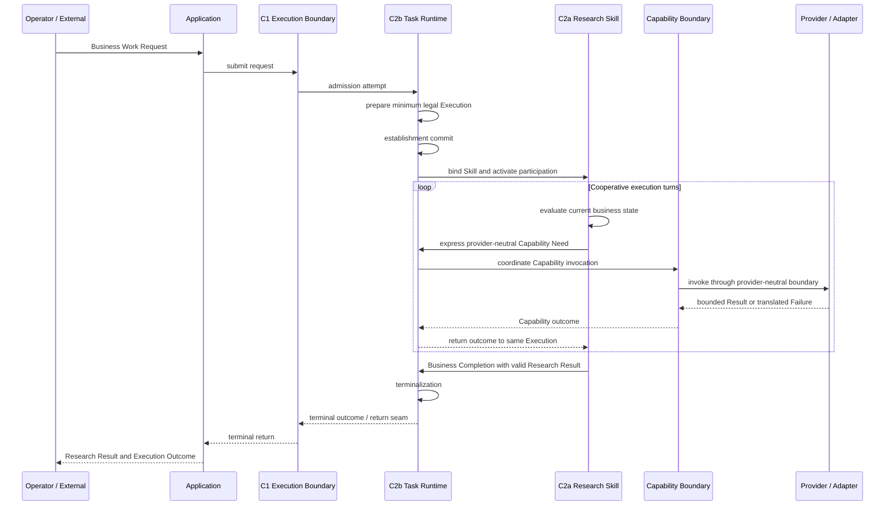

# Ecommerce AI OS — First Research Slice — Execution Spine Software Design V0.1

- **Phase**: Minimal Software Architecture
- **Step**: 2 — Execution Spine Software Design
- **Status**: Candidate / Step 2 Complete
- **Architecture Authority**: No
- **Slice**: US / Car Vacuum / TikTok Content Research
- **Upstream Contract Package**: D1 = C1 + C2b + C2a
- **Walking Implementation**: NOT YET AUTHORIZED

> 中文阅读导语：本文描述一次 Research Execution 的最小执行主干。C2b Task Runtime 拥有 Execution Authority，C2a Research Skill 拥有 Business Method Authority；Capability invocation 必须由 C2b 协调，并在同一 Execution 中完成返回与终止化。

---

## 0. 文档目的与边界（Document Purpose and Boundary）

本文件只负责：

> 将已经确认的 D1 Execution Spine semantics 转译为 First Research Slice 所需的最小 software execution model candidate。

D1 包含：

```text
C1
Task Execution Boundary

C2b
Task Runtime Execution Contract

C2a
Skill Contract
```

本文件回答：

```text
Business Work Request 如何进入一次 Execution？
什么时候才算 Execution 真正建立？
C2b Task Runtime 在软件层拥有什么 execution authority？
C2a Research Skill 如何参与当前 Execution？
Execution Context 与 Skill Working State 如何分离？
C2a 如何向 C2b 表达 provider-neutral Capability Need？
C2b 如何协调 Capability Invocation？
Capability Result / Failure 如何回到当前业务执行？
Business Completion 如何发生？
Execution 如何进入 terminal state？
Capability Invocation 与 Task / Execution 是什么关系？
Failure / Partial Execution 下哪些稳定事实仍必须可用于后续 closure？
```

本文件不负责：

```text
C3 Search concrete software model
C4a Provider Resolution implementation
C4b Adapter implementation
C5a Evidence exact software representation
C5b Research Result exact schema
C6 exact accumulator / builder / finalizer representation
package layout
module layout
class layout
Protocol / ABC / callable choice
generator / coroutine / callback choice
sync / async implementation
database
persistence implementation
HTTP / CLI / UI transport
framework selection
```

必须继续保持：

```text
Responsibility ≠ Contract ≠ Software Component
Runtime Semantic Flow ≠ Software Call Graph
Business Work Request ≠ Execution
Skill = Business Method
Task Runtime = Execution Coordination
```

---

## 1. 继承输入（Inherited Inputs）

本 Step 不重新设计上游语义。主要继承：

```text
docs/02_system/00_SYSTEM_ARCHITECTURE.md
docs/02_system/vertical_slices/01_research_execution/02_RESPONSIBILITY_COVERAGE.md
docs/02_system/vertical_slices/01_research_execution/03_MINIMAL_RUNTIME_PATH.md
docs/02_system/vertical_slices/01_research_execution/05_DEFERRED_REGISTER.md
docs/02_system/vertical_slices/01_research_execution/06_ARCHITECTURE_REVIEW.md
docs/02_system/vertical_slices/01_research_execution/contracts/01_EXECUTION_SPINE.md
docs/03_software/01_MINIMAL_SOFTWARE_ARCHITECTURE_PHASE_HANDOFF.md
docs/03_software/vertical_slices/01_research_execution/01_SOFTWARE_RESPONSIBILITY_MAPPING.md
```

本 Step 继续继承以下稳定结论：

```text
C1 = transport-neutral execution entry / return seam
C2b = actual execution owner
C2a = executable business method
C2a ≠ second Runtime
C2a does not directly invoke C3
C2b coordinates Capability invocation and result return
Business Completion precedes Execution Completion
```

---

## 2. 核心软件执行模型候选（Core Software Execution Model Candidate）

First Slice 当前采用：

```text
Turn-based Cooperative Execution
```

作为 C2a / C2b 的软件协作语义。它表示：

```text
C2b owns Execution authority
C2a owns Business Method authority
```

二者之间的关系不是：

```text
Task Runtime
→ ResearchSkill.run()
→ Skill directly executes everything
```

也不是：

```text
Research Skill
→ emits complete workflow
→ Runtime becomes workflow engine
```

而是：

```text
C2b establishes Execution
↓
C2a evaluates current business state
↓
C2a expresses the next business-level need
↓
C2b coordinates required system action
↓
outcome returns to the same business execution
↓
C2a evaluates again
↓
...
↓
C2a expresses Business Completion
↓
C2b terminalizes Execution
```

这里的 Turn-based Cooperative Execution 只是 software execution semantic。它不是：

```text
Turn Contract
Action Contract
Command Contract
Step Contract
Workflow DSL
Graph Runtime
Agent Runtime
```

也不要求具体代码必须使用：

```text
generator
yield
coroutine
async/await
callback
state machine library
```

---

## 3. Execution Authority 与 Business Method Authority

### 3.1 C2b Task Runtime owns Execution Authority

C2b 当前最小责任包括：

```text
Execution establishment
Execution identity
canonical Execution Context
thin runtime state
actual Skill binding awareness
Capability invocation coordination
Capability outcome return
execution-level failure semantics
terminalization
execution-scoped stable fact awareness
```

因此：

```text
C2b = canonical owner of the current Execution
```

### 3.2 C2a Research Skill owns Business Method Authority

C2a 当前拥有：

```text
research question clarification
evidence need
query / discovery strategy
sampling strategy
evidence-worthiness judgment
evidence interpretation
Finding formation
Hypothesis formation
answerability reasoning
limitation reasoning
Research Result formation
```

因此 C2a 决定：

```text
"What should the research do next?"
```

而不是：

```text
"How should the provider API be called?"
```

### 3.3 Authority Boundary

必须保持：

```text
C2a owns business sequencing
C2b owns system execution coordination
```

不能退化为：

```text
C2a owns both business logic and execution infrastructure
```

也不能变成：

```text
C2b understands research interpretation
and decides business conclusions
```

---

## 4. C1 接纳与 Execution 建立（C1 Admission and Execution Establishment）

### 4.1 Business Work Request is not yet an Execution

入口：

```text
Operator / External Workflow
↓
Application Boundary
↓
C1 Task Execution Boundary
```

此时：

```text
Business Work Request ≠ established Execution
```

C1 首先承担 transport-neutral admission / rejection seam。

### 4.2 Pre-execution Rejection

如果请求无法形成合法的 First Slice Execution：

```text
C1 Admission Attempt
↓
Reject
```

则：

```text
Execution = NOT ESTABLISHED
C6 Execution Record = NOT CREATED
```

必须继续保持：

```text
Pre-execution Rejection ≠ Execution Failure
```

---

## 5. Execution Establishment Commit Boundary（Execution 建立提交边界）

Step 2 引入一个 software-level candidate concept：

```text
Execution Establishment Commit Boundary
```

其目的不是增加新 Contract，而是明确：从哪一刻开始，后续 failure 必须被视为已经建立的 Execution 中的 failure。

概念路径：

```text
Business Work Request
↓
C1 Admission Attempt
↓
C2b prepares minimum legal execution
    execution identity
    execution context
    actual skill binding
    minimum runtime state
↓
EXECUTION ESTABLISHMENT COMMIT
↓
Execution exists
```

### 5.1 Before Commit

如果失败发生在 establishment commit 之前：

```text
invalid work request
required context cannot be formed
valid Skill cannot be bound
minimum Execution cannot be initialized
```

则：

```text
C1 Rejection
Execution = NOT ESTABLISHED
```

### 5.2 After Commit

一旦越过 establishment commit：

```text
Execution = ESTABLISHED
```

之后发生的 Capability failure、Provider failure、runtime failure，都属于 Execution-level lifecycle，不能再伪装成 C1 pre-execution rejection。

### 5.3 Commit Boundary Is Semantic

这里的 Execution Establishment Commit 不等于：

```text
database transaction
SQL commit
event commit
distributed transaction
CommitService
```

它只是 lifecycle semantic boundary。代码即使提前生成了 temporary UUID 或 temporary object，也不自动意味着 Execution semantically established。

---

## 6. Execution Context 所有权（Execution Context Ownership）

### 6.1 C2b owns Canonical Execution Context

First Slice 的 Execution Context 至少必须能保持当前 Research Execution 的稳定业务执行上下文，例如：

```text
Execution identity
Product / SKU Context
Platform Context = TikTok
Market Context = US
Business Goal = Commerce Content
Research Intent
actual bound Skill identity
allowed / declared Capability dependencies
execution-level runtime facts
```

C2b 是 canonical owner。

### 6.2 Execution Context must remain thin

不能把整个 Research 工作过程塞入 Execution Context。禁止把以下内容默认升级成 Runtime-owned global state：

```text
candidate queries
query reasoning notes
sampling candidates
sampling judgment
selected observations
provisional Finding
candidate Hypothesis
research interpretation notes
```

否则 Task Runtime 会逐渐变成 Research Working Memory，这违反 C2a / C2b responsibility split。

---

## 7. Skill 工作状态（Skill Working State）

Research Skill 可以拥有 execution 内部的 business-method working state。例如：

```text
clarified research question
current discovery angle
candidate query strategy
search coverage judgment
sampling progress
selected evidence-worthy observations
provisional Findings
candidate Hypotheses
answerability reasoning
```

因此必须保持：

```text
Execution Context
≠
Skill Working State
```

---

## 8. 跨边界稳定事实（Cross-boundary Stable Facts）

除了 Execution Context 和 Skill Working State，还存在第三类信息：

```text
Stable Cross-boundary Facts / Results
```

它们采用：

```text
Local Ownership
+
Cross-boundary Reference
```

而不是 Global Shared Context。例如：

```text
Capability Invocation Fact
Capability Result
Actual Provider Fact
Actual Sample Boundary
Evidence Ref
Research Result Ref
Terminal Outcome
```

这些事实可能由不同 Responsibility 产生或拥有，但可以被当前 Execution 引用。

---

## 9. Actual Sample Boundary 示例

Sampling decision 属于 C2a Research Skill。但一旦真实样本范围被确定，Actual Sample Boundary 就不再只是 Skill-private temporary variable，而成为 stable Research Execution fact。

正确关系是：

```text
Research Skill
→ owns sampling decision

Actual Sample Boundary
→ stable research execution fact

Execution closure
→ may reference it
```

不是 Task Runtime decides sampling，也不是 Actual Sample Boundary stays invisible inside Skill。

---

## 10. Skill 绑定模型（Skill Binding Model）

First Slice 当前只有一个明确 Research Skill path。因此当前需要：

```text
Skill declaration
Skill identity
static registration / binding
dependency declaration
context binding
```

不需要：

```text
Dynamic Skill Discovery
Skill Marketplace
Remote Registry
Hot Reload
Independent Skill Runtime
```

Execution establishment 后：

```text
C2b
↓
resolve current static Skill binding
↓
confirm Skill identity
↓
obtain declared dependencies
↓
bind allowed context
↓
activate Skill participation
```

Skill Extension Mechanism 只支持这些参与关系。它不是：

```text
Task Runtime
→ Extension Runtime
→ Research Skill
```

---

## 11. C2a ↔ C2b 控制转移（Control Transfer）

Turn-based cooperative execution 中，C2a 每一轮根据当前 business state 形成下一步业务语义。当前至少存在两种重要 logical outcome：

```text
A. Provider-neutral Capability Need
B. Business Completion
```

这两个不是新的 Contract。它们继续由 C2a + C2b 现有 Contract semantics 承载。不得增加：

```text
CapabilityNeedContract
ActionContract
CommandContract
StepContract
ToolCallContract
```

---

## 12. Provider-neutral Capability Need（Provider 中立的能力需求）

当 Research Skill 认为需要 Search：

```text
C2a Research Skill
↓
Provider-neutral Search Need
↓
C2b Task Runtime
```

Skill 可以知道 I need Search，以及业务上需要的 provider-neutral Search semantics。Skill 不应该知道：

```text
Scrape Creators
TT-17
/v1/tiktok/search/keyword
HTTP request
provider cursor format
provider-specific query quirks
```

因此：

```text
C2a Capability Need = provider-neutral
```

---

## 13. Dependency Declaration 与 Runtime Capability Need

必须继续保持：

```text
Declared Capability Dependency
≠ Runtime Capability Need
≠ Actual Capability Invocation Fact
```

例如：

```text
Skill Declaration:
"I depend on Search"
```

不等于：

```text
Current turn:
"I need Search now"
```

更不等于：

```text
Search was actually invoked
```

---

## 14. Runtime 对 Capability Invocation 的协调

当 C2b 收到 Capability Need：

```text
Research Skill
↓
Provider-neutral Search Need
↓
Task Runtime
```

C2b 当前承担：

```text
1. confirm requested Capability is legitimate for the bound Skill
2. coordinate invocation through Capability boundary
3. receive Capability outcome
4. preserve execution-scoped invocation facts as appropriate
5. return the outcome to the same Research Execution / Skill participation
```

C2b 不负责：

```text
Search business interpretation
sampling judgment
evidence-worthiness judgment
Finding formation
```

---

## 15. 同一 Execution 的连续性（Same Execution Continuity）

一条 Research Execution 可以发生多次 Capability Invocation。例如：

```text
Research Execution E1
├── Search Invocation I1
├── Search Invocation I2
├── Search Invocation I3
└── Research Result
```

这仍然是 one Research Execution。因此：

```text
Task ≠ Capability Invocation
```

---

## 16. Capability Invocation 不是子 Execution

当前明确：

```text
Capability Invocation ≠ Task
Capability Invocation ≠ Child Execution
```

Capability Invocation 是：

```text
one execution-scoped invocation fact
inside the same Research Execution
```

当前不建设：

```text
Parent Task
Child Task
Nested Execution
Child Execution Lifecycle
Child C6
Failure Propagation Tree
Cancellation Tree
```

如果未来真实 workload 证明需要 nested execution，再重新评估。

---

## 17. Invocation Identity 与 Execution Identity

Capability Invocation 后续可以具有足够的 identity / referenceability，用于：

```text
traceability
actual invocation fact
result reference
provider usage fact
```

但必须保持：

```text
Invocation Identity
≠
Execution Identity
```

这也不要求新增 Invocation Contract。现有 Contract / cross-contract obligations 足够承载。

---

## 18. 逻辑顺序与并发（Logical Ordering and Concurrency）

First Slice 当前冻结：

```text
Multiple Capability Invocations per Execution = YES
Multiple Concurrent Outstanding Capability Invocations = NOT REQUIRED / NOT PROVEN
```

因此当前 logical execution ordering 为 Sequential Turn Ordering：

```text
C2a expresses Capability Need
↓
C2b coordinates one invocation
↓
Capability Outcome returns
↓
C2a evaluates new business state
↓
C2a decides next action
```

然后才能进入下一 turn。例如：

```text
Search I1
↓
Result I1
↓
Skill evaluates
↓
Search I2
↓
Result I2
↓
Skill evaluates
```

而不是：

```text
Search I1 ─┐
Search I2 ─┼→ fan-in
Search I3 ─┘
```

### 18.1 Sequential Logical Semantics ≠ Sync Implementation

Sequential Turn Ordering 只描述 logical control semantics，不决定：

```text
sync
async
await
thread
process
coroutine
generator
```

因此：

```text
Logical Sequentiality
≠ synchronous implementation requirement
```

### 18.2 Why Concurrency Is Not Added

当前没有 First Slice 证据要求：

```text
fan-out
fan-in
parallel Search
race coordination
concurrent capability state
event-driven aggregation
```

因此不得因为“以后可能更快”就提前加入：

```text
Async Orchestration Layer
Event Bus
Parallel Task Graph
```

---

## 19. Capability 结果模型（Capability Outcome Model）

当前软件语义区分：

```text
Capability Invocation Outcome
├── Contract-valid Result
└── Capability Failure
```

这不是新 Contract，只是现有 Capability Output Boundary + Error Boundary 的软件执行解释。

---

## 20. Contract 有效的有界结果（Contract-valid Bounded Result）

Capability Result 不要求数据完美。以下情况仍可能属于合法 Result：

```text
partial provider data
known incomplete traversal
missing field
bounded semantics
lossy-but-explicit mapping
unknown provider hard cap
provider limitation preserved
```

这些不自动意味着 Execution Failure。正确路径：

```text
C3 Result
↓
C2b
↓
C2a Research Skill
↓
business interpretation
```

Skill 决定：

```text
coverage 是否够？
是否继续搜索？
sampling 是否够？
Evidence 是否足够？
```

---

## 21. Capability 失败（Capability Failure）

如果 provider / adapter / capability chain 无法形成合法 C3 Result：

```text
Provider-specific Error
↓
Adapter translation
↓
Capability-level Failure
↓
Task Runtime
```

Task Runtime 负责 execution-level handling。

---

## 22. 可继续失败与终止失败（Continuable Failure vs Terminal Failure）

当前不建立 comprehensive error taxonomy。但 Step 2 允许最小区分：

```text
A. Translated Capability Failure
   where the current Execution can still legally continue

B. Execution-level Non-continuable Failure
```

### 22.1 Continuable Capability Failure

如果 failure 已经被稳定翻译，并且当前 Research Method 仍有合法业务选择空间：

```text
Capability Failure
↓
C2b
↓
C2a
```

C2a 可以决定：

```text
try another business-valid Search Need
continue using already acquired Evidence
complete with insufficient evidence
stop pursuing the failed research branch
```

这属于 Business Method continuation，而不是 Retry Engine。

### 22.2 Non-continuable Failure

如果 Execution 已经无法在当前 Contract / execution condition 下合法继续：

```text
C2b
↓
Terminal Failure Outcome
```

当前只冻结这一原则。不提前设计完整 failure taxonomy。

---

## 23. Retry 边界（Retry Boundary）

必须保持：

```text
System-level automatic Retry Engine
≠
Research Skill choosing another business action
```

例如：

```text
Query A failed
↓
Skill decides Query B is still useful
```

这是 Business Method，不是 automatic retry。因此：

```text
Retry Engine = NOT REQUIRED / NOT PROVEN
```

---

## 24. Insufficient Evidence 不是失败

必须长期保持：

```text
Execution Failure
≠ Insufficient Evidence
≠ Hypothesis Rejected Later
```

合法路径：

```text
Search succeeds
↓
Evidence formed
↓
Research Skill evaluates Evidence
↓
Current evidence is insufficient
↓
Valid Research Result
↓
Business Completion
↓
Successful Execution
```

因此：

```text
No strong conclusion ≠ Task Failure
```

---

## 25. Business Completion（业务完成）

C2a Research Skill 形成合法 C5b Research Result，随后表达 C2a Business Completion。

必须保持：

```text
Valid Research Result
↓
Business Completion
↓
Execution Completion
```

禁止：

```text
Task marked SUCCESS
↓
later attempt to construct Research Result
```

---

## 26. 单一被接受的 Business Completion

Step 2 当前采用：

```text
One established Execution
→ at most one accepted Business Completion
```

Research Skill 内部可以形成：

```text
draft Finding
draft Hypothesis
candidate Research Result
```

但真正跨越 C2a → C2b 的 Business Completion 是一次单调 lifecycle transition。因此：

```text
Candidate Result ≠ Accepted Business Completion
```

---

## 27. Execution Terminalization（Execution 终止化）

C2b 在确认 Business Completion 之后进入 Execution Terminalization。

正常成功路径：

```text
Valid Research Result
↓
C2a Business Completion
↓
C2b recognizes Business Completion
↓
Execution terminalization
↓
C6 downstream finalization seam
↓
C1 Terminal Return
```

---

## 28. 至多一次终止转换（At-most-once Terminal Transition）

当前 software semantic 要求：

```text
Terminalization
= at-most-once logical lifecycle transition
```

重复 terminalization 请求不得制造：

```text
second logical terminal outcome
second logical Execution completion
second independent C6 finalization
```

但当前不设计：

```text
distributed idempotency protocol
idempotency key
distributed lock
transaction system
```

因此：

```text
At-most-once terminal semantics
≠ approved distributed idempotency mechanism
```

---

## 29. 生命周期候选（Lifecycle Candidate）

Step 2 当前最小 lifecycle 可以概念上理解为：

```text
PRE-EXECUTION
↓
ESTABLISHMENT
↓
ACTIVE
↓
BUSINESS COMPLETED
↓
TERMINALIZING
↓
TERMINAL
```

Failure 可以从已建立的 ACTIVE execution 进入：

```text
ACTIVE
↓
TERMINAL FAILURE
```

注意：这些是 lifecycle semantic stages，不是已经批准的：

```text
TaskState Enum
database state machine
workflow graph
```

---

## 30. Execution 期间的 Stable Execution Facts

Execution 运行过程中，一些 stable facts 会逐步成为已知事实。例如：

```text
execution identity
input / task refs
actual bound Skill ref
actual Capability invocation refs
actual Provider fact
relevant Capability result refs
Actual Sample Boundary
Evidence refs
Research Result / Business Output ref
failure facts
terminal outcome
```

它们不是在 Execution 开始时全部已知，而是：

```text
Runtime interaction
↓
stable fact becomes known
↓
execution-scoped availability / reference
```

---

## 31. C2b 与稳定事实责任

Step 2 当前只冻结：

```text
C2b
coordinates the execution lifecycle
and must not lose stable execution facts
needed for downstream closure
```

本 Step 不决定：

```text
ExecutionFactsAccumulator
ExecutionRecordBuilder
Repository
JSON file
database
event sink
```

这些留给：

```text
Step 5 — Execution Record / Referenceability
```

---

## 32. 瞬时状态、稳定事实与 C6

必须长期保持：

```text
Transient Runtime State
≠ Stable Execution Facts
≠ Finalized Execution Record
```

Transient runtime state 可能包括：

```text
temporary local variables
current control position
temporary provider object
current in-memory working object
```

这些不自动进入 C6。

---

## 33. 失败闭环与部分事实（Failure Closure and Partial Facts）

一个失败 Execution 不要求拥有完整 business path。例如：

```text
Execution established
↓
Skill bound
↓
Search invoked
↓
Provider fails
↓
Execution cannot continue
↓
Terminal Failure
```

此时可能合法存在：

```text
Execution identity
Input / Task refs
Actual Skill ref
Actually Invoked Capability ref
Actual Provider ref
Failure facts
Terminal outcome
```

而不存在：

```text
Evidence Ref
Finding
Hypothesis
Research Result Ref
Business Output Ref
```

仍然是合法的 failed Execution closure。

---

## 34. 部分事实不代表架构缺失

必须避免：

```text
Every C6 field
must exist
for every execution
```

正确原则：

```text
Only facts actually established by that Execution
can become actual execution facts
```

因此：

```text
Declared Capability Dependency
≠ Actually Invoked Capability Fact

Current Provider Binding
≠ Resolved Provider Fact
≠ Actually Used Provider Fact
```

---

## 35. Application 返回边界（Application Return Boundary）

Application 最终消费：

```text
Research Result
+
Execution Outcome / Record Reference
```

而不是默认消费：

```text
complete Execution Record payload
```

C1 继续承担：

```text
transport-neutral terminal return seam
```

Application transport representation 仍未决定。

---

## 36. 主 Execution 序列候选（Main Execution Sequence Candidate）



这张图描述的是 Runtime Semantic Flow，不是 Software Call Graph，也不是已经批准的 package / module / class layout。

---

## 37. 候选边界摘要（Candidate Boundary Summary）

Step 2 当前形成以下 software-level candidate：

```text
C1
→ transport-neutral execution entry / return seam

C2b
→ canonical Execution owner
→ establishes, coordinates, and terminalizes the Execution

C2a
→ executable Research business method
→ decides business sequencing
→ does not directly invoke provider-specific capability

Capability Invocation
→ provider-neutral execution-scoped fact
→ not a child Execution

Execution Context
→ thin, canonical, runtime-owned context

Skill Working State
→ business-method-owned working state

Stable Cross-boundary Facts
→ locally owned, referenceable facts needed for closure

Business Completion
→ accepted at most once per established Execution

Execution Terminalization
→ at-most-once logical lifecycle transition
→ downstream C6 finalization seam
```

---

## 38. 明确未作出的决定（Explicit Non-decisions）

本 Step 不决定：

```text
package layout
module layout
class layout
Protocol / ABC / callable choice
generator / coroutine / callback choice
sync / async implementation
database
persistence implementation
HTTP / CLI / UI transport
framework selection
```

本 Step 也不新增：

```text
Turn Contract
Action Contract
Command Contract
Step Contract
ToolCallContract
CapabilityNeedContract
Retry Engine
Async Orchestration Layer
Event Bus
Parallel Task Graph
Child Execution Lifecycle
Child C6
```

---

## 39. Step 2 候选状态（Step 2 Candidate Status）

```text
Status
= Candidate / Step 2 Complete

Architecture Authority
= No

Walking Implementation
= NOT YET AUTHORIZED
```

Step 2 的 Candidate 结论是：

```text
Execution establishment
= explicit semantic commit boundary

C2b
= actual owner of the current Execution

C2a
= executable business method

Capability invocation
= provider-neutral, same-Execution coordination

Business Completion
= accepted at most once

Execution Terminalization
= at-most-once logical transition

Transient runtime state
≠ stable execution facts
≠ finalized C6 record
```

这些结论只作为 Minimal Software Architecture 的下一步输入，不直接授权 implementation。
