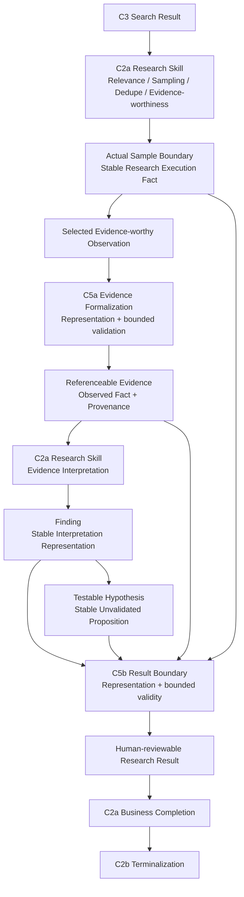

# Ecommerce AI OS — First Research Slice — Research / Evidence Software Design V0.1

- **Phase**: Minimal Software Architecture
- **Step**: 4 — Research / Evidence Software Design
- **Status**: Candidate / Step 4 Complete
- **Architecture Authority**: No
- **Slice**: US / Car Vacuum / TikTok Content Research
- **Walking Implementation**: NOT YET AUTHORIZED
- **Current Next**: Step 5 — Execution Record / Referenceability

---

## 0. Document Purpose, Scope, and Non-Scope

This document records the Step 4 software design candidate for the First Research Slice.

Its purpose is to translate the already-established research and evidence semantics into the minimum software responsibilities needed to carry a human-reviewable research result from Search Result through Evidence, Finding, Hypothesis, and Research Result.

This document is a candidate design record. It is not Architecture Authority, does not reopen Product Architecture or System Architecture, and does not authorize Walking Implementation.

### 0.1 This document answers

```text
How does a C3 Search Result become research evidence?

Who decides evidence-worthiness?

What must C5a preserve when an observation is formalized as Evidence?

How is Actual Sample Boundary represented as a stable Research Execution Fact?

How do Evidence, Finding, and Hypothesis remain distinct and traceable?

Who forms the Research Result?

What does C5b validate or formalize without becoming ResearchService?

How can insufficient evidence be expressed as a valid business outcome?

How are business-result validity and C2b execution terminalization kept separate?

Which references must resolve during the active Research Execution?
```

### 0.2 Scope

This Step covers:

- C3 provider-neutral Search Result consumption by C2a.
- C2a relevance, sampling, deduplication, and evidence-worthiness decisions.
- Actual Sample Boundary as a stable Research Execution Fact.
- C5a Evidence representation and bounded formalization/validation responsibility.
- Evidence nature, observed fact, source, time, missingness, provenance, and referenceability semantics.
- C2a interpretation, Finding formation, and Testable Hypothesis formation.
- Claim-level traceability from Finding/Hypothesis to supporting Evidence.
- C5b Research Result representation and bounded result-validity/formalization responsibility.
- Answerability, Limitations, insufficient evidence, and non-empty-outcome guardrails.
- Business Completion eligibility versus C2b Execution Completion.
- Active-execution referenceability and the handoff of post-terminal representation questions to Step 5.

### 0.3 Non-scope

This document does not:

- redesign Product Architecture or System Architecture;
- add a tenth Contract;
- change D3, C5a, C5b, or any inherited Step 1–3 semantic boundary;
- select Python classes, dataclasses, Pydantic, Protocol, ABC, or any other code representation;
- choose package/module/class layout;
- choose sync/async execution, framework, agent runtime, or LLM framework;
- choose a database, repository, persistence subsystem, Vector DB, Graph DB, or RAG;
- define post-terminal retention or persistence;
- define a ResearchService, EvidenceService, AnalyzeService, or other independent research runtime;
- authorize Walking Implementation.

The following distinction remains central:

```text
Required Software Presence
≠
Independent Runtime Component
```

---

## 1. Inherited Inputs and Invariants

Step 4 inherits, rather than redesigns, the following context:

```text
03_RESEARCH_SEMANTICS.md
01_SOFTWARE_RESPONSIBILITY_MAPPING.md
02_EXECUTION_SPINE_SOFTWARE_DESIGN.md
03_SEARCH_PROVIDER_SPINE_SOFTWARE_DESIGN.md
Architecture review conclusions
Prior Step 2 execution boundaries
Prior Step 3 Search / Provider boundaries
```

The names above identify the inherited design context. This document freezes only the Step 4 software candidate that follows from that context.

### 1.1 D3 / C5a / C5b inherited responsibilities

```text
C2a Research Skill
= relevance, sampling, dedupe, evidence-worthiness,
  Evidence interpretation, Finding formation,
  Hypothesis formation, Research Result formation,
  Answerability / Limitations logic,
  Business Completion declaration.

C3 Search Capability
= provider-neutral Search request/result boundary.

C5a Evidence
= stable Evidence semantics and formalization boundary.

C5b Research Result
= stable human-reviewable Result boundary
  and bounded validity/formalization semantics.

C2b Task Runtime
= execution coordination, failure handling,
  Business Completion recognition, and terminalization.
```

### 1.2 Inherited Step 1–3 software invariants

```text
Responsibility ≠ Contract ≠ Software Component
Contract ≠ Service ≠ Class ≠ Process ≠ API
Runtime Semantic Flow ≠ Software Call Graph
Business Work Request ≠ Execution
Skill = Business Method
Task Runtime = Execution Coordination
Search Request ≠ Provider Request
Search Result ≠ Raw Provider Result
C3 Search Result ≠ Evidence
Provider ≠ Adapter ≠ Access Mechanism ≠ Endpoint
Research Sample Boundary ≠ Search Retrieval Bound
```

The Step 4 candidate must also preserve:

```text
Evidence interpretation remains inside C2a.
Finding and Hypothesis formation remain inside C2a.
C5a does not decide why an observation is worth studying.
C5b does not perform research interpretation.
C5b does not own execution lifecycle transition.
Insufficient Evidence is not an execution failure.
```

### 1.3 First Slice research boundary

The working slice remains:

```text
US / Car Vacuum / TikTok Content Research
```

The result is a human-reviewable Research Result. It is not a validated business truth, final test-priority decision, script, creative direction, or automatic Knowledge update.

---

## 2. Core Software Responsibility Flow

The minimum Step 4 flow is:

```text
C3 Search Result
    ↓
C2a relevance / sampling / dedupe / evidence-worthiness
    ↓
Actual Sample Boundary
    ↓
Selected Observation
    ↓
C5a Evidence formalization
    ↓
Evidence
    ↓
C2a interpretation
    ↓
Finding
    ↓
Testable Hypothesis
    ↓
C2a forms a C5b-valid Research Result
    ↓
C5b Research Result boundary / bounded validity
    ↓
C2a Business Completion
    ↓
C2b terminalization
```

The expanded semantic path is:

```text
C3 Search Result
→ C2a relevance decision
→ C2a sampling decision
→ C2a dedupe decision
→ C2a evidence-worthiness decision
→ Actual Sample Boundary established as a stable execution fact
→ selected observation
→ C5a Evidence formalization / bounded validation
→ referenceable Evidence
→ C2a evidence interpretation
→ evidence-backed Finding
→ traceable, explicitly unvalidated Hypothesis when applicable
→ C2a forms Research Result outcome
→ C5b validates the Result boundary
→ C2a declares Business Completion
→ C2b terminalizes the Execution
```

The flow deliberately does not insert an EvidenceService, AnalyzeService, FindingService, HypothesisService, ResearchService, or TraceabilityService.

---

## 3. Search Result Is Not Evidence

```text
Search Result
≠
Evidence
```

A C3 Search Result is a provider-neutral discovery result. It is a candidate source for research work, not automatically a selected research fact.

The transformation requires C2a to apply:

```text
relevance
sampling
deduplication
research-boundary judgment
evidence-worthiness
```

Only after those business-method decisions can a selected observation enter C5a Evidence formalization.

This distinction prevents the following incorrect shortcut:

```text
C3 Search Result Item
→ automatically Evidence
```

It also prevents a provider payload from silently becoming a research conclusion. Search discovery, evidence admission, observation formalization, and interpretation remain distinct semantics.

### 3.1 Evidence is selected and reviewable

Evidence is:

```text
one selected, reviewable research fact
plus the minimum boundary, source, time,
missingness, and provenance semantics needed to review it.
```

Evidence is not:

```text
the entire Search Result Item
the entire raw provider payload
the entire TT-17 response
an interpretation
a recommendation
a causal business claim
```

A single source item may yield multiple Evidence items when the observations are materially different, for example:

```text
E1: public views observed at a stated observation time
E2: immediate dirt-before-clean contrast in the opening
E3: product demonstrated in a seat-gap scenario
```

---

## 4. Evidence Admission Versus Evidence Formalization

The two responsibilities must remain separate.

```text
C2a decides WHY an observation is worth studying.

C5a defines WHAT must be preserved when it becomes Evidence.
```

### 4.1 C2a Evidence admission

C2a owns the research-method decision that an observation is relevant and evidence-worthy within the current Research Boundary and Actual Sample Boundary.

C2a may decide to:

```text
admit the observation;
exclude the observation;
continue sampling;
search for additional evidence;
continue with other Evidence;
conclude that available evidence is insufficient.
```

C5a must not decide relevance by itself. A formalizer must not silently contain business rules such as `useful(item)` or `should_sample(item)` unless that responsibility is explicitly returned to C2a.

### 4.2 C5a Evidence formalization

C5a owns the stable representation/formalization boundary for an observation already admitted by C2a.

C5a may have bounded executable validation or construction behavior, such as checking whether required evidence semantics can be formed. That bounded behavior does not justify:

```text
EvidenceService
EvidenceRuntime
EvidenceRepository
Evidence DB
Evidence orchestration
```

The current candidate is therefore:

```text
Selected Observation
    ↓
C5a bounded formalization / validation boundary
    ↓
Evidence representation
```

This is a software responsibility, not an approved independent service.

---

## 5. Evidence Minimum Stable Semantic Categories

The Evidence representation must preserve the following semantic categories:

1. **Identity and referenceability** — enough identity semantics to identify the Evidence within the applicable execution boundary.
2. **Observed fact and observation boundary** — what was observed, and the boundary that prevents the observation from being overstated.
3. **Evidence nature** — content-observation and public-performance semantics must remain distinguishable.
4. **Original source reference** — where the observed fact originated.
5. **Provider / capability result references** — references to the C3 capability result and, where needed, the provider result that supports provenance.
6. **Actual Sample Boundary reference** — the established research sample boundary to which the Evidence belongs.
7. **Observation / collection context** — the relevant context in which the observation was made or collected.
8. **Time semantics** — publication time, observation time, collection time, or other applicable time meaning must not be silently conflated.
9. **Missingness** — unavailable, unknown, not returned, or otherwise missing information must not be silently converted into zero, false, or an inferred value.
10. **Provenance / traceability** — enough relationship semantics to review the fact back through Evidence, sample, capability result, provider result, and original source.

These are semantic categories, not a frozen field list:

```text
10 semantic categories
≠
10 fields
≠
10 persistence objects
```

The exact software shape, names, nesting, and reference encoding remain deliberately deferred.

### 5.1 Evidence nature

The software semantics must preserve the distinction:

```text
Public Content Evidence
≠
Public Performance Evidence
```

Content observations may concern visuals, copy, content structure, presentation method, product appearance, or other observable content properties.

Public-performance observations may concern views, likes, comments, or other public performance signals.

The semantic distinction does not require a subclass hierarchy. It also does not permit this unsupported inference:

```text
Public Performance Signal
→ Causal Business Truth
```

### 5.2 Observed Fact versus Interpretation

```text
Observed Fact
≠
Research Interpretation
```

For example:

```text
Observed Fact:
10 sampled videos use an immediate dirt reveal in the opening.

Research Interpretation:
The dirt reveal may contribute to stopping power
for this research question.
```

The first belongs to the Evidence boundary. The second belongs to C2a interpretation and may contribute to a Finding. Evidence must not silently embed interpretation as observed fact.

---

## 6. Actual Sample Boundary

Actual Sample Boundary is a stable Research Execution Fact.

It is not owned exclusively by C5a, is not a C5b-private object, and is not an `EvidenceSet` substitute.

The responsibility flow is:

```text
C2a sampling method
    ↓
Actual Sample Boundary established
    ↓
Evidence references the boundary
Research Result references / exposes the boundary
Step 5 may establish downstream execution-record references
```

Skill-local candidate items, deduplication decisions, selection progress, and sampling reasoning remain Skill Working State until the actual boundary is established.

The boundary must be referenceable as a stable fact, but Step 4 does not select whether that means inline value, local identifier, object reference, URI, repository key, or another representation.

Evidence should not repeatedly copy a full sample object. The minimum semantic rule is:

```text
Actual Sample Boundary
= independently referenceable Research Execution Fact

Evidence
= references it

Research Result
= references / exposes it
```

### 6.1 Multiple Evidence items do not imply EvidenceSet

Multiple Evidence items are a required reality. They may be held as a collection of supporting references in Skill Working State or in a Research Result.

That does not establish an independent `EvidenceSet` entity or service. An EvidenceSet would require its own identity, version, approval, lifecycle, reuse semantics, or other responsibility that is not currently proven.

---
## 7. Finding Software Semantics

Finding is a stable research-interpretation representation, not an independent runtime.

C2a Research Skill owns Finding formation. Finding must be:

```text
Evidence-backed
Sample-bounded
Traceable
Epistemically limited
```

Its minimum semantic direction is:

```text
research interpretation / claim
supporting Evidence references
applicable Research / Sample Boundary relation
epistemic limitation when required
```

Finding must not be reduced to an unsupported free-text summary, but its exact object shape and reference representation remain open. Sample-bounded does not require every Finding representation to copy the complete Research Scope or Actual Sample Boundary payload.

Finding is not:

```text
Validated Business Truth
Final Test Priority Decision
Script
Creative Direction
FindingService
FindingContract
Finding Runtime
```

---

## 8. Hypothesis Software Semantics

Hypothesis is a stable testable-proposition representation formed by C2a from a Finding and/or supporting Evidence.

Its minimum semantic direction is:

```text
testable proposition
supporting Finding reference and/or Evidence reference
research-boundary applicability
explicitly unvalidated status
```

Hypothesis remains a proposition awaiting future experiment and validation. It is not:

```text
Validated Business Truth
Final Test Priority Decision
Experiment execution
Experiment scheduler
Script
Creative Direction
HypothesisService
HypothesisEngine
HypothesisContract
```

The Step 4 candidate does not require priority score, confidence score, experiment plan, validation state machine, owner, or deadline.

---

## 9. Interpretation, Finding, and Hypothesis Ownership

An independent AnalyzeService or Analyze Capability is not required for the First Slice.

The minimum responsibility path is:

```text
C2a Research Skill
    ↓
interprets Evidence
    ↓
forms Finding
    ↓
forms Testable Hypothesis
```

Creating an AnalyzeService would split an already-established C2a Business Method without a separately proven responsibility or Contract. The delete test is direct: deleting AnalyzeService still leaves a complete path from Evidence through Research Skill to Finding and Hypothesis.

---

## 10. Claim-Level Traceability

Claim-level traceability is required. The minimum First Slice direction is:

```text
Finding
    → supporting Evidence

Hypothesis
    → supporting Finding and/or Evidence
```

Evidence then preserves or exposes the downstream provenance direction:

```text
Evidence
    → Actual Sample Boundary
    → C3 Capability Result
    → Raw Provider Result
    → Original Source
```

This does not require:

```text
bidirectional graph
reverse indexes
edge tables
TraceabilityService
Graph DB
Knowledge Graph
```

Exact reference direction and software representation remain open except for the minimum support-reference requirement above.

---

## 11. Research Result and C5b Boundary

### 11.1 Formation ownership

C2a Research Skill owns Research Result formation. C2a forms the business content that may include:

```text
Research Scope / Boundary outcome
Actual Sample Boundary reference
Evidence references
Finding outcome
Hypothesis outcome
Answerability
Limitations
Traceability / provenance
```

C5b does not perform research interpretation and does not generate Findings or Hypotheses by reading Evidence. C5b defines the stable human-reviewable Result boundary and the bounded validity/formalization semantics needed to determine whether the business result is eligible for C2a Business Completion.

### 11.2 C5b minimum stable semantic categories

The Research Result must preserve these semantic categories:

1. **Result identity and referenceability**.
2. **Research Scope / Boundary**.
3. **Actual Sample Boundary reference**.
4. **Evidence references**.
5. **Finding outcome**.
6. **Hypothesis outcome**.
7. **Answerability**.
8. **Limitations**.
9. **Traceability / provenance needed to review claims**.

The Result deliberately does not contain execution status. It is not an Execution Outcome.

The Result also does not become:

```text
final business decision
script
creative direction
validated business truth
automatic Knowledge update
```

### 11.3 References, not full Evidence copies

C5b references Evidence. It does not redefine or fully copy the Evidence payload.

```text
Research Result
→ supporting Evidence references
```

Inline versus referenced representation remains open. The semantic requirement is that a reviewer can follow the Result’s claims to the supporting Evidence within the applicable reference boundary.

### 11.4 Answerability and Limitations

```text
Answerability
≠
Limitations
```

Answerability describes what the current research can answer. Limitations describe why the answer is bounded and what it cannot establish.

The First Slice does not require a confidence score, confidence level, confidence taxonomy, or Answerability taxonomy.

### 11.5 Finding and Hypothesis outcomes may be empty

Finding and Hypothesis outcomes are required semantic surfaces, but positive non-empty claims are not required.

Valid outcomes include:

```text
one or more supported Findings;
no supported Finding;
one or more testable Hypotheses;
no supportable Hypothesis;
an explicit insufficient-evidence outcome with Answerability and Limitations.
```

The system must never fabricate a claim merely to satisfy schema shape:

```text
No supported Finding
≠
generate a Finding anyway
```

---

## 12. Insufficient Evidence and Completion Boundaries

Insufficient Evidence is a valid Research Result outcome.

It is not:

```text
Research Result failure
Execution failure
FAILED_INSUFFICIENT_EVIDENCE
```

A valid path may be:

```text
Search succeeds
    ↓
Actual Sample Boundary
    ↓
available Evidence is formalized
    ↓
C2a completes the available research
    ↓
Evidence is insufficient for a strong conclusion
    ↓
Research Result records Answerability + Limitations + Traceability
    ↓
C2a declares Business Completion
    ↓
C2b terminalizes successfully
```

### 12.1 Result validity is not Execution Completion

```text
C5b
= validates the Research Result boundary

C2a
= declares Business Completion

C2b
= owns Execution terminalization
```

Therefore:

```text
Valid Research Result
≠
Execution Completion
```

Creation or validation of a Result must not mark the Execution successful by itself.

---

## 13. Evidence Formalization Failure Split

This section is a Step 4 software Candidate refinement. It is not presented as a new upstream Contract quote.

The formalization boundary must preserve two different cases.

### 13.1 Case A — Candidate observation cannot satisfy C5a semantics

Examples:

```text
source cannot be reliably located;
observation fact and inference cannot be separated;
observation boundary cannot be established;
time semantics are not identifiable;
necessary provenance cannot be formed.
```

Then:

```text
Candidate Observation
≠
Valid Evidence
```

This is an Evidence-admission/formalization result that the current Research Method can consume. It does not automatically fail the Execution. C2a may exclude the observation, continue with other Evidence, search more, or conclude insufficient evidence.

### 13.2 Case B — C5a software/runtime malfunction

Examples:

```text
formalizer crashes;
required validation code throws an internal error;
reference mechanism becomes unavailable because the software failed.
```

This is not evidence insufficiency. It is a software execution failure and belongs to C2b Execution Failure handling.

The distinction is:

```text
Evidence semantic inadmissibility
≠
Evidence formalizer/runtime malfunction
```

No `EvidenceRejectionContract` or `EvidenceFailureContract` is introduced. The existing C2a / C5a / C2b seams must simply preserve the distinction.

---

## 14. Referenceability and Step 5 Boundary

Evidence, Finding, Hypothesis, and Research Result references must be resolvable during the active Research Execution.

The minimum active-execution obligation is:

```text
Local ownership
+
cross-boundary reference resolution
within the current Research Execution
```

For example:

```text
Skill Working State may own current Evidence objects/references.
Finding can resolve supporting Evidence.
Hypothesis can resolve supporting Finding and/or Evidence.
Research Result can identify supporting Evidence and its Sample Boundary.
```

This does not choose in-memory references, local identifiers, URIs, repositories, databases, or any other mechanism.

Step 4 defines which relationships must be referenceable. Step 5 — Execution Record / Referenceability — decides the exact post-terminal referenceability, retention, and finalization representation.

Referenceability is therefore not permission to introduce:

```text
EvidenceRepository
ResultRepository
database
object store
persistence subsystem
retention policy
```

If a reference becomes necessary for finalized Execution explanation or provenance after terminalization, the post-terminal resolvability obligation is handed to Step 5.

---

## 15. Software Responsibility Flow



```text
Software Responsibility Flow
≠ mandatory service call graph
```

In particular:

```text
C5a Evidence Formalization
= responsibility boundary

C5b Result Boundary
= responsibility boundary
```

They are not approved services named `EvidenceFormalizationService` or `ResearchResultService`.

---

## 16. Full Step 4 Stress-Test Summary

The following records all 26 pressure tests from the three Step 4 rounds.

| Test | Pressure point | Step 4 conclusion |
|---:|---|---|
| 1 | Search Result directly becomes Evidence | Search Result is not Evidence; C2a must select an evidence-worthy observation under the Actual Sample Boundary. **PASS** |
| 2 | Who creates Evidence? | C2a owns admission/evidence-worthiness; C5a owns formalization. Bounded construction/validation may exist without EvidenceService. **PASS** |
| 3 | Minimum Evidence shape | Evidence is one selected reviewable fact with identity, observation, source, sample, time, missingness, and provenance semantics; it is not a whole provider object. **PASS** |
| 4 | Actual Sample Boundary ownership | Actual Sample Boundary is a stable Research Execution Fact; Evidence and Result reference it. It is not C5a-owned state. **PASS** |
| 5 | EvidenceSet entity/service | Multiple Evidence items are required, but no independent EvidenceSet entity/service is justified. **PASS** |
| 6 | Observed Fact versus Interpretation | Evidence preserves the observed fact; C2a owns research interpretation. **PASS** |
| 7 | Content versus Performance evidence classes | Public Content Evidence and Public Performance Evidence must be distinguishable semantically; separate subclasses are not required. **PASS** |
| 8 | Finding as free text or service | Finding needs stable representation semantics, but not FindingService, FindingContract, or a Finding runtime; C2a forms it. **PASS** |
| 9 | Hypothesis Engine | Hypothesis needs stable, traceable, explicitly unvalidated proposition semantics; no HypothesisService or Engine is required. **PASS** |
| 10 | Finding → Hypothesis analysis layer | No independent AnalyzeService / Analyze Capability is required; interpretation and formation remain in C2a. **PASS** |
| 11 | Finding/Hypothesis traceability | Minimum support direction is Finding → Evidence and Hypothesis → Finding and/or Evidence; reverse graph infrastructure is not required. **PASS** |
| 12 | Research Result formation ownership | C2a forms the Result content; C5b defines the valid human-reviewable Result boundary. **PASS** |
| 13 | C5b as only a bag of fields | C5b requires stable Result representation plus bounded validity/formalization semantics, without becoming ResearchService. **PASS** |
| 14 | Copy all Evidence into Result | C5b references Evidence and does not redefine or fully copy its payload; inline/reference shape remains open. **PASS** |
| 15 | Answerability and Limitations | They are separate Result semantics; no confidence score or taxonomy is required. **PASS** |
| 16 | Finding/Hypothesis must be non-empty | Semantic outcomes are required, but positive non-empty claims are not; no claim may be fabricated for schema shape. **PASS** |
| 17 | Insufficient Evidence as failure | Insufficient Evidence is a valid Research Result outcome, not Research Result failure or Execution failure. **PASS** |
| 18 | Result directly marks Execution success | Valid Result is not Execution Completion; C2a declares Business Completion and C2b terminalizes. **PASS** |
| 19 | Result identity/referenceability | Research Result must be referenceable; referenceability is not persistence, repository, or DB design. **PASS** |
| 20 | Four independent research runtimes | C5a, Finding, Hypothesis, and C5b require software presence, but not independent runtime services. **PASS** |
| 21 | Evidence formalization failure | Candidate semantic inadmissibility is continuable research-method input; formalizer/runtime malfunction is software Execution Failure. **PASS_WITH_REFINEMENT** |
| 22 | Evidence minimum semantic categories | Evidence preserves one reviewable fact plus minimum boundary/provenance semantics; categories are not frozen one-to-one fields. **PASS** |
| 23 | Finding minimum semantic categories | Finding preserves interpretation, support, bounded applicability, and required epistemic limitation; exact shape remains open. **PASS** |
| 24 | Hypothesis minimum semantic categories | Hypothesis preserves a traceable testable proposition and remains explicitly unvalidated; it does not own experiment execution or prioritization. **PASS** |
| 25 | Research Result minimum semantic categories | Result preserves identity, scope, sample ref, Evidence refs, Finding/Hypothesis outcomes, Answerability, Limitations, and reviewable provenance; it excludes execution status. **PASS** |
| 26 | Referenceability during and after Execution | Active-execution references must resolve within the current Research Execution; Step 5 decides exact post-terminal representation/retention. No Repository or persistence subsystem follows. **PASS** |

---

## 17. Candidate Decisions S4-01 through S4-35

These are the final Step 4 Candidate decisions, preserving the established substance and order.

| ID | Candidate decision |
|---|---|
| S4-01 | Search Result ≠ Evidence. Evidence admission requires Research Skill selection / evidence-worthiness judgment under an Actual Sample Boundary. |
| S4-02 | C2a owns Evidence admission / evidence-worthiness. |
| S4-03 | C5a owns Evidence formalization semantics. |
| S4-04 | Evidence formalization may require bounded executable behavior, but does not justify EvidenceService. |
| S4-05 | Evidence = selected reviewable research fact, not full Search Result Item or raw payload. |
| S4-06 | Actual Sample Boundary is a stable Research Execution Fact, not C5a/C5b-owned state. |
| S4-07 | Evidence and Research Result reference the Actual Sample Boundary. |
| S4-08 | Multiple Evidence items do not imply an EvidenceSet service/entity. |
| S4-09 | Observed Fact ≠ Research Interpretation. |
| S4-10 | C2a owns interpretation. |
| S4-11 | Public Content Evidence ≠ Public Performance Evidence. |
| S4-12 | Semantic evidence-nature distinction does not yet require a subclass hierarchy. |
| S4-13 | Finding requires stable representation, but not an independent service/runtime/contract; C2a Research Skill owns Finding formation. |
| S4-14 | Hypothesis requires stable representation, but not an independent service/runtime/contract; C2a Research Skill owns Hypothesis formation. |
| S4-15 | Independent AnalyzeService / Analyze Capability is not required; Evidence interpretation, Finding formation, and Hypothesis formation remain inside C2a Business Method. |
| S4-16 | Claim-level traceability uses minimum support references: Finding → supporting Evidence; Hypothesis → supporting Finding / Evidence. Reverse graph infrastructure is not required. |
| S4-17 | Research Skill owns Research Result formation; C5b does not perform research interpretation and defines what a valid human-reviewable Result must preserve. |
| S4-18 | C5b owns stable Result representation plus bounded validity/formalization semantics; C5b is not ResearchService or an independent runtime. |
| S4-19 | Research Result references Evidence; it does not redefine or fully copy Evidence payload. Inline versus referenced representation remains open. |
| S4-20 | Answerability ≠ Limitations. No confidence taxonomy is required. |
| S4-21 | Finding / Hypothesis outcomes are required semantically, but positive non-empty claims are not; the system must never fabricate claims to satisfy schema shape. |
| S4-22 | Insufficient Evidence = valid Research Result outcome, not Research Result failure or Execution failure. |
| S4-23 | Valid Research Result ≠ Execution Completion. C5b validates business output; C2a declares Business Completion; C2b owns Execution terminalization. |
| S4-24 | Research Result must be referenceable; referenceability ≠ persistence, repository, or DB design. |
| S4-25 | C5a / Finding / Hypothesis / C5b all require software presence; none currently require independent runtime services. |
| S4-26 | Candidate Observation rejected by C5a formalization does not automatically fail the Execution. |
| S4-27 | Evidence semantic inadmissibility ≠ Evidence formalizer/runtime malfunction. |
| S4-28 | A continuable Evidence-admission failure returns to the Research Method; a non-continuable software/runtime failure belongs to C2b execution-failure handling. |
| S4-29 | Evidence stable representation must preserve one reviewable research fact and the minimum semantics needed to explain it. |
| S4-30 | Finding requires interpretive outcome + supporting Evidence traceability + bounded applicability; exact duplication/reference shape remains open. |
| S4-31 | Hypothesis must remain traceable and explicitly unvalidated; it does not own experiment execution or prioritization. |
| S4-32 | C5b Research Result contains the stable semantics required for business completion eligibility; it does not own lifecycle transition. |
| S4-33 | During active execution, Evidence / Finding / Hypothesis / Result references must be resolvable within the current Research Execution. |
| S4-34 | Step 4 defines required reference relationships; Step 5 owns exact post-terminal referenceability / retention representation. |
| S4-35 | Referenceability requirement does not justify a Repository or persistence subsystem. |

---

## 18. Explicitly Non-Introduced Items

The following are explicitly not introduced by Step 4:

```text
EvidenceService
EvidenceRepository
EvidenceSet entity
EvidenceSetService
ObservationService
AnalyzeService
Analyze Capability
FindingService
HypothesisService
Hypothesis Engine
ResearchService
TraceabilityService
Confidence Engine
Confidence taxonomy
Evidence Ontology
Graph DB
SampleBoundaryContract
FindingContract
HypothesisContract
AnswerabilityContract
LimitationContract
persistence subsystem
database
DB
Vector DB
RAG
Knowledge integration
automatic Research Result → Knowledge update
```

The absence of these items does not remove the corresponding required semantics. C5a Evidence representation, Actual Sample Boundary, observed-fact/interpretation separation, Finding and Hypothesis representations, claim-level traceability, C5b Result boundary, Answerability, Limitations, and active-execution referenceability remain required software presence.

---

## 19. Representation Questions Deliberately Deferred

Step 4 intentionally does not choose:

```text
Python class / dataclass / Pydantic / Protocol / ABC choices
exact Evidence field names
exact Research Result field names
IDs / URI formats
exact Actual Sample Boundary representation
exact Observation representation
time field model
missingness representation
Finding exact object shape
Hypothesis exact object shape
inline versus referenced Evidence representation
reference direction details beyond minimum claim support
post-terminal retention / persistence
package / module placement
```

Also deferred, because they are outside this Candidate boundary:

```text
sync / async
framework
DB
repository
Vector DB / RAG
Graph DB
LLM framework
agent runtime
transport
deployment
```

---

## 20. Delete Test Matrix

The following matrix reflects the Step 4 delete test exactly at the responsibility level.

| Delete candidate | Can the First Slice still close correctly? | Conclusion |
|---|---:|---|
| `EvidenceService` | YES | Delete |
| `EvidenceRepository` | YES, in the current Step | Do not introduce |
| `EvidenceSetService` | YES | Delete |
| `ObservationService` | YES | Delete |
| `AnalyzeService` | YES | Delete |
| `FindingService` | YES | Delete |
| `HypothesisService` | YES | Delete |
| `ResearchService` | YES | Delete |
| `TraceabilityService` | YES | Delete |
| Confidence Engine | YES | Delete |
| Evidence Ontology | YES | Delete |
| C5a Evidence representation/formalization | NO | Must retain |
| Actual Sample Boundary stable fact | NO | Must retain |
| Observed Fact / Interpretation distinction | NO | Must retain |
| Finding stable representation | NO | Must retain |
| Hypothesis stable representation | NO | Must retain |
| Claim → Evidence traceability | NO | Must retain |
| C5b Research Result boundary | NO | Must retain |
| Answerability | NO | Must retain |
| Limitations | NO | Must retain |
| Evidence / Result referenceability | NO | Must retain |

The delete test confirms:

```text
Required Software Presence
≠
Independent Runtime Component
```

Deleting an unproven service is safe. Deleting a necessary semantic boundary is not.

---

## 21. Step 4 Sufficiency Gate

| Gate | Result |
|---|---|
| Search Result and Evidence are separated | PASS |
| Evidence-worthiness owner is explicit | PASS — C2a |
| Evidence formalization owner is explicit | PASS — C5a |
| EvidenceService was incorrectly introduced | NO |
| Actual Sample Boundary ownership is correct | PASS |
| SampleBoundaryContract was incorrectly introduced | NO |
| Evidence preserves Observed Fact rather than Interpretation | PASS |
| Content / Performance Evidence can be distinguished | PASS |
| Finding formation owner is explicit | PASS — C2a |
| Hypothesis formation owner is explicit | PASS — C2a |
| AnalyzeService was introduced | NO |
| Finding / Hypothesis are traceable to Evidence | PASS |
| Graph / TraceabilityService was introduced | NO |
| Research Result formation owner is explicit | PASS |
| C5b validity/formalization boundary exists | PASS |
| Research Result copies complete Evidence | NO |
| Answerability and Limitations are separated | PASS |
| Confidence score was added | NO |
| Finding/Hypothesis are forced non-empty | NO |
| Insufficient Evidence was incorrectly made a Failure | NO |
| Result validity and Execution Completion are separated | PASS |
| Evidence / Result are referenceable | PASS |
| Persistence / repository / DB was selected early | NO |
| Evidence formalization rejection and runtime failure are separated | PASS_WITH_REFINEMENT |
| A tenth Contract was added | NO |
| System Architecture must be reopened | NO |

---

## 22. Step 4 Verdict

```text
Step 4 Research / Evidence Software Design
= CANDIDATE COMPLETE

Architecture Reopen
= NO

Product Architecture Reopen
= NO

System Architecture Reopen
= NO

Contract Inventory Reopen
= NO

New Contract Required
= NO

Evidence Service Required
= NO

Analyze Service Required
= NO

Research Service Required
= NO

Persistence Architecture Approved
= NO

Walking Implementation
= NOT YET AUTHORIZED
```

### Current Next

```text
Step 5 — Execution Record / Referenceability
```

Step 5 may decide how required execution facts accumulate, finalize, and remain referenceable after terminal closure. It must not be treated as permission to redesign the Step 4 Evidence semantics or to assume a particular persistence technology.

---

## 23. Final One-Line Conclusion

**Step 4 freezes the minimum Evidence, Finding, Hypothesis, and Research Result software semantics and their active-execution traceability boundaries, while keeping interpretation in C2a, lifecycle in C2b, formalization in C5a/C5b responsibilities, and all independent research services and persistence architecture out of scope.**

