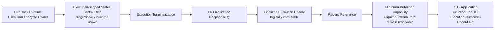

# Ecommerce AI OS — First Research Slice — Execution Record / Referenceability Software Design V0.1

- **Project**: Ecommerce AI OS
- **Phase**: Minimal Software Architecture
- **Step**: 5 — Execution Record / Referenceability
- **Slice**: US / Car Vacuum / TikTok Content Research
- **Status**: Candidate / Step 5 Complete
- **Architecture Authority**: No
- **Walking Implementation**: NOT YET AUTHORIZED
- **Current Next**: Step 6 — Minimal Software Architecture Assembly + Representation Closure

---

## 0. Purpose, Scope, and Non-Scope

### 0.1 Purpose

This document freezes the minimum software semantics required for a finalized C6 Execution Record and for the references needed to explain an Execution after terminalization. It converts the Step 5 pressure-test conclusions into implementation-constraining requirements for Step 6.

The central boundary is:

```text
Runtime State
    !=
Stable Execution Facts
    !=
Finalized Execution Record
```

Step 5 establishes what must be preserved and resolvable. It does not choose the concrete representation or storage medium.

### 0.2 Scope

This document covers:

- execution-scoped stable fact accumulation;
- C2b lifecycle ownership and C6 finalization responsibility;
- finalized Execution Record semantic categories;
- actual participation and provenance reference semantics;
- internal versus external references;
- post-terminal resolvability obligations;
- partial success and failure record semantics;
- minimum retention capability requirements;
- logical immutability of finalized C6;
- Step 5 pressure tests, Candidate Decisions, Delete Test, and Sufficiency Gate;
- implementation constraints handed to Step 6.

### 0.3 Non-scope

This document does not:

- redesign Product Architecture, System Architecture, D1–D5, or Step 1–4;
- add a tenth Contract;
- choose a Python type, package, module, class, protocol, or ABC shape;
- choose memory, file, JSON, SQLite, PostgreSQL, Redis, Vector DB, Document DB, Event Store, or any other storage technology;
- approve a dedicated persistence subsystem;
- define a universal reference model, registry, or central resolver;
- define correction or supersession semantics;
- define restart, cross-process, or long-term durability requirements;
- authorize Walking Implementation.

---

## 1. Inherited Inputs, Invariants, and Authority Boundary

Step 5 inherits the established conclusions from the authoritative C6 / D4 material, the runtime path, Step 1–4 candidate documents, the Deferred Register, and the detailed Contract Consistency Review.

### 1.1 Authoritative input set

The relevant software-design inputs are:

```text
01_SOFTWARE_RESPONSIBILITY_MAPPING.md
02_EXECUTION_SPINE_SOFTWARE_DESIGN.md
03_SEARCH_PROVIDER_SPINE_SOFTWARE_DESIGN.md
04_RESEARCH_EVIDENCE_SOFTWARE_DESIGN.md
00_MINIMAL_SOFTWARE_ARCHITECTURE_PLAN.md
C6 / D4 authoritative Contract and referenceability material
Deferred Register
Detailed Contract Consistency Review
```

The inputs remain authoritative for their own boundaries. This document adds no upstream semantic redesign.

### 1.2 Inherited responsibility map

```text
C1
= transport-neutral Execution entry, rejection, and terminal return seam

C2b
= current Execution lifecycle owner and coordinator

C2a
= executable Research business method

C3
= provider-neutral Search Capability boundary

C4a
= current static Search → Scrape Creators binding

C4b
= provider-specific translation and quirk-absorption boundary

C5a
= Evidence representation and formalization responsibility

C5b
= stable Research Result / Business Result boundary

C6 / D4
= stable Execution facts, referenceability, and terminal finalization responsibility
```

### 1.3 Inherited runtime invariants

The following invariants remain closed and are not reopened by Step 5:

1. A valid Business Work Request becomes an Execution only after C1 admission and Execution establishment.
2. C2b owns the current Execution, its canonical Execution Context, coordination, failure handling, and terminalization.
3. C2a owns Research Method judgment, including relevance, sampling, evidence-worthiness, interpretation, Finding / Hypothesis formation, answerability, limitations, and Research Result formation.
4. C2b coordinates Capability invocation; C2a does not directly invoke the concrete Provider.
5. C3 remains provider-neutral; C4a remains static binding; C4b owns Provider translation.
6. Search Result is not Evidence. Evidence is not Research Interpretation.
7. Research Result is not Execution Completion. C2a declares Business Completion; C2b terminalizes the Execution.
8. Evidence, Research Result, and other relevant facts are referenceable within the active Research Execution.
9. Referenceability is not, by itself, a Repository, database, persistence architecture, or universal object model.
10. Insufficient Evidence can be a valid Research Result outcome and is not automatically Research or Execution Failure.
11. Provider-specific payloads and mechanics stay below the C3 / C4b boundary, with only necessary provenance references exposed upward.
12. Walking Implementation remains unauthorized.

### 1.4 Deferred Register and Contract Review inheritance

The following remain deferred rather than missing:

- exact C6 accumulator / finalizer representation;
- exact C6 field names, types, and reference encoding;
- exact post-terminal retention duration;
- exact persistence or serialization medium;
- package, module, class, and callable placement;
- correction, amendment, and supersession behavior;
- restart and cross-process durability;
- application transport representation.

The detailed Contract Consistency Review found no need to reopen the Contract Inventory, add a tenth Contract, or convert C6 semantics into a new runtime service.

---

## 2. Core Lifecycle Candidate

### 2.1 Lifecycle sequence

The minimal lifecycle is:

```text
Execution begins
    ↓
C2b establishes and owns the Execution lifecycle
    ↓
Stable execution facts / references progressively become known
    ↓
Business work and Capability coordination continue
    ↓
Execution terminalization
    ↓
C6 finalization responsibility
    ↓
Finalized Execution Record
    ↓
Execution Outcome / Record Reference returned to C1 / Application
```

The sequence does not imply a service graph, an event graph, a database transaction, or a separate Recorder Runtime.

### 2.2 Three-state separation

#### Runtime State

Runtime State is live coordination state owned by C2b. It may include current control flow, temporary working objects, provisional values, active Capability calls, and Skill Working State references. It is disposable unless a specific fact has been promoted to stable execution semantics.

#### Stable Execution Facts

Stable Execution Facts are facts that became actually known during the Execution and are necessary for later Execution explanation, terminal closure, required provenance, or business-output traceability. They become known progressively. They are not the complete runtime history and are not automatically every object observed during execution.

#### Finalized Execution Record

The Finalized Execution Record is the terminal C6 representation of the stable facts and references valid for that terminal outcome. It is not a live pointer to Runtime State, not a trace stream, and not a full copy of all foreign-owned payloads.

### 2.3 Finalization boundary

C6 finalization occurs at terminalization, after C2b has determined that the Execution is entering a terminal state. C6 must support the facts available for the actual terminal path, including partial success and terminal failure.

Finalization is a responsibility and semantic boundary. It does not currently require:

```text
ExecutionRecordBuilder
ExecutionRecordDraft
FinalExecutionRecord class
RecordSnapshotter
SnapshotService
```

Step 6 may choose an implementation shape only if needed to satisfy the frozen semantics.

### 2.4 Application return boundary

The Application receives:

```text
Business Result
+
Execution Outcome / Record Reference
```

It does not receive the complete C6 payload by default. The application-facing `Record Reference` must resolve to the finalized C6 Execution Record. Returning a reference that resolves only to live Runtime State, or that becomes invalid immediately after the Execution Context is destroyed, is invalid software behavior.

---

## 3. Ownership and Fact Accumulation

### 3.1 C2b remains lifecycle owner

C2b remains the lifecycle owner for execution-scoped stable fact accumulation. It establishes the Execution, coordinates the runtime path, recognizes terminalization, and coordinates the handoff to C6 finalization.

This does not make C2b the owner of every domain fact. Other responsibilities retain local ownership of the facts they form and expose the stable facts or references required for Execution closure.

### 3.2 Local ownership with execution-level closure

The ownership rule is:

```text
Local responsibility owns its domain meaning
    ↓ exposes stable fact / result / reference
C2b retains only execution-level actual facts / references needed for closure
    ↓
C6 finalizes the terminal Execution Record
```

Examples:

```text
C2a owns Research interpretation and Research Result formation.
C5a owns Evidence semantics and formalization.
C5b owns Research Result boundary semantics.
C3/C4b own provider-neutral result and provider translation boundaries.
C2b retains the actual participation and execution-level references needed for C6 closure.
```

There is no direct multi-writer ownership of a finalized C6 Record. Local responsibilities expose facts; C2b coordinates execution-level collection and C6 owns terminal finalization semantics.

### 3.3 No RecorderService / Fact Sink / Event Bus / Record Runtime

The requirement for stable facts and finalization does not justify:

```text
RecorderService
Fact Sink
Event Bus
Message Architecture
Record Runtime
ExecutionRecordService
```

The lifecycle can close through C2b-owned coordination plus C6 finalization responsibility. A separate recorder would add an unproven writer, ordering, delivery, and failure architecture without being required by the established semantics.

---

## 4. C6 Minimum Semantic Categories

The following are semantic categories, not an exact field list. Step 5 freezes the categories and obligations; Step 6 may decide their concrete representation.

### 4.1 Record identity and referenceability

C6 must provide the identity semantics needed to identify the finalized Execution Record and resolve the Application-facing Record Reference within its declared required lifecycle.

### 4.2 Execution / Task identity

C6 must identify which Execution occurred and which Task / Business Work Request it served, using the minimum references needed to explain the relationship.

### 4.3 Input references

C6 must preserve references to the inputs needed to explain what the Execution acted on. This does not require copying complete Product Briefs, Research Contexts, or foreign-owned input payloads into C6.

### 4.4 Actual participation facts

C6 records facts about what actually participated:

```text
Actual Skill reference
Actually invoked Capability references
Actually resolved / used Provider reference
```

These are facts of the actual Execution, not merely configured possibilities.

### 4.5 Version and reproducibility facts

Where relevant, C6 preserves the version or reproducibility facts needed to explain the actual Execution, such as applicable Skill, Capability, Adapter, or Contract-related version references. Exact version formats are deferred.

### 4.6 Relevant produced and provenance references

C6 may preserve references to relevant produced or provenance-bearing outputs:

```text
Capability Result references
Actual Sample Boundary reference, when relevant
Evidence references
Research Result / Business Output reference
Raw Provider Result reference, only when required for provenance
```

“Relevant” means necessary for finalized Execution explanation, required provenance, or business-output traceability. It does not mean every Search occurrence, temporary object, intermediate result, log line, or payload ever produced.

### 4.7 Terminal outcome and failure facts

C6 preserves the terminal outcome and, when applicable, stable Failure Facts sufficient to explain why the Execution reached its terminal failure state. Success and failure records may contain different valid reference sets.

### 4.8 Semantic categories are not exact fields

Step 5 does not freeze:

```text
exact field names
exact field types
exact nesting
exact ID format
exact reference string format
```

The categories are implementation constraints, not a new C6 Contract and not permission to invent a tenth Contract.

---

## 5. Actual Facts, Declared Dependencies, and Provider Reality

### 5.1 Declared Dependency is not Actual Invocation Fact

```text
Declared Dependency
    !=
Actual Invocation Fact
```

A Skill may declare a Capability dependency. That declaration does not prove that the Capability was invoked in a specific Execution. C6 records the actual invocation fact only when the invocation actually occurred and the fact is known.

### 5.2 Configured Provider Binding is not Actually Used Provider

```text
Configured Provider Binding
    !=
Actually Resolved Provider
    !=
Actually Used Provider
```

The current static binding is Search → Scrape Creators. Nevertheless, the finalized Execution Record must not infer actual Provider use from configuration alone. C6 may record the Provider that was actually resolved and used for the relevant invocation.

### 5.3 No declared possibility inflation

C6 must not record:

```text
Capability was used because it was declared
Provider was used because it was configured
Evidence exists because a search result was available
Research Result exists because the Skill was bound
```

Each fact must reflect what actually happened in the Execution.

---

## 6. Partial Terminal Facts and Failure Semantics

### 6.1 Partial terminal facts are valid

C6 supports partial terminal facts. A terminal record may contain only the facts that were actually established before terminalization.

Examples:

```text
Execution established, but no Capability invoked.
Capability invoked, but no valid result returned.
Provider resolved, but invocation failed.
Search returned, but no Evidence was admitted.
Research Result formed and Business Completion declared, but C6 finalization failed.
```

The absence of a reference in a valid terminal record is not automatically an architecture gap. It may be the correct semantic result of that path.

### 6.2 Success and failure reference sets differ

Success and failure records may have different valid reference sets:

```text
Success may include Business Result, Evidence, Sample Boundary, and Capability Result refs.
Failure may include only Execution identity, input refs, actual participation facts, and Failure Facts.
```

Evidence, Research Result, and Business Output references are not always required.

### 6.3 Failure Facts are bounded

Failure Facts explain the terminal failure at the C6 semantic level. They are not:

```text
full logs
trace history
raw Provider errors
stack traces
metrics
observability payloads
```

C6 must not become a Trace system or Observability backend. Provider-specific raw errors remain below the established C4b / C3 normalization boundary unless a stable, execution-level failure fact is required for closure.

### 6.4 C6 finalization failure

C6 finalization failure may occur after Business Completion. It is:

```text
not Research Business Failure
```

It prevents clean Execution closure because the required finalized C6 Record and/or required Record Reference could not be established. This does not imply any of the following:

```text
Retry Engine
secondary Recorder
transactional outbox
Checkpoint
Crash Recovery
Durable Execution subsystem
```

Those are separate architecture decisions and remain outside Step 5.

---

## 7. Reference Semantics

### 7.1 Narrow definition

For Step 5:

```text
Reference
= stable identification / resolution semantics
  within a declared lifecycle and scope
```

Reference is not, by definition:

```text
database primary key
URI
file path
UUID
object pointer
storage technology
```

Any of those could be a future representation choice for a target-specific reference, but none is frozen here.

### 7.2 Target-specific semantics

Reference semantics remain local to the referent and its owning responsibility:

```text
Execution Record reference
→ identifies and resolves a finalized C6 Record.

Research Result reference
→ identifies and resolves the Business Result representation.

Evidence reference
→ identifies and resolves supporting Evidence.

Capability Result reference
→ identifies the provider-neutral Capability Result.

Provider reference
→ identifies the Provider actually resolved / used.

Original Source reference
→ identifies the corresponding object in the external source world.
```

These references may share a low-level representation convention later, but they do not become one universal semantic model.

### 7.3 Internal versus external references

#### System-controlled internal references

An OS-controlled internal reference is a reference whose referent and resolution responsibility are within the software representations controlled by the Ecommerce AI OS or its declared local retention capability. If the reference is necessary for finalized Execution explanation, required provenance, or business-output traceability, it inherits the post-terminal resolvability obligation for its declared lifecycle.

#### External / original-source references

An external reference preserves the identity and provenance of an object in the external source world, such as a TikTok source item or Provider-side identity. The OS must preserve the source identity needed for provenance, but external availability is not guaranteed.

```text
External source disappearance
    !=
Internal reference integrity failure
```

It becomes an internal integrity failure only when a required OS-controlled internal reference is broken during its required lifecycle, not merely because an external website or source object later becomes unavailable.

### 7.4 Required references versus all runtime objects

Not every runtime object or produced result requires post-terminal retention. The obligation applies only to references necessary for:

```text
finalized Execution explanation
required provenance
business-output traceability
```

Observed during execution is not the same as referenced by the finalized Execution, and neither is the same as a required post-terminal referent.

### 7.5 Disposable pointers are insufficient

Plain disposable runtime object pointers are insufficient when the referent must remain resolvable after the Execution Context is destroyed:

```text
Execution terminal
    ↓
Execution Context destroyed
    ↓
plain object pointer dies
    ↓
Record Reference becomes unusable
```

That fails the application-facing referenceability obligation.

Retained process memory may be a candidate for bounded process-lifetime resolvability. It does not prove restart durability, cross-process durability, or long-term retention, none of which is currently required or proven.

### 7.6 Resolution ownership

There is no central `ReferenceResolverService`. Resolution remains locally owned by the representation that owns the referent:

```text
Evidence reference
→ Evidence-owning representation resolves it.

Research Result reference
→ Result-owning representation resolves it.

Execution Record reference
→ C6-owning retention representation resolves it.
```

Referenceability obligation does not imply a global resolver, object registry, or resource locator.

### 7.7 UniversalReference is not introduced

Step 5 does not introduce:

```text
UniversalReference Contract
UniversalReference model
Global Reference Registry
```

Step 6 may choose a shared low-level coding convention if it helps the First Slice, but that convention must not be mistaken for a universal domain Contract.

---

## 8. Minimum Retention Capability

### 8.1 Freeze requirements, not a medium

Step 5 freezes the following `Minimum Retention Representation Requirements`:

1. The finalized C6 Record must survive terminalization.
2. The returned Record Reference must remain resolvable.
3. Required internal provenance and result references must remain resolvable for their required lifecycle.
4. Retention must not depend on a disposable Execution Context.
5. The exact medium is chosen in Step 6 Representation Closure.

This is an implementation-constraining capability requirement, not a decision to create a `RetentionService` or `PersistenceService`.

### 8.2 Candidate retention observations

The following observations are recorded without selecting a medium:

```text
Pure disposable runtime memory
= rejected when it makes required refs die at terminalization.

Retained process memory
= technically viable candidate for bounded process-lifetime resolvability.

Local file / JSON
= technically possible candidate, but not selected in Step 5.

SQLite / database
= technically possible candidate, but not selected in Step 5.
```

No candidate is approved by Step 5. Step 6 must test the concrete candidate against the requirements in Section 18.

### 8.3 Dedicated persistence remains unproven

The existence of a finalized Execution Record does not imply:

```text
Repository
SQLite
PostgreSQL
Redis
Vector DB
Document DB
Event Store
Dedicated Persistence Subsystem
```

The semantic requirement is Minimum Retention Capability. The concrete retention representation is deferred to Step 6.

### 8.4 Mixed inline and reference semantics

C6 uses mixed semantics:

```text
Small C6-owned stable facts
→ may be carried directly.

Foreign-owned / domain-owned / provider-owned / business-owned objects
→ are referenced, not duplicated by default.
```

This allows C6 to be explanatory without becoming a payload warehouse.

### 8.5 No durability-by-duplication shortcut

C6 must not solve reference durability by duplicating full:

```text
Research Result
Evidence
Search Result
Raw Provider Result
logs
runtime history
```

The correct solution is:

```text
target-specific reference semantics
+
required referent retention / resolution responsibility
```

not full foreign-payload duplication.

---

## 9. Finalized C6 Immutability and Integrity

### 9.1 Logical immutability

Finalized C6 is logically immutable. Once terminal finalization succeeds, the finalized record represents the terminal facts for that Execution and is not a live accumulation surface.

The exact immutability mechanism is deferred. Step 5 does not choose frozen dataclasses, copy-on-write, serialization boundaries, database constraints, or any other mechanism.

### 9.2 Correction and supersession remain open

Correction, amendment, replacement, and supersession semantics are NOT YET DESIGNED. Logical immutability does not answer how a future correction would be represented.

### 9.3 Broken required internal references

```text
Broken required internal reference
during its required lifecycle
= C6 integrity failure
```

This is distinct from external source disappearance when the external source identity and provenance were preserved.

The integrity rule does not prescribe an automatic recovery component, retry path, or database transaction.

---

## 10. Research Result, Business Output, and Execution Record

```text
Research Result
    !=
Execution Record
```

The Research Result is the C5b business output boundary. The Execution Record is the C6 explanation of what actually happened at the Execution level, including actual participation, terminal outcome, and relevant references.

The Application receives:

```text
Business Result
+
Execution Outcome / Record Reference
```

The Application does not receive the full C6 payload by default. C6 may reference the Research Result / Business Output when relevant, but must not absorb the Result’s full foreign-owned representation merely to make C6 self-contained.

---

## 11. Software Responsibility / Lifecycle View



**Software Responsibility / Lifecycle View != mandatory service graph.**

The following labels are responsibilities or capabilities, not approved services:

```text
FACTS
= execution-scoped stable-fact responsibility

C6 Finalization
= terminal finalization responsibility

Retention
= minimum retention capability
```

The diagram does not authorize `RecorderService`, `Record Runtime`, `RetentionService`, `Repository`, `ReferenceResolverService`, or a database.

---

## 12. Full Three-Round Pressure-Test Summary

The following summary records all 27 Step 5 pressure tests and their conclusions.

### Round 1 — Lifecycle, ownership, and minimum C6 semantics

| # | Pressure test | Conclusion | Result |
|---:|---|---|---|
| 1 | Is the Execution Record the live Runtime State? | No. Runtime State, Stable Execution Facts, and Finalized Execution Record remain separate. | **PASS** |
| 2 | Are stable facts known only at the end? | No. Stable facts and references become known progressively; C6 finalizes at terminalization. | **PASS** |
| 3 | Does C6 take over Execution lifecycle ownership? | No. C2b remains the Execution lifecycle owner; C6 owns finalization semantics. | **PASS** |
| 4 | Must every responsibility write directly to C6? | No. Local responsibilities retain local ownership and expose facts/results; C2b retains execution-level facts/references needed for closure. | **PASS** |
| 5 | Can declared dependencies stand in for actual participation? | No. C6 records actual Skill, Capability, and Provider participation facts. | **PASS** |
| 6 | Can configured Provider binding stand in for actually used Provider? | No. Configured binding, resolved Provider, and actually used Provider remain distinct. | **PASS** |
| 7 | What is the minimum C6 semantic surface? | Record identity, Execution/Task identity, input refs, actual participation, versions/reproducibility, relevant produced/provenance refs, terminal/failure facts. | **PASS** |
| 8 | Must every success record contain every possible reference? | No. Success and failure records may have different valid reference sets; partial terminal facts are valid. | **PASS** |
| 9 | Are Failure Facts full logs or traces? | No. Failure Facts explain terminal failure but are not logs, traces, raw errors, stack traces, metrics, or observability payloads. | **PASS** |
| 10 | Is Research Result the same as Execution Record? | No. Research Result is Business Result; C6 is the finalized Execution explanation. | **PASS** |
| 11 | What does the Application receive? | Business Result plus Execution Outcome / Record Reference, not full C6 payload by default. | **PASS** |
| 12 | Can C6 record facts that never actually occurred? | No. C6 records actual, established facts only and does not inflate declared/configured possibilities. | **PASS** |

### Round 2 — Reference semantics, lifecycle, and retention obligation

| # | Pressure test | Conclusion | Result |
|---:|---|---|---|
| 13 | Is Reference a database key, URI, UUID, path, or object pointer by definition? | No. Reference means stable identification/resolution semantics within a declared lifecycle and scope. | **PASS** |
| 14 | Must every reference remain resolvable forever? | No. Only required internal references needed for finalized explanation, required provenance, or business-output traceability inherit the post-terminal obligation. | **PASS** |
| 15 | Does internal referenceability guarantee external source availability? | No. External identity/provenance must be preserved, but external availability is not guaranteed. | **PASS** |
| 16 | Must every runtime object/result survive terminalization? | No. Transient runtime objects and unreferenced intermediate results do not automatically inherit post-terminal retention. | **PASS** |
| 17 | Are plain runtime object pointers sufficient for required post-terminal references? | No. Disposable pointers die with the Execution Context and cannot satisfy the required Record Reference obligation. | **PASS** |
| 18 | Does retained process memory prove restart/cross-process durability? | No. It is a possible bounded process-lifetime candidate only; restart, cross-process, and long-term durability are not currently required or proven. | **PASS** |

### Round 3 — Representation choice, duplication, and closure sufficiency

| # | Pressure test | Conclusion | Result |
|---:|---|---|---|
| 19 | Should Step 5 select memory, retained memory, file, JSON, SQLite, or DB? | No. Step 5 freezes minimum retention requirements; Step 6 chooses the concrete representation. | **PASS** |
| 20 | Should the project create a UniversalReference model or Contract? | No. Reference semantics remain target-specific; a shared low-level representation convention may be chosen later. | **PASS** |
| 21 | Should the project create a central ReferenceResolverService? | No. Resolution remains locally owned by the representation that owns the referent. | **PASS** |
| 22 | What exact stable C6 categories must survive? | Identity, Execution/Task, inputs, actual participation, versions/reproducibility, relevant produced/provenance refs, and terminal/failure facts. Categories are not exact fields. | **PASS** |
| 23 | Should C6 copy full Evidence, Research Result, Search Result, or Raw Provider payloads? | No. C6 uses mixed inline/reference semantics and must not become a payload warehouse. | **PASS** |
| 24 | Does finalization require an ExecutionRecordBuilder, snapshot service, or draft/final class pair? | No. Finalization semantics are frozen; exact implementation shape remains deferred. | **PASS** |
| 25 | Must C6 retain the full chronology of fact accumulation? | No. C6 stores finalized stable facts, not the full history of when facts became known. | **PASS** |
| 26 | Does the minimum design require Repository, Recorder, Resolver, or Database layers? | No. Those are removable. Minimum Retention Capability, C6 finalization, and required referenceability are not removable. | **PASS** |
| 27 | Is Step 5 too vague for Step 6 to choose a representation? | No. Step 5 provides concrete requirements that candidate retention representations must be tested against. | **PASS** |

---

## 13. Candidate Decisions S5-01 through S5-29

| ID | Candidate decision |
|---|---|
| **S5-01** | Execution Record is not live Runtime State. |
| **S5-02** | Stable facts become known progressively; C6 finalizes at terminalization. |
| **S5-03** | C2b remains lifecycle owner; no RecorderService. |
| **S5-04** | Other responsibilities keep local ownership; C2b retains execution-level facts/refs. |
| **S5-05** | C6 records actual facts, not declared/configured possibilities. |
| **S5-06** | Minimum semantics: identity/task, inputs, actual participation, versions/reproducibility, relevant result/evidence/output refs, terminal outcome, and failure facts. |
| **S5-07** | Success/failure may have different valid reference sets. |
| **S5-08** | Failure Facts are not logs, trace, or raw error persistence. |
| **S5-09** | Research Result is not Execution Record. |
| **S5-10** | Application gets Business Result plus Execution Outcome / Record Reference, not full C6 payload by default. |
| **S5-11** | Reference means stable identification/resolution semantics, not a prescribed storage key. |
| **S5-12** | Only required internal references for explanation, provenance, or business-output traceability inherit post-terminal resolvability. |
| **S5-13** | Internal reference resolvability is not external source availability. |
| **S5-14** | Required references outlive transient Execution state; disposable object pointers are insufficient. |
| **S5-15** | A minimum retention mechanism is required; dedicated persistence architecture is not approved; Step 6 closes concrete representation. |
| **S5-16** | C6 uses mixed inline C6-owned facts plus cross-boundary references. |
| **S5-17** | Finalized C6 is logically immutable. |
| **S5-18** | A broken required internal reference during its required lifecycle is an integrity failure. |
| **S5-19** | C6 finalization failure prevents clean Execution closure, but is not Research Business Failure. |
| **S5-20** | The Application-facing Record Reference resolves to the finalized C6 Record. |
| **S5-21** | Step 5 freezes minimum retention requirements, not memory, file, JSON, SQLite, or DB. |
| **S5-22** | Reference semantics are target-specific; no UniversalReference Contract, model, or registry. |
| **S5-23** | No central ReferenceResolverService is required. |
| **S5-24** | Finalized C6 stable semantics are: record identity; Execution/Task identity; input refs; actual participation; version/reproducibility; relevant produced/provenance refs; terminal/failure facts. |
| **S5-25** | C6 must not solve durability through full foreign-payload duplication. |
| **S5-26** | Finalization semantics do not require a separate ExecutionRecordBuilder. |
| **S5-27** | C6 stores finalized stable facts, not fact-accumulation chronology. |
| **S5-28** | Recorder, Repository, Resolver, and Database are removable; Minimum Retention Capability is not. |
| **S5-29** | Step 5 is implementation-constraining enough for Step 6 to choose a concrete representation without reopening retention semantics. |

---

## 14. Delete Test Matrix

| Candidate component / mechanism | Delete? | Step 5 conclusion |
|---|---:|---|
| `RecorderService` / Recorder Runtime | YES | C2b lifecycle ownership plus C6 finalization responsibility is sufficient. |
| Fact Sink | YES | Stable facts can be accumulated under C2b ownership without a sink. |
| Event Bus / Message Architecture | YES | No event-delivery architecture is required by C6 semantics. |
| `ExecutionRecordRepository` | YES | A concrete repository layer is not required; the chosen retention representation must still resolve the Record Reference. |
| `EvidenceRepository` | YES | Required Evidence refs can be resolved by the Evidence-owning representation. |
| `ReferenceResolverService` | YES | Resolution remains local to the referent owner. |
| UniversalReference model / Contract / registry | YES | Target-specific reference semantics remain sufficient. |
| RetentionService | YES | Minimum Retention Capability is required, but not a named service. |
| PersistenceService / StorageService | YES | A dedicated storage service is not proven. |
| Database | YES | Step 5 does not impose a database-level requirement. |
| Trace system / Observability backend | YES | C6 stores bounded Failure Facts and stable facts, not full chronology or telemetry. |
| Full raw/result/evidence payload duplication | YES | Duplication is prohibited as the default durability strategy. |
| C2b execution-scoped stable fact responsibility | NO | Required for execution-level closure. |
| C6 finalized representation | NO | Required for a finalized Execution Record. |
| Record Reference semantics | NO | Required for Application-facing referenceability. |
| Required internal reference resolvability | NO | Required for integrity and provenance. |
| Minimum Retention Capability | NO | Required after terminalization. |
| Terminal finalization semantics | NO | Required for clean Execution closure. |
| Partial failure record support | NO | Required for valid partial and failure terminal paths. |

The Delete Test proves:

```text
Required Software Presence
    !=
Independent Runtime Component
```

---

## 15. Step 5 Sufficiency Gate

| Gate | Result |
|---|---|
| Runtime State and C6 are separated | **PASS** |
| Stable facts progressively become known | **PASS** |
| C2b lifecycle ownership is preserved | **PASS** |
| Other responsibilities keep local ownership | **PASS** |
| C2b retains only execution-level facts/refs needed for closure | **PASS** |
| Declared and actual participation are separated | **PASS** |
| Configured Provider and actually used Provider are separated | **PASS** |
| C6 supports partial terminal facts | **PASS** |
| Success and failure may have different valid reference sets | **PASS** |
| Failure Facts are not logs, trace, or raw observability payloads | **PASS** |
| Research Result and Execution Record are separated | **PASS** |
| Application gets Business Result plus Outcome / Record Reference | **PASS** |
| Reference is not defined as a database key or URI | **PASS** |
| Internal and external references are separated | **PASS** |
| Required internal refs inherit the appropriate post-terminal obligation | **PASS** |
| All runtime objects are not forced into retention | **PASS** |
| Disposable runtime pointers are rejected for required post-terminal refs | **PASS** |
| Retained process memory is treated only as a candidate | **PASS** |
| Minimum retention requirements are frozen without selecting a medium | **PASS** |
| Mixed inline/reference semantics are preserved | **PASS** |
| Finalized C6 is logically immutable | **PASS** |
| Broken required internal refs have integrity-failure semantics | **PASS** |
| C6 finalization failure blocks clean closure but is not Research Business Failure | **PASS** |
| No Retry Engine, secondary recorder, or transactional outbox is implied | **PASS** |
| No Repository Layer is required | **PASS** |
| No ReferenceResolverService is required | **PASS** |
| No Database is required | **PASS** |
| No UniversalReference Contract/model/registry is required | **PASS** |
| Full foreign-payload duplication is excluded | **PASS** |
| Fact accumulation chronology is not required by default | **PASS** |
| Step 6 receives implementation-constraining retention requirements | **PASS** |
| No tenth Contract is added | **PASS** |
| Architecture, Product Architecture, and System Architecture remain closed | **PASS** |
| Walking Implementation remains unauthorized | **PASS** |

---

## 16. Explicitly Non-Introduced Items

Step 5 does not introduce any of the following:

```text
RecorderService / Recorder Runtime
Fact Sink
Event Bus / Message Architecture
ExecutionRecordRepository
EvidenceRepository
ReferenceResolverService
UniversalReference Contract / model / registry
RetentionService
PersistenceService / StorageService
Dedicated Persistence Subsystem
SQLite
Postgres / PostgreSQL
Redis
Vector DB
Document DB
Event Store
Trace system / Observability backend
Retry Engine
Checkpoint
Crash Recovery
Durable Execution
Transactional outbox
full raw/result/evidence payload duplication
new Contract
```

The absence of these items does not remove the required semantics. C6 stable facts, finalization, referenceability, required internal resolution, and Minimum Retention Capability remain required software presence.

---

## 17. Deliberately Deferred Representation Questions

The following questions are deliberately deferred to Step 6:

```text
Python dataclass / Pydantic / Protocol / ABC / class choices
exact C6 field names and types
exact ID / reference string format
URI / path / key conventions
in-memory vs file vs JSON vs SQLite vs other representation
exact retention duration / lifecycle
restart durability
cross-process durability
resolver API shape
immutable implementation mechanism
correction / supersession semantics
package / module / class placement
```

Deferred does not mean that the semantics are vague. Step 5 freezes the constraints that every candidate representation must satisfy.

---

## 18. Step 6 Implementation-Constraint Handoff

Step 6 must test each candidate retention representation against the following requirements:

1. It must preserve the finalized C6 Record after terminalization.
2. It must make the returned Application-facing Record Reference resolvable.
3. It must keep required internal provenance and result references resolvable for their declared lifecycle.
4. It must not depend on disposable Runtime State or an object pointer that dies with the Execution Context.
5. It must support partial terminal facts and success/failure records with different valid reference sets.
6. It must preserve actual participation facts rather than inferred declarations or configured bindings.
7. It must support the C6 semantic categories without forcing exact field names prematurely.
8. It must support mixed semantics: small C6-owned facts may be carried directly; foreign-owned objects are referenced by default.
9. It must not require full Research Result, Evidence, Search Result, Raw Provider Result, logs, or runtime-history duplication.
10. It must preserve logical immutability after successful finalization.
11. It must expose or enable locally owned resolution for the referents it controls without a central resolver service.
12. It must distinguish an internal broken required reference from external source disappearance.
13. It must allow C6 finalization failure to be represented as a failure of clean Execution closure without implying Retry Engine, transactional outbox, or secondary recorder architecture.
14. It must remain compatible with C2b lifecycle ownership and local ownership of C2a/C3/C4b/C5a/C5b facts.
15. It must leave the exact retention medium, lifecycle duration, and restart/cross-process durability policy explicit rather than silently inventing them.

Step 6 therefore performs:

```text
Candidate retention representation
    ↓ tested against frozen requirements
Minimum concrete representation
    ↓
Step 6 Representation Closure
```

It must not reopen the retention semantics merely because it chooses a concrete representation.

---

## 19. Final Verdict

```text
Step 5 — Execution Record / Referenceability
= CANDIDATE COMPLETE

Architecture Reopen
= NO

Product Architecture Reopen
= NO

System Architecture Reopen
= NO

Contract Inventory Reopen
= NO

New Contract Required
= NO

Recorder Service Required
= NO

Repository Layer Required
= NO

Reference Resolver Required
= NO

Database Required
= NO

Minimum Retention Capability
= REQUIRED

Concrete Retention Representation
= DEFERRED TO STEP 6 REPRESENTATION CLOSURE

Walking Implementation
= NOT YET AUTHORIZED
```

### Current Next

```text
Step 6 — Minimal Software Architecture Assembly + Representation Closure
```

### Final one-line conclusion

Step 5 freezes what stable execution facts and references must survive terminalization and remain resolvable, without prematurely choosing a repository, resolver, recorder, or database.
