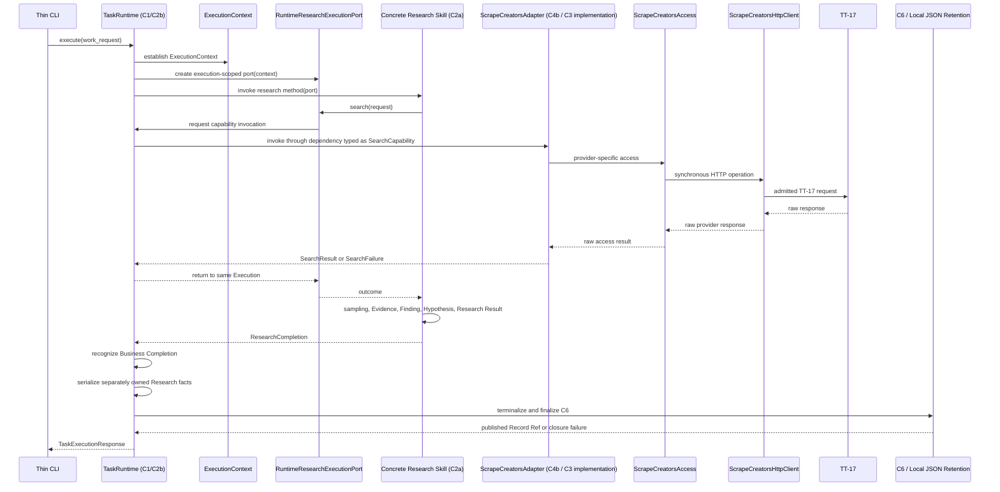
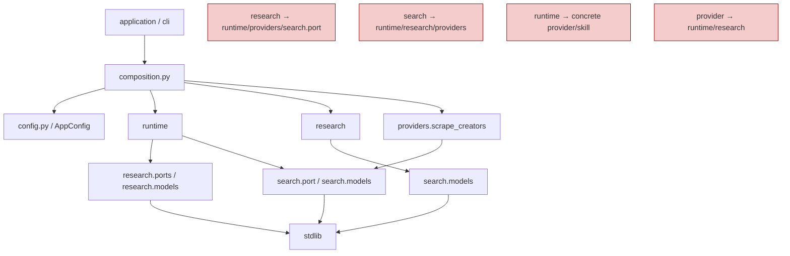

# Ecommerce AI OS — First Research Slice — Minimal Software Architecture Assembly

- **Project**: Ecommerce AI OS
- **Phase**: Minimal Software Architecture
- **Step**: 6 — Minimal Software Architecture Assembly + Representation Closure
- **Status**: Candidate / Step 6 Complete / Refined after Step 7 Review
- **Architecture Authority**: No
- **Slice**: US / Car Vacuum / TikTok Content Research
- **Walking Implementation**: NOT YET AUTHORIZED
- **Current Next**: Step 7 — Consistency Re-check

Initial Step 7 Review Verdict: `PASS_WITH_REFINEMENTS_REQUIRED`

Step 7 Refinement Set: `S7-R1 ~ S7-R10`

Step 6 Representation Refinement Sync: `COMPLETE`

Current Review State: `AWAITING STEP 7 CONSISTENCY RE-CHECK`

```text
Architecture Reopen = NO
Product Architecture Reopen = NO
System Architecture Reopen = NO
Contract Inventory Reopen = NO
New Contract Required = NO
Step 6 Structural Redesign = NO
Step 6 Representation Refinement Sync = COMPLETE
Walking Implementation = NOT YET AUTHORIZED
```

---

## 0. Document Status and Governing Boundary

This document assembles the minimum implementation-ready software shape for the First Slice from the conclusions of Steps 1–5. It closes software representation questions that were intentionally left open while responsibility, execution, provider, research/evidence, and referenceability semantics were being established.

```text
Step 6 != Final Ecommerce AI OS Software Architecture
Step 6 = minimum implementation-ready software shape for the First Slice only
```

This is a candidate architecture record. It is not Architecture Authority, does not reopen Product Architecture, System Architecture, D1–D5, TT-17 semantics, or the 9-contract inventory, and does not authorize Walking Implementation.

The live empty `src/ecommerce_ai_os/` scaffold is not Architecture Authority. Its current directories are scaffold facts only. Walking Implementation may replace, remove, or reorganize unused empty packages to realize this target shape. No compatibility layer is required for empty scaffold packages.

The terms below remain distinct:

```text
Responsibility != Contract != Software Component
Contract Boundary != Runtime Hop
Runtime Semantic Flow != Python Import Graph
Package != System Architecture Layer
Contract != Class Count
```

---

## 1. Purpose, Scope, and Non-Scope

### 1.1 Purpose

Step 6 records, for the First Slice only:

- the selected package-family and module shape;
- the software representation of C1, C2a, C2b, C3, C4a, C4b, C5a, C5b, and C6;
- the dependency/import DAG and its architecture guards;
- manual constructor injection and the single composition root;
- synchronous execution, thin CLI transport, and narrowed configuration;
- provider access and TT-17 translation boundaries;
- stable dataclass/value strategies and explicit outcome representations;
- local JSON Execution Bundle retention and STAGING → FINALIZED/PUBLISHED lifecycle;
- IDs, time, missingness, serialization ownership, and bounded raw provenance;
- the initial test shape and Step 6 sufficiency evidence;
- the final candidate verdict and current next step.

### 1.2 In scope

The scope is the minimum Python 3.12 software shape needed to walk the US / Car Vacuum / TikTok Content Research slice while preserving the inherited semantics.

### 1.3 Non-scope

This document does not:

- redesign Product Architecture, System Architecture, D1–D5, or any upstream contract;
- change TT-17 admission, endpoint semantics, pagination semantics, or provider meaning;
- change the 9-contract inventory or introduce a new Contract;
- create a generic capability runtime, service platform, plugin runtime, workflow engine, or universal resolver;
- authorize Walking Implementation;
- define production-scale deployment, multi-tenant operation, crash recovery, durable workflow, cross-process recovery, or permanent retention;
- select FastAPI, Pydantic, `requests`, `httpx`, `pytest`, an async runtime, a DI framework, a service container, or a database.

---

## 2. Inherited Inputs and Frozen Invariants

### 2.1 Input documents

This assembly is consistent with the following existing software-design records:

```text
01_SOFTWARE_RESPONSIBILITY_MAPPING.md
02_EXECUTION_SPINE_SOFTWARE_DESIGN.md
03_SEARCH_PROVIDER_SPINE_SOFTWARE_DESIGN.md
04_RESEARCH_EVIDENCE_SOFTWARE_DESIGN.md
05_EXECUTION_RECORD_REFERENCEABILITY_SOFTWARE_DESIGN.md
```

It also inherits the upstream System Architecture, D1–D5 detailed contracts, the First Slice responsibility coverage and minimal runtime path, the Deferred Register, architecture/review closure, and TT-17 Endpoint Admission / Selection Closure.

### 2.2 Frozen semantic invariants

```text
C1 = transport-neutral execution entry, rejection, and terminal return seam
C2b = current Execution owner and coordinator
C2a = executable Research Skill business method
C2a != a second Runtime
C2b coordinates Capability invocation and result return
C2a does not directly invoke the concrete Provider
C3 = provider-neutral Search Capability boundary
C4a = current static Search -> Scrape Creators binding
C4b = provider-specific translation and quirk-absorption boundary
C5a = Evidence representation and formalization responsibility
C5b = stable Research Result / business-result representation
C6 = stable Execution facts, referenceability, and terminal finalization
Search Request != Provider Request
Search Result != Raw Provider Result
Search Result != Evidence
Evidence != Research Interpretation
Research Result != Execution Completion
Business Completion precedes Execution Completion
Insufficient Evidence may be a valid Research Result outcome
```

The software assembly preserves local responsibility ownership while choosing a minimal concrete representation. A required software presence does not imply an independent runtime component.

---

## 3. Final Package-Family Assembly Decision

The First Slice uses six cohesive package families:

| Package family | Primary responsibility | Boundary | Explicit non-interpretation |
|---|---|---|---|
| **Application / Entry** | Thin operator-facing entry and terminal presentation | `argparse` CLI facing C1 | Not a business runtime or provider client |
| **Runtime** | Execution establishment, coordination, terminalization, C6 facts/finalization, retention | C1/C2b/C6 runtime-facing behavior | Not a generic workflow engine or provider registry |
| **Research** | Research Skill, research-owned seams, evidence/result semantics, car-vacuum TikTok method | C2a/C5a/C5b | Not a second runtime or provider access layer |
| **Search** | Provider-neutral Search request, outcomes, seam, and codecs | C3 | Not a SearchService runtime object |
| **Provider Integration** | C4b `ScrapeCreatorsAdapter`, Provider Access / Integration implementation, HTTP client, TT-17 translation | C4b/provider access | Not a generic transport platform |
| **Composition / Configuration** | C4a static Search → Scrape Creators binding, `AppConfig`, and concrete wiring | Composition root | Not runtime orchestration or a service locator |

Package families are not runtime services. They are not one-to-one copies of System Architecture layers and are not one-to-one copies of Contract IDs. One package family may carry several related responsibilities without merging their semantics; a Contract may be represented by a Protocol, a callable owner, a binding, a stable value, or bounded behavior without creating a new package or class.

Generic buckets are explicitly not part of the selected First-Slice target unless later evidence earns them:

```text
services/
kernel/
capabilities/
skills/
contracts/       # global dumping-ground package
models/          # global dumping-ground package
repositories/
```

---

## 4. Final Target Python Package / Module Tree

The target shape is exactly the following in substance:

```text
src/ecommerce_ai_os/
├── __init__.py
├── config.py
├── composition.py
├── application/
│   ├── __init__.py
│   └── cli.py
├── runtime/
│   ├── __init__.py
│   ├── execution.py
│   ├── task_runtime.py
│   ├── execution_record.py
│   └── retention.py
├── research/
│   ├── __init__.py
│   ├── ports.py
│   ├── models.py
│   ├── serialization.py
│   └── car_vacuum_tiktok.py
├── search/
│   ├── __init__.py
│   ├── port.py
│   ├── models.py
│   └── serialization.py
└── providers/
    ├── __init__.py
    └── scrape_creators/
        ├── __init__.py
        ├── models.py
        ├── access.py
        ├── http.py
        └── adapter.py
```

The tree is a target representation, not a demand that every semantic concept receives a module or dataclass. A module may contain a small cohesive set of types/functions owned by the same responsibility family.

---

## 5. Software Representation Mapping

### 5.1 C1, C2a, C2b, C3, C4a, C4b, C5a, C5b, C6

| Seam / responsibility | Selected software representation | Boundary rule |
|---|---|---|
| **C1** | Public transport-neutral method on concrete `TaskRuntime`, conceptually `TaskRuntime.execute(...)` | No C1 Protocol, ABC, or `TaskExecutionService`; C1 is the public callable boundary of the concrete runtime owner |
| **C2a Research Skill** | `typing.Protocol` in `research/ports.py` | The concrete research method is injected; the Protocol is a replacement/isolation seam, not a runtime hop |
| **C2b Task Runtime** | Concrete `TaskRuntime` in `runtime/task_runtime.py` | Owns Execution establishment, coordination, failure, terminalization, and C6 finalization coordination |
| **C2a ↔ C2b capability-need interaction** | Small typed `ResearchExecutionPort` Protocol in `research/ports.py` | Software representation of an existing seam; not a new Contract, Service, or runtime layer |
| **Execution-scoped port implementation** | One concrete `RuntimeResearchExecutionPort` per Execution in runtime | Carries the current `ExecutionContext` explicitly; no hidden global `current_execution` state |
| **C3 Search Capability** | `SearchCapability` Protocol in `search/port.py` | Provider-neutral typed callable seam; no separate `SearchService` object |
| **C4a Provider Resolution** | Static Search → Scrape Creators binding performed by `composition.py` | No runtime `ProviderResolver`, `Router`, scoring engine, or dynamic registry |
| **C4b Adapter** | Concrete `ScrapeCreatorsAdapter` in `providers/scrape_creators/adapter.py` | Current concrete implementation behind the C3 `SearchCapability` seam; no intermediate SearchService |
| **Provider I/O seam** | Provider-specific `ScrapeCreatorsAccess` Protocol in `access.py` | Isolates adapter translation from concrete transport and supports fake access fixtures |
| **Concrete provider access** | Synchronous `ScrapeCreatorsHttpClient` in `http.py` | Uses stdlib `urllib.request`, `urllib.parse.urlencode`, and `json` initially |
| **C5a / C5b / C6** | Stable representations and bounded behavior near their semantic owners | Do not become independent services merely because they have named concepts |

The key correction is:

```text
SearchCapability Protocol != SearchCapability runtime object
SearchCapability Protocol != SearchService runtime object
ScrapeCreatorsAdapter = current concrete implementation behind the C3 seam
```

`Protocol != runtime hop`. A Protocol describes a typed software seam; the object supplied at that seam is the concrete implementation currently selected by composition.

### 5.2 Illustrative callable shape

Only the following conceptual signatures are needed to explain the selected representation; they are not implementation code:

```python
class ResearchSkill(Protocol):
    declaration: SkillDeclaration
    def run(self, port: ResearchExecutionPort) -> ResearchCompletion: ...

class SearchCapability(Protocol):
    def search(
        self,
        request: SearchRequest,
        context: SearchInvocationContext,
    ) -> SearchResult | SearchFailure: ...

class ResearchExecutionPort(Protocol):
    def search(self, request: SearchRequest) -> SearchResult | SearchFailure: ...

class TaskRuntime:
    def execute(self, work_request: BusinessWorkRequest) -> TaskExecutionResponse: ...
```

The concrete `ScrapeCreatorsAdapter` satisfies `SearchCapability` by shape. There is no `SearchCapability` instance forwarding to a `SearchService`, then to an adapter. `ResearchSkill.run(...)` returns the C2a Business Completion handoff described below; it does not create a second completion abstraction.

---

## 6. Corrected Runtime and Call Structure

### 6.1 Text call structure

```text
CLI
→ TaskRuntime.execute(...)                         C1
→ TaskRuntime creates ExecutionContext
→ TaskRuntime creates execution-scoped RuntimeResearchExecutionPort
→ concrete Research Skill                           C2a
→ TaskRuntime validates SkillDeclaration
→ ResearchExecutionPort.search(...)                C2a ↔ C2b seam
→ TaskRuntime-controlled capability invocation     C2b
→ dependency typed as SearchCapability             C3
→ concrete ScrapeCreatorsAdapter                    C4b, current C3 implementation
→ ScrapeCreatorsAccess                              provider-specific seam
→ ScrapeCreatorsHttpClient                          synchronous stdlib HTTP
→ TT-17
```

Return path:

```text
TT-17 raw response
→ C4b normalization and translation
→ typed SearchResult | SearchFailure
→ Runtime
→ same Research Execution / Skill
→ sampling
→ Actual Sample Boundary
→ Evidence | EvidenceInadmissible
→ Finding
→ Hypothesis
→ Research Result
→ Business Completion
→ Runtime terminalization
→ C6 finalization
→ local JSON Execution Bundle publish
→ Record Ref
→ C1 / CLI
```

This structure makes the following statements explicit:

```text
Protocol != runtime hop
Package != System Architecture layer
Contract != class count
SearchCapability Protocol != SearchService runtime object
```

### 6.2 Mermaid sequence



The sequence is a responsibility/call view. `C3 SearchCapability` is a typed software seam, not a runtime hop. It does not imply that a Protocol is an object in the chain or that C3, C4a, and C4b are three runtime services.

---

## 7. Dependency / Import DAG

### 7.1 Frozen import rules

1. `search` depends on stdlib only.
2. `research` may depend on `search.models`, but must not depend on `search.port`, `runtime`, or `providers`.
3. `providers.scrape_creators` may depend on `search.port` and `search.models`; it must not depend on `runtime` or `research`.
4. `runtime` may depend on `research.ports`, research models, `search.port`, and search models; it must not import the concrete `providers.scrape_creators` implementation.
5. `composition.py` is the only place allowed to know the concrete Research Skill, concrete Provider implementation, runtime, and configuration together.
6. `application` is thin and uses composition/C1-facing types; it does not import provider internals.
7. Core packages must not import `composition` or `application`.
8. `research` must not import `runtime`, `providers`, or `search.port`.
9. `search` must not import `runtime`, `research`, or `providers`.
10. `runtime` must not import the concrete car-vacuum skill or concrete provider implementation.
11. Provider implementation must not import `runtime` or `research`.
12. Only `composition.py` may know both concrete skill and concrete provider implementation.

The refinement representations remain within the same DAG: `research` consumes provider-neutral `search.models`, `runtime` consumes the Research and Search seams/models, and provider integration remains below the Search boundary. `SearchInvocationContext` and its opaque capture capability do not create a reverse provider-to-runtime import. The added representations therefore introduce no import cycle.

### 7.2 Mermaid DAG



The red nodes are guard examples, not imports. The actual architecture is a DAG with composition at the outer concrete assembly point.

---

## 8. Data Model and Type Strategy

### 8.1 Selected model technology

```text
Python 3.12 stdlib dataclass
Stable completed values: @dataclass(frozen=True, slots=True)
Mutable runtime / working state: explicit @dataclass(slots=True)
```

Stable cross-boundary representations must not be `dict[str, Any]`. Pydantic is not selected. A semantic concept does not automatically imply a dataclass; use a named stable type only where a boundary, invariant, retention unit, or owner-local value requires it.

Frozen values are preferred for completed Search outcomes, Evidence, Findings, Hypotheses, Research Results, stable execution facts, and finalized record values. Mutable dataclasses are reserved for explicitly changing Execution Context, working state, and bounded accumulators.

### 8.2 Type / owner mapping

| Type / concept | Owner / module family | Representation note |
|---|---|---|
| `BusinessWorkRequest` | Runtime execution seam | Typed input admitted at C1; not an `Execution` |
| `ExecutionContext` | Runtime | Execution-scoped mutable coordination context |
| `PreExecutionRejection` | Runtime / C1 | Returned before the Execution Establishment Commit Boundary; no Execution or C6 record exists |
| `TerminalReturn` | Runtime / C1 | Transport-neutral terminal return containing business outcome and execution outcome/reference |
| `TaskExecutionResponse` | Runtime / C1 | `PreExecutionRejection \| TerminalReturn`; preserves pre-execution vs established-Execution distinction |
| `ExecutionAbort` | Runtime-private C2b control | Private non-continuable failure unwind mechanism; not a Contract or public error |
| `SkillDeclaration` | Research | Stable Research-owned `skill_id`, `skill_version`, and declared capabilities |
| `ResearchSkill` Protocol | Research | C2a replacement/isolation seam |
| `ResearchCompletion` | Research | In-memory C2a Business Completion handoff containing Research Result, Actual Sample Boundary, and admitted Evidence |
| `ResearchExecutionPort` Protocol | Research | Small C2a↔C2b seam; not a new Contract |
| `RuntimeResearchExecutionPort` | Runtime | Concrete execution-scoped port instance per Execution |
| `SearchCapability` Protocol | Search | Provider-neutral C3 seam |
| `SearchInvocationContext` | Search | Narrow execution-scoped C3 invocation context with opaque raw-capture capability |
| `SearchInvocationProvenance` | Search | Provider-neutral actual invocation / resolution / result reference facts |
| `RawProviderResultRef` | Search | Search-owned provider-neutral reference representation in `search/models.py` |
| `SearchRequest` | Search | Provider-neutral request value |
| `SearchResult` / `SearchFailure` | Search | Explicit typed C3 outcomes with bounded retrieval semantics and invocation provenance |
| `ActualSampleBoundary` | Research | Stable fact marking the actual selected research sample boundary |
| `Evidence` / `EvidenceInadmissible` | Research | Local evidence outcome; semantic rejection is not malfunction |
| `Finding` | Research | Evidence-backed interpretation owned by C2a research method |
| `Hypothesis` | Research | Explicitly testable, traceable interpretation |
| `ResearchResult` | Research | Human-reviewable business result with answerability and limitations |
| `ScrapeCreatorsAdapter` | Provider Integration | Concrete C4b implementation behind C3 |
| `ScrapeCreatorsAccess` Protocol | Provider Integration | Provider-specific access seam for real/fake access |
| `ScrapeCreatorsHttpClient` | Provider Integration | Synchronous stdlib HTTP access |
| `StableExecutionFacts` | Runtime | C6-owned stable facts accumulated during execution |
| `FinalizedExecutionRecord` | Runtime | Terminal C6 representation |
| Local JSON bundle | Runtime retention | Physical execution-scoped retention representation |
| `AppConfig` | Composition/config boundary | Small immutable configuration value loaded at composition boundary |

### 8.3 Search outcome and error representation

C3 returns an explicit typed outcome:

```text
SearchResult | SearchFailure
```

A valid empty `SearchResult` is success. It is not converted to failure merely because zero results were found. Provider-specific exceptions terminate at C4b translation and become `SearchFailure` where the semantics call for a provider/search outcome. Unexpected programming or software defects may remain exceptions and are handled by C2b closure; no universal error taxonomy is invented.

### 8.3.1 Bounded SearchResult representation

`SearchResult` is not represented as only `list[SearchItem]`. Its stable Search-owned representation must be able to express these semantic categories without freezing unnecessary exact field names:

1. Result identity.
2. Ordered returned item occurrences, with duplicates preserved at the C3 retrieval level.
3. Requested retrieval bound.
4. Actual returned-set boundary, including returned occurrence count, observed/fetched pages, or actual traversal extent where known.
5. Stopping reason.
6. Provider-neutral continuation state.
7. Known completeness / incompleteness semantics.
8. Known missingness.
9. Collection / observation context.
10. Invocation provenance.

```text
duplicate occurrence != automatic noise
C3 does not research-dedupe
Research Skill owns research sampling / dedupe decisions
```

Provider cursor/token syntax remains below provider translation. The Research Skill receives no Scrape Creators cursor syntax. Provider traversal exhaustion is not global TikTok completeness; `has_more = false` does not prove that all relevant TikTok content was discovered. A `region = US` request does not prove the exact US population, and the current TT-17 observations preserve the following bounded limitations:

```text
two successful pages observed
cross-page duplicates observed
pagination termination = unverified
hard cap = unknown
exact region effect = unverified
date_posted = unverified
sort_by = unverified
ranking semantics = unverified
```

These limitations remain expressible through SearchResult bounded-retrieval semantics and are available to the Research Skill without leaking provider-specific traversal syntax.

### 8.3.2 Search invocation context and provenance

The concrete C3 callable has the following semantics:

```text
SearchCapability.search(
    SearchRequest,
    SearchInvocationContext,
)
→ SearchResult | SearchFailure
```

`SearchInvocationContext` is an execution-scoped Search-owned context created by the Task Runtime / Runtime-controlled invocation path. It contains only narrowed values or callables that the current Search invocation genuinely requires. For the First Slice, this includes an opaque raw-result capture capability for bounded provenance.

It is not a `GlobalContext`, `UniversalContextEnvelope`, `RuntimeContext` dump, `RetentionService`, `Repository`, or `Event Sink`.

The invocation path is:

```text
TaskRuntime
→ creates SearchInvocationContext
→ SearchCapability
→ ScrapeCreatorsAdapter
→ TT-17 raw response
→ opaque raw capture
→ current Execution staging bundle
→ RawProviderResultRef
→ normalized SearchResult / SearchFailure
```

`RawProviderResultRef` is a Search-owned provider-neutral reference representation in `search/models.py`. It represents the stable reference fact created after C4b has made a bounded Raw Provider Result referenceable.

```text
RawProviderResultRef != raw payload
RawProviderResultRef != storage path exposed as business semantics
RawProviderResultRef != UniversalReference

Runtime-provided opaque raw capture callable:
input  → bounded raw provider response
output → RawProviderResultRef
```

The raw-capture callable is provided by Runtime for the current Execution, while the resulting reference value is owned by Search. This preserves:

```text
providers.scrape_creators → search.models
providers.scrape_creators ↛ runtime
```

This ownership refinement does not create an import cycle.

`SearchInvocationProvenance` is provider-neutral and must carry enough actual invocation facts for C2b to record, where present:

- actually resolved provider reference;
- actually used provider reference when invocation occurred;
- capability result reference when one exists;
- raw result references when they exist.

```text
Configured Provider Binding != Resolved Provider != Actually Used Provider
```

C4a composition-time binding represents the configured/current legal binding only. Runtime must not infer the actual provider from `type(adapter)` or composition configuration. Provider resolution failure may have no actual used provider; provider invocation failure and successful Search have an actual provider when invocation occurred. Provider implementation does not import Runtime.

### 8.4 Evidence formalization outcome

The local research outcome is:

```text
Evidence | EvidenceInadmissible
```

`EvidenceInadmissible` is a semantic result returned to the Research Method when an observation does not satisfy the evidence admissibility rules. A formalizer/software malfunction remains an exception. There is no `EvidenceFailureContract` and no `EvidenceService`.

### 8.5 Terminal return and partial closure

`TerminalReturn` supports partial terminal closure:

```text
Business Result may be present
while Execution Closure is failed because C6 finalization or publication failed.
```

The Execution Outcome is required. A `Record Ref` may be absent on failed closure. C6 finalization failure is not silently reported as a clean successful execution, but it is not retroactively mislabeled as Research Business Failure when the business method already completed.

The C1-facing callable returns one of two transport-neutral response representations:

```text
TaskRuntime.execute(...)
→ TaskExecutionResponse

TaskExecutionResponse
= PreExecutionRejection | TerminalReturn
```

`PreExecutionRejection` is returned before the Execution Establishment Commit Boundary:

```text
Execution Establishment Commit Boundary not reached
no Execution exists
no execution_id
no C6 Execution Record
no record_ref
```

`TerminalReturn` is valid only after an Execution was established. It carries the Execution Outcome, may carry a Business Result, and may carry a Record Ref when finalization succeeded.

```text
Pre-execution rejection != Execution failure
```

There is no `TaskExecutionService`, `RejectionService`, or `GlobalResponseEnvelope`.

### 8.6 Runtime-local execution abort

After a `SearchFailure` enters C2b, C2b decides whether the failure is continuable:

```text
Continuable SearchFailure
→ returned to the same Research Skill
→ Skill may continue or choose a legal business alternative

Non-continuable SearchFailure
→ RuntimeResearchExecutionPort triggers private ExecutionAbort
→ current Skill call unwinds
→ TaskRuntime catches ExecutionAbort
→ terminal failure
→ C6 finalization
```

`ExecutionAbort` is a C2b-private control mechanism. It is not a Contract, SearchFailure, global error taxonomy, retry mechanism, or public Application error. It is not exposed to C3, C4b, Research Skill business semantics, or Application. Unexpected software defects may remain exceptions and are captured by TaskRuntime's execution-closure handling.

### 8.7 Time representation

- Internal times use timezone-aware `datetime`.
- Canonical internal time is normalized to UTC.
- JSON uses ISO-8601 / RFC3339-style UTC strings.
- Publication Time, Observation Time, and Collection Time remain distinct.
- A generic undifferentiated `timestamp` must not collapse their meanings.

### 8.8 Missingness representation

Known missingness remains explicit wherever the semantics require it. `None` alone must not erase known missingness semantics. The First Slice does not introduce a universal missingness framework or ontology; each owner preserves the missingness meaning relevant to its boundary.

### 8.9 Internal and provider IDs

- Target-specific typed string IDs use `NewType` or an equivalent low-level typing convention where the distinction prevents accidental mixing.
- Generated internal IDs are UUID4-backed opaque strings.
- Provider IDs remain exact opaque provider strings.
- Provider IDs are never converted to fake global IDs or numeric canonical forms.
- No `UniversalReference` model or registry is introduced.

### 8.10 Owner-local identity and version references

The following stable owner-local identity/version references are explicit:

```text
Research Skill
→ skill_id
→ skill_version

Search Capability
→ capability_id
→ capability_version

Scrape Creators Adapter
→ adapter_id
→ adapter_version
```

These refs are stable, explicit, and owned by their respective semantic owner. C6 must record the actually used version refs, not every configured possible version. No Version Registry, Compatibility Service, Migration Framework, or Semantic Versioning Framework is introduced.

```text
schema_version != skill_version
schema_version != capability_version
schema_version != adapter_version
```

`schema_version` represents only the retained JSON representation version.

---

## 9. Dependency Injection and Composition

### 9.1 Selected approach

```text
Explicit manual constructor injection
One explicit composition root in composition.py
No DI framework
No service locator
No service container
```

The composition root performs static wiring and configuration assembly only. It is not runtime orchestration. `TaskRuntime` does not instantiate the concrete provider or concrete skill internally. The root constructs the concrete `ScrapeCreatorsHttpClient`, `ScrapeCreatorsAdapter`, concrete First-Slice Research Skill, and `TaskRuntime`, then injects the selected dependencies.

### 9.2 Static binding

C4a is represented by the composition-time fact that the C3 `SearchCapability` seam is satisfied by the concrete `ScrapeCreatorsAdapter`. Skill extension is likewise static composition/registration for this slice, with a bound `SkillDeclaration` checked before invocation. There is no `SkillRegistry`, hot-reload plugin runtime, provider resolver, or dynamic selection platform.

---

## 10. Sync / Async Decision

First-Slice execution is synchronous end-to-end. Multiple sequential provider calls are allowed. No async, coroutine, concurrency, worker pool, or parallel execution mechanism is introduced until real evidence requires it.

```text
synchronous != globally single-execution forever
```

Each call to `TaskRuntime.execute(...)` receives its own `ExecutionContext` and its own `RuntimeResearchExecutionPort`; synchronous execution does not justify hidden global execution state.

---

## 11. Application / Transport Decision

- C1 is a local Python callable on `TaskRuntime`.
- The First Walking-Implementation Application is a thin CLI adapter.
- The CLI uses stdlib `argparse`.
- The CLI maps operator input to `BusinessWorkRequest`, calls the C1-facing runtime callable, and presents `TaskExecutionResponse` (`PreExecutionRejection` or `TerminalReturn`).
- The CLI does not know Scrape Creators, TT-17, provider internals, or research implementation details.
- No HTTP, Web, Desktop, Chat, or application framework is selected.

---

## 12. Configuration Decision

`AppConfig` is a small immutable dataclass loaded at the composition boundary. Secrets come from environment variables. Dependencies receive only the values they need; there is no global configuration propagation and no `GlobalContext`.

The Scrape Creators API key:

```text
may be read by composition and supplied only to the concrete provider access mechanism;
must not enter SearchRequest;
must not enter the Research Skill;
must not enter C6;
must not enter business logs.
```

Configuration narrowing is an ownership boundary, not a reason to introduce `ConfigService`.

---

## 13. Provider Integration Decisions

`ScrapeCreatorsAdapter` and the concrete access mechanism remain separate module responsibilities:

```text
adapter.py
= C4b request/response/error/pagination/identity/missingness translation

access.py
= provider-specific access seam

http.py
= synchronous concrete HTTP access
```

The initial HTTP implementation uses:

```text
urllib.request
urllib.parse.urlencode
stdlib json
```

`requests` and `httpx` are not selected. There is no generic transport platform. Provider-specific exceptions are translated at C4b; raw provider mechanics do not become Search or Research business values.

The adapter may use an execution-scoped opaque raw-capture mechanism for bounded provenance retention, but raw payload does not become a C2b/C2a-visible business value.

---

## 14. Research / Evidence Representation Decisions

The Research Skill owns business method judgment:

```text
SkillDeclaration representation
relevance
sampling
deduplication
evidence-worthiness
Evidence interpretation
Finding formation
Hypothesis formation
answerability / limitations
Research Result formation
Business Completion declaration
```

### 14.1 SkillDeclaration

`SkillDeclaration` is a stable Research-owned representation with the minimum semantic content:

```text
skill_id
skill_version
declared_capabilities
```

For the First Slice:

```text
declared_capabilities = {Search}
```

The `ResearchSkill` Protocol explicitly has both:

```text
declaration
business execution method: run(...)
```

Before a real capability invocation, TaskRuntime verifies:

```text
requested capability ∈ bound Skill declared capabilities
```

```text
Declared Capability Dependency
!= Runtime Capability Need
!= Actual Capability Invocation Fact
```

`SkillDeclaration` is representation only. It is not a `SkillRegistry`, Plugin Registry, Extension Runtime, Marketplace, or Dynamic Discovery mechanism.

### 14.2 ResearchCompletion and Business Completion

`ResearchSkill.run(...)` returns `ResearchCompletion`. This is the in-memory C2a Business Completion handoff and is the single completion representation for S7-R2 and S7-R7; no second Completion abstraction is introduced.

Its minimum semantic content is:

```text
ResearchResult
ActualSampleBoundary
admitted Evidence
```

`ResearchCompletion` is not a new Contract, persistent business envelope, Artifact, Execution Record, or Research Service result wrapper. It does not require an independent JSON file. It hands C2a-owned stable Research facts to C2b for execution closure:

```text
Research Skill
→ ResearchCompletion
→ Task Runtime recognizes Business Completion
→ research-owned stable values serialized separately
→ C6 stores references
→ Execution terminalization
```

Business Completion is the receipt of a valid `ResearchCompletion` containing a C5b-valid `ResearchResult`. `ResearchResult` references Evidence; it is not a full Evidence payload copy. Business Completion precedes Execution Completion.

### 14.3 Module responsibility refinement

The existing package tree is unchanged. The refined responsibilities are placed in the existing modules:

```text
research/ports.py
→ ResearchSkill Protocol
→ ResearchExecutionPort Protocol

research/models.py
→ SkillDeclaration
→ ResearchCompletion
→ ActualSampleBoundary
→ Evidence / EvidenceInadmissible
→ Finding / Hypothesis / ResearchResult

search/port.py
→ SearchCapability Protocol

search/models.py
→ SearchInvocationContext
→ SearchInvocationProvenance
→ SearchRequest
→ SearchResult / SearchFailure
→ bounded retrieval semantics

runtime/execution.py
→ BusinessWorkRequest
→ ExecutionContext
→ PreExecutionRejection
→ TerminalReturn
→ TaskExecutionResponse

runtime/task_runtime.py
→ TaskRuntime
→ RuntimeResearchExecutionPort
→ private ExecutionAbort

runtime/retention.py
→ staging bundle lifecycle
→ local JSON physical placement
→ execution-scoped raw capture
→ publish / finalization support
```

No new package family is created by these refinements.

`ActualSampleBoundary` is a stable Research execution fact. `Evidence`, `Finding`, `Hypothesis`, and `ResearchResult` remain distinct semantic representations even when they share the Research package family. No EvidenceService, ResearchService, AnalyzeService, FindingService, HypothesisService, or TraceabilityService is introduced.

Semantic evidence rejection is an explicit `EvidenceInadmissible` outcome. A valid insufficient-evidence Research Result is not automatically a Research failure or Execution failure.

---

## 15. Local Retention Representation

### 15.1 Selected concrete representation

```text
Local JSON Execution Bundle = SELECTED concrete First-Slice retention representation
SQLite / DB = NOT REQUIRED
Dedicated persistence subsystem = NOT PROVEN / not introduced
```

One Execution owns one bundle. The bundle retains only the referents required for the finalized execution explanation, required provenance, and business-output traceability. It is not a universal object store and does not turn C6 into a database schema.

### 15.2 Retained bundle layout

```text
var/
└── executions/
    ├── .staging/
    │   └── <execution_id>/
    └── <execution_id>/
        ├── execution_record.json
        ├── inputs/
        │   └── <work_request_id>.json
        ├── sample_boundaries/
        │   └── <sample_boundary_id>.json
        ├── search_results/
        │   └── <search_result_id>.json
        ├── evidence/
        │   └── <evidence_id>.json
        ├── research_results/
        │   └── <research_result_id>.json
        └── provider_raw/
            └── <raw_result_id>.json
```

Not all directories/files must exist for every Execution. Failed executions may legitimately have no Evidence or Research Result. `provider_raw/` stores only required bounded provenance, not a universal provider archive. No media, video, or image binary download retention is required. C6 JSON contains only C6-owned stable facts plus references; it does not inline full foreign payloads by default.

### 15.3 Lifecycle

```text
Execution Establishment
→ create .staging/<execution_id>/
→ progressively write required retained referents
→ Business Completion or terminal failure
→ C6 finalization
→ write execution_record.json LAST
→ validate required references resolve
→ atomically rename/publish staging to final execution directory
→ make Record Ref externally visible
```

Raw TT-17 pages contributing to retained SearchResults may be captured below C4b into staging through an opaque execution-scoped retention callback/mechanism. The raw payload never enters Runtime business state or the Research Skill. The `execution_record.json` is finalized and written last. A Record Ref is not externally visible before successful publication.

`SearchResult` and `SearchFailure` carry provider-neutral invocation provenance where known. C6 actual-participation facts are derived from the actual Search invocation outcome:

```text
configured binding
→ does not prove actual provider participation

actual invocation outcome
→ may establish resolved provider ref
→ may establish used provider ref
→ may establish capability result ref
→ may establish RawProviderResultRef
```

Runtime records actually used provider / capability / adapter version refs when those invocation facts exist. It does not infer actual provider participation from `type(adapter)` or composition configuration.

This is not crash recovery, durable workflow, or a transactional outbox. A process failure may leave staging material; no recovery subsystem is introduced in the First Slice.

### 15.4 Raw Provider retention rule

Actual TT-17 response pages that contribute to retained SearchResults are retained as bounded provenance artifacts for the Walking Slice. This does not create a General Provider Raw Archive. Raw-result referenceability is not a permanent retention guarantee, and external source availability is not guaranteed by retaining an observation-time locator.

### 15.5 Retention duration

There is no automatic expiry or cleanup in the First Slice. This is explicitly **not** a permanent-retention guarantee. The exact retention policy remains future, evidence-driven work.

### 15.6 JSON serialization ownership

Stable JSON codecs live near semantic owners:

```text
research/serialization.py
search/serialization.py
runtime/execution_record.py or runtime-owned C6 serialization
```

Retention owns physical bundle placement, not foreign semantic serialization. Each retained stable JSON representation carries a simple owner-local `schema_version = 1` or semantically equivalent version marker. There is no schema registry or migration framework.

### 15.7 Runtime bundle source-control and credential safety

The selected runtime root is:

```text
var/executions/
```

Walking Implementation invariant: `var/executions/` MUST be source-control excluded / gitignored. This refinement does not modify `.gitignore`.

Raw Provider capture may retain only provider response payload required for bounded provenance. It must never retain:

```text
SCRAPE_CREATORS_API_KEY
Authorization header
Cookie
Secret
credential
authenticated request headers
sensitive authentication material
```

```text
Runtime provenance artifact != repository documentation artifact
Runtime raw data != Git-tracked source file
provider_raw/ != general Provider archive
```

---

## 16. Testing Strategy

### 16.1 Target test shape

```text
tests/
├── unit/
│   ├── runtime/
│   ├── research/
│   ├── search/
│   └── providers/
│       └── scrape_creators/
├── integration/
│   ├── test_execution_bundle.py
│   └── test_first_slice_fake_provider.py
├── architecture/
│   └── test_import_boundaries.py
└── live/
    └── test_tt17_smoke.py
```

### 16.2 Test rules

- Initial test runner: stdlib `unittest`.
- Provider translation tests use saved TT-17 raw fixtures through a fake `ScrapeCreatorsAccess`.
- Normal tests never hit the paid/live Provider.
- Exactly one explicit opt-in TT-17 live smoke test is allowed for the First Slice boundary.
- Import-boundary architecture tests use stdlib `ast` plus `pathlib`; no import-linter framework is introduced.
- Tests mirror ownership boundaries: runtime, research, search, provider integration, bundle lifecycle, fake provider integration, and architecture rules.

### 16.3 Explicit import-boundary guard examples

The architecture test must reject at least these dependencies:

```text
research -> runtime
research -> providers
research -> search.port
search -> runtime
search -> research
search -> providers
runtime -> concrete providers.scrape_creators implementation
runtime -> concrete car-vacuum skill implementation
provider implementation -> runtime
provider implementation -> research
```

It must also verify that composition is the only concrete assembly point for the concrete Skill, concrete Provider implementation, runtime, and configuration.

---

## 17. Existing Scaffold Handling

Existing empty packages such as:

```text
applications
capabilities
kernel
services
skills
```

are scaffold facts, not architecture authority. They do not constrain the selected target package layout. Walking Implementation may remove or replace unused empty scaffold packages. No compatibility layer is required for empty packages, because no live behavior or stable public contract is being preserved by an empty directory.

---

## 18. Assembly Stress Test Summary

The Step 6 assembly was pressure-tested across the representation questions left by Steps 1–5. The following are the closed outcomes.

| Pressure test | Final conclusion |
|---|---|
| Contract count vs package count | The 9-contract inventory does not determine package count; no new Contract is introduced. |
| System layers vs Python packages | Python packages are cohesive implementation families, not one-to-one System Architecture layers. |
| Application / C1 / C2b ownership | Application is thin; C1 is `TaskRuntime.execute(...)`; C2b owns executable coordination. |
| Research grouping | C2a, C5a, C5b can coexist in `research/` without semantic merging. |
| Search/provider isolation | `search/` stays provider-neutral; provider quirks terminate at C4b. |
| C4a static wiring | C4a is composition-time binding, not a runtime resolver or router. |
| Skill extension | Skill Extension is static declaration/registration/composition, not a Plugin Runtime. |
| C6/runtime colocation | C6 is colocated with Runtime because of lifecycle ownership, while C6 facts remain distinct from mutable runtime state. |
| Adapter/access separation | Adapter translation and provider-specific access are separate responsibilities/modules. |
| C1 representation | C1 is the public method on concrete `TaskRuntime`; no C1 Protocol/ABC/Service. |
| Skill representation | Research Skill is a `typing.Protocol` seam plus an injected concrete business method. |
| Search representation | Search Capability is a `typing.Protocol` seam. |
| ExecutionPort representation | `ResearchExecutionPort` is a small typed Protocol, not a new Contract. |
| Dataclass vs Pydantic | Stdlib dataclasses; stable values frozen+slots; mutable runtime state explicit; no Pydantic or dict-any boundary. |
| Manual DI/composition | Constructor injection and one static composition root; no framework/container/service locator. |
| Sync/async | Synchronous end-to-end; no concurrency before evidence. |
| CLI | Thin stdlib `argparse` adapter is the First Slice application. |
| Config narrowing | Immutable `AppConfig` is loaded at composition; only needed values are passed downstream; no `GlobalContext`. |
| Local JSON vs memory vs SQLite | Local JSON Execution Bundle is selected; transient memory alone is insufficient; SQLite/DB is not required. |
| Reference IDs | Typed opaque internal strings backed by UUID4; provider IDs stay exact opaque strings; no universal registry. |
| Serialization ownership | Owner-local codecs serialize semantic values; retention owns placement only; `schema_version=1`; no schema registry. |
| Bundle publish | Progressive staging writes, C6 record last, required-ref validation, atomic publish, Record Ref after publish. |
| Retention duration | No automatic cleanup; not a permanent-retention guarantee; exact policy remains future evidence-driven work. |
| Stdlib HTTP | Synchronous `urllib.request` + `urlencode` + `json`; no `requests`/`httpx` initially. |
| Tests | Ownership-mirrored unit/integration tests, fake provider fixtures, AST import guard, opt-in TT-17 smoke. |
| SearchCapability vs SearchService | Protocol is a seam, not a runtime SearchService; adapter is the current concrete implementation. |
| Execution-scoped port | A fresh `RuntimeResearchExecutionPort` is created per Execution; no hidden global `current_execution`. |
| Import DAG | Core packages point inward; composition is the only concrete assembly point. |
| Raw payload boundary | Raw payload can flow only into opaque retention below C4b, never into business logic. |
| Staging/finalized lifecycle | Bundle lifecycle is `STAGING → FINALIZED/PUBLISHED`; final C6 record is written last. |
| Search failure outcome | C3 returns `SearchResult | SearchFailure`; valid empty result is success; provider exceptions translate at C4b. |
| Evidence inadmissibility | Semantic rejection is explicit local outcome; malfunction remains exception. |
| Partial TerminalReturn | Business Result may exist while Execution Closure fails; outcome is required and Record Ref may be absent. |
| Time | Aware datetimes, UTC normalization, UTC ISO-8601 JSON, and distinct time meanings. |
| Missingness | Known missingness remains explicit; `None` alone cannot erase its semantics. |
| Scaffold authority | Empty scaffold packages do not constrain the target and do not require compatibility layers. |

The pressure tests confirm that the selected shape is implementation-ready for the First Slice without manufacturing runtime hops, generic platforms, or unproven infrastructure.

---

## 19. Candidate Decisions

The following decisions are the Step 6 candidate closure, S6-01 through S6-47.

### S6-01 — Contract identity does not determine package identity

Contract identity does not determine package, module, class, or runtime-component identity.

### S6-02 — Do not mirror System Architecture one-for-one

Global System Architecture layers are not mirrored one-for-one into Python packages.

### S6-03 — Small cohesive responsibility families

Use small cohesive software responsibility families selected for the First Slice.

### S6-04 — Application / C1 / C2b ownership

Application and C1 remain explicit seams; C2b remains the executable coordination owner.

### S6-05 — Research grouping without semantic merging

C2a, C5a, and C5b may coexist in the Research family without merging their semantics.

### S6-06 — C3 separable from Provider Integration

C3 Search remains separable from Provider Integration; provider-specific behavior stays below C4b.

### S6-07 — C4a is composition-time wiring

C4a is static composition-time Search → Scrape Creators wiring, not a runtime resolver.

### S6-08 — Skill Extension is static composition

Skill Extension is static composition/registration for the First Slice, not a plugin runtime.

### S6-09 — No global dumping grounds

Avoid global `contracts/`, `models/`, `services/`, `kernel/`, `capabilities/`, or `skills/` dumping grounds.

### S6-10 — C6 colocated with Runtime, distinct from runtime state

C6 is colocated with the Runtime family for lifecycle ownership but remains distinct from mutable Runtime State.

### S6-11 — Adapter/access separation

Adapter translation and provider-specific access remain separate module responsibilities.

### S6-12 — C1 is `TaskRuntime.execute()`

C1 is the public `TaskRuntime.execute(...)` method; no separate C1 service or interface is required.

### S6-13 — ResearchSkill is a Protocol

`ResearchSkill` is represented as a `typing.Protocol` seam where replacement/isolation is real.

### S6-14 — SearchCapability is a Protocol

`SearchCapability` is represented as a `typing.Protocol` provider-neutral seam.

### S6-15 — ResearchExecutionPort is a typed Protocol, not a new Contract

`ResearchExecutionPort` is a small typed Protocol representing an existing C2a↔C2b seam; it is not a new Contract.

### S6-16 — Concrete adapter, provider access Protocol, sync access

C4b is a concrete adapter behind C3, with a provider-specific access Protocol and synchronous concrete access implementation.

### S6-17 — Stdlib dataclasses; no Pydantic or dict-any boundaries

Use stdlib dataclasses; prefer frozen+slots for stable values; use explicit mutable runtime dataclasses; do not use Pydantic or `dict[str, Any]` as stable cross-boundary representation.

### S6-18 — Manual constructor injection

Use explicit manual constructor injection.

### S6-19 — One composition root, not an orchestrator

Use one `composition.py` composition root for static wiring and configuration assembly; it is not runtime orchestration.

### S6-20 — Synchronous end-to-end

First-Slice execution is synchronous end-to-end; async/concurrency remains unselected.

### S6-21 — Local callable plus thin CLI

C1 is a local Python callable and the First-Slice Application is a thin stdlib CLI.

### S6-22 — Immutable config plus environment secrets

Use an immutable `AppConfig` with environment-sourced secrets; do not introduce `ConfigService` or global configuration.

### S6-23 — Local JSON Execution Bundle, no DB

Retention is a local JSON Execution Bundle; no database or dedicated persistence subsystem is required.

### S6-24 — One Execution, one bundle; only required referents

One Execution has one bundle, retaining only referents required for closure, provenance, and business-output traceability.

### S6-25 — C6 facts plus references; foreign payloads separate

C6 contains C6-owned stable facts and references; foreign-owned payloads remain separately owned and are not copied into C6 by default.

### S6-26 — Internal typed strings and exact provider IDs

Internal identities are target-specific typed opaque strings backed by UUID4; provider IDs remain exact opaque strings.

### S6-27 — Owner-local JSON codecs

JSON codecs live near semantic owners; retention owns physical placement only.

### S6-28 — Write then publish

Write staging material, finalize and validate, publish atomically, and expose a Record Ref only after publish.

### S6-29 — No automatic expiry; not permanent retention

No automatic expiry/cleanup is introduced, and the First Slice does not promise permanent retention.

### S6-30 — Stdlib `urllib` HTTP initially

Use synchronous stdlib HTTP through `urllib.request`, `urllib.parse.urlencode`, and stdlib `json` initially.

### S6-31 — Ownership-mirrored tests and fake fixtures

Use ownership-mirrored tests, saved TT-17 fixtures through fake access, stdlib `unittest`, and one opt-in live smoke test.

### S6-32 — SearchCapability Protocol is a seam, not SearchService

The C3 `SearchCapability` Protocol does not become a separate runtime component or `SearchService`; `ScrapeCreatorsAdapter` is the current concrete implementation behind the seam.

### S6-33 — Execution-scoped RuntimeResearchExecutionPort

Create one `RuntimeResearchExecutionPort` per Execution; do not use hidden global `current_execution` state.

### S6-34 — Explicit import DAG

Freeze an explicit import DAG with composition as the only concrete assembly point; core packages do not import composition/application.

### S6-35 — Raw payload only below C4b into opaque retention

Raw Provider payload may enter only the opaque execution-scoped retention mechanism below C4b; it never becomes a C2b/C2a-visible business value.

### S6-36 — STAGING → FINALIZED/PUBLISHED lifecycle

The bundle lifecycle is `STAGING → FINALIZED/PUBLISHED`; required referents may be written progressively and the C6 record is written last.

### S6-37 — Contributing TT-17 pages are bounded provenance

Actual contributing TT-17 pages may be retained as bounded provenance, not as a general Provider Raw Archive.

### S6-38 — Typed Search result/failure outcomes

C3 returns `SearchResult | SearchFailure`; provider-specific exceptions terminate at C4b translation; a valid empty SearchResult is success.

### S6-39 — Explicit Evidence semantic rejection

Evidence semantic rejection is an explicit local outcome such as `EvidenceInadmissible`; formalizer/software malfunction remains an exception.

### S6-40 — Partial TerminalReturn

`TerminalReturn` supports partial terminal closure: a Business Result may be present while execution closure fails, and a Record Ref may be absent on failed closure.

### S6-41 — Aware UTC time with distinct semantics

Use aware datetimes, UTC normalization, UTC ISO-8601 JSON, and preserve distinct Publication, Observation, and Collection Time semantics.

### S6-42 — Explicit known missingness

Known missingness remains explicit where required; `None` alone must not erase semantic missingness.

### S6-43 — AppConfig only at composition, narrowed downstream

Load `AppConfig` at composition and pass only narrowed values to dependencies; do not propagate global configuration.

### S6-44 — Stdlib `unittest` initially

Use stdlib `unittest` as the initial test runner.

### S6-45 — Stdlib AST import-boundary test

Use stdlib `ast` plus `pathlib` for architecture import-boundary tests; no import-linter framework.

### S6-46 — Empty scaffold does not constrain target

The empty scaffold does not constrain the target package layout; unused empty packages may be removed/replaced during Walking Implementation.

### S6-47 — Owner-local schema version 1

Each retained stable JSON representation carries an owner-local `schema_version = 1` or equivalent marker; no schema registry or migration framework is introduced.

---

## 20. Delete Test

The Delete Test asks whether the selected First-Slice behavior still has a clear owner if a proposed mechanism is removed. The following can be deleted without violating the closed First-Slice shape:

| Candidate mechanism | Delete? | Reason |
|---|---:|---|
| FastAPI | YES | C1 is a local callable and the first transport is a thin CLI. |
| Pydantic | YES | Stdlib dataclasses preserve the required stable representations. |
| `requests` / `httpx` | YES | Stdlib synchronous HTTP is sufficient initially. |
| `pytest` | YES | Stdlib `unittest` is selected initially. |
| DI framework | YES | Manual constructor injection is explicit and sufficient. |
| Service container | YES | The composition root can perform the small static wiring. |
| ABC hierarchy | YES | Protocols are used only at real seams; no inheritance hierarchy is needed. |
| SearchService | YES | `SearchCapability` is a seam and the adapter is its current concrete implementation. |
| EvidenceService | YES | Evidence formalization remains bounded behavior in Research. |
| ResearchService | YES | The Research Skill owns the business method; no second runtime is required. |
| RecorderService | YES | C6 finalization is owned by Runtime/retention. |
| Repository Layer | YES | Local bundle placement and owner-local codecs are sufficient. |
| Database | YES | SQLite/DB is not required for the First Slice. |
| Event Bus | YES | Synchronous direct calls preserve the selected execution path. |
| Async | YES | No evidence requires async/concurrency. |
| Plugin Runtime | YES | Skill extension is static composition/registration. |
| `GlobalContext` | YES | Execution context and narrowed dependencies are explicit. |
| Generic `services/` package | YES | No generic service has earned a cohesive responsibility. |
| Generic `kernel/` package | YES | No kernel abstraction is required. |
| Generic `capabilities/` package | YES | C3 is owned by `search/` and is not a runtime platform. |
| Global `contracts/` package | YES | Seams live near semantic owners. |
| Global `models/` package | YES | Stable values live near their owners. |
| UniversalReference model/registry | YES | Target-specific IDs and local refs are sufficient. |
| Crash-recovery subsystem | YES | Crash recovery is not selected or proven. |
| Transactional outbox | YES | No event/durable workflow requirement is selected. |
| Automatic cleanup/expiry | YES | No expiry policy is selected; absence is explicit and not permanent retention. |

The following are non-deletable for the selected First Slice because they carry required ownership or semantics:

| Required seam / owner / rule | Delete? | Why it remains |
|---|---:|---|
| Concrete `TaskRuntime.execute(...)` / C1 | NO | Required transport-neutral entry and terminal return boundary. |
| C2b Runtime ownership | NO | Required Execution establishment, coordination, and terminalization owner. |
| Concrete Research Skill / C2a | NO | Required business-method owner. |
| `ResearchSkill` Protocol | NO | Required replacement/isolation seam for the selected representation. |
| Execution-scoped `ResearchExecutionPort` | NO | Required C2a↔C2b capability-need seam without hidden global state. |
| `RuntimeResearchExecutionPort` per Execution | NO | Required return to the same Execution and explicit context scoping. |
| `SearchCapability` Protocol / C3 | NO | Required provider-neutral Search seam. |
| Static C4a binding | NO | Required First-Slice Search → provider binding fact. |
| `ScrapeCreatorsAdapter` / C4b | NO | Required provider translation and quirk-absorption boundary. |
| `ScrapeCreatorsAccess` Protocol | NO | Required provider-specific access isolation and fake fixture seam. |
| Synchronous concrete provider access | NO | Required actual TT-17 access for the Walking Slice. |
| C5a/C5b stable representations | NO | Required Evidence and Research Result meanings. |
| C6 stable facts and finalization | NO | Required terminal execution closure. |
| Local JSON retention | NO | Selected concrete representation for required references. |
| Staging → finalized/published lifecycle | NO | Required write-then-publish referenceability semantics. |
| Required internal reference validation | NO | Required integrity condition before Record Ref exposure. |
| Owner-local serialization | NO | Required stable JSON representations without a global registry. |
| Import DAG / architecture guard | NO | Required dependency direction and provider isolation. |
| Explicit missingness/time/ID semantics | NO | Required preservation of inherited meaning. |

---

## 21. Step 6 Sufficiency Gate

Step 6 is sufficient for a review gate when all of the following are closed for the First Slice:

| Sufficiency item | Result |
|---|---|
| Package/module tree | CLOSED — target tree is explicit. |
| Callable/interface form | CLOSED — C1 callable, Research/ExecutionPort/Search Protocols, concrete adapter/access selected. |
| Dependency DAG | CLOSED — allowed and forbidden imports are explicit. |
| Dependency injection | CLOSED — manual constructor injection and one composition root. |
| Sync/async | CLOSED — synchronous end-to-end. |
| Application transport | CLOSED — thin stdlib CLI with `argparse`. |
| Configuration | CLOSED — immutable AppConfig at composition, narrowed values downstream. |
| Provider HTTP | CLOSED — synchronous stdlib `urllib` access. |
| Provider isolation | CLOSED — adapter/access separation and C3 neutrality. |
| Search failure | CLOSED — typed `SearchResult | SearchFailure`; empty success is valid. |
| Evidence rejection | CLOSED — `EvidenceInadmissible` semantic outcome; malfunction exception. |
| Partial TerminalReturn | CLOSED — Business Result and Execution Closure are independently represented. |
| IDs | CLOSED — target-specific internal typed opaque strings and exact provider IDs. |
| Time | CLOSED — aware UTC internal values and distinct time semantics. |
| Missingness | CLOSED — explicit known missingness. |
| Retention | CLOSED — Local JSON Execution Bundle; no DB. |
| Raw provenance | CLOSED — bounded contributing TT-17 pages below C4b only. |
| Finalization | CLOSED — C6 record last, refs validated, atomic publish, Record Ref after publish. |
| Serialization | CLOSED — owner-local codecs and schema version 1. |
| Testing | CLOSED — unit/integration/architecture/live shape with unittest and fake access. |
| Import guard | CLOSED — stdlib AST/pathlib test shape and forbidden examples. |
| Scaffold independence | CLOSED — empty current scaffold is not authority. |
| Contract inventory | CLOSED — no new Contract. |
| System Architecture | CLOSED — no reopen. |
| Step 7 boundary | CLOSED — this document does not perform Step 7 review. |

The gate passes only for the First Slice. It does not claim final Ecommerce AI OS architecture, scale readiness, or permanent operational policy.

---

## 22. Step 7 Review Refinement Sync

The Step 7 review findings are synchronized as representation refinements only. They do not redesign the Step 6 structure or reopen any upstream architecture or Contract semantics.

| Finding | Resolution | Architecture Impact |
|---|---|---|
| S7-R1 SkillDeclaration | **RESOLVED** | Representation refinement only |
| S7-R2 Business Completion representation | **RESOLVED BY S7-R7** | Representation refinement only |
| S7-R3 PreExecutionRejection \| TerminalReturn | **RESOLVED** | Representation refinement only |
| S7-R4 SearchInvocationContext / raw capture | **RESOLVED** | Representation refinement only |
| S7-R5 Runtime-private ExecutionAbort | **RESOLVED** | Representation refinement only |
| S7-R6 Actual Provider provenance | **RESOLVED** | Representation refinement only |
| S7-R7 ResearchCompletion | **RESOLVED** | Representation refinement only |
| S7-R8 Runtime bundle source-control / credential safety | **RESOLVED** | Representation refinement only |
| S7-R9 Bounded SearchResult semantics | **RESOLVED** | Representation refinement only |
| S7-R10 Owner-local component identity/version refs | **RESOLVED** | Representation refinement only |

```text
Architecture Reopen = NO
Product Architecture Reopen = NO
System Architecture Reopen = NO
Contract Inventory Reopen = NO
New Contract = NO
New Service = NO
Package Tree Change = NO
Step 6 Structural Redesign = NO
Representation Refinement Sync = COMPLETE
```

The refinement sync does not mark Step 7 as PASS and does not authorize Walking Implementation.

---

## 23. Final Step 6 Verdict

```text
Step 6 — Minimal Software Architecture Assembly + Representation Closure
= CANDIDATE COMPLETE / REFINED AFTER STEP 7 REVIEW

Package Boundaries = CLOSED FOR FIRST SLICE
Module Boundaries = CLOSED FOR FIRST SLICE
Callable / Interface Representation = CLOSED
Dependency Direction = CLOSED
Dependency Injection = CLOSED
Sync / Async = CLOSED → SYNC
Application Transport = CLOSED → THIN CLI
Provider Access = CLOSED → SYNC STDLIB HTTP
Stable Model Strategy = CLOSED → DATACLASS
Retention Representation = CLOSED → LOCAL JSON EXECUTION BUNDLE
Step 6 Refinement Sync = COMPLETE
Database = NOT REQUIRED
Framework = NOT REQUIRED
New Contract = NO
New Service = NO
System Architecture Reopen = NO
Walking Implementation = STILL NOT YET AUTHORIZED
```

**Current Next:** Step 7 — Consistency Re-check.

```text
Step 7 = CONSISTENCY RE-CHECK READY
```

Step 6 remains the implementation-ready First-Slice Python shape with explicit seams, dependencies, local JSON retention, provider isolation, and tests. The Step 7 findings are complete as representation refinement only; Step 7 consistency re-check remains next, and Walking Implementation remains not yet authorized.
