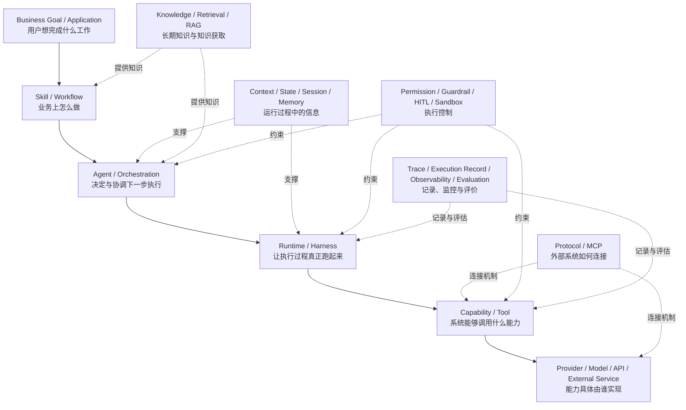
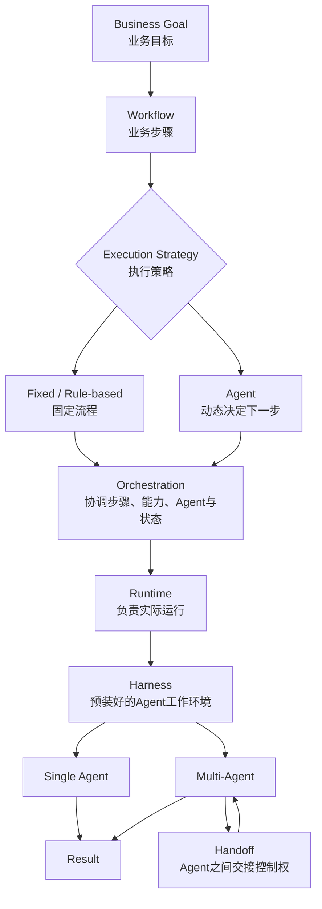
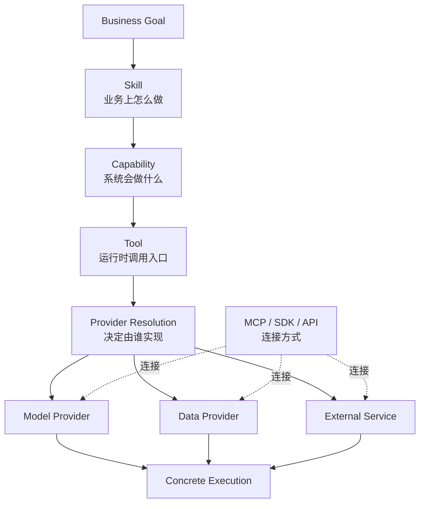
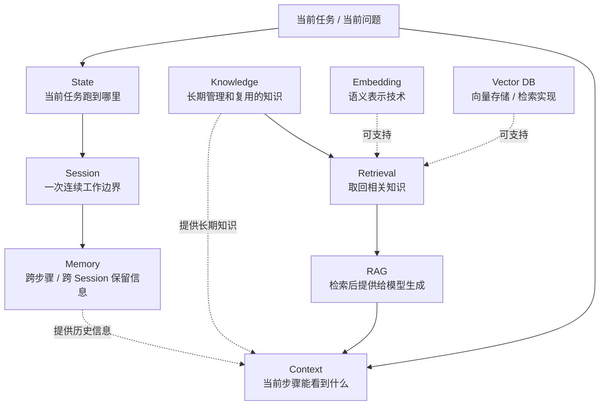
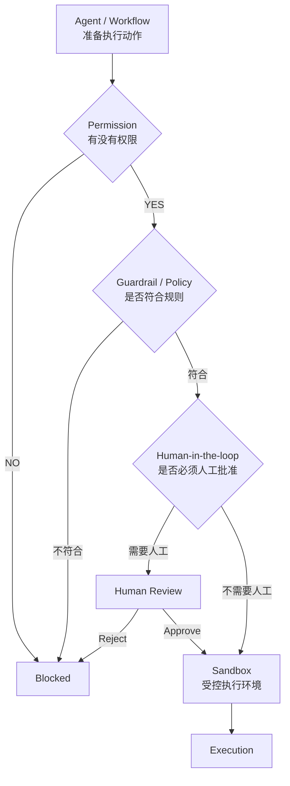

# Ecommerce AI OS — AI Architecture Concept Map V0.1

**Document Type:** External Architecture Learning Reference  
**Suggested Path:** `docs/05_references/ai_architecture/01_AI_ARCHITECTURE_CONCEPT_MAP.md`  
**Status:** Learning Baseline / Reference  
**Architecture Authority:** No  
**Stage:** External AI Architecture Audit — Phase 1 Completed

---

## 0. Document Purpose

这份文档记录 External AI Architecture Audit 第一阶段建立的基础概念坐标系。

这一阶段的目标不是：

- 掌握 Agent 开发；
- 掌握 LangGraph；
- 掌握 MCP；
- 掌握 RAG；
- 掌握 Multi-Agent；
- 掌握某一种 AI Framework。

当前目标只是：

> **先知道这些概念分别是什么、解决什么问题、处在什么位置，以及它们为什么不能混为一谈。**

这一阶段更接近：

```text
建立地图
≠
真正掌握地图上的每一条路
```

真正掌握仍然需要后续：

```text
理解
↓
自己设计
↓
自己写
↓
自己运行
↓
自己调试
↓
自己观察失败
↓
自己修改
↓
再次验证
```

因此本文件属于 **Learning Reference**，不能反向定义 Ecommerce AI OS 的正式 System Architecture。

Ecommerce AI OS 当前 System Architecture 仍以 `Applications / Skills / Stable Core / Capabilities / Foundation Services / Providers` 为 Candidate Responsibility Map，并明确不是严格 Runtime Call Graph。fileciteturn0file4L35-L112

---

# 1. 为什么先建立概念地图

当前 AI 领域存在大量容易混淆的词：

```text
Agent
Runtime
Harness
Workflow
Orchestration
Tool
Skill
Capability
MCP
Memory
RAG
Vector DB
Multimodal
Human-in-the-loop
Tracing
Multi-Agent
...
```

如果没有基础坐标系，很容易产生一种错误判断：

```text
看到一个新名词
↓
觉得它很先进
↓
怀疑自己的架构是不是缺了它
↓
把它加入系统
↓
过几天又出现另一个热点
↓
继续修改架构
```

本阶段要建立的是另一种思维：

```text
看到一个新概念
↓
它解决什么问题？
↓
属于哪个层级？
↓
是业务需求、系统职责还是实现技术？
↓
Ecommerce AI OS 是否真的存在这个问题？
↓
再决定是否值得进一步研究
```

这与 Ecommerce AI OS 当前的 Technology-neutral 原则一致：系统不应由 Agent、MCP、RAG、Embedding、Vector DB 等流行技术名词反向定义。fileciteturn0file2L576-L624

---

# 2. AI Architecture 总体学习坐标系

下面这张图只用于建立概念位置。

> **它不是 Ecommerce AI OS System Architecture，也不是严格 Runtime Call Graph。**



这张总图主要回答：

> **看到一个 AI 名词时，它大致属于哪里？**

---

# 3. AI 怎么“干活”

这一组概念包括：

```text
Workflow
Agent
Orchestration
Runtime
Harness
Multi-Agent
Handoff
```

## 3.1 关系图



## 3.2 核心区别

### Workflow

回答：

> **业务步骤应该怎么走。**

例如：

```text
明确研究问题
↓
搜索
↓
筛选
↓
分析
↓
形成 Finding
```

Workflow 不要求一定存在 Agent。

---

### Agent

可以暂时理解为：

> **根据目标和当前情况，动态判断下一步应该做什么的执行单元或执行策略。**

例如：

```text
搜索结果够不够？
├── YES → 开始分析
└── NO  → 换来源继续搜索
```

所以：

```text
Workflow
≠
Agent
```

---

### Orchestration

回答：

> **这些步骤、Tool、Agent、State 到底怎么被协调。**

可以理解为“交通指挥”。

例如：

```text
什么时候调用 Search
什么时候调用 Analyze
什么时候暂停
什么时候恢复
Agent A 什么时候交给 Agent B
```

---

### Runtime

回答：

> **怎样让整个执行过程真正可靠地跑起来。**

可能涉及：

```text
Execution
State
Checkpoint
Pause / Resume
Retry
Recovery
Long-running Task
```

这类问题与 Ecommerce AI OS 当前 `Task Runtime` Candidate 有明显关联，但 Task Runtime 的内部 Contract 当前仍然 Not Yet Designed。fileciteturn0file4L306-L319

---

### Harness

可以理解为：

> **在 Runtime 等基础能力上，为 Agent 预先组合好一整套工作装备。**

可能包含：

```text
Planning
Filesystem
Skills
Context Management
Memory
Subagents
Tool Rules
```

Harness 不应自动被理解成新的顶层 Architecture Layer。

---

### Multi-Agent

表示：

> **多个 Agent 进行职责分工与协作。**

例如：

```text
Research Agent
Critic Agent
Creative Agent
```

Multi-Agent 并不天然比 Single Agent 更高级。

只有真实任务需要职责隔离、上下文隔离或专业分工时，它才有意义。

---

### Handoff

表示：

> **一个 Agent 将任务或控制权交给另外一个 Agent。**

它是 Multi-Agent 协作的一种机制，而不是新的业务层。

---

# 4. AI 怎么“调用能力”

这一组概念包括：

```text
Skill
Capability
Tool
Provider
Model
API
SDK
MCP
```

## 4.1 关系图



Ecommerce AI OS 当前已经明确：

```text
Skill
= 业务上怎么做

Capability
= 系统会做什么

Provider
= 谁来实现 / 通过谁访问
```

这是当前 System Architecture 的重要语义边界。fileciteturn0file4L197-L233

---

## 4.2 Skill

Skill 保存：

```text
Business Know-how
Professional Method
Platform Adaptation
Domain Rules
Composite Workflow Method
```

例如：

> TikTok 车载吸尘器内容研究到底应该怎么研究。

这里属于业务方法，而不是 API 调用。

fileciteturn0file4L149-L193

---

## 4.3 Capability

Capability 表示系统能够：

```text
Search
Retrieve
Analyze
Generate Text
Generate Image
Generate Video
Transcribe
Translate
...
```

例如 Skill 判断：

> 下一步应该搜索 TikTok 内容。

它依赖的是：

```text
Search Capability
```

而不是应该知道 Scrape Creators 的具体 endpoint。

---

## 4.4 Tool

Tool 可以暂时理解为：

> **Capability 在 Runtime / Agent 中可以实际调用的入口。**

例如：

```text
Capability
Search Content

可能暴露成：

search_content(query, platform, region)
```

因此：

```text
Capability
= 能力概念

Tool
= 运行时调用形式
```

当前 Ecommerce AI OS 尚未正式设计 Tool Contract，因此这一关系只作为学习概念，不是 Approved Contract。

---

## 4.5 Provider

Provider 回答：

> **最终由谁真正完成这个能力。**

例如：

```text
Search
→ Scrape Creators

Generate Video
→ Kling

Generate Text
→ LLM Provider
```

当前 System Architecture 的关键原则是：

> **Business logic should depend on stable contracts, not concrete Providers.**

fileciteturn0file4L618-L653

---

## 4.6 Model

Model 通常属于某项 Capability 的具体智能实现。

例如：

```text
Generate Video
= Capability

Kling / 其他视频模型
= Model / Provider implementation
```

Model 更换不应该迫使业务 Skill 整体重写。

---

## 4.7 MCP / SDK / API

这几个更接近：

> **连接外部能力的方式。**

例如：

```text
Capability
↓
MCP
↓
External Service
```

也可能：

```text
Capability
↓
SDK
↓
Provider
```

或者：

```text
Capability
↓
REST API
↓
Provider
```

当前 Ecommerce AI OS 因此把 MCP 理解为：

```text
Integration / Capability Access Mechanism
```

而不是顶层 System Architecture Layer。fileciteturn0file4L600-L614

---

# 5. AI 怎么“记住东西”

这一组概念包括：

```text
Context
State
Session
Memory
Knowledge
Retrieval
RAG
Embedding
Vector DB
```

## 5.1 关系图



---

## 5.2 Context

回答：

> **当前这一步模型可以看到什么？**

例如：

```text
商品信息
市场
当前研究问题
已有 Evidence
当前 Tool Result
已有 Knowledge
```

---

## 5.3 State

回答：

> **这个 Task 当前跑到了什么状态？**

例如：

```text
已搜索 3 个关键词
已收集 42 条视频
评论尚未分析
current_stage = analyzing_comments
```

---

## 5.4 Session

表示：

> **一次连续交互或执行过程的边界。**

它不是长期知识本身。

---

## 5.5 Memory

表示：

> **跨步骤甚至跨 Session 仍然保留下来的信息。**

Memory 可能包含用户习惯、过去任务信息、历史工作上下文等。

但：

```text
Memory
≠
Knowledge
```

---

## 5.6 Knowledge

Knowledge 更强调：

```text
经过管理
有来源
可版本化
可复用
必要时经过 Human Review
```

例如：

```text
正式商品事实
已批准平台规则
审核后的运营知识
Success / Failure Case
```

Ecommerce AI OS 当前产品需求明确要求 Knowledge 不应每次从零开始，新 Evidence 可以挑战旧 Knowledge，但正式 Knowledge Update 必须经过 Human Review。fileciteturn0file2L227-L264

---

## 5.7 RAG

RAG 可以简单理解为：

```text
当前问题
↓
Retrieval
↓
找到相关 Knowledge
↓
加入当前 Context
↓
Model Generate
```

因此：

```text
Knowledge
≠
RAG
```

RAG 是一种 Knowledge Retrieval Pattern。

---

## 5.8 Embedding

Embedding 是：

> **把内容转换成可进行语义计算的表示方式。**

它只是技术手段。

---

## 5.9 Vector DB

Vector DB 是：

> **保存和检索向量的一类存储 / 检索实现。**

因此：

```text
RAG
≠ Embedding

Embedding
≠ Vector DB

Vector DB
≠ Knowledge System
```

当前 Ecommerce AI OS 也明确将：

```text
RAG
→ Knowledge Retrieval Pattern

Embedding
→ Semantic Representation Technique

Vector DB
→ Storage / Retrieval Implementation
```

而不是顶层 System Layer。fileciteturn0file4L600-L614

---

# 6. Multimodal / AIGC / Model / Provider

这一组主要解决另一种常见 AI 焦虑：

> 新的 Multimodal / AIGC 技术出现，是不是意味着系统架构必须重做？

通常不能这样推。

## Multimodal

描述的是：

> **系统能够处理哪些信息模态。**

例如：

```text
Text
Image
Video
Audio
```

它更多影响 Capability 范围和具体 Model / Provider，而不是天然形成一个新的业务架构层。

---

## AIGC

表示：

> **使用 AI 生成内容。**

例如：

```text
Script
Image
Video
Audio
Short Drama
```

Ecommerce AI OS 当前已经把这些放在跨平台的 `Creative Production` Product Family，而不是 TikTok 专属系统。fileciteturn0file3L117-L142

因此：

```text
AIGC capability evolves
≠
Product Architecture must be rebuilt
```

---

# 7. AI 怎么“被控制”

这一组概念包括：

```text
Permission
Guardrail / Policy
Human-in-the-loop
Sandbox
```

## 7.1 关系图



---

## Permission

回答：

> **有没有资格做。**

例如：

```text
可以读取 TikTok 数据
不可以删除正式文件
不可以直接花钱投广告
```

---

## Guardrail / Policy

回答：

> **做的时候必须遵守什么规则。**

例如：

```text
不能产生虚假商品 Claim
不能把相关性直接说成因果
```

---

## Human-in-the-loop

回答：

> **哪些关键节点必须由人决定。**

例如：

```text
预计生成视频成本过高
↓
Pause
↓
Human Review
↓
Approve / Reject
```

---

## Sandbox

回答：

> **即使允许执行，真正执行时应该被限制在哪里。**

例如执行：

```text
Shell
Python
FFmpeg
Filesystem
```

不意味着 Agent 应该拥有整个生产服务器权限。

---

当前 Ecommerce AI OS 的 `Runtime Governance` Candidate 已经包括 Permission、Policy、Human Gate、Cost Gate 和 Risk Gate，但其详细规则仍然 Not Yet Designed。fileciteturn0file4L359-L408

---

# 8. AI 怎么“被记录与评价”

这一组包括：

```text
Trace
Execution Record
Observability
Evaluation
```

## Trace

回答：

> **这次执行发生了哪些步骤。**

例如：

```text
User Request
↓
Search
↓
Analyze
↓
Generate
↓
Human Review
```

---

## Execution Record

回答：

> **哪些关键执行事实应该长期保存。**

可能包括：

```text
Run
Input Reference
Skill Version
Capability Reference
Provider
Artifact Reference
Trace Reference
Provenance
Execution Version
```

当前 Ecommerce AI OS 已将 Execution Record 列为 Stable Core Candidate Area，并把 Run、Artifact Reference、Provenance、Trace Reference、执行版本和可复现上下文列为候选职责。fileciteturn0file4L412-L426

---

## Observability

回答：

> **系统运行得健康不健康。**

例如：

```text
Provider 错误率
任务延迟
成本异常
Capability Failure
```

---

## Evaluation

回答：

> **最终结果质量到底好不好。**

例如：

```text
Research Finding 是否有 Evidence 支持
Script 是否符合商品事实
Video 是否可用
Agent 是否完成目标
```

所以：

```text
Trace
= 发生了什么

Execution Record
= 哪些事实值得长期留下

Observability
= 系统运行健康不健康

Evaluation
= 输出质量好不好
```

---

# 9. 第一阶段最终形成的概念压缩表

| 概念 | 当前最简单理解 |
|---|---|
| Agent | 动态判断下一步怎么做 |
| Workflow | 业务步骤怎么走 |
| Orchestration | 怎么协调这些步骤 |
| Runtime | 怎么让整个执行过程可靠运行 |
| Harness | 给 Agent 配好的工作环境 |
| Multi-Agent | 多个 Agent 分工 |
| Handoff | Agent 间交接控制权 |
| Skill | 业务上怎么做 |
| Capability | 系统会做什么 |
| Tool | Runtime 可调用的能力入口 |
| Provider | 谁真正实现 |
| Model | 智能能力的具体实现之一 |
| MCP | 外部能力连接协议 / 机制 |
| Context | 当前这一步能看到什么 |
| State | 当前 Task 跑到哪 |
| Session | 一轮连续执行边界 |
| Memory | 跨步骤 / Session 保留的信息 |
| Knowledge | 被管理、可复用的长期知识 |
| RAG | 检索知识再参与生成的模式 |
| Embedding | 语义表示技术 |
| Vector DB | 向量存储与检索实现 |
| Multimodal | 能处理多种信息形式 |
| AIGC | 使用 AI 生成内容 |
| Permission | 有没有资格做 |
| Guardrail | 做的时候必须遵守什么 |
| HITL | 哪些地方必须让人决定 |
| Sandbox | 真执行时限制在哪里 |
| Trace | 执行经过了什么 |
| Execution Record | 哪些执行事实长期保存 |
| Observability | 系统运行得怎么样 |
| Evaluation | 结果质量怎么样 |

---

# 10. 当前真正理解到什么程度

必须明确：

> **完成这份 Concept Map，不代表已经真正掌握这些技术。**

目前达到的是：

```text
Level 0
听过名词
        ↓
Level 1 ← 当前
知道基本定义和位置
        ↓
Level 2
能读懂具体项目怎么实现
        ↓
Level 3
自己写最小 Demo
        ↓
Level 4
自己调试、观察失败
        ↓
Level 5
能比较不同实现的 Trade-off
        ↓
Level 6
能基于真实业务自己设计
```

当前阶段的意义是：

> **先获得 Level 1 的全局坐标系，为后续真正进入 Level 2–6 做准备。**

如果没有这一层，很容易在学习具体 Framework 时只会复制代码，而不知道自己到底在实现什么问题。

---

# 11. 后续真正掌握这些概念的方法

长期不能只靠阅读。

每个重要概念最终都应该经历：

```text
Definition
↓
Read Real Project
↓
Write Minimal Example
↓
Run
↓
Break It Intentionally
↓
Debug
↓
Compare Alternative
↓
Explain It Without Looking
↓
Use It In Real Ecommerce Workflow
```

例如未来真正学习 Task Runtime，不应该只是继续阅读：

```text
Checkpoint 是什么
Pause / Resume 是什么
```

而应该自己做一个最小任务：

```text
Task Start
↓
Step 1
↓
Save State
↓
程序退出
↓
重新启动
↓
Resume
↓
Step 2
```

到那时 `State / Checkpoint / Runtime / Resume` 才真正从“看过”变成“理解”。

同样：

```text
RAG
Agent
MCP
Human-in-the-loop
Tracing
Multi-Agent
```

都应该走类似路径。

---

# 12. 与 Ecommerce AI OS 的边界

本阶段最大的纪律是：

> **理解外部 AI 架构，不等于让外部 AI 架构定义 Ecommerce AI OS。**

例如：

```text
LangGraph 有 Graph
≠
Ecommerce AI OS 需要 Graph Layer

某框架有 Memory
≠
Ecommerce AI OS 需要 Memory Service

MCP 很流行
≠
Ecommerce AI OS 需要 MCP Layer

Multi-Agent 很流行
≠
Ecommerce AI OS 必须 Multi-Agent
```

外部概念只能形成：

```text
External Architecture Evidence
↓
Does Ecommerce AI OS have the same real problem?
↓
YES / NO
↓
Architecture Review
↓
Human Review
```

而不能：

```text
New AI Trend
↓
直接修改架构
```

这符合当前 Architecture Governance：新 Requirement / Evidence 必须先进行 Impact Classification，只有真实需求证明现有架构不足时，才进入 Architecture Change Proposal 和 Human Review。fileciteturn0file6L702-L750

---

# 13. Phase 1 Conclusion

External AI Architecture Audit 第一阶段已经完成：

> **建立基础 AI Architecture Concept Map。**

这一阶段没有证明：

- 当前 Stable Core 一定正确；
- Task Runtime 一定需要；
- Extension Runtime 一定需要；
- Compatibility 一定属于 Core；
- Agent 不需要；
- LangGraph 适合或不适合；
- MCP 应该或不应该使用；
- RAG 应该采用什么实现。

它只完成了：

> **建立一套足够继续阅读真实 AI Architecture 的基本语言和坐标系。**

下一阶段：

```text
Phase 2
AI Architecture Landscape Classification
```

将使用这套坐标系开始研究少量代表项目：

```text
OpenAI Agents SDK
LangGraph
Deep Agents
MCP
AutoGen Core
```

目标不再是学习新名词，而是：

> **观察真实项目如何组合和实现这些已经建立的概念，并开始区分“行业反复出现的真实问题”和“某个 Framework 自己的设计选择”。**