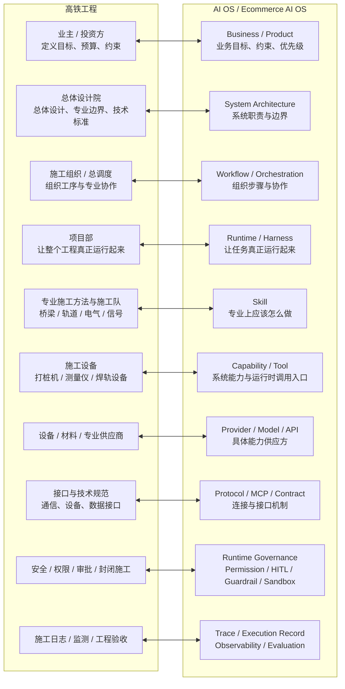
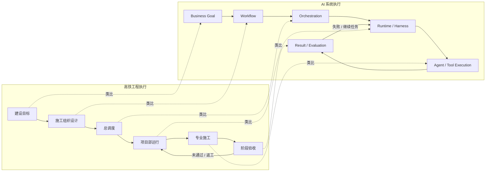
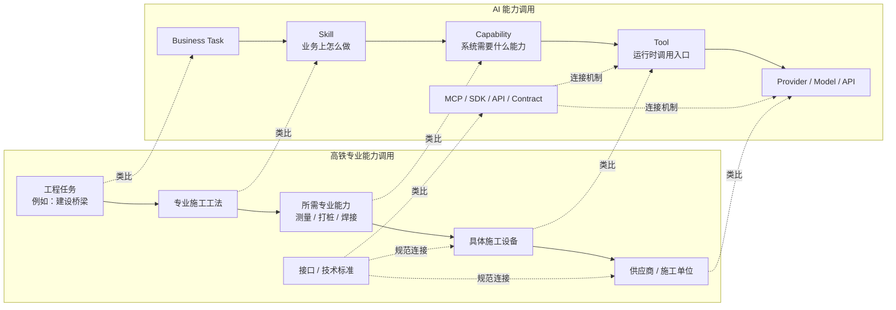
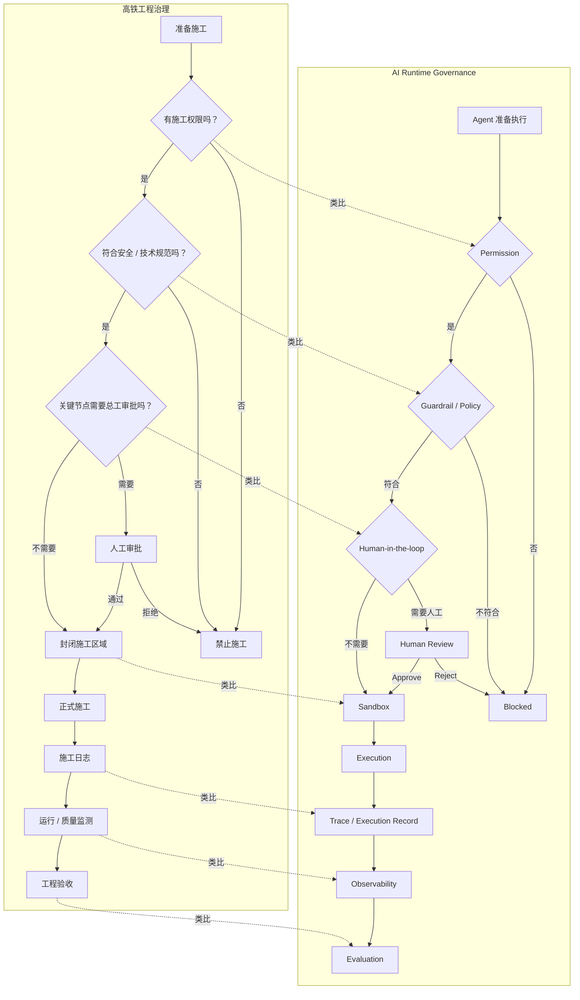
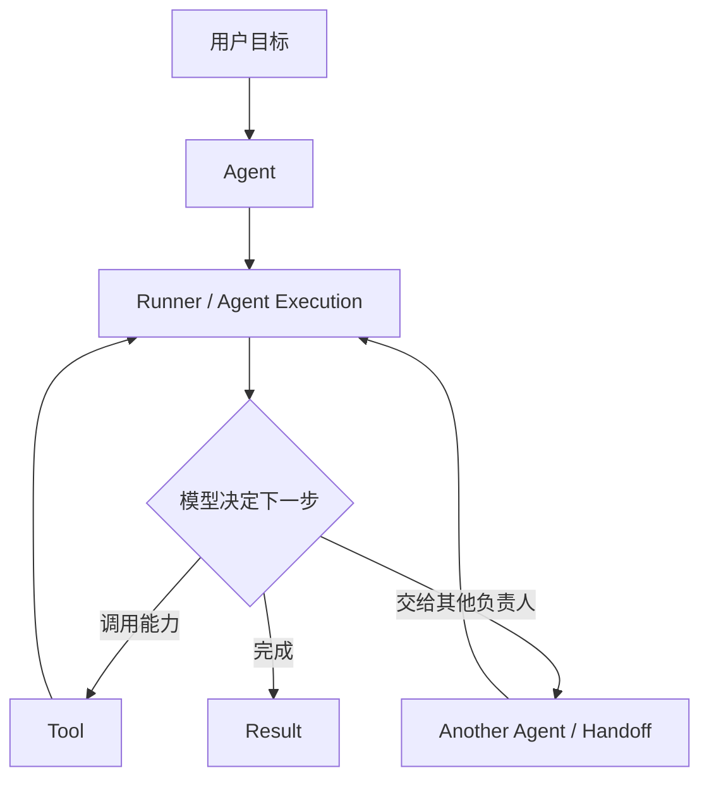
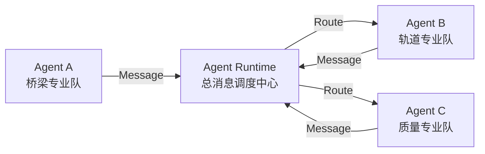
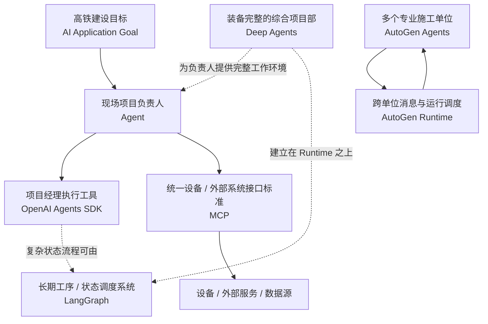

# Ecommerce AI OS — AI Architecture Landscape V0.1

**Suggested Path:** `docs/05_references/ai_architecture/02_AI_ARCHITECTURE_LANDSCAPE.md`  
**Status:** Learning Reference / Draft  
**Architecture Authority:** No  
**Stage:** External AI Architecture Audit — Phase 2 / First Sample Set  
**Upstream Learning Reference:** `01_AI_ARCHITECTURE_CONCEPT_MAP.md`

---

## 0. Document Purpose

`01_AI_ARCHITECTURE_CONCEPT_MAP.md` 已经从基础定义上梳理了：

- Agent / Workflow / Runtime / Harness；
- Skill / Capability / Tool / Provider；
- Context / State / Session / Memory / Knowledge；
- RAG / Embedding / Vector DB；
- Permission / Guardrail / HITL / Sandbox；
- Trace / Execution Record / Observability / Evaluation；
- Multi-Agent / Handoff / MCP。

但第一阶段主要完成的是：

> **知道这些词大概是什么、分别处在哪里。**

Phase 2 不再继续增加术语，而是观察真实开源项目如何组合这些概念。

第一批样本：

1. OpenAI Agents SDK
2. LangGraph
3. Deep Agents
4. MCP
5. AutoGen Core

同时，为了帮助 AI 初学者建立工程直觉，本文件增加：

> **“高铁工程 ↔ AI OS”统一类比模型。**

高铁工程类比只用于学习。

```text
Analogy
≠
Formal Architecture Definition
```

它不能反向定义 Ecommerce AI OS System Architecture。

---

# 1. 为什么用“高铁工程”理解 AI OS

假设目标是：

> **建设并长期运营一条安全、可靠、高效的高铁线路。**

这显然不是：

```text
买一台挖掘机
→ 开始施工
```

而是一个大型工程系统：

```text
业务目标
↓
总体设计
↓
施工组织
↓
专业工法
↓
具体设备
↓
供应商
↓
接口标准
↓
安全和审批
↓
施工记录
↓
监测
↓
验收
↓
长期运营
```

AI OS 同样不是：

```text
选一个大模型
→ 加几个 Prompt
→ 完成
```

而是多个不同职责共同组成的工程系统。

---

# 2. 高铁工程 ↔ AI OS 总体类比



---

## 2.1 最重要的对应关系

| 高铁工程 | AI Architecture | 初学者直觉 |
|---|---|---|
| 业主 / 投资方 | Business / Product | 为什么做、要达到什么结果 |
| 总体设计院 | System Architecture | 整个系统怎么分职责 |
| 施工组织设计 | Workflow | 工序怎么走 |
| 总调度 | Orchestration | 多个工序和资源怎么协调 |
| 项目部运行机制 | Runtime | 怎么让工程持续可靠运行 |
| 装备完整的项目部 | Harness | 预装好常用工作环境 |
| 专业施工工法 | Skill | 专业上应该怎么做 |
| 打桩 / 测量 / 焊接能力 | Capability | 系统会什么 |
| 打桩机 / 测量仪 | Tool | 实际调用入口 |
| 设备与施工供应商 | Provider | 谁提供能力 |
| 某种具体设备型号 | Model | 某项能力的具体实现 |
| 工程接口规范 | MCP / Protocol | 外部系统怎么连接 |
| 施工资格 | Permission | 有没有权做 |
| 安全规范 | Guardrail | 做的时候遵守什么规则 |
| 总工签字 | HITL | 哪一步必须人决定 |
| 封闭施工区 | Sandbox | 真正执行时限制在哪里 |
| 施工日志 | Trace / Execution Record | 做过什么 |
| 在线监测 | Observability | 系统运行健康吗 |
| 工程验收 | Evaluation | 最终结果好吗 |

---

# 3. 专项图一：高铁怎么施工 ↔ AI 怎么执行



可以暂时记成：

```text
Workflow
≈ 施工组织设计

Orchestration
≈ 总调度

Runtime
≈ 让整个项目持续运行的机制

Harness
≈ 已经搭建完整的项目部

Agent
≈ 根据现场情况做决策的负责人
```

---

# 4. 专项图二：高铁怎么调用专业资源 ↔ AI 怎么调用能力



对于 Ecommerce AI OS，可以理解成：

```text
TikTok 内容研究方法
        ↓
Skill

需要搜索公开内容
        ↓
Search Capability

运行时真正发起一次搜索
        ↓
Tool

选择实际数据访问方
        ↓
Provider

通过 API / MCP / Adapter 等连接
        ↓
Concrete Execution
```

---

# 5. 专项图三：高铁怎么治理、记录、验收 ↔ AI 怎么控制和审计



---

# 6. 五个真实项目先放进工程地图

| 项目 | Primary Role | 高铁工程类比 |
|---|---|---|
| OpenAI Agents SDK | Agent-centric Framework / Multi-Agent Workflow | 项目经理 + 一套执行管理工具 |
| LangGraph | Stateful Orchestration Framework | 长期施工工序与状态调度系统 |
| Deep Agents | Opinionated Agent Harness | 装备完整的综合项目部 |
| MCP | Integration Protocol | 统一设备和外部系统接口规范 |
| AutoGen Core | Event-driven Distributed Multi-Agent Runtime | 多专业施工单位 + 消息调度中心 |

这五个项目：

> **不是同一个层级上的五个竞争产品。**

就像：

```text
项目经理
施工调度系统
综合项目部
接口标准
多施工单位协同平台
```

不能简单问：

> 谁更先进？

首先应该问：

> **它们分别解决什么问题？**

---

# 7. OpenAI Agents SDK

## 7.1 官方定位

OpenAI 官方仓库目前把 Agents SDK 定义为：

> lightweight yet powerful framework for building multi-agent workflows。

其核心概念包括：

- Agents；
- Tools；
- Agents as tools；
- Handoffs；
- Guardrails；
- Human-in-the-loop；
- Sessions；
- Tracing；
- Sandbox Agents。

---

## 7.2 高铁工程类比

可以把它想成：

> **给项目经理配一套执行团队和现场管理工具。**

项目经理知道：

```text
目标是什么
↓
当前情况是什么
↓
需要调用什么专业工具
↓
什么时候把任务交给另一个负责人
↓
什么时候结束
```

AI 对应：



官方也明确把 Agent 定义为配置了 instructions、tools、guardrails 和 handoffs 的 LLM。

---

## 7.3 它怎么调用能力

它的核心调用关系更接近：

```text
Agent
↓
Tool
```

Tool 可以包括：

- Functions；
- MCP；
- Hosted Tools；
- Another Agent；
- Sandbox / local execution。

这和 Ecommerce AI OS 当前的：

```text
Skill
→ Capability
→ Provider
```

不是同一种抽象体系。

Agents SDK 主要回答：

> Agent 怎样实际调用一个能力？

而 Ecommerce AI OS 还希望进一步区分：

```text
业务方法
系统能力
具体供应方
```

两者不能直接混用。

---

## 7.4 它怎么处理状态和记忆

官方提供：

```text
Sessions
→ 跨 Agent Run 管理 Conversation History

Sandbox Agent
→ 长任务中的 Workspace State
```

并支持 Human-in-the-loop、Tracing 等机制。

但：

```text
Session
≠ Formal Knowledge Governance
```

它没有因此自动解决：

- Ecommerce Knowledge versioning；
- Evidence provenance；
- Knowledge approval；
- 正式知识更新流程。

---

## 7.5 它明确不是什么

OpenAI Agents SDK 不是：

```text
Ecommerce Business Architecture
完整 Knowledge Governance System
MCP Protocol 本身
Model 本身
整个 Ecommerce AI OS
```

高铁类比：

> **它更像“项目经理执行系统”，不是整个铁路建设集团。**

---

# 8. LangGraph

## 8.1 官方定位

LangGraph 官方仓库当前直接称自己为：

> **Low-level orchestration framework for building stateful agents.**

它重点支持：

- long-running；
- stateful agents；
- durable execution；
- human-in-the-loop；
- memory；
- state persistence；
- runtime visibility。

---

## 8.2 高铁工程类比

LangGraph 更像：

> **整个复杂施工流程的工序调度和工程状态管理系统。**

例如：

```text
地基施工完成
↓
State = FOUNDATION_DONE

桥墩施工
↓
State = PIER_BUILDING

出现异常
↓
Pause

总工检查
↓
Resume

桥墩完成
↓
Checkpoint

进入下一工序
```

关注重点不是：

> 某一个项目经理是谁。

而是：

> **整个长期、有状态的工程流程怎么持续运行。**

---

## 8.3 Agent-centric 与 Workflow-centric

可以粗略理解：

```text
OpenAI Agents SDK
→ 更自然从 Agent 出发

LangGraph
→ 更自然从 Workflow / State / Runtime 出发
```

官方特别强调 LangGraph 为 long-running、stateful workflows / agents 提供底层基础设施，并支持 failure recovery 和 resumability。

---

## 8.4 它不是业务 Capability 架构

LangGraph 可以在 Node 里调用：

```text
Model
Tool
Agent
API
Python Function
```

但：

```text
Node
≠ Ecommerce Capability
```

LangGraph 主要解决：

> **如何把调用编排和持续运行。**

它不会自动告诉 Ecommerce AI OS：

```text
Research Skill 应该怎么定义
Search Capability 怎么抽象
Provider 怎么替换
Knowledge 应该怎么治理
```

---

## 8.5 高铁一句话

> **OpenAI Agents SDK 更像“项目经理怎么工作”；LangGraph 更像“长期复杂施工流程怎么运行”。**

---

# 9. Deep Agents

## 9.1 官方三层结构

Deep Agents 官方 Architecture 文档明确写出：

```text
Deep Agents
= opinionated harness

LangChain
= agent abstraction

LangGraph
= runtime
```

并明确说明：

> Deep Agents 不引入新的 Runtime，而是把 middleware、backends、subagents、skills、memory、profiles 等组装在已有 Agent / Runtime 基础之上。

---

## 9.2 高铁工程类比

如果：

```text
LangGraph
≈ 工程运行和工序调度底座
```

那么 Deep Agents 更像：

> **已经搭建好的综合项目部。**

里面提前配置：

```text
项目计划
文件系统
专业小组
历史资料
工作空间
权限
上下文整理
工具
Subagents
Memory
```

不用每次：

> 从空地开始重新搭项目部。

---

## 9.3 Runtime 和 Harness 的真正区别

```text
Runtime
≈ 工程真正能够运行的基础机制

Harness
≈ 在运行基础上，给工程团队准备完整工作环境
```

这正是 Deep Agents 的价值。

它解决的不是：

> “创造一个新的运行时”。

而是：

> **怎样让 Agent 拿到一套比较完整、带观点的工作装备。**

---

## 9.4 Skills 的概念冲突

Deep Agents 也使用：

```text
Skills
```

但不能直接得到：

```text
Deep Agents Skill
=
Ecommerce AI OS Skill
```

Ecommerce AI OS 当前 `Skill` 强调：

```text
Business Know-how
Professional Method
Platform Adaptation
Domain Rules
```

Deep Agents 的 Skill 则属于 Harness 中提供给 Agent 的扩展能力 / 工作知识机制。

这正是后续 Concept Normalization 必须处理的问题。

---

# 10. MCP

## 10.1 官方定位

当前 MCP Specification 使用：

```text
Host
↓
Client
↓
Server
```

架构。

Host 管理多个 Client；每个 Client 与一个 Server 通信；Server 可以暴露：

- Tools；
- Resources；
- Prompts。

当前 Specification 还明确将 MCP 描述为 stateless protocol，每个 request 自带 protocol version 和 capabilities。

---

## 10.2 高铁工程类比

想象高铁项目需要连接：

```text
气象系统
测量系统
材料管理系统
信号系统
施工设备
供应商系统
```

如果每一个系统都是：

```text
A 系统用自己的协议
B 系统用另一套协议
C 系统又完全不同
```

系统集成会非常混乱。

MCP 想解决的更接近：

> **建立一种 AI 应用连接外部能力的统一协议。**

---

## 10.3 Host / Client / Server 类比

```text
Host
≈ 工程总指挥中心

Client
≈ 总指挥中心连接某一个专业系统的接口模块

Server
≈ 某个专业能力 / 数据系统
```

例如：

```text
AI Application Host
↓
MCP Client
↓
Database MCP Server
↓
Database
```

---

## 10.4 MCP 不负责业务决策

MCP 不负责回答：

```text
现在应该先研究什么？
要不要继续搜索？
哪个证据更重要？
什么时候开始生成视频？
```

这些仍然属于：

```text
Business Logic
Skill
Agent
Workflow
Orchestration
```

MCP 当前架构也明确强调：

> Host 负责复杂 coordination / security，而 Server 应保持聚焦和可组合。

---

## 10.5 Capability 的同名陷阱

MCP 也有：

```text
Capability Negotiation
```

但这里的 Capability 更接近：

> Client / Server 在协议层声明自己支持哪些 Protocol Features。

而 Ecommerce AI OS 当前：

```text
Capability
= 系统会做什么
```

两个词名字一样：

```text
Name Same
≠
Semantics Same
```

后续比较不能按名字直接对应。

---

# 11. AutoGen Core

## 11.1 官方定位

AutoGen Core 官方说明其目标是构建：

> event-driven、distributed、scalable、resilient AI agent systems。

并采用 Actor Model。

其核心特征包括：

- asynchronous messaging；
- event-driven architecture；
- distributed execution；
- multi-agent；
- modularity；
- observability。

---

## 11.2 高铁工程类比

这次不再想象：

> 一个项目经理带着几台设备。

而是：

```text
桥梁施工单位
轨道施工单位
电气施工单位
信号施工单位
质量检测单位
供应单位
```

大家在不同现场甚至不同城市运行。

它们通过：

> **统一的消息和调度中心协作。**

---

## 11.3 Agent / Message / Runtime

核心直觉：



可以暂时类比：

```text
Agent
≈ Actor / 专业施工单位

Message
≈ 正式任务 / 协作消息

Runtime
≈ 消息路由 + 生命周期管理中心
```

---

## 11.4 Standalone 和 Distributed Runtime

AutoGen 官方架构区分：

### Standalone Runtime

```text
一个进程
↓
多个 Agent
↓
同一 Runtime
```

高铁类比：

> 多个专业小组都在一个项目部。

### Distributed Runtime

```text
Host Servicer
↓
多个 Worker
↓
不同机器 / 进程中的 Agent
```

高铁类比：

> 上海、嘉兴、杭州多个项目部分布运行，但通过统一调度系统协作。

官方 Runtime 负责 Agent communication、identity、lifecycle，以及 security / privacy boundaries。

---

# 12. 五个案例放进同一个“高铁工程”



注意：

> **这张图不是推荐技术组合。**

并不是说系统应该：

```text
OpenAI Agents SDK
+
LangGraph
+
Deep Agents
+
MCP
+
AutoGen
```

全部一起使用。

它只是在说明：

> **五个项目分别位于不同的问题空间。**

---

# 13. 五个项目的一句话理解

### OpenAI Agents SDK

> **项目经理怎么带着工具和其他负责人完成任务。**

### LangGraph

> **复杂、长期、有状态的施工流程怎么持续运行、暂停和恢复。**

### Deep Agents

> **怎么给 Agent 提前搭建一个装备完整的综合项目部。**

### MCP

> **AI 总控中心怎么通过统一标准连接外部专业系统。**

### AutoGen Core

> **多个专业 Agent 怎么通过消息和 Runtime 在单机或分布式环境协作。**

---

# 14. 五个案例真正说明了什么

目前最重要的结论不是：

```text
哪个 Framework 最强
```

而是：

> **所谓“AI Architecture”其实包含很多完全不同的工程问题。**

第一批样本已经至少暴露：

```text
Agent Decision
Workflow
Orchestration
Runtime
State
Checkpoint
Tool
External Integration
Harness
Memory
Human Control
Tracing
Multi-Agent
Distributed Execution
```

不同项目只是选择了不同的问题作为自己的核心。

---

# 15. 为什么不能按热点选架构

如果从 Framework 出发：

```text
看到 LangGraph 很火
↓
把系统设计成 Graph

看到 MCP 很火
↓
加 MCP Layer

看到 Multi-Agent 很火
↓
加 Multi-Agent Architecture

看到 Harness 很火
↓
再加 Harness Layer
```

系统最终会被热点拖着走。

正确顺序应该是：

```text
真实 Ecommerce Business Problem
↓
System Responsibility
↓
Architecture Requirement
↓
需要什么 Runtime / Integration / Harness
↓
最后才选择 Framework / Technology
```

---

# 16. 与 Ecommerce AI OS 的关系

这一轮 Landscape 目前只能作为：

```text
External Architecture Learning Evidence
```

不能直接得到：

```text
Ecommerce AI OS 应使用 LangGraph
Ecommerce AI OS 应使用 OpenAI Agents SDK
Ecommerce AI OS 应采用 AutoGen
Ecommerce AI OS 必须 MCP
```

更重要的问题是：

> **这些项目反复解决的问题，Ecommerce AI OS 自己是否真实存在？**

例如：

```text
Long-running Task
是不是我们的真实问题？

Pause / Resume
是不是我们的真实问题？

Human Approval
是不是我们的真实问题？

Provider Decoupling
是不是我们的真实问题？

Distributed Multi-Agent
现在真的需要吗？

Agent Harness
现在真的需要吗？
```

只有：

```text
External Recurring Problem
+
Ecommerce Business Need
```

同时成立，才值得进入 Architecture Review。

---

# 17. 当前理解深度

必须承认：

> **到这里仍然属于“建立工程直觉”，不是掌握。**

当前大约是：

```text
Level 0
只听过名字
↓
Level 1
知道基本定义
↓
Level 2 ← 当前开始进入
能看懂真实项目大致在解决什么
↓
Level 3
自己写最小 Demo
↓
Level 4
自己制造问题并调试
↓
Level 5
比较不同实现 Trade-off
↓
Level 6
基于真实业务独立设计
```

后续真正掌握至少需要自己做：

```text
OpenAI Agents SDK
→ Agent + Tool + Handoff

LangGraph
→ State + Checkpoint + Pause / Resume

Deep Agents
→ 比较 Bare Agent 与 Harness

MCP
→ 写最小 Client / Server

AutoGen
→ 两个 Agent 通过 Message 协作
```

只有：

```text
写
↓
运行
↓
出错
↓
调试
↓
重构
↓
解释
```

才能真正变成自己的知识。

---

# 18. Evidence Boundary

本文件将：

```text
Official Source Fact
Interpretation
Teaching Analogy
```

明确区分。

### OpenAI Agents SDK

官方仓库明确其为用于构建 multi-agent workflows 的轻量 Framework，并列出 Agents、Tools、Handoffs、Guardrails、HITL、Sessions、Tracing、Sandbox Agents 等核心概念。

### LangGraph

官方仓库明确其为：

> Low-level orchestration framework for building stateful agents。

并强调 durable execution、human-in-the-loop、memory 和 long-running stateful workflows。

### Deep Agents

官方 Architecture 明确：

```text
Deep Agents = opinionated harness
LangChain = agent abstraction
LangGraph = runtime
```

并明确 Deep Agents 不引入新的 Runtime。

### MCP

当前官方 Specification 明确其 Host / Client / Server 架构、stateless protocol、Server tools/resources/prompts，以及 capability negotiation。

### AutoGen Core

官方文档明确其采用 Actor Model，面向 event-driven / distributed / scalable multi-agent systems；其 Runtime 负责 communication、identity、lifecycle 以及 security / privacy boundaries。 

高铁工程内容全部属于：

```text
Teaching Analogy
```

不能当作官方项目定义。

---

# 19. Phase 2 当前结论

第一批 Landscape 样本已经形成：

```text
OpenAI Agents SDK
→ Agent-centric Framework / Workflow Runtime

LangGraph
→ Stateful Orchestration Framework

Deep Agents
→ Opinionated Agent Harness

MCP
→ Integration Protocol

AutoGen Core
→ Event-driven Distributed Multi-Agent Runtime
```

目前已经可以看到：

> **行业并不存在一个唯一的“Agent Architecture”。**

不同项目分别从：

```text
Agent
Graph / State
Harness
Protocol
Message / Actor Runtime
```

出发解决不同问题。

因此 Phase 2 的下一步不应该继续无止境增加 Framework。

下一阶段应该进入：

# **Cross-project Concern Comparison**

目标是从这五条不同路线中找出：

```text
哪些问题反复出现？
哪些只是某个 Framework 的设计选择？
哪些概念名字相同但语义不同？
哪些问题 Ecommerce AI OS 自己真的存在？
```

这才是之后对 Ecommerce AI OS 做 Architecture Stress Test 的真正输入。